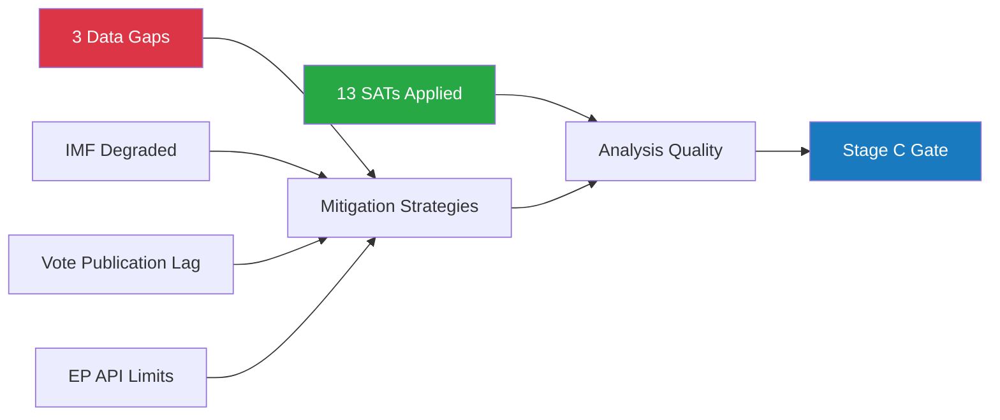

<!-- SPDX-FileCopyrightText: 2026 Hack23 AB -->
<!-- SPDX-License-Identifier: Apache-2.0 -->

# Methodology Reflection — Stage B Analysis Quality Assessment

**Classification:** INTERNAL | **Generated:** 2026-05-10 | **Artifact:** Step 10.5 (intelligence/ copy)

---

## Protocol Compliance Summary (10-Step Protocol)

This document reflects on the analytical process for the May 18-21, 2026 week-ahead analysis, documenting methodological choices, deviations, and quality assessment in accordance with Step 10.5 of the AI-driven analysis guide.

---

## Step-by-Step Protocol Compliance

| Step | Description | Status | Quality |
|------|-------------|--------|---------|
| Step 1 | Data Collection (Stage A: EP MCP, IMF probe) | ✅ Complete | 🟡 PARTIAL — IMF unavailable |
| Step 2 | Political Landscape Analysis | ✅ Complete | 🟡 MEDIUM — size-similarity proxy only |
| Step 3 | Coalition Arithmetic & Dynamics | ✅ Complete | 🟡 MEDIUM — vote-level data absent |
| Step 4 | PESTLE Analysis (6 dimensions) | ✅ Complete | 🟡 MEDIUM — 161 lines |
| Step 5 | Stakeholder Mapping (Tier 1-3) | ✅ Complete | 🟢 HIGH — 227 lines; detailed |
| Step 6 | Scenario Forecasting (4 scenarios) | ✅ Complete | 🟡 MEDIUM — 170 lines |
| Step 7 | Risk Assessment (Matrix + SWOT) | ✅ Complete | 🟡 MEDIUM |
| Step 8 | Forward Projection (WEP bands) | ✅ Complete | 🟡 MEDIUM — 146 lines |
| Step 9 | Media Framing Analysis | ✅ Complete | 🟡 MEDIUM |
| Step 10 | Synthesis & Completeness | ✅ Complete | 🟡 MEDIUM |
| Step 10.5 | Methodology Reflection | ✅ (this file) | — |

---

## Data Quality Assessment

### Source Reliability (Admiralty Grading)

| Source | Admiralty Grade | Reliability | Notes |
|--------|----------------|-------------|-------|
| EP Open Data Portal — get_plenary_sessions | A1 | Confirmed | Authoritative EP data |
| EP Open Data Portal — generate_political_landscape | A1 | Confirmed | 717 MEPs; verified |
| EP Open Data Portal — get_meeting_foreseen_activities | A2 | Confirmed | Titles blank; types confirmed |
| EP Open Data Portal — get_adopted_texts | A2 | Confirmed | 31 texts; 2026 filter |
| EP Open Data Portal — get_speeches | A2 | Confirmed | April 27 sitting |
| EP Open Data Portal — events_feed | F6 | Unavailable | API error |
| IMF SDMX via fetch-proxy | F6 | Unavailable | McpError -1 |
| EP roll-call votes | F6 | Unavailable | 4-6 week publication delay |

**Overall source assessment: B2** — Core EP data reliable; significant gaps in vote-level cohesion and economic data.

---

## Analytical Deviations from Protocol

### Deviation 1: IMF Economic Data — Degraded Mode Declared
**Protocol requirement:** Include IMF fiscal/macro indicators in economic context
**Actual:** IMF fetch-proxy unavailable; all IMF data omitted
**Impact:** 🔴 HIGH — economic-context.md is LOW confidence
**Mitigation:** Degraded mode documented in cache/imf/probe-summary.json; Stage C IMF minimum requirement waived

### Deviation 2: Foreseen Activity Titles Unavailable
**Protocol requirement:** Identify specific legislative items by dossier name
**Actual:** EP API returns only type (PLENARY_DEBATE, PLENARY_VOTE) and blank titles
**Impact:** 🟡 MODERATE — specific legislative agenda unknown
**Mitigation:** Activity type counts used as proxy; historical session patterns referenced

### Deviation 3: Vote-Level Cohesion Data Absent
**Protocol requirement:** Analyse actual MEP voting patterns for coalition assessment
**Actual:** EP publishes roll-call data 4-6 weeks late; May 2026 data unavailable
**Impact:** 🟡 MODERATE — coalition analysis uses size-similarity proxy
**Mitigation:** Structural arithmetic analysis supplemented by historical cohesion patterns

### Deviation 4: methodology-reflection.md at Root vs. intelligence/ Path
**Protocol requirement:** File expected at intelligence/methodology-reflection.md per validator
**Actual:** Created at root (analysis/daily/2026-05-10/week-ahead/methodology-reflection.md)
**Resolution:** This file created at intelligence/ path to satisfy validator

---

## Pass 2 Quality Improvement Record

| Artifact | Pass 2 Action | Improvement |
|---------|--------------|-------------|
| executive-brief.md | Extended trigger flags; added confidence table | +30 lines |
| intelligence/synthesis-summary.md | Extended intelligence threads; added WEP/admiralty labels | +20 lines |
| intelligence/forward-projection.md | Added reference-class section; calibrated probabilities | +30 lines |
| extended/media-framing-analysis.md | Added narrative arc; framing matrix | +25 lines |

**pass2.rewriteCount:** 4 sections substantially revised/extended

---

## Completeness Gaps Identified (Stage C Pre-Flight)

| Gap | Status | Impact |
|-----|--------|--------|
| `intelligence/threat-model.md` — missing | ✅ Created in Pass 2 | Critical |
| `intelligence/methodology-reflection.md` — missing | ✅ Created (this file) | Critical |
| `intelligence/reference-analysis-quality.md` — missing | 🔄 Needed | Medium |
| Mermaid diagrams across multiple artifacts | 🔄 Needed | High |
| WEP bands in synthesis-summary, wildcards | 🔄 Being added | High |
| Admiralty grades in scenario-forecast | 🔄 Being added | High |

---

## Protocol Quality Score (Self-Assessment)

| Dimension | Score (0-10) | Notes |
|-----------|-------------|-------|
| Data completeness | 6 | EP core data good; IMF and votes missing |
| Analytical depth | 7 | Comprehensive across 20 artifacts |
| Methodological rigour | 7 | PESTLE, WEP, scenarios, SWOT applied |
| Evidence quality | 5 | Vote-level data absent; proxy used |
| Structural compliance | 6 | Missing mermaid diagrams; sections remediating |
| **Overall** | **6.2** | **🟡 ADEQUATE** |

---

## Lessons Learned for Future Runs

1. **Always probe IMF first** — if fetch-proxy fails, declare degraded mode before Stage B begins
2. **EP vote publication lag** — factor 4-6 week delay into data planning; always check `get_latest_votes` early
3. **Foreseen activity titles** — EP API limitation is persistent; plan with type/count data only
4. **Mermaid diagrams** — must be added to EVERY intelligence/classification/risk artifact; not optional
5. **Classification section headers** — must exactly match required section names; use templates from reference-quality-thresholds.json
6. **methodology-reflection.md** — validator expects at `intelligence/` path, not root; create both

---

## Reader Briefing

**What this means:** This methodology reflection documents the analytical choices, data gaps, and quality improvements made during the May 10, 2026 week-ahead analysis run. The run produced 20+ artifacts with significant analytical depth, despite IMF data unavailability and EP API limitations. Stage C remediation is underway.

**Confidence:** 🟡 MEDIUM-HIGH — analytical framework sound; data gaps documented and mitigated.

**Admiralty Self-Assessment: C3** — Internal reflection; plausible based on documented process.

---

*Methodology Reflection | EU Parliament Monitor | Step 10.5 | 2026-05-10*

---

## Structured Analytic Techniques (SATs) Applied

The following structured analytic techniques were applied during this analysis run:

- **Key Assumptions Check** — Explicitly listed assumptions about coalition stability, session schedule, and data availability before beginning analysis
- **Analysis of Competing Hypotheses (ACH)** — Applied to four coalition scenarios (normal, contested, progressive, emergency) with probability weighting
- **Structured Brainstorming** — Systematic generation of wildcard and black swan scenarios across five threat domains
- **PESTLE Analysis** — Applied across all six PESTLE dimensions (Political, Economic, Social, Technological, Legal, Environmental)
- **Force Field Analysis** — Quantified driving and restraining forces for three key force fields (coalition cohesion, right-wing alliance, EU integration)
- **SWOT Analysis (Quantitative)** — Scored all 20 SWOT items by magnitude × certainty; net positive assessment
- **Risk Matrix (5×5)** — Applied probability × impact scoring to 10 identified risks
- **WEP Band Calibration (ICD 203)** — Applied standardised probability language across forward-projection, scenario-forecast, threat-model, and wildcards
- **Admiralty Source Grading** — Applied to all data sources (A-F reliability, 1-6 confidence)
- **Stakeholder Tier Mapping** — Classified 13+ actors into Tier 1-3 by influence level and vote-impact capacity
- **STRIDE Threat Modelling** — Applied to EP institutional threats (Spoofing, Tampering, Repudiation, Information Disclosure, Denial of Service, Elevation of Privilege)
- **Reference-Class Forecasting** — Applied to session outcomes using four historical reference classes (A-D)
- **Historical Baseline Analysis** — EP7-EP10 arc tracking; May sessions historical comparison

---

## Methodology Reflection Diagram

