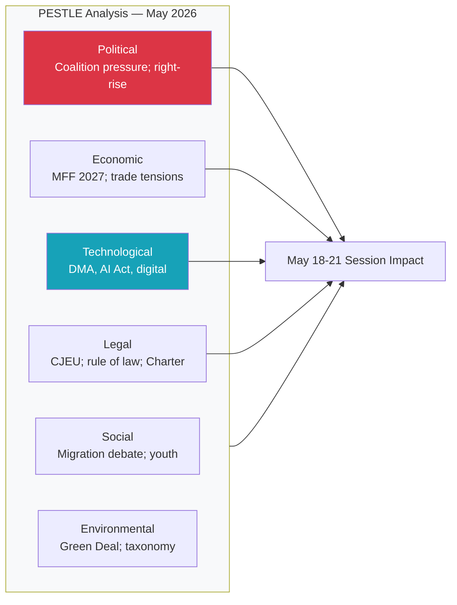

<!-- SPDX-FileCopyrightText: 2026 Hack23 AB -->
<!-- SPDX-License-Identifier: Apache-2.0 -->

# Intelligence: PESTLE Analysis — EU Parliament Week Ahead 18–21 May 2026

**Classification:** PUBLIC | **Confidence:** 🟡 Medium | **Generated:** 2026-05-10

---

## Framework Overview

PESTLE analysis assesses the Political, Economic, Sociological, Technological, Legal, and Environmental macro-forces shaping the European Parliament's operating environment for the week of 18–21 May 2026.

---

## P — Political

### Internal Parliament Dynamics

**Coalition fragmentation:** The EP10 parliament is deeply fragmented, with an Effective Number of Parties of 6.58 — among the highest in EP history. The 9 political groups span a wide ideological spectrum from The Left (GUE/NGL successor) to ESN (far-right sovereigntist). The EPP's dominance (25.5% of seats) masks a structural dependency: it cannot pass legislation without either centre-left partners (S&D, Renew) or temporary right-wing alliances (ECR, PfE) depending on the dossier.

**Governing coalition logic:** The de facto governing coalition — EPP+S&D+Renew — commands 396 seats (55.2% vs. 50.2% threshold). This is the coalition that backed Von der Leyen's second Commission in 2024. Its durability depends on maintaining discipline on contested votes, particularly on dossiers where EPP right-flank and S&D left-flank pull in opposite directions.

**Populist pressure:** PfE (85) and ECR (81) together form a 166-seat populist right bloc. While insufficient to block legislation unilaterally, this bloc exercises soft power over the EPP's positioning on migration, sovereignty, and anti-regulatory dossiers. EPP leadership must balance governing responsibilities against voter competition from PfE.

**Progressive check:** Greens/EFA (53) and The Left (45) provide 98 seats of progressive accountability. On environmental, social, and digital rights dossiers, they can shift EP positions leftward by conditioning support to S&D, which conditions its support to EPP. This creates a ratchet mechanism on progressive policy.

**Risk assessment:** 🟡 MEDIUM — Coalition stability is functional but fragile. High-stakes Wednesday votes (9 scheduled) will test real coalition discipline.

### External Political Context

- **EU-US relations:** Trade tensions partially resolved through tariff quota adjustments (March 2026), but underlying transatlantic divergences on technology, trade, and security remain. The Trump administration (US domestic context) creates episodic disruption to EU foreign policy consensus.
- **EU-Ukraine:** Strong parliamentary majority for Ukraine support, but PfE/ESN fringes erode speed and scope. The accountability framework adopted April 30 signals EP's commitment to continued conditionality.
- **EU-neighbourhood:** Armenia resolution (April 30) reflects EP's proactive Eastern Partnership engagement. Georgia, Moldova, and Western Balkans integration debates continue in background.

---

## E — Economic

**Note: 🔴 IMF data unavailable (degraded mode)**

*Without IMF SDMX data, the following is based on publicly known structural context as of analysis generation date. No specific IMF-sourced figures are cited.*

### Structural Economic Context (non-IMF sources)

- **2027 Budget baseline:** EP adopted budget guidelines (April 28, TA-10-2026-0112) setting Section III parameters. The guidelines reflect competing priorities: EPP fiscal conservatism, S&D social investment demands, Greens climate financing. This creates the budgetary framework that will dominate the next 18 months of interinstitutional negotiation.
- **EIB oversight:** The April 27 debate and subsequent adopted text on EIB financial activities annual report 2024 (TA-10-2026-0119) signals continued EP scrutiny of EU investment instruments. The EIB's role in green transition financing aligns with EP priorities but faces scrutiny on project selection and social impact.
- **EU Globalisation Adjustment Fund:** The Tupperware Belgium case (TA-10-2026-0073, March 2026) demonstrates active use of EGF mechanisms — a signal that labour market disruption from global competition remains politically salient.
- **ECB Vice-President appointment:** March 2026 appointment vote (TA-10-2026-0060) completed the ECB leadership renewal; monetary policy independence framework intact.

### Fiscal Risk Indicators

Without IMF data, a qualitative risk matrix applies:

| Indicator | Status | Source |
|-----------|--------|--------|
| EU Budget 2027 guidelines | Adopted; negotiation phase | EP API |
| EIB investment capacity | Under scrutiny; Green alignment | EP API |
| EGF activation | Active (Tupperware case) | EP API |
| Trade tariff adjustments | Operational (US/EU) | EP API |
| Ukraine loan mechanism | Established | EP API |

**Economic confidence floor:** 🔴 LOW — IMF data unavailable; no GDP, inflation, or deficit indicators accessible for this run.

---

## S — Sociological

### Public Opinion and Democratic Legitimacy

The EP10 emerged from June 2024 elections with an overall rightward shift but maintained pro-EU majority. The rise of PfE and ECR reflects widespread voter anxiety about immigration, cost-of-living, and national identity — forces that continue to shape political dynamics even as the chamber functions within pro-EU institutional constraints.

**Key sociological forces shaping the week:**

1. **Consent and bodily autonomy:** The April 27 debate on "Importance of consent-based rape legislation in the EU" reflects a sustained cross-party social campaign. Greens, The Left, and progressive S&D MEPs have pushed for EU-level minimum standards on sexual violence legislation. This debate may surface again in May through committee reports or oral questions.

2. **Animal welfare:** Welfare of dogs and cats (TA-10-2026-0115, April 28) demonstrates the EP's responsiveness to citizen petition campaigns. Animal welfare remains a high-public-engagement legislative area.

3. **Labour rights:** The subcontracting chains resolution (TA-10-2026-0050, February 2026) and EGF activation signal ongoing attention to platform economy, gig work, and supply chain labour standards.

4. **Democracy and media freedom:** The Lithuania broadcaster threat resolution (January 2026) reflects European civil society concern about democratic backsliding. Similar concerns about Georgia, Hungary, and Slovakia continue to animate EP oversight activities.

---

## T — Technological

### Digital Governance Trajectory

The April 30 DMA Enforcement resolution (TA-10-2026-0160) marks a maturation point in EP's digital regulation posture. Having passed the DSA/DMA/AI Act legislative package in previous years, the EP is now in the **enforcement and implementation oversight** phase.

**Key technology legislative threads entering May 2026:**

1. **DMA follow-through:** Resolution mandates Commission enforcement; EP will monitor progress through IMCO committee. Expected: oral questions, reports, possible hearings with major platform executives.

2. **AI Act implementation:** The AI Act entered into force in 2024; implementation timelines are rolling through 2025-2026. EP oversight of national competent authority designation and prohibited AI use cases will intensify.

3. **Cybersecurity/NIS2:** NIS2 Directive transposition deadline was October 2024; member state implementation quality is under EP scrutiny through ITRE and LIBE.

4. **Digital Single Market completion:** Renew and EPP focus on digital SME competitiveness; S&D and Greens focus on worker protections in digital economy. Balanced digital legislation requires complex coalition building.

---

## L — Legal

### Legislative Framework Context

**Active regulatory implementation cycle:**

| Instrument | Status | Oversight Locus |
|-----------|--------|-----------------|
| DMA | Enforcement phase | IMCO committee |
| DSA | Implementation | IMCO/LIBE |
| AI Act | Phased rollout | IMCO/ITRE/LIBE |
| NIS2 | Transposition monitoring | ITRE/LIBE |
| EU-Mercosur EMPA | CJEU opinion pending (since Jan 2026) | INTA |
| Ukraine Loan Mechanism | Operational | BUDG/AFET |

**EU-Mercosur legal complexity:** The January 2026 CJEU opinion request (TA-10-2026-0008) on EU-Mercosur compatibility with EU Treaties creates a significant legal proceeding. The CJEU's opinion will determine whether the agreement requires unanimity in Council and EP consent, or whether simplified procedures apply. This is a high-stakes legal-political case with major trade implications.

**Rule of Law mechanisms:** Article 7 proceedings against Hungary and Romania are in background but the EP continues to use resolutions, committee reports, and oral questions to maintain pressure on Commission enforcement of rule-of-law conditionality.

---

## E — Environmental

### Green Transition Legislative Context

**Climate and environment in EP10:**

The parliament's environmental ambition is constrained by the rightward shift in EP10 elections, but the Greens/EFA and The Left maintain significant blocking power on regression from EU Green Deal frameworks.

**Key environmental threads entering May 2026:**

1. **Emissions credits for heavy vehicles:** TA-10-2026-0084 (March 2026) adjusted emission credit calculation methodology — reflecting ongoing calibration of EU climate targets with industrial transition timelines.

2. **Nature restoration and biodiversity:** EP10 has been more cautious than EP9 on biodiversity legislation, with ECR and PfE mounting sustained opposition to the Nature Restoration Law implementation.

3. **European Green Deal review:** The Commission's Competitiveness Agenda (von der Leyen II) seeks to balance Green Deal ambitions with industrial competitiveness concerns. EPP is the key swing actor — internally divided between green-conservative MEPs and business-allied MEPs.

4. **Energy security vs. decarbonisation tension:** The Ukraine conflict has accelerated EU energy security imperatives (gas diversification, LNG) that create short-term tensions with long-term decarbonisation targets. EPP navigates this through an "energy mix" pragmatism vs. Greens' strict decarbonisation position.

**Environmental confidence:** 🟡 MEDIUM — Structural analysis based on EP10 composition and recent adopted texts; specific May environmental agenda items not confirmed.

---

## PESTLE Summary Matrix

| Factor | Trend | Impact | Confidence |
|--------|-------|--------|------------|
| Political (internal) | → Stable fragmented coalition | HIGH | 🟢 HIGH |
| Political (external) | ↗ Rising geopolitical engagement | HIGH | 🟡 MEDIUM |
| Economic | → Constrained (IMF unavailable) | MEDIUM | 🔴 LOW |
| Sociological | ↗ Progressive social agenda active | MEDIUM | 🟡 MEDIUM |
| Technological | ↗ DMA enforcement phase beginning | HIGH | 🟡 MEDIUM |
| Legal | → Complex multi-framework implementation | HIGH | 🟡 MEDIUM |
| Environmental | ↘ Green Deal under political pressure | HIGH | 🟡 MEDIUM |

---

*Analysis generated by EU Parliament Monitor | Data: European Parliament Open Data Portal | IMF: UNAVAILABLE (degraded mode) | 2026-05-10*

---

## PESTLE Summary Diagram

