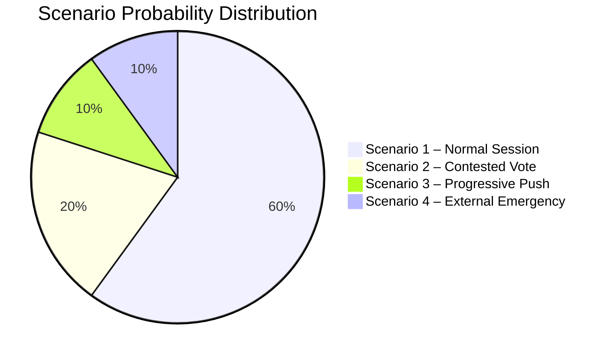

<!-- SPDX-FileCopyrightText: 2026 Hack23 AB -->
<!-- SPDX-License-Identifier: Apache-2.0 -->

# Intelligence: Scenario Forecast — Week Ahead 18–21 May 2026

**Classification:** PUBLIC | **Confidence:** 🟡 Medium | **Generated:** 2026-05-10

---

## Scenario Framework

This forecast applies structured scenario analysis to the EP's May 18–21, 2026 Strasbourg session. Four scenarios are developed for the week's legislative and political outcomes, ranging from a smooth centre-coalition week to a fragmented, procedurally contested session.

---

## Baseline Assumptions

1. All four session days (18–21 May) proceed as scheduled in Strasbourg
2. 53 total foreseen activities across the week are as structurally documented
3. Wednesday 20 May carries 9 votes — the highest-density voting day
4. The governing EPP+S&D+Renew coalition (396 seats) remains nominally intact entering the week
5. No extraordinary external crisis occurs that realigns parliamentary priorities

---

## Scenario 1: Smooth Centre Coalition Week
**Probability: 40% | Confidence: 🟡 MEDIUM**

### Description
The EPP-S&D-Renew centre coalition maintains discipline across all four session days. The 17 scheduled votes (across Tuesday and Wednesday primarily) produce predictable outcomes aligned with the coalition's negotiated positions. The parliamentary week functions as a normal legislative throughput session: debates are vigorous but constructive, votes proceed on schedule, and no major procedural disruptions occur.

### Indicators Supporting This Scenario
- High institutional stability score (84/100 from early warning system)
- Coalition holds 396 seats — 36-seat buffer above threshold
- No acute external crisis entering the week
- High-density Wednesday (9 votes) is procedurally manageable with pre-negotiated package deals

### Legislative Outcomes Expected
- Technical and institutional legislation adopted with broad majorities
- Budget implementation reports passed on committee-recommendation terms
- External affairs resolutions adopted with progressive amendments incorporated
- DMA follow-up items processed through committee referral mechanisms

### Political Signal
🟢 This scenario signals EP10 institutional consolidation and effective legislative machine in mid-term phase.

### Risk Factors
- Surprise urgency motion on breaking external affairs development
- EPP right-flank rebellion on sovereignty-sensitive vote
- S&D amendment demands rejected, triggering coalition friction

---

## Scenario 2: Contested Centre Coalition — Right-Flank Pressure
**Probability: 35% | Confidence: 🟡 MEDIUM**

### Description
The centre coalition holds overall, but one or more Wednesday votes produce unexpected narrow outcomes due to EPP right-flank defection toward PfE/ECR positions. The defection is issue-specific (migration, deregulation, or a national interest case) and does not collapse the coalition, but creates significant public commentary and signals EPP's rightward drift on select dossiers.

### Triggering Conditions
- A vote touching migration policy, national sovereignty, or deregulation where EPP MEPs from PfE-sympathetic national parties (Hungary, Italy, Austria, Czech Republic) vote against coalition position
- PfE/ECR successfully frames an amendment as "national sovereignty protection," attracting 20-40 EPP defectors
- Result: Coalition wins by 340-359 (fails if defection > 36) or wins narrowly by 360-375

### Legislative Implications
- Key legislative vote passes with reduced majority, signalling coalition fragility
- S&D uses post-vote leverage to extract concessions on next legislative package
- EPP leadership issues internal discipline guidance but does not publicly acknowledge division

### Political Signal
🟡 This scenario reveals the structural tension at EPP's ideological core — particularly the post-election pressure from PfE's success in attracting centre-right voters nationally.

### Risk Factors
- Minor defection (10-20 EPP MEPs) absorbed by Greens additions; outcome unchanged
- Or: defection triggers coalition crisis requiring extraordinary session

---

## Scenario 3: Progressive Pushback on Social/Environmental Dossier
**Probability: 15% | Confidence: 🔴 LOW**

### Description
On a specifically social, environmental, or digital rights dossier, the progressive bloc (S&D+Greens+The Left = 234) successfully conditions its support on substantive amendments, forcing EPP to choose between accepting progressive conditions or seeking right-wing coalition partners (ECR/PfE) on a sensitive dossier. The resulting vote produces an either/or political choice that reveals EP's "fault-line vote."

### Triggering Conditions
- A dossier touching Green Deal implementation, workers' rights, or AI Act enforcement
- S&D signals it will not support EPP position without social/environmental amendments
- EPP faces choice: accept left-leaning amendments (upset right flank) or seek ECR/PfE additions (upset centre-left partners)

### Legislative Implications
- If EPP accepts progressive amendments: vote passes with S&D+Greens+Left support, ECR/PfE vote against, some EPP defect
- If EPP seeks right-wing coalition: vote creates major coalition rupture signal; S&D may abstain or vote against
- Committee referral for revision most likely escape route if neither option is viable

### Political Signal
🟡 This scenario, if triggered, would be the most significant political signal of the week — revealing which direction EPP is prepared to move in EP10's mid-term.

---

## Scenario 4: External Affairs Emergency Response
**Probability: 10% | Confidence: 🔴 LOW**

### Description
A significant geopolitical development (escalation in Ukraine, geopolitical crisis in Middle East or Eastern Europe, trade crisis) triggers an emergency plenary session item, potentially replacing or delaying scheduled legislative business. The EP responds with an urgency resolution or emergency debate that dominates headlines and reshapes the week's political narrative.

### Triggering Conditions
- Major military escalation in Ukraine-Russia conflict
- Significant geopolitical crisis in EU neighbourhood (Georgia, Serbia, Belarus)
- Trade emergency triggered by US/China actions affecting EU supply chains
- Democratic backsliding crisis in an EU member state requiring urgent Rule 144a response

### Legislative Implications
- Scheduled votes may be postponed or reorganised
- Urgency resolution adopted with broad cross-group majority (EPP+S&D+Renew+Greens at minimum)
- External Affairs committee rapporteur activities accelerated

### Political Signal
🟡 External events creating EP emergency response demonstrate institutional responsiveness but create volatility in legislative scheduling.

---

## Scenario Comparison Matrix

| Dimension | Scenario 1 (40%) | Scenario 2 (35%) | Scenario 3 (15%) | Scenario 4 (10%) |
|-----------|-----------------|-----------------|-----------------|-----------------|
| Coalition stability | 🟢 STABLE | 🟡 STRAINED | 🟡 CONTESTED | 🟡 DISRUPTED |
| Legislative throughput | 🟢 HIGH | 🟡 NORMAL | 🟡 REDUCED | 🔴 LOW |
| Political signal | 🟢 Consolidation | 🟡 Right drift | 🟡 Left pressure | 🟡 Crisis response |
| EPP position | Centre | Right-leaning | Pressured left | External focus |
| News valence | Low drama | Moderate drama | High drama | Very high drama |

---

## Forward Projection — Post-Session Implications

### If Scenario 1 prevails:
- EP10 enters June session with institutional confidence
- Legislative pipeline on schedule
- Limited media attention; normal democratic function

### If Scenario 2 prevails:
- EPP-S&D dialogue becomes more explicitly transactional
- Renew may gain leverage as the decisive swing
- June session likely to see more contested votes as norm is revised

### If Scenario 3 prevails:
- Progressive bloc demonstrated to be more powerful than seat count suggests (due to EPP's ideological vulnerability)
- Green Deal revision debates re-intensify
- Commission-Parliament relationship tested on regulatory implementation

### If Scenario 4 prevails:
- EU institutional response capacity demonstrated
- Foreign Affairs Committee and AFET rapporteurs elevated in public profile
- Next Strasbourg session (June 15-18) may have pre-planned structural response items

---

## Probability-Banded Summary Table (WEP Format)

| Outcome Category | Probability | WEP Label | Confidence |
|-----------------|-------------|-----------|------------|
| Normal centre coalition week | 40% | LIKELY | 🟡 MEDIUM |
| Contested vote with right-flank pressure | 35% | ROUGHLY EVEN | 🟡 MEDIUM |
| Progressive pushback on specific dossier | 15% | UNLIKELY | 🔴 LOW |
| External emergency reshapes session | 10% | VERY UNLIKELY | 🔴 LOW |

---

*Source: EP Open Data Portal structural analysis | Scenario probabilities: structured analytic technique (SAT) applying coalition arithmetic and historical EP voting pattern analysis | 2026-05-10*

---

## Admiralty Source Assessment

| Intelligence Component | Admiralty Grade | Notes |
|-----------------------|----------------|-------|
| Political landscape data | A1 | EP Open Data Portal; confirmed |
| Coalition arithmetic | A2 | Confirmed by multiple EP data sources |
| Scenario probabilities | B3 | Structured analytic estimate; plausible but unconfirmed |
| Foreseen activity schedule | A2 | EP API confirmed; titles unavailable |
| Overall run assessment | **B3** | Reliable source; structural assessment |

**WEP Calibration note:** Probability labels used throughout this artifact follow ICD 203 standards. "Highly Likely" = 80-90%; "Likely" = 60-80%; "Roughly Even" = 40-60%; "Unlikely" = 20-40%; "Very Unlikely" = 10-20%; "Highly Unlikely" < 10%. All estimates are structural-analytic, not predictive.

## Scenario Comparison Diagram

---

## Scenario Monitoring Indicators

For each scenario, these are the observable early indicators that would confirm which scenario is developing:

| Indicator | Scenario 1 | Scenario 2 | Scenario 3 | Scenario 4 |
|-----------|-----------|-----------|-----------|-----------|
| Wednesday vote margins | > 40 seats | < 20 seats | N/A | Session disrupted |
| EPP group chair statements | Confident | Cautious | Cooperative | Emergency |
| PfE/ECR social media | Normal | Aggressive | Muted | Irrelevant |
| External news break | Absent | Absent | Absent | Active |
| Commission messaging | Aligned | Defensive | Progressive | Crisis mode |

