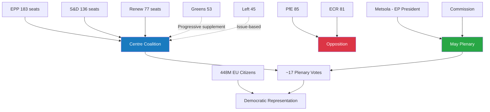

<!-- SPDX-FileCopyrightText: 2026 Hack23 AB -->
<!-- SPDX-License-Identifier: Apache-2.0 -->

# Intelligence: Stakeholder Map — Week Ahead 18–21 May 2026

**Classification:** PUBLIC | **Confidence:** 🟡 Medium | **Generated:** 2026-05-10

---

## Stakeholder Framework

This map identifies the primary institutional and political actors shaping the European Parliament's May 18–21, 2026 Strasbourg plenary. It analyses each group's interests, expected positions, coalition behaviours, and strategic leverage points.

---

## Tier 1: Primary Parliamentary Actors

### EPP — European People's Party (183 seats, 25.5%)

**Strategic position:** Dominant legislative agenda-setter but structurally dependent on coalition partners for every majority. The EPP is simultaneously the engine of legislative output and the subject of coalition management pressure from all sides.

**Core interests this week:**
- Maintain legislative throughput on strategic Commission priorities (competitiveness, defence, digital)
- Prevent populist right (PfE/ECR) from capturing EP headlines or forcing agenda items
- Preserve S&D and Renew coalition cohesion without making concessions that weaken EPP's own voter base appeal

**Expected behaviour:**
- Support mainstream centre coalition on institutional and technical legislation
- Negotiate hard on any redistributive or Green Deal-adjacent dossiers where fiscal conservatism and social pressure collide
- Deploy procedural mechanisms (time limits, referrals to committee) to manage controversial debates

**Leverage:** Agenda-setting primacy through Conference of Presidents; committee chair distributions favour EPP disproportionately; Von der Leyen Commission alignment creates executive-legislative coordination channel.

**Risk factors:** Right-flank defection (EPP MEPs from PfE-sympathetic national parties) on migration; left-wing pressures from German/Austrian CDU MEPs' social-market tradition creating internal diversity of position.

**Key figures** (from public parliamentary record): Roberta Metsola (President, Maltese EPP), Manfred Weber (EPP Group Chair). Their procedural and political leadership defines the week's tone.

---

### S&D — Progressive Alliance of Socialists and Democrats (136 seats, 19%)

**Strategic position:** Indispensable coalition partner. S&D has the leverage to extract concessions from EPP in exchange for majority votes, but cannot govern independently. The group's legislative strategy centres on ensuring social, labour, and democratic-governance priorities are embedded in centre-coalition legislation.

**Core interests this week:**
- Ensure workers' rights, anti-poverty, and social investment measures in budget and trade legislation
- Maintain strong Ukraine support without allowing it to crowd out social agenda
- Hold the progressive coalition together on rule-of-law and democratic oversight dossiers

**Expected behaviour:**
- Vote with EPP and Renew on mainstream institutional and geopolitical dossiers
- Push for amendments on social clauses in economic and trade legislation
- Use oral questions and debates to maintain public accountability pressure on Commission

**Leverage:** As the indispensable second partner in the governing coalition, S&D has "kingmaker" capacity on any vote where EPP cannot secure majority from the right.

**Risk factors:** Internal divergence between Nordic social-democratic members (fiscally disciplined, trade-liberal) and Southern/Western members (pro-spending, trade-conditional). On Ukraine, varying national security positions create potential fragmentation.

---

### Renew Europe (77 seats, 10.7%)

**Strategic position:** The swing vote. Renew's positioning between EPP and S&D on the ideological spectrum gives it pivotal capacity on a narrow range of "centre" votes. Its liberal, pro-EU, pro-free-trade stance aligns with EPP on economic dossiers and with S&D on rule-of-law and European integration.

**Core interests this week:**
- Advance digital single market and free trade agenda
- Maintain EU institutional integrity and rule-of-law enforcement
- Prevent regression on EU enlargement and neighbourhood policy

**Expected behaviour:**
- Reliable centre-coalition partner on institutional, digital, and external relations dossiers
- May split from EPP on environmental regulation (some Renew members more environmentally ambitious than EPP average)
- Active on Ukraine support — France's Renaissance wing and Nordic liberal parties strongly pro-Ukraine

**Leverage:** With 77 seats, Renew tips any close vote in the 350-370 range. Without Renew, EPP+S&D at 319 is short of majority.

---

### PfE — Patriots for Europe (85 seats, 11.9%)

**Strategic position:** The largest opposition bloc, ideologically positioned right of EPP on sovereignty, migration, and EU institutional power. PfE cannot govern but can disrupt — through amendments, procedural challenges, public communications, and defection appeals to EPP right-flank.

**Core interests this week:**
- Resist EU-level competencies expansion in social and immigration domains
- Maintain national sovereignty carve-outs in digital and energy legislation
- Amplify narratives about EU regulatory overreach for domestic electoral purposes

**Expected behaviour:**
- Opposition voting on most mainstream legislative dossiers
- Amendment strategies targeting sovereignty and deregulation provisions
- Coalition with ECR on select measures (deregulation, anti-Green Deal) but divergence on Ukraine and rule of law

**Leverage:** Soft power through media presence and EPP right-flank pressure; procedural ability to call for roll-call votes; committee positions that allow report amendments.

---

### ECR — European Conservatives and Reformists (81 seats, 11.3%)

**Strategic position:** Ideologically adjacent to PfE on many economic dossiers, but notably different on Ukraine (strongly pro-support, led by Polish PiS faction) and occasionally on institutional reform. ECR occupies an awkward position: anti-EU-integration in theory, but strongly pro-EU-unity on Russia/Ukraine due to Polish-led security priorities.

**Core interests this week:**
- Strong Ukraine support and Russian accountability (Poland-led agenda)
- Resistance to EU regulatory expansion on labour and environmental domains
- Maintaining national government prerogatives in economic and social policy

**Expected behaviour:**
- Pro-Ukraine on external relations dossiers — may vote with centre coalition on Ukraine-related items
- Opposition on social regulation, climate, and EU-competencies expansion
- Potential dealmaking with EPP on security-linked dossiers (defence procurement, hybrid threat resilience)

**Leverage:** Ukraine stance creates opportunities for EPP dealmaking on security dossiers; 81 seats provide meaningful coalition addition for right-leaning EPP majorities.

---

### Greens/EFA (53 seats, 7.4%)

**Strategic position:** Progressive anchor on climate, digital rights, and democratic governance. Having lost seats in EP10 elections, the Greens are in defensive mode — protecting Green Deal achievements from rollback while seeking to shape new legislation progressively.

**Core interests this week:**
- Prevent environmental regression in any legislative outcomes
- Maintain DMA/DSA enforcement momentum on digital regulation
- Push for stronger social and migration rights protections

**Expected behaviour:**
- Vote with S&D and The Left on progressive coalition dossiers
- Condition support for EPP-S&D legislation on environmental safeguards
- Active use of committee mechanisms and oral questions on Green Deal implementation

**Leverage:** Environmental credibility and progressive coalition anchor; capacity to create "progressive majority" with S&D and The Left on select dossiers (53+136+45=234, short of majority but significant amendment power).

---

### The Left / GUE-NGL successor (45 seats, 6.3%)

**Strategic position:** Far-left anchor. The Left provides the most consistent progressive position on social, anti-austerity, and human rights dossiers. It votes with Greens and often S&D on progressive coalitions but maintains independence on geopolitical security dossiers.

**Core interests this week:**
- Social rights and anti-austerity positions in budget context
- Workers' rights and labour protections in trade and economic legislation
- Democratic accountability and anti-corruption oversight

**Expected behaviour:**
- Progressive coalition partner on social and rights dossiers
- Conditional on Ukraine dossiers (anti-militarism tradition creates internal tension)
- Independent on trade — more protectionist than S&D

**Leverage:** Marginal blocking/enabling capacity on close progressive majority votes.

---

## Tier 2: Institutional Actors

### European Commission (Von der Leyen II)

The Commission is the primary legislative initiator and executive partner. Von der Leyen's second Commission (2024-2029) is aligned with the EPP-S&D-Renew governing coalition. The Commission's legislative programme defines the underlying dossier pipeline that the Parliament processes.

**EP relationship:** Constructive but monitored. The parliament uses oral questions, hearings, and resolutions to exercise oversight and push back on Commission priorities.

**Week significance:** Commission representatives attend plenary debates and respond to oral questions — their positions on DMA enforcement, Ukraine instruments, and budget implementation will be scrutinised.

---

### Council of the EU

The Council (member state governments) is the co-legislator on most EP dossiers. Interinstitutional negotiations (trilogues) between EP, Council, and Commission define final legislative outcomes.

**Week significance:** Council positions on upcoming trilogues will shape the negotiating context for EP committees. External affairs Council decisions (on Ukraine, trade) create context for EP resolutions.

---

## Tier 3: External Actors with EP Relevance

### United States Government

The March 2026 US tariff adjustment resolution reflects the ongoing importance of transatlantic trade policy management. The US position on trade, technology (platform regulation, AI standards), and Ukraine support creates episodic EP agenda influence.

### Ukraine Government / Russian Federation

Ukraine's ongoing conflict with Russia directly shapes EP external affairs agenda. The April 30 accountability resolution and January loan mechanism reflect EP's strong institutional commitment to Ukraine — but the conflict trajectory creates weekly volatility in EP foreign policy discussions.

### Major Digital Platforms (Gatekeeper Designation)

Post-DMA enforcement resolution, major platforms (Apple, Google, Meta, Amazon, Microsoft) are directly affected EP stakeholders. Their lobbying activity in Brussels intensifies as enforcement mechanisms activate. The May session may see platform-related committee hearings or reports.

---

## Stakeholder Interaction Map

```
                    European Commission
                          ↑↓
    Council ←→ [PLENARY: 18-21 May] ←→ Committees
                          ↑
              Coalition Management Architecture
              ┌──────────────────────────┐
              │  EPP (183) ←core→ S&D (136) │
              │       ↑ Renew (77) ↑        │
              │  396/360 seats ✅ majority  │
              └──────────────────────────┘
                    ↓ pressure ↓
          PfE+ECR (166) ←→ Greens+Left (98)
          [Opposition/Challenge]    [Progressive anchor]
```

---

## Coalition Scenario Analysis for Key Votes

### Scenario A: EPP-S&D-Renew centre coalition (396 seats)
**Likelihood:** 🟢 HIGH for institutional and technical legislation
**Failure mode:** Right-flank defection on sovereignty dossiers

### Scenario B: EPP + Right (EPP+ECR+PfE = 349 seats)
**Likelihood:** 🔴 LOW — insufficient seats; ideologically contested
**Use case:** Might work for deregulation with some NI additions if all align

### Scenario C: Progressive plus centre (S&D+Renew+Greens+Left = 311)
**Likelihood:** 🟡 MEDIUM on progressive social dossiers
**Failure mode:** 49 seats short of majority; requires EPP or right-wing additions

### Scenario D: Grand coalition (EPP+S&D+Renew+Greens = 449 seats)
**Likelihood:** 🟡 MEDIUM on high-stakes constitutional/institutional dossiers
**Use case:** When broad consensus is desirable; climate and digital rights overlap

---

*Source: European Parliament Open Data Portal | Political landscape data: 2026-05-10 | Analysis applies public parliamentary role data only (GDPR compliant)*

---

## Stakeholder Network Diagram



