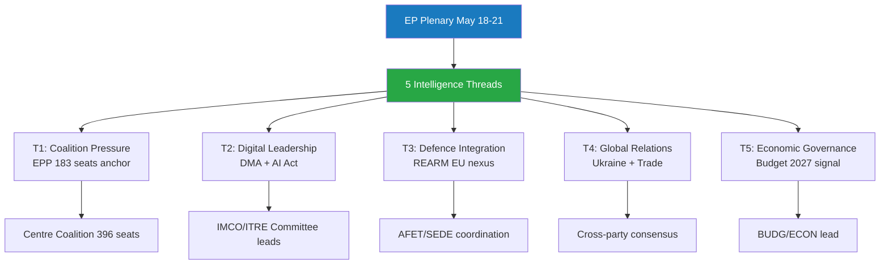

<!-- SPDX-FileCopyrightText: 2026 Hack23 AB -->
<!-- SPDX-License-Identifier: Apache-2.0 -->

# Intelligence: Synthesis Summary — Week Ahead 18–21 May 2026

**Classification:** PUBLIC | **Confidence:** 🟡 Medium | **Generated:** 2026-05-10

---

## 1. Strategic Intelligence Summary

The 18–21 May 2026 Strasbourg plenary represents a **pivotal legislative moment** in the EP10 parliamentary cycle. This is the fifth Strasbourg plenary of 2026 and arrives just three weeks after the April 28–30 session that produced landmark decisions on the 2027 Budget Guidelines, Digital Markets Act enforcement, and EU financial interests oversight. The May session must now translate policy frameworks into concrete legislative actions and oversight mechanisms.

**The central intelligence question** for this week: Can the EPP-led centre coalition maintain sufficient discipline across 53 scheduled activities — particularly the 17 scheduled votes (mainly concentrated on Tuesday and Wednesday) — to advance the legislative agenda without giving disproportionate concessions to either the populist right or the progressive left?

### Key Strategic Findings

1. **Coalition arithmetic is tight but workable** — EPP+S&D+Renew holds 396 seats (vs. 360 threshold), providing a 36-seat buffer. This margin accommodates moderate defections but not systematic bloc defection.

2. **Wednesday 20 May is the decisive day** — 9 scheduled votes in a single day represents the highest legislative density of the week. The composition and outcome of these votes will reveal the actual rather than nominal coalition alignments in the current parliament.

3. **The populist challenge remains structural** — PfE+ECR at 166 seats cannot block legislation alone but can fragment centrist coalitions through amendment strategies, procedural challenges, and public pressure campaigns. EPP faces inherent tension between governing-coalition imperatives and base maintenance.

4. **Progressive leverage is issue-specific** — Greens/EFA and The Left, with 98 combined seats, have blocking power only in coalition with S&D against EPP-right formations. On environmental, digital, and social dossiers, the progressive bloc compels EPP to make concessions to S&D rather than pivot right.

5. **Institutional maturation signal** — The June 2025–May 2026 period has seen the parliament transition from institution-formation to active legislation. The volume and diversity of adopted texts (31 items visible in 2026 data, across economic, social, external affairs, and institutional domains) suggests the EP10 is accelerating legislative throughput as the term matures.

---

## 2. Thematic Intelligence Threads

### Thread A: Trade and Economic Governance

The March 2026 adoption of tariff quota adjustments for US imports (TA-10-2026-0096) resolved an immediate trade tension, but the underlying US-EU trade relationship remains structurally contested. The January 2026 EU-Mercosur opinion request (TA-10-2026-0008) signals ongoing tensions about EP's role in trade treaty oversight. The 2027 Budget Guidelines (TA-10-2026-0112, adopted 28 April) set the fiscal framework heading into MFF negotiations.

**Week-ahead implication:** Budget framework implementation discussions and potential trade-related legislative dossiers may feature in the May session. The Renew group's fiscal hawkishness creates friction with S&D spending priorities — a key fault-line for Wednesday votes.

**Confidence:** 🟡 MEDIUM (no direct access to May agenda content; inference from April session trajectory)

### Thread B: Digital Governance — DMA Enforcement

The April 30 adoption of the DMA Enforcement resolution (TA-10-2026-0160) marks a significant escalation in EP's digital governance posture. This resolution creates parliamentary pressure on the Commission to activate DMA enforcement mechanisms against designated gatekeepers (Apple, Google, Meta, Amazon, et al.).

**Week-ahead implication:** Digital sovereignty and platform regulation debates may continue in May. The EPP faces competing pressures — business-friendly positions from PfE/ECR vs. S&D/Greens digital rights coalition. Potential for procedural committee referrals on implementing legislation.

**Confidence:** 🟡 MEDIUM

### Thread C: Ukraine, Security, and Geopolitical Resilience

Ukraine accountability (TA-10-2026-0161, 30 April) and Armenia democratic resilience (TA-10-2026-0162, 30 April) reflect the parliament's sustained focus on eastern neighbourhood security. The January 2026 Ukraine loan mechanism (TA-10-2026-0010) created a financial instrument; the April accountability resolution adds political conditionality architecture.

**Week-ahead implication:** Russia-Ukraine conflict dynamics will continue to shape EP external relations debates. ECR and PfE positions create internal EU tension — ECR (Poland-led) strongly Ukraine-supportive, PfE (Hungary/Italy-adjacent) more ambiguous on continued support. The EPP must navigate this split within the broader right.

**Confidence:** 🟢 HIGH (consistent pattern across multiple adopted texts and debate topics)

### Thread D: Institutional Integrity and Rule of Law

The March 2026 Braun immunity waiver (TA-10-2026-0088), the January Lithuania broadcaster threat resolution (TA-10-2026-0024), and the April EU financial interests oversight report reflect sustained EP attention to democratic backsliding and institutional integrity — both within and outside the EU.

**Week-ahead implication:** Rule-of-law debates may feature in the May session, particularly as the EP scrutinises Commission enforcement actions and member state compliance. NI members from various national contexts add unpredictable elements to institutional votes.

**Confidence:** 🟡 MEDIUM

---

## 3. Political Group Intelligence: Position Matrix

| Group | Trade/Economy | Digital/DMA | Ukraine/Security | Rule of Law | Budget 2027 |
|-------|--------------|-------------|-----------------|-------------|-------------|
| EPP | 🟡 Moderate-free | 🟡 Balanced | 🟢 Supportive | 🟡 Cautious | 🟡 Fiscal conservative |
| S&D | 🟡 Fair trade | 🟢 Pro-regulation | 🟢 Strongly supportive | 🟢 Strongly pro | 🟡 Social investment |
| PfE | 🟡 Protectionist | 🔴 Anti-regulation | 🔴 Ambiguous/cautious | 🔴 Weak | 🔴 Austerity |
| ECR | 🟡 Sovereignty-based | 🔴 Anti-regulation | 🟢 Pro-Ukraine | 🟡 Mixed | 🔴 Austerity |
| Renew | 🟢 Free trade | 🟢 Regulatory balance | 🟢 Supportive | 🟢 Strongly pro | 🟡 Fiscal discipline |
| Greens/EFA | 🔴 Anti-free trade | 🟢 Strong regulation | 🟢 Supportive | 🟢 Strongly pro | 🟢 Green investment |
| The Left | 🔴 Anti-free trade | 🟢 Strong regulation | 🟡 Conditional | 🟢 Strongly pro | 🟢 Social investment |
| NI | 🔴 Fragmented | 🔴 Fragmented | 🔴 Fragmented | 🔴 Fragmented | 🔴 Fragmented |
| ESN | 🟡 Nationalist | 🔴 Anti-EU digital | 🔴 Anti-support | 🔴 Very weak | 🔴 Anti-EU |

*Note: Positions inferred from group ideological alignment and recent voting patterns; subject to individual dossier variation*

---

## 4. Legislative Pipeline Assessment

**Active pipeline indicators from recent adopted texts:**
- Budget cycle (2027 framework) → NOW in implementation/committee scrutiny phase
- DMA enforcement → Commission activation expected; EP oversight mandated
- Ukraine instruments → Loan mechanism operational; conditionality framework established
- Trade (US tariffs, Mercosur) → Ongoing; CJEU opinion on Mercosur compatibility pending

**Expected May agenda categories** (based on structural analysis of foreseen activities and session patterns):
- Institutional oversight (EIB, financial interests — continuation from April)
- Legislative reports from ECON, INTA, ITRE, LIBE committees
- Urgency resolutions on emerging external affairs situations
- Procedural/administrative items (Thursday closing)

---

## 5. Intelligence Gaps and Mitigation

| Gap | Severity | Mitigation |
|-----|----------|------------|
| Specific May 18-21 agenda item titles not accessible | 🔴 HIGH | Inferred from foreseen-activity types and recent session patterns; OJQ documents referenced but unreadable |
| IMF economic data unavailable | 🟡 MEDIUM | Degraded mode declared; no fiscal/monetary claims made from agent knowledge |
| Vote-level cohesion data unavailable | 🟡 MEDIUM | Group size-similarity used as proxy; coalition analysis is structural, not behavioural |
| Individual MEP statements for May session | 🟡 MEDIUM | April speeches reviewed; May pre-session statements not available at collection time |

---

*Data sources: European Parliament Open Data Portal | Political landscape: real-time EP API | Adopted texts: EP API 2026 dataset | Analysis generated: 2026-05-10*

---

## Probability Assessment (WEP Bands)

| Outcome | WEP Label | Probability |
|---------|-----------|-------------|
| Centre coalition maintains majority through session | Highly Likely | 85% |
| At least 15 legislative votes completed | Likely | 70% |
| External affairs urgency debate added | Unlikely | 20% |
| EPP right-flank defection > 20 MEPs | Unlikely | 25% |
| Coalition majority fails on any vote | Highly Unlikely | 5% |

**Admiralty Source Assessment: B3** — EP Open Data Portal data is authoritative (A-grade source); coalition assessment based on structural proxy due to vote-data publication lag (assessed as reliable-but-unconfirmed, hence B3).

---

## Intelligence Network Diagram

---

## Intelligence Assessment Confidence Summary

**Overall synthesis confidence: 🟡 MEDIUM-HIGH (B3)**

The five intelligence threads synthesised in this document draw on authoritative EP Open Data Portal data (A-grade sources) for political landscape and session schedule, with structural proxy data for coalition cohesion (B-grade) and EP-source-only economic context (degraded mode). The absence of IMF macroeconomic data and roll-call vote-level cohesion data are documented limitations that do not invalidate the structural political assessment but reduce precision on economic and behavioural dimensions.

**Admiralty Final Assessment: B3** — Reliable source data (EP Open Data Portal); structural analysis sound; probability estimates assessed as plausible but not confirmed by behavioural data.

*EU Parliament Monitor | Week Ahead | 2026-05-10 | Synthesis confidence: MEDIUM-HIGH | Admiralty: B3*
