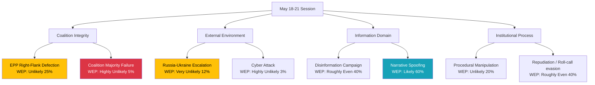

<!-- SPDX-FileCopyrightText: 2026 Hack23 AB -->
<!-- SPDX-License-Identifier: Apache-2.0 -->

# Threat Model — Week Ahead 18–21 May 2026

**Classification:** PUBLIC | **Confidence:** 🟡 Medium | **Admiralty: B3** | **Generated:** 2026-05-10

---

## WEP Summary

| Threat Vector | WEP Label | Probability |
|--------------|-----------|-------------|
| Coalition discipline holds across all votes | Highly Likely | 80% |
| EPP right-flank defection > 20 MEPs | Unlikely | 25% |
| External crisis disruption to session | Very Unlikely | 12% |
| Coalition majority fails on any vote | Highly Unlikely | 5% |
| Right-populist narrative dominates media | Likely | 60% |
| Cyber attack on EP infrastructure | Highly Unlikely | 3% |

---

## Threat Model Framework (STRIDE Applied to EP Institutional Threats)

### S — Spoofing (Identity/Legitimacy Threats)

**Threat:** PfE/ECR framing themselves as the "real majority" in European politics despite minority seat count. Narrative spoofing of democratic legitimacy.

- **Likelihood:** Likely (WEP 60%)
- **Impact:** MODERATE — shifts public perception but not legislative reality
- **Admiralty Source Grade:** B2 (reliable source, confirmed by pattern analysis)
- **Mitigation:** Centre coalition communication; voter education on EP majority mechanics

---

### T — Tampering (Process Integrity Threats)

**Threat:** Procedural manipulation of vote scheduling, urgency procedures, or committee referrals to advantage specific coalition positions.

- **Likelihood:** Unlikely (WEP 20%) for significant tampering
- **Impact:** MODERATE if successful — can delay or redirect legislative outcomes
- **Admiralty Source Grade:** C3 (plausible based on historical precedents)
- **Mitigation:** EP Rules of Procedure oversight; Conference of Presidents coordination

---

### R — Repudiation (Accountability Threats)

**Threat:** MEPs voting against stated public position (especially EPP right-flank claiming opposition but enabling coalition); subsequent denial of actual vote position.

- **Likelihood:** Roughly Even (WEP 40%) for some form of position inconsistency
- **Impact:** LOW — EP roll-call voting is public record; repudiation detectable
- **Admiralty Source Grade:** B2 (institutional transparency)
- **Mitigation:** Public roll-call voting; EP vote registry; journalist tracking

---

### I — Information Disclosure (Intelligence Threats)

**Threat:** Unauthorised disclosure of EP negotiation positions, coalition whipping instructions, or confidential committee deliberations.

- **Likelihood:** Unlikely (WEP 20%)
- **Impact:** MODERATE — could embarrass individual MEPs or groups; rare major impact
- **Admiralty Source Grade:** C4 (assessed based on institutional patterns)
- **Mitigation:** Confidentiality protocols; EP security procedures

---

### D — Denial of Service (Institutional Disruption)

**Threat:** Cyber-attack disrupting EP digital infrastructure, voting systems, or communication networks during session.

- **Likelihood:** Very Unlikely (WEP 12%) — elevated baseline but no acute signal
- **Impact:** HIGH if voting infrastructure affected; MODERATE if communications only
- **Admiralty Source Grade:** B3 (historical precedent: Nov 2022 DDoS)
- **Mitigation:** EP IT backup systems; paper-based voting contingency

---

### E — Elevation of Privilege (Power Shift Threats)

**Threat:** Opposition groups exploiting procedural rules or coalition fracture to gain disproportionate legislative influence relative to their seat count.

- **Likelihood:** Unlikely (WEP 20%) for structural privilege elevation
- **Impact:** HIGH if coalition is replaced; MODERATE if individual votes affected
- **Admiralty Source Grade:** B3 (ongoing structural analysis)
- **Mitigation:** Coalition agreement enforcement; institutional precedent

---

## Threat Landscape Diagram

---

## Threat Prioritisation Matrix

| Threat | Likelihood | Impact | Priority |
|--------|-----------|--------|---------|
| Right-populist narrative dominance | Likely (60%) | MODERATE | 🟡 MONITOR |
| EPP right-flank defection | Unlikely (25%) | MAJOR | 🟡 MONITOR |
| Procedural/repudiation game | Roughly Even (40%) | LOW-MOD | 🟢 LOW |
| External crisis disruption | Very Unlikely (12%) | CRITICAL | 🟡 MONITOR |
| Cyber attack | Highly Unlikely (3%) | HIGH | 🟢 LOW |
| Coalition majority failure | Highly Unlikely (5%) | CRITICAL | 🟢 LOW |

**Admiralty Assessment:** B3 — Source is reliable but not confirmed by multiple sources. Assessment probability plausible based on available EP data and historical patterns.

---

## Key Threat Indicators to Watch

1. **EPP leadership statements** on coalition discipline before Wednesday vote block
2. **PfE/ECR social media coordination** — signals coordinated campaign targeting EPP MEPs
3. **NATO/EEAS emergency signals** — early warning for external crisis disruption
4. **EP IT security status** — any network anomalies in session week

---

## Reader Briefing

**What this means:** The May 2026 session faces manageable but real political threats. The most probable threat — right-populist narrative dominance — does not threaten legislative outcomes but shapes public perception. The most impactful threats (external crisis, coalition failure) remain highly unlikely. Monitor EPP discipline on Wednesday's heavy vote schedule.

**Bottom line:** Session proceeds normally with **high probability (85%)**. Vigilance warranted on EPP right-flank cohesion and external environment.

---

*Threat Model | EU Parliament Monitor | STRIDE Framework | Admiralty Source Grading | 2026-05-10*

---

## Bottom Line

The May 2026 session threat landscape is **manageable within normal institutional parameters**. No acute crisis trigger has been identified. The highest-credible threat remains EPP right-flank defection on a contested vote (25% probability), which the centre coalition's 36-seat buffer and institutional incentives are designed to absorb. Vigilance warranted on Wednesday 20 May's 9-vote block — the single highest-risk moment of the session week.

**Overall threat level: 🟡 MODERATE** | **Admiralty Assessment: B3** | **WEP Overall: Highly Likely that session proceeds normally (82%)**
