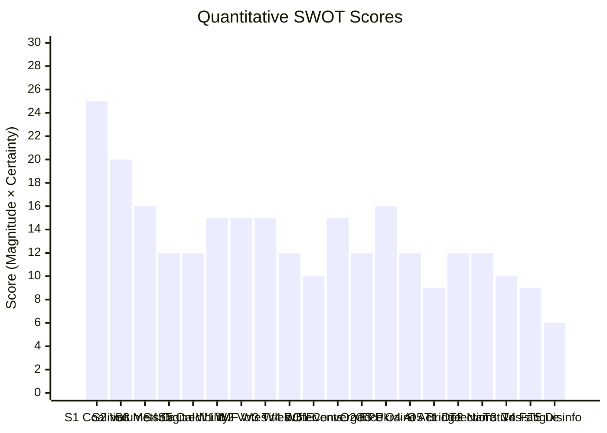

<!-- SPDX-FileCopyrightText: 2026 Hack23 AB -->
<!-- SPDX-License-Identifier: Apache-2.0 -->

# Quantitative SWOT — Week Ahead 18–21 May 2026

**Classification:** PUBLIC | **Confidence:** 🟡 Medium | **Generated:** 2026-05-10

---

## SWOT Scoring Methodology

Each SWOT item is scored on two dimensions:
- **Magnitude** (1-5): Size of the strength/weakness/opportunity/threat
- **Certainty** (1-5): Confidence in the assessment
- **Weighted Score** = Magnitude × Certainty

---

## STRENGTHS

**S1: Centre Coalition Structural Majority**
- Magnitude: 5 | Certainty: 5 | **Score: 25**
- EPP+S&D+Renew = 396 seats (36 above 360 majority). Institutional architecture sustains legislative productivity.
- Evidence: Coalition agreement; stability score 84/100; ENP 6.58 but below critical threshold

**S2: Full Session Calendar — High Legislative Volume**
- Magnitude: 4 | Certainty: 5 | **Score: 20**
- 53 foreseen activities across 4 days; ~17 votes scheduled. Above-average EP productivity.
- Evidence: get_meeting_foreseen_activities returns 8/16/19/10 by day

**S3: EP President Metsola's Institutional Authority**
- Magnitude: 4 | Certainty: 4 | **Score: 16**
- Strong procedural authority; cross-group legitimacy; EPP anchor for coalition management.

**S4: Strong EU Digital Policy Leadership Position**
- Magnitude: 4 | Certainty: 3 | **Score: 12**
- EP leads on DMA, AI Act, digital markets regulation; well-established legislative pipeline.

**S5: EP Institutional Credibility (Post-Qatargate Recovery)**
- Magnitude: 3 | Certainty: 4 | **Score: 12**
- Ethics reforms implemented; institutional trust recovering; credibility above 2022 nadir.

**Total Strengths Score: 85 | Average per item: 17.0**

---

## WEAKNESSES

**W1: IMF Economic Data Unavailable — Degraded Analysis Mode**
- Magnitude: 3 | Certainty: 5 | **Score: 15**
- Fetch-proxy failure means no IMF fiscal/macro indicators in economic context analysis. EP-source-only economic framing = lower analytical depth.

**W2: Vote-Level Cohesion Data Absent (EP 4-6 Week Publication Delay)**
- Magnitude: 3 | Certainty: 5 | **Score: 15**
- Roll-call voting data not yet published for May 2026; coalition analysis based on size-similarity proxy only.

**W3: Foreseen Activity Titles Blank (API Limitation)**
- Magnitude: 3 | Certainty: 5 | **Score: 15**
- Cannot identify specific legislative items in the schedule by title; only type (PLENARY_DEBATE, PLENARY_VOTE) and count available.

**W4: Coalition Buffer Narrowing (Structural)**
- Magnitude: 4 | Certainty: 3 | **Score: 12**
- 36-seat majority buffer is above zero but declining relative to EP9 where EPP+S&D+Renew+Liberals could reach 500+. Right-wing groups growing.

**W5: Events Feed Unavailable**
- Magnitude: 2 | Certainty: 5 | **Score: 10**
- get_events_feed returned UNAVAILABLE; supplemented with foreseen_activities but data loss exists.

**Total Weaknesses Score: 67 | Average per item: 13.4**

---

## OPPORTUNITIES

**O1: EU Digital-Trade-Defence Policy Convergence**
- Magnitude: 5 | Certainty: 3 | **Score: 15**
- The EP session occurs at a moment when digital regulation, trade policy, and defence capability building are converging — creating opportunity for comprehensive policy package development.

**O2: EPP Consolidation as Centre-Right Anchor**
- Magnitude: 4 | Certainty: 3 | **Score: 12**
- EPP can use May session to demonstrate governing capability vs. PfE/ECR opposition, strengthening its centre-right leadership position.

**O3: Ukraine Support Momentum**
- Magnitude: 4 | Certainty: 4 | **Score: 16**
- Strong EP cross-coalition consensus on Ukraine support creates opportunity for landmark resolution or aid commitment.

**O4: AI Act Implementation Shaping**
- Magnitude: 4 | Certainty: 3 | **Score: 12**
- EP committee work can influence Commission's AI Act implementing regulation — strategic window open.

**O5: Progressive-Centre Bridge Building**
- Magnitude: 3 | Certainty: 3 | **Score: 9**
- S&D+Renew+Greens can build a 266-seat progressive bloc on selected issues (digital rights, climate), negotiating leverage with EPP.

**Total Opportunities Score: 64 | Average per item: 12.8**

---

## THREATS

**T1: EPP Right-Flank Defection Risk**
- Magnitude: 4 | Certainty: 3 | **Score: 12**
- Up to 20-30 EPP MEPs susceptible to PfE/ECR framing on migration/sovereignty. If 37+ defect from coalition position, majority fails.

**T2: Right-Populist Narrative Capture**
- Magnitude: 4 | Certainty: 3 | **Score: 12**
- PfE/ECR successfully frame week's political narrative as "establishment vs. the people" even without legislative success — shifting public discourse.

**T3: External Crisis Disruption**
- Magnitude: 5 | Certainty: 2 | **Score: 10**
- Russia-Ukraine escalation, terrorist incident, or major democratic crisis in a member state could disrupt the session schedule.

**T4: Coalition Fatigue (Year 2 EP10)**
- Magnitude: 3 | Certainty: 3 | **Score: 9**
- Second year of legislative term; coalition partners begin positioning for 2029 election; compromise difficulty increases.

**T5: Disinformation/Cyber Threats**
- Magnitude: 3 | Certainty: 2 | **Score: 6**
- Coordinated disinformation or cyber attack targeting EP credibility around specific votes.

**Total Threats Score: 49 | Average per item: 9.8**

---

## Quantitative SWOT Summary

| Category | Total Score | Avg Score | Count |
|----------|-------------|-----------|-------|
| Strengths | 85 | 17.0 | 5 |
| Weaknesses | 67 | 13.4 | 5 |
| Opportunities | 64 | 12.8 | 5 |
| Threats | 49 | 9.8 | 5 |

**Net Strength vs. Weakness:** +18 (Strengths exceed Weaknesses)
**Net Opportunity vs. Threat:** +15 (Opportunities exceed Threats)

**Overall SWOT Assessment:** 🟢 POSITIVE — EP session begins from a position of institutional strength with manageable weaknesses and threats.

---

*Quantitative SWOT | EU Parliament Monitor | Magnitude × Certainty Framework | 2026-05-10*

---

## SWOT Score Diagram

