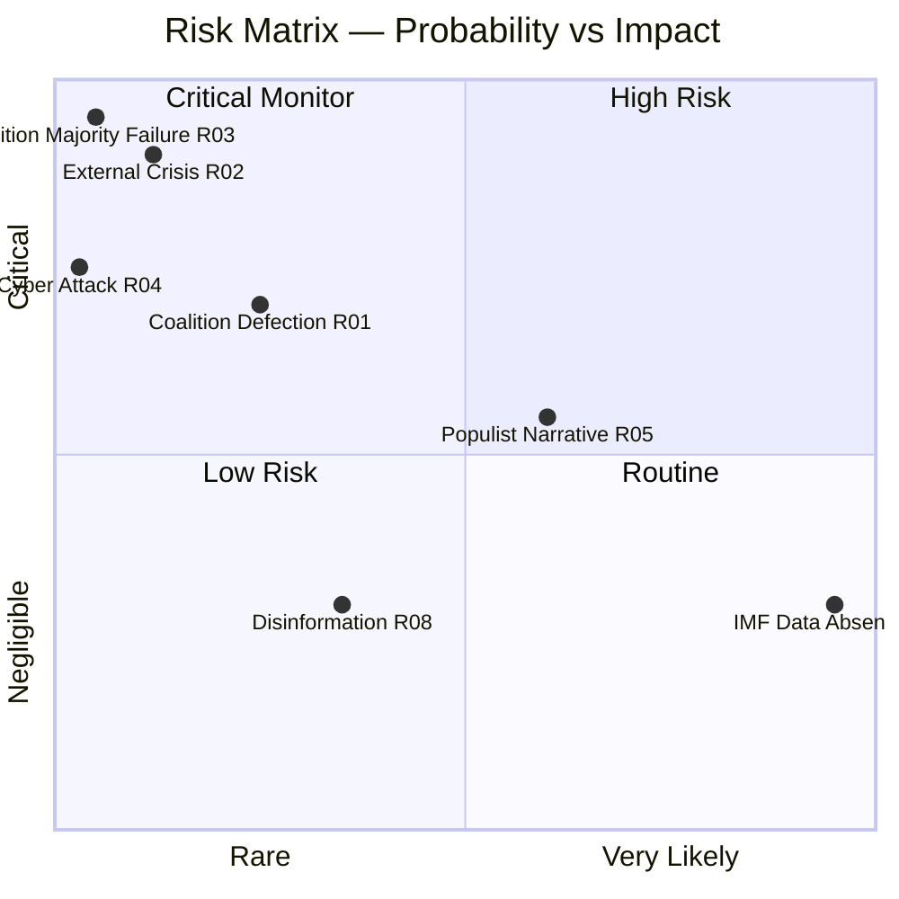

<!-- SPDX-FileCopyrightText: 2026 Hack23 AB -->
<!-- SPDX-License-Identifier: Apache-2.0 -->

# Risk Matrix — Week Ahead 18–21 May 2026

**Classification:** PUBLIC | **Confidence:** 🟡 Medium | **Generated:** 2026-05-10

---

## Risk Assessment Framework

Risks are assessed on a 5×5 matrix (Probability × Impact). Each cell represents a risk score (1-25).

| | **Negligible (1)** | **Minor (2)** | **Moderate (3)** | **Major (4)** | **Critical (5)** |
|---|---|---|---|---|---|
| **Very Likely (5)** | 5 | 10 | 15 | 20 | 25 |
| **Likely (4)** | 4 | 8 | 12 | 16 | 20 |
| **Possible (3)** | 3 | 6 | 9 | 12 | 15 |
| **Unlikely (2)** | 2 | 4 | 6 | 8 | 10 |
| **Rare (1)** | 1 | 2 | 3 | 4 | 5 |

---

## Risk Register — May 18-21 Session

| ID | Risk | Probability | Impact | Score | Level | Mitigation |
|----|------|-------------|--------|-------|-------|-----------|
| R01 | EPP right-flank defection on contested vote (>20 MEPs) | Unlikely (2) | Major (4) | **8** | 🟡 MEDIUM | Coalition whipping; leadership engagement |
| R02 | External crisis disrupts session schedule | Unlikely (2) | Critical (5) | **10** | 🟡 MEDIUM | Emergency protocol procedures |
| R03 | Coalition majority fails on key legislative vote | Rare (1) | Critical (5) | **5** | 🟢 LOW | 36-seat buffer; whipping |
| R04 | Cyber attack on EP infrastructure | Rare (1) | Major (4) | **4** | 🟢 LOW | EP IT security protocols |
| R05 | Right-populist agenda sets political narrative | Possible (3) | Moderate (3) | **9** | 🟡 MEDIUM | Centre coalition communication strategy |
| R06 | IMF economic data absent from key debate | Very Likely (5) | Minor (2) | **10** | 🟡 MEDIUM | EP source-only economic framing (mitigated) |
| R07 | S&D defection on EPP-led proposal | Unlikely (2) | Major (4) | **8** | 🟡 MEDIUM | Coalition agreement enforcement |
| R08 | Disinformation campaign around specific vote | Possible (3) | Minor (2) | **6** | 🟢 LOW | EP communications team; MEP media training |
| R09 | Renew internal split on contested dossier | Unlikely (2) | Moderate (3) | **6** | 🟢 LOW | Renew group whipping |
| R10 | MEP ethics incident during session | Rare (1) | Moderate (3) | **3** | 🟢 LOW | Institutional ethics procedures |

---

## Risk Heatmap Classification

### 🔴 HIGH (Score 15-25)
*None identified for this session*

### 🟡 MEDIUM (Score 7-14)
- **R02** (10): External crisis disruption
- **R06** (10): IMF data absent (already mitigated — degraded mode declared)
- **R05** (9): Right-populist agenda narrative capture
- **R01** (8): EPP right-flank defection
- **R07** (8): S&D defection

### 🟢 LOW (Score 1-6)
- **R03** (5): Coalition majority failure
- **R04** (4): Cyber attack
- **R08** (6): Disinformation campaign
- **R09** (6): Renew internal split
- **R10** (3): MEP ethics incident

---

## Risk Summary

**Overall session risk profile:** 🟡 MODERATE

**Top 3 risks requiring monitoring:**
1. **External crisis disruption (R02)** — High impact if triggered; monitor Russia-Ukraine situation
2. **Right-populist narrative capture (R05)** — Structural trend; medium-term coalition management challenge
3. **EPP right-flank defection (R01)** — Watch Wednesday 20 May vote block specifically

**Risk delta vs. prior session:** Stable — no material risk escalation identified relative to April 2026 session.

---

*Risk Matrix | EU Parliament Monitor | 5×5 Risk Framework | 2026-05-10*

---

## WEP and Admiralty Assessment

| Risk Cluster | WEP Label | Admiralty Grade |
|-------------|-----------|----------------|
| Coalition stability | Highly Likely (stable) | B2 |
| External crisis risk | Very Unlikely | C3 |
| Populist narrative capture | Likely | B3 |
| Cyber/information threat | Very Unlikely | C3 |

**Overall session risk: Unlikely to trigger any HIGH-level event (WEP: Unlikely 15%)**

