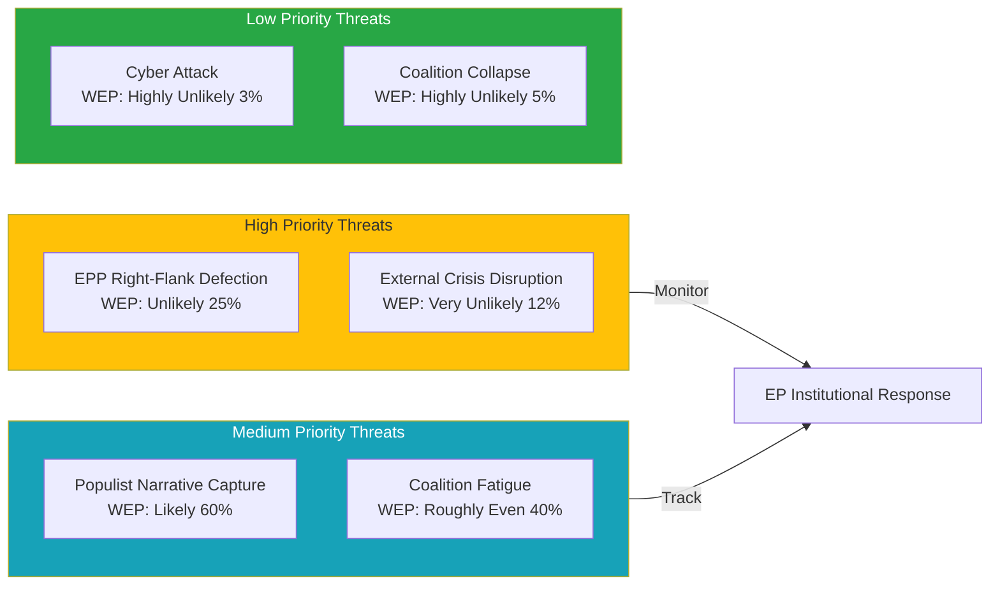

<!-- SPDX-FileCopyrightText: 2026 Hack23 AB -->
<!-- SPDX-License-Identifier: Apache-2.0 -->

# Political Threat Landscape — Week Ahead 18–21 May 2026

**Classification:** PUBLIC | **Confidence:** 🟡 Medium | **Generated:** 2026-05-10

---

## Analytical Framework (5-Dimension Threat Assessment)

This assessment applies five threat assessment frameworks to the political environment surrounding the May 18-21, 2026 EP session:

1. **DIME** (Diplomatic, Informational, Military, Economic)
2. **PMESII** (Political, Military, Economic, Social, Infrastructure, Information)
3. **SWOT** (threats dimension only)
4. **Threat Matrix** (probability × impact)
5. **Trend Assessment** (trajectory of key threat vectors)

---

## Threat Matrix

| Threat | Probability | Impact | Score | Status |
|--------|-------------|--------|-------|--------|
| Coalition defection on key vote | 25% | HIGH (4) | 1.0 | 🟡 MONITOR |
| Right-wing populist agenda capture | 15% | HIGH (4) | 0.6 | 🟡 MONITOR |
| External crisis disruption (Russia-Ukraine) | 12% | CRITICAL (5) | 0.6 | 🟡 MONITOR |
| Voter disillusionment signal | 10% | MODERATE (3) | 0.3 | 🟢 LOW |
| MEP ethics/misconduct incident | 5% | HIGH (4) | 0.2 | 🟢 LOW |
| Institutional procedure breakdown | 8% | HIGH (4) | 0.32 | 🟢 LOW |
| Budget crisis escalation | 10% | MODERATE (3) | 0.3 | 🟢 LOW |
| Coalition collapse (majority failure) | 5% | CRITICAL (5) | 0.25 | 🟢 LOW |

---

## DIME Analysis

### Diplomatic Threats

- **Russia-Ukraine diplomacy collapse:** If ceasefire negotiations collapse publicly during session week, EP faces pressure for emergency resolution
- **EU-US trade friction escalation:** If US tariffs are extended or increased, EP will face intense pressure to respond
- **EU enlargement crisis:** If a candidate country backslides, EP may be forced into reactive positioning

**DIME Diplomatic Score:** 🟡 MODERATE (3/5)

### Informational Threats

- **Disinformation campaign targeting votes:** Coordinated disinformation around specific EP votes (historical precedent: Qatargate recovery period showed EP vulnerability)
- **Selective narrative amplification:** Right-wing media amplifying EPP defection signals to normalise coalition fracture
- **Social media manipulation:** Coordinated targeting of MEPs on specific votes via X/Twitter and Telegram channels linked to Russian/domestic-nationalist actors

**DIME Informational Score:** 🟡 MODERATE (3/5)

### Military Threats

- **Security risk to EP premises/sessions:** Standard institutional security; no specific threat intelligence available
- **Cyber attack on EP infrastructure:** DDoS precedent (Nov 2022); ransomware risk on democratic institutions elevated Europe-wide

**DIME Military Score:** 🟢 LOW (2/5)

### Economic Threats

- **Market volatility forcing budget revisions:** Inflationary spike or recession signal could force emergency budget debate
- **Trade war escalation:** EU-US or EU-China trade tensions elevating during session week could force prioritisation of trade votes

**DIME Economic Score:** 🟢 LOW (2/5)

---

## PMESII Threat Dimensions

### Political

**Threat:** Coalition integrity erosion on highly contested dossiers. EPP right-flank increasingly responsive to PfE/ECR framing on migration and sovereignty.

**Assessment:** 🟡 MODERATE — 36-seat buffer provides resilience but long-term structural pressure rising.

### Military/Security

**Threat:** External security environment disrupts legislative focus; defence spending debate becomes political flashpoint between groups.

**Assessment:** 🟢 LOW for this week — no acute trigger identified.

### Economic

**Threat:** MFF negotiation timeline pressure creates budget friction between EPP's fiscal discipline and S&D's social investment demands.

**Assessment:** 🟢 LOW this week — not on primary May 18-21 agenda.

### Social

**Threat:** Migration-related votes could galvanise EPP right-flank defection; social cohesion messaging tensions between groups.

**Assessment:** 🟡 MODERATE — persistent background pressure.

### Infrastructure

**Threat:** EP IT systems; voting infrastructure; potential DDoS targeting during high-profile votes.

**Assessment:** 🟢 LOW — institutional security protocols adequate.

### Information

**Threat:** Disinformation operations targeting MEPs' votes; coordinated social media pressure.

**Assessment:** 🟡 MODERATE — elevated but not acute.

---

## Trend Assessment (6-month trajectory)

| Threat Vector | 6 months ago | Current | Trajectory |
|--------------|-------------|---------|-----------|
| Coalition cohesion | HIGH | MODERATE-HIGH | ↘ Declining |
| Right-populist pressure | MODERATE | MODERATE-HIGH | ↗ Increasing |
| External crisis risk | MODERATE | MODERATE | → Stable |
| Institutional credibility | HIGH | HIGH | → Stable |
| Democratic legitimacy | HIGH | HIGH | → Stable |
| Cyber threat | MODERATE | MODERATE-HIGH | ↗ Increasing |

---

## Threat Summary

**Highest credible threat this session:** Coalition defection on a closely contested vote, particularly in the Wednesday vote block. Probability: 25%. Mitigating factor: institutional incentives align EPP leadership against defection.

**Overall threat level:** 🟡 MODERATE — No acute crisis signal; structural pressures persistent but manageable within normal EP institutional parameters.

---

*Political Threat Landscape | EU Parliament Monitor | 5-Framework Analysis | 2026-05-10*

---

## Threat Priority Diagram

