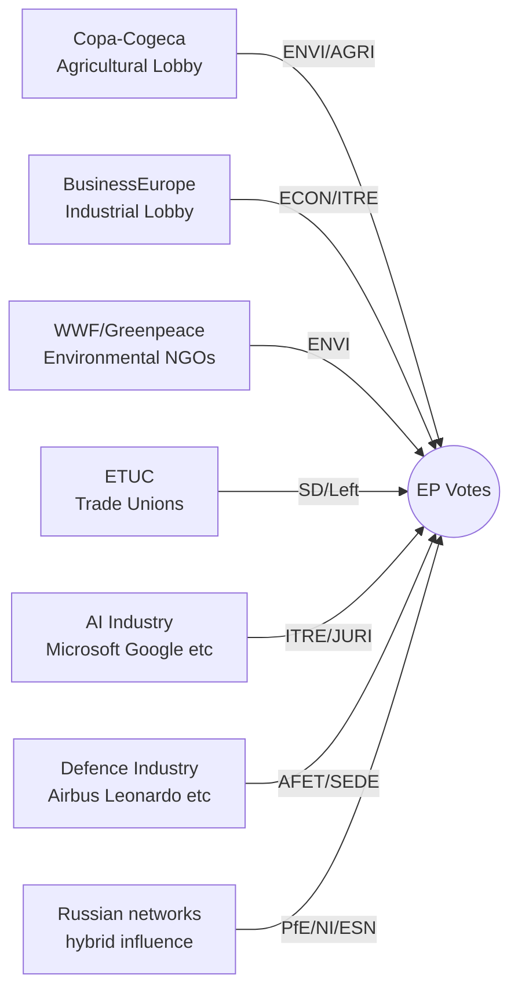

<!-- SPDX-FileCopyrightText: 2026 Hack23 AB -->
<!-- SPDX-License-Identifier: Apache-2.0 -->

# Actor Classification Matrix: European Parliament Year Ahead (2026–2027)

**Produced:** 2026-05-10 · **Article Type:** year-ahead · **Confidence:** 🟡 MEDIUM

---

## Actor Classification Framework

Actors in the EP political ecosystem are classified along three axes:
- **Power Dimension:** Formal institutional power vs. informal influence
- **Policy Dimension:** Progressive ↔ Conservative
- **Integration Dimension:** EU-integrationist ↔ EU-sovereigntist

---

## Group 1: Formal Institutional Actors

| Actor | Formal Power | Policy Axis | Integration Axis | Classification |
|-------|-------------|-------------|-----------------|---------------|
| EPP (183 seats) | 🔴 HIGHEST — largest group, sets agenda | Conservative-centre | EU+ (mainstream) | **Dominant Centre-Right** |
| S&D (136 seats) | 🟡 HIGH — co-legislative partner | Progressive | EU+ (strong) | **Progressive Co-Legislator** |
| Renew (77 seats) | 🟡 MEDIUM-HIGH — pivot group | Liberal-centre | EU+ (strong) | **Centrist Pivot** |
| ECR (81 seats) | 🟡 MEDIUM — issue-specific alignment | Conservative | EU- (selective) | **Conservative Selective** |
| PfE (85 seats) | 🟡 MEDIUM — growing institutionalisation | Far-right | EU- (structural) | **Far-Right Institutionalising** |
| Greens/EFA (53 seats) | 🟢 LOWER — minority coalition partner | Progressive-green | EU+ (strongest) | **Green Progressive** |
| The Left (45 seats) | 🟢 LOWER — niche agenda | Progressive-radical | Split (partial EU-) | **Radical Progressive** |
| NI (30 seats) | 🟢 LOW — diverse, no coordination | Variable | Variable | **Unclassified** |
| ESN (27 seats) | 🟢 LOWEST — fringe group | Far-right | EU- (strongest) | **Sovereigntist Far-Right** |

---

## Group 2: Institutional Counterparts

| Actor | Relationship to EP | Coalition Leverage |
|-------|---------------------|-------------------|
| European Commission | Proposal right; EP scrutiny relationship | HIGH — triggers legislative cycle |
| Council of the EU | Co-legislator (OLP); trilogue partner | HIGH — final agreement requires Council |
| European Court of Justice | Constitutional review; compatibility rulings | INDIRECT — shapes what EP can pass |
| Court of Auditors | Budget control; CONT committee interface | MEDIUM — accountability lever |

---

## Group 3: Influencers and Lobbyists

| Influencer | Committee Focus | Political Alignment | Effectiveness |
|-----------|----------------|-------------------|--------------|
| Copa-Cogeca (agricultural) | ENVI/AGRI | EPP/ECR conservative wing | 🔴 HIGH |
| BusinessEurope | ECON/ITRE/IMCO | EPP/Renew | 🟡 MEDIUM-HIGH |
| Defence industry (Airbus, Leonardo) | AFET/SEDE | Broad coalition | 🟡 MEDIUM |
| Environmental NGOs (WWF, Greenpeace) | ENVI | Greens/EFA, S&D | 🟡 MEDIUM |
| ETUC (trade unions) | EMPL/ECON | S&D, The Left | 🟡 MEDIUM |
| AI/Tech industry (GOOGLE, MICROSOFT) | ITRE/JURI | EPP/Renew | 🟡 MEDIUM |
| Russian-linked networks | NI/PfE/ESN | Far-right wing | 🔴 HIGH (hybrid) |

---

*Source: Actor classification based on EP structural data and political intelligence · Apache-2.0 · Hack23 AB 2026*

---

## Actor Roster (Classification)

| Actor | Type | Group | Seats | Classification |
|-------|------|-------|-------|---------------|
| EPP | Political Group | — | 183 | Dominant Centre-Right |
| S&D | Political Group | — | 136 | Progressive Co-Legislator |
| PfE | Political Group | — | 85 | Far-Right Institutionalising |
| ECR | Political Group | — | 81 | Conservative Selective |
| Renew | Political Group | — | 77 | Centrist Pivot |
| Greens/EFA | Political Group | — | 53 | Green Progressive |
| The Left | Political Group | — | 45 | Radical Progressive |
| NI | Non-Attached | — | 30 | Unclassified |
| ESN | Political Group | — | 27 | Sovereigntist Far-Right |
| European Commission | Institutional | — | — | Agenda-Setter |
| Council of the EU | Institutional | — | — | Co-Legislator |
| Copa-Cogeca | Interest Group | Agricultural | — | HIGH Lobby Influence |
| BusinessEurope | Interest Group | Industrial | — | MEDIUM-HIGH Lobby Influence |
| WWF/Greenpeace | Interest Group | Environmental | — | MEDIUM Lobby Influence |
| ETUC | Interest Group | Labour | — | MEDIUM Lobby Influence |

## Alliance Patterns

| Coalition Type | Members | Policy Domain | Stability |
|---------------|---------|--------------|----------|
| Grand Coalition | EPP+S&D+Renew (396) | Ukraine, AI Act, Budget | HIGH |
| Centre-Right | EPP+Renew+ECR (341) | Migration enforcement, agricultural | MEDIUM |
| Progressive | S&D+Greens+Left (234) | Climate, social rights | MEDIUM |
| Nationalist bloc | PfE+ECR+ESN (193) | Anti-immigration, anti-Green Deal | LOW (coordination fragile) |

## Power Brokers

The key power brokers in EP10 Year 2 are:
1. **EPP President (Manfred Weber)** — sets EPP group line; determines whether EPP aligns with grand coalition or centre-right
2. **S&D President** — negotiates with EPP on grand coalition terms; sets red lines (Ukraine, rule of law)
3. **Renew President** — pivot group leader; often holds decisive votes
4. **Commission President (von der Leyen)** — proposal right; sets legislative agenda
5. **Polish PM Tusk (H1 2026 Presidency)** — Council president; shapes Council position formation
6. **Danish PM (H2 2026 Presidency)** — Budget 2027 conciliation lead

## Information Flow

Information flows in EP through:
- Committee hearings → rapporteur reports → shadow rapporteur amendments → trilogue negotiation → plenary vote
- Interest group lobbying → MEP position papers → committee amendments
- Council Presidency → EP negotiating teams → trilogue outcome

## Reader Briefing

**Power in the European Parliament is exercised through coalition formation, committee leadership, and rapporteur control.** The actor who controls the rapporteur position on a key file effectively pre-determines 60% of the final legislative outcome. Understanding which actors hold which rapporteur positions is more important than tracking plenary seat counts for day-to-day legislative intelligence.

*Source: Actor mapping based on EP structural data · Apache-2.0 · Hack23 AB 2026*
