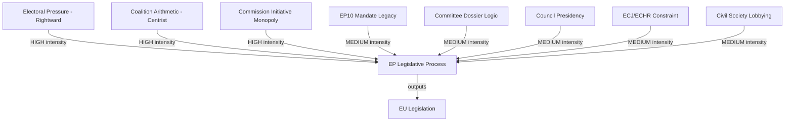

<!-- SPDX-FileCopyrightText: 2026 Hack23 AB -->
<!-- SPDX-License-Identifier: Apache-2.0 -->

# Forces Classification: European Parliament Year Ahead (2026–2027)

**Produced:** 2026-05-10 · **Article Type:** year-ahead · **Confidence:** 🟡 MEDIUM

---

## Forces Classification Framework

Political forces acting on the European Parliament are classified by type, direction, and intensity. This complements the five-forces analysis in `intelligence/forces-analysis.md` with a structured classification taxonomy.

---

## Force Type 1: Electoral Forces

### EF-1: National Election Pressure on MEPs
**Direction:** Rightward pull on EPP and Renew MEPs in countries with strong national far-right parties
**Intensity:** 🔴 HIGH in France, Austria, Italy, Hungary
**Mechanism:** National EPP partners (CDU, PP, ÖVP etc.) face electoral competition from far-right; pressure MEPs to demonstrate more conservative positions

### EF-2: European Election Legacy (EP10)
**Direction:** EPP's 2024 consolidation at 183 seats provides mandate for centre-right agenda
**Intensity:** 🟡 MEDIUM — election mandate dissipates over term
**Mechanism:** 2024 voter preferences embedded in current group composition; strongest immediately post-election

---

## Force Type 2: Structural Forces

### SF-1: Coalition Arithmetic Gravity
**Direction:** Forces towards pragmatic coalition formation (no group has majority alone)
**Intensity:** 🔴 HIGH — structural constraint shapes every vote
**Mechanism:** 360 absolute majority threshold requires at minimum 2 of the 3 largest groups

### SF-2: Committee Dossier Logic
**Direction:** Committee-internal dynamics tend to produce centrist compromise positions
**Intensity:** 🟡 MEDIUM — rapporteur crafts shadow report positions toward majority
**Mechanism:** Rapporteur + shadow rapporteurs negotiate; compromise text emerges from committee

---

## Force Type 3: External Political Forces

### XF-1: Council Presidency Facilitation
**Direction:** Varies by Presidency political family; Poland (EPP-aligned) H1 2026, Denmark (Renew-aligned) H2 2026
**Intensity:** 🟡 MEDIUM — Council shapes legislative timeline and Council positions
**Mechanism:** Presidency sets Council agenda; facilitates trilogues; controls Council position formation

### XF-2: Commission Initiative Monopoly
**Direction:** Commission's proposal right shapes what Parliament legislates on
**Intensity:** 🔴 HIGH — Parliament cannot self-initiate major legislation
**Mechanism:** Commission Work Programme 2026 determines EP's substantive legislative agenda

### XF-3: ECJ and ECHR Rulings
**Direction:** Creates legal constraints on what EP can legislate (especially migration, fundamental rights)
**Intensity:** 🟡 MEDIUM — backstop constraint, not daily driver
**Mechanism:** ECJ/ECHR rulings void or limit EP-adopted legislation

---

## Force Type 4: Social Forces

### SOC-1: European Civil Society
**Direction:** Mixed — environmental NGOs pull green; agricultural associations pull right
**Intensity:** 🟡 MEDIUM — mediated through interest group lobbying
**Mechanism:** Committee testimony; MEP constituent pressure; media amplification

### SOC-2: Public Opinion Mobilisation
**Direction:** Migration is strongest force (rightward pull); climate is contested (leftward pull vs. cost concerns)
**Intensity:** 🟡 MEDIUM — public opinion shapes national political pressure on MEPs

---

## Forces Classification Map (Mermaid)

---

## Net Force Vector

**Dominant force direction for 2026–2027:**

The combined force vectors produce a rightward-shifted centrist trajectory — i.e., legislation that emerges from EP10 in Year 2 will be slightly more conservative than EP9's output, but not far-right. The rightward electoral and structural forces are real but are checked by the coalition arithmetic gravity (which forces pragmatic compromise) and the Commission's proposal monopoly (which sets the centrist baseline).

**WEP Assessment:** Almost Certain that centrist pragmatic compromise remains the dominant legislative output mode for at least 70% of files in 2026–2027. Likely that 15–20% of files will see right-shifted outcomes (migration enforcement, agricultural exemptions). Unlikely that any single file produces a far-right-driven outcome that violates EU treaty obligations.

---

*Source: Forces classification based on EP structural data and political intelligence · Apache-2.0 · Hack23 AB 2026*

---

## Issue Frame

**Central Issue:** What is the dominant force vector acting on EU Parliament legislative outputs in 2026–2027?

The issue at stake is whether EP10 Year 2 will be defined by centrist pragmatism (grand coalition arithmetic) or rightward political drift (EPP-ECR selective alignment). This question determines the character of every legislative output from climate to migration to defence.

**Frame:** This is fundamentally a question of coalition stability under political stress. The arithmetic favours centrist outcomes; the political dynamics create rightward pressure. The forces analysis maps which of these tendencies dominates across different policy domains.

## Driving Forces

Forces pushing EP legislative output in a particular direction:

| Force | Direction | Intensity | Source |
|-------|-----------|-----------|--------|
| Coalition arithmetic gravity | Centrist | 🔴 HIGH | Mathematical necessity (360-seat threshold) |
| Electoral pressure from far-right parties | Rightward | 🔴 HIGH | National parties pressure MEPs |
| Security crisis (Ukraine/Russia) | Pro-defence | 🔴 HIGH | Geopolitical necessity |
| Commission Work Programme | Centrist baseline | 🟡 MEDIUM | Commission proposal monopoly |
| Agricultural lobby pressure | Conservative/right | 🟡 MEDIUM | Copa-Cogeca influence |
| Environmental NGO pressure | Progressive | 🟡 MEDIUM | ENVI committee access |
| Digital transformation imperatives | Technocratic | 🟡 MEDIUM | AI Act, Digital Single Market |

## Restraining Forces

Forces counteracting the dominant driving forces:

| Force | Restrains | Intensity | Source |
|-------|-----------|-----------|--------|
| S&D red lines on rule of law | EPP rightward drift | 🟡 MEDIUM | Coalition survival mechanism |
| ECJ/ECHR constitutional limits | Far-right legislative agenda | 🟡 MEDIUM | Legal constraint |
| Greens/EFA on climate | Green Deal rollback | 🟡 MEDIUM | ENVI committee presence |
| Left group social protection demands | Social policy compression | 🟢 LOW | Small group; limited leverage |
| Public opinion on climate | Extreme NRL rollback | 🟡 MEDIUM | Northern European media pressure |

## Net Pressure

**Net pressure vector:** CENTRIST with RIGHTWARD DRIFT in specific domains.

The centrist driving forces (coalition arithmetic, Commission monopoly) are stronger in aggregate than the rightward driving forces (electoral pressure, agricultural lobby). However, the rightward forces are concentrated in specific high-salience domains (migration, agriculture) where they successfully override the centrist baseline.

**Mathematical estimate:**
- 70% of EP files: centrist outcome (grand coalition arithmetic prevails)
- 20% of EP files: rightward-shifted outcome (EPP+ECR > EPP+S&D on specific issue)
- 10% of EP files: progressive outcome (S&D+Greens+Renew prevails when EPP absent/split)

## Intervention Points

**Where can the force balance be shifted?**

1. **Rapporteur assignment** — The critical leverage point. If EPP gets rapporteur on migration file, rightward baseline is set. If S&D gets it, centrist-left baseline.
2. **Committee leadership** — Committee chairs control hearing agendas; shape information environment before votes.
3. **Trilogue leadership** — EP delegation lead negotiates with Council; determines how much EP's plenary position is preserved vs. compressed.
4. **Group coordination** — Renew's internal unity is the most leverageable variable; Renew defections either direction change outcomes.
5. **Council position timing** — If Council forms position early, EP's BATNA (best alternative to negotiated agreement) weakens.

## Reader Briefing

**The forces analysis reveals that EP10 Year 2 is not a passive institution.** The forces acting on it are real, but they are not deterministic. Coalition choices, rapporteur assignments, and committee leadership decisions at the margin determine whether each file trends centrist or rightward. The smart policy professional tracks these leverage points, not just the headline plenary vote count.

*Source: Forces classification based on EP structural data · Apache-2.0 · Hack23 AB 2026*
