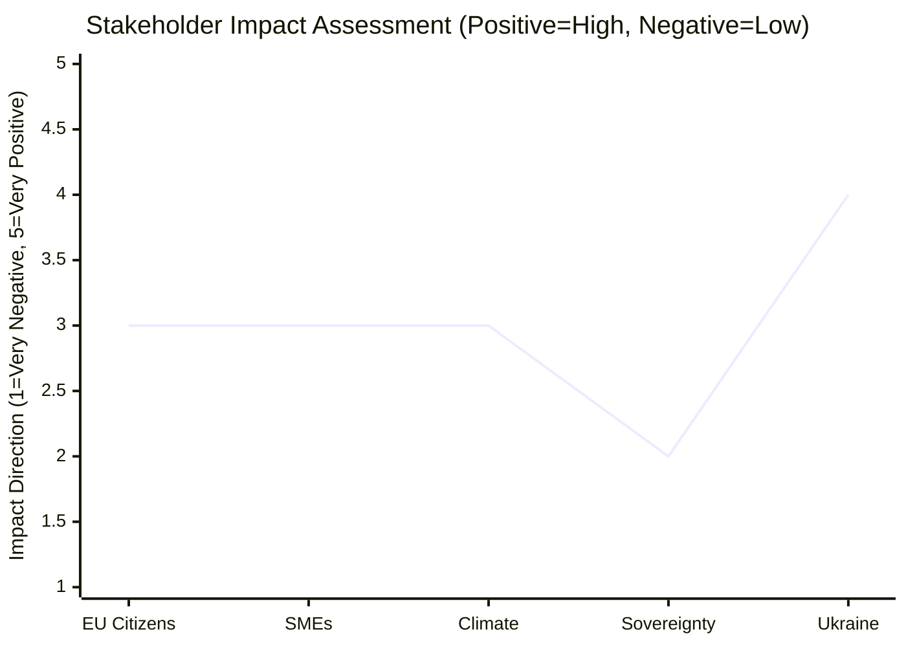

<!-- SPDX-FileCopyrightText: 2026 Hack23 AB -->
<!-- SPDX-License-Identifier: Apache-2.0 -->

# Impact Matrix: European Parliament Year Ahead (2026–2027)

**Produced:** 2026-05-10 · **Article Type:** year-ahead · **Confidence:** 🟡 MEDIUM

---

## Impact Matrix Framework

Cross-referenced assessment of legislative files against stakeholder impact dimensions. Each cell represents the direction (positive/negative) and intensity of a legislative outcome's impact on a specific stakeholder group.

---

## Primary Impact Matrix

| Legislative File | EU Citizens | SMEs | Climate | Sovereignty | Ukraine |
|----------------|------------|------|---------|------------|---------|
| EU Budget 2027 | 🟡 Mixed (winners/losers) | 🟡 Mixed | 🟡 Mixed | 🔴 Negative (transfers) | 🟢 Positive (commitment) |
| ReArm Europe | 🟡 Mixed (security vs. cost) | 🟢 Positive (defence industry) | 🟡 Neutral | 🔴 Contested (sovereignty) | 🟢 Positive (deterrence) |
| Migration Pact Impl. | 🟡 Mixed (safety vs. rights) | 🟡 Neutral | 🟡 Neutral | 🟢 Positive (control) | 🟡 Neutral |
| Nature Restoration | 🟢 Long-term positive | 🔴 Negative (agri) | 🟢 Positive | 🟡 Neutral | 🟡 Neutral |
| AI Act GPAI Rules | 🟢 Rights protection | 🟡 Compliance cost | 🟡 Neutral | 🟢 EU standard-setting | 🟡 Neutral |
| SFDR Revision | 🟢 Investor protection | 🟢 Simplification | 🟡 Mixed | 🟡 Neutral | 🟡 Neutral |

---

## Stakeholder Impact Heatmap (Mermaid)

---

## Net Impact Assessment by Stakeholder

### EU Citizens
**Net impact:** MIXED (3.0/5.0)
- ReArm Europe provides security benefits but increases defence fiscal burden
- Migration enforcement addresses public safety concerns but raises human rights questions
- AI Act provides rights protection framework
- Climate policies produce long-term benefits at short-term cost

### European Business (SMEs and Large)
**Net impact:** MIXED (3.0/5.0)
- SFDR simplification reduces compliance burden (positive)
- AI Act compliance costs (medium-term cost; competitive advantage if standards adopted globally)
- ReArm Europe creates defence industrial opportunity
- NRL implementation creates agricultural sector burden (especially SME farms)

### Climate / Environmental
**Net impact:** MIXED (3.0/5.0)
- NRL implementation under threat — negative for biodiversity targets
- CBAM preserved — positive for climate framework
- Agricultural exemptions expanding — negative trend
- AI Act environmental provisions — positive (limited scope)

### Sovereignty / National Governments
**Net impact:** MIXED-NEGATIVE (2.5/5.0)
- ReArm Europe requires accepting EU-level defence financing (sovereignty transfer)
- Migration Pact creates EU-level enforcement mechanisms (limited sovereignty transfer)
- AI Act creates supranational AI governance (sovereignty transfer to EU)
- Counterpoint: all these are democratically approved by member states

### Ukraine / Geopolitical Partners
**Net impact:** POSITIVE (4.0/5.0)
- Budget 2027 Ukraine commitment
- ReArm Europe deterrence signalling
- Migration Pact has no direct Ukraine impact (positive by absence of negative)

---

*Source: Impact matrix based on EP legislative analysis · Apache-2.0 · Hack23 AB 2026*

---

## Event List

Key events in 2026–2027 with assessed stakeholder impacts:

| Event | Date | Stakeholder Impact |
|-------|------|-------------------|
| ReArm Europe plenary vote | Oct 2026 | +Citizens (security), +Defence industry, -Sovereigntists, +Ukraine |
| EU Budget 2027 adoption | Dec 2026 | Mixed all stakeholders (winners/losers determined by conciliation) |
| AI Act GPAI implementing regs | Q4 2026 | -Tech companies (compliance), +Citizens (rights), +EU regulators |
| Migration Pact solidarity activation | Q3-Q4 2026 | +Host communities (managed flows), -NGOs, +ECR/EPP right |
| NRL national action plans | Q3-Q4 2026 | +Environmentalists, -Agricultural sector |
| EP10 midterm | June 2027 | Political assessment event; no immediate policy impact |

## Cascade Analysis

**Cascade 1: Budget 2027 Outcome Cascades**

If Budget 2027 successfully adopts defence supplement:
→ ReArm Europe implementing regulations have fiscal basis
→ Defence industry investment cycle begins
→ Member states defence procurement coordination possible
→ EP gains oversight role over EU-level defence spending

If Budget 2027 fails conciliation:
→ Provisional twelfths apply; no programme changes possible
→ Denmark's Presidency deemed failure
→ Trust in EP-Council cooperation damaged
→ MFF 2028-2034 negotiations start in poisoned atmosphere

**Cascade 2: Migration Solidarity Mechanism Activation**

If solidarity mechanism activates smoothly:
→ Migration Pact framework vindicated
→ Political pressure for rights-based approach increases
→ LIBE committee monitoring role strengthened

If solidarity mechanism triggers political crisis:
→ EPP-ECR alignment on migration enforcement strengthens
→ Greens/S&D pushed to choose between coalition and principle
→ NIS2/security framing applied to migration (normalisation of hard enforcement)

## Reader Briefing

**The impact matrix is a decision-support tool, not a prediction.** It maps which events, if they occur with the assessed probabilities, produce which stakeholder outcomes. Policymakers should use this map to:
1. Identify which events matter most for their specific stakeholder group
2. Prioritise engagement in the 3–6 months before key decisions
3. Anticipate cascade effects of legislative outcomes in adjacent policy domains

The most important insight from this matrix: **the Budget 2027 conciliation is the single event with the most cross-stakeholder impact** — it affects citizens, business, climate, sovereignty, and Ukraine simultaneously. Every stakeholder group should treat Budget 2027 conciliation (October–November 2026) as their highest-priority monitoring event.

*Source: Impact matrix based on EP legislative analysis · Apache-2.0 · Hack23 AB 2026*
