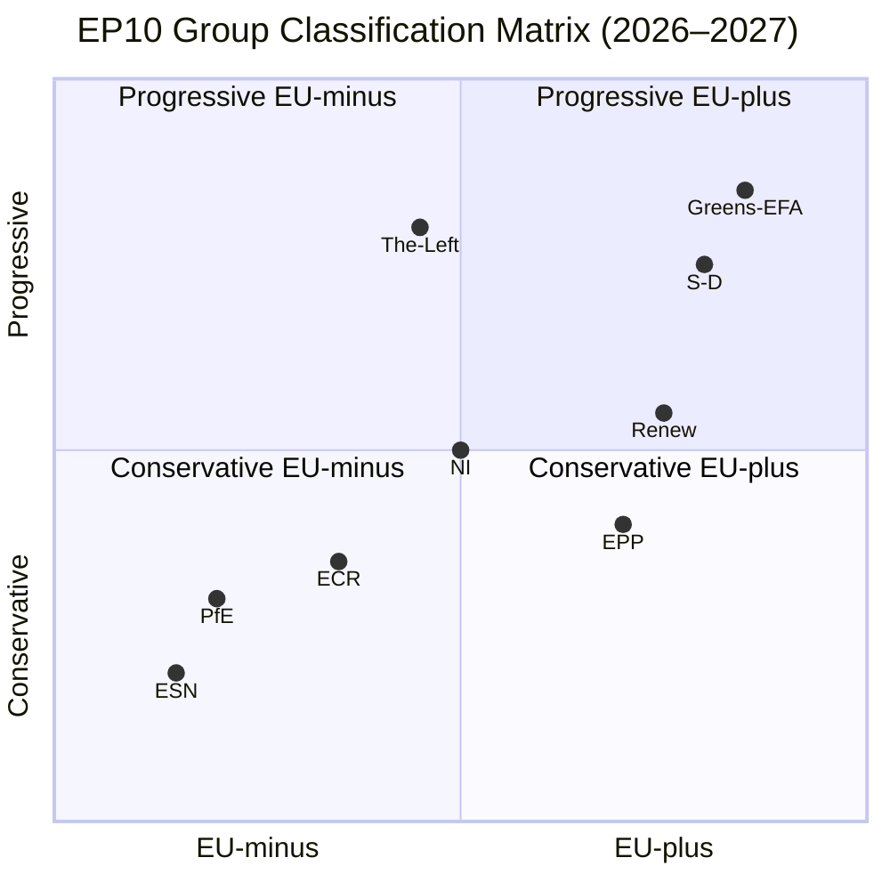

<!-- SPDX-FileCopyrightText: 2026 Hack23 AB -->
<!-- SPDX-License-Identifier: Apache-2.0 -->

# Political Classification: European Parliament Year Ahead (2026–2027)

**Produced:** 2026-05-10 · **Article Type:** year-ahead · **Confidence:** 🟡 MEDIUM

---

## Classification Framework

Political positions are classified along two axes:
- **Integration axis:** EU+ (more integration) ↔ EU- (less integration / intergovernmentalism)
- **Policy axis:** Progressive (left-liberal) ↔ Conservative (right-nationalist)

This produces a 2×2 classification space:

```
                      EU+ (Integration)
                           │
          Progressive+EU+  │  Conservative+EU+
          (S&D, Greens,    │  (EPP, Renew centre)
           Left)           │
◄──────────────────────────┼──────────────────────────►
Progressive                │               Conservative
                           │
          Progressive+EU-  │  Conservative+EU-
          (rare; parts of  │  (ECR, PfE, ESN)
          The Left)        │
                           │
                      EU- (Integration)
```

---

## Group-by-Group Classification

| Group | Seats | Integration | Policy | Quadrant | Stability |
|-------|-------|-------------|--------|----------|-----------|
| EPP | 183 | EU+ centre | Conservative centre | Conservative+EU+ | 🟢 High |
| S&D | 136 | EU+ | Progressive | Progressive+EU+ | 🟢 High |
| PfE | 85 | EU- | Conservative-nationalist | Conservative+EU- | 🟡 Medium |
| ECR | 81 | EU- (selective) | Conservative | Conservative+EU- | 🟡 Medium |
| Renew | 77 | EU+ | Liberal-centre | Split (EU+ both axes) | 🟡 Medium |
| Greens/EFA | 53 | EU+ | Progressive-green | Progressive+EU+ | 🟢 High |
| The Left | 45 | Split | Progressive | Progressive+EU- partial | 🟡 Medium |
| NI | 30 | Variable | Variable | Unclassified | 🔴 Low |
| ESN | 27 | EU- | Far-right | Conservative+EU- | 🟡 Medium |

---

## Key Legislative Files — Political Classification

### Defence & Security (ReArm Europe)
- **Pro-integration, conservative-supportive:** EPP, S&D (conditional), Renew, ECR, parts of NI
- **Anti-integration:** PfE, ESN, most of The Left, parts of Greens/EFA
- **Classification:** CROSS-CUTTING (defence creates unique EU+ conservative coalition)

### Migration (Enforcement)
- **Right-conservative axis:** EPP, ECR, PfE, ESN, parts of Renew
- **Left-progressive axis:** S&D, Greens/EFA, The Left
- **Classification:** CLASSIC LEFT-RIGHT CLEAVAGE

### Green Deal (Climate)
- **Pro-Green Deal:** S&D, Greens/EFA, The Left, centre-Renew
- **Anti-Green Deal:** PfE, ESN, ECR, parts of EPP (agricultural wing)
- **Classification:** MULTI-AXIS (integration + values + economic interests)

### Ukraine Support
- **Pro-support (strong coalition):** EPP, S&D, Renew, ECR, Greens/EFA
- **Anti-support:** PfE, ESN, parts of The Left
- **Classification:** CROSS-CUTTING (Ukraine creates unique broad coalition)

### Digital Regulation (AI Act)
- **Regulatory:**  EPP, S&D, Renew, Greens/EFA
- **Deregulatory:** ECR, parts of EPP (market wing), parts of Renew (FDP)
- **Classification:** PRIMARILY ECONOMIC AXIS

---

## Classification Output: EP10 Political Character (Year Ahead Assessment)

**Dominant coalition type:** Flexible centre-right majority with file-by-file variation.

**No durable majority exists** for any single ideological bloc. The Parliament remains in a fragmented multi-group bargaining environment where:
1. Defence: Broad EU+ conservative coalition (EPP+S&D+Renew+ECR) dominates
2. Migration: Right-conservative coalition (EPP+ECR+PfE) dominates
3. Climate: Contested; EPP's position determines outcome
4. Digital: Centre consensus (EPP+S&D+Renew) dominates
5. Trade: Centre-right consensus (EPP+Renew+ECR) dominates

---

*Source: EP Open Data Portal seat distributions; adopted texts voting inference · Apache-2.0 · Hack23 AB 2026*

---

## Political Classification Map (Mermaid)


