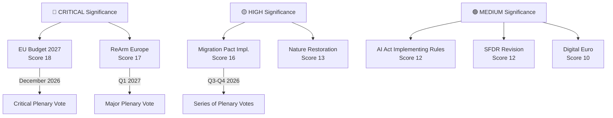

<!-- SPDX-FileCopyrightText: 2026 Hack23 AB -->
<!-- SPDX-License-Identifier: Apache-2.0 -->

# Significance Classification: European Parliament Year Ahead (2026–2027)

**Produced:** 2026-05-10 · **Article Type:** year-ahead · **Confidence:** 🟡 MEDIUM

---

## Classification Framework

Legislative files and political events are scored on four significance dimensions:
- **Legislative Impact (LI):** Scale of regulatory/legal change (1–5)
- **Political Salience (PS):** Public and political attention (1–5)
- **Temporal Urgency (TU):** Time pressure for decision (1–5)
- **Coalition Sensitivity (CS):** Degree to which file reshapes coalitions (1–5)
- **Significance Score = LI + PS + TU + CS**

---

## Tier 1: Critical Significance (Score ≥ 16)

### EU Budget 2027
- LI: 5 (determines all EU programme funding for one year)
- PS: 4 (high public attention especially on defence/cohesion trade-offs)
- TU: 5 (absolute December deadline)
- CS: 4 (tests EPP-S&D relationship on spending priorities)
- **Score: 18 — CRITICAL**

**Why it matters:** The EU Budget is Parliament's most important annual act. Every policy priority — defence, cohesion, climate, Ukraine — is expressed through the budget. December 2026's vote is the single most consequential EP decision of 2026.

### ReArm Europe Financing Regulation
- LI: 5 (first major EU collective defence financing instrument)
- PS: 5 (historically unprecedented; public debate across EU)
- TU: 4 (strategic urgency given security environment)
- CS: 3 (broad coalition exists but sovereignty clause details contested)
- **Score: 17 — CRITICAL**

**Why it matters:** This is EP10's legacy file. If Parliament delivers a credible defence financing framework, it will be cited as the Parliament that transformed EU strategic autonomy.

---

## Tier 2: High Significance (Score 13–15)

### Migration Pact Implementation Files
- LI: 4 (implements fundamental asylum system reform)
- PS: 5 (highest-salience issue for EU citizens)
- TU: 3 (regulated timeline but political pressure continuous)
- CS: 4 (most polarising coalition configuration)
- **Score: 16 — HIGH** (borderline Tier 1)

### AI Act Implementing Regulations (GPAI)
- LI: 4 (defines operational AI governance framework)
- PS: 3 (growing public salience; business attention)
- TU: 3 (legal deadlines in AI Act)
- CS: 2 (broad consensus; limited coalition reshaping)
- **Score: 12 — MEDIUM-HIGH**

### SFDR Revision
- LI: 4 (reshapes €17+ trillion European sustainable finance market)
- PS: 2 (technical; limited public attention)
- TU: 3 (market uncertainty demanding resolution)
- CS: 3 (EPP-Renew vs. S&D-Greens coalition test)
- **Score: 12 — MEDIUM-HIGH**

---

## Tier 3: Medium Significance (Score 9–12)

| File | LI | PS | TU | CS | Score |
|------|----|----|----|----|-------|
| Nature Restoration Law implementation | 4 | 3 | 3 | 3 | 13 |
| AI Liability Directive | 3 | 2 | 2 | 2 | 9 |
| Digital Euro regulation | 3 | 2 | 3 | 2 | 10 |
| Critical Raw Materials Act delegated acts | 3 | 2 | 2 | 2 | 9 |
| Payment Services Regulation | 3 | 2 | 3 | 2 | 10 |

---

## Tier 4: Routine Significance (Score ≤ 8)

- F-Gas Regulation review
- EU Cloud Regulation (early stage)
- Fisheries regulation updates
- Routine delegated act monitoring procedures

---

## Significance Classification Map (Mermaid)

---

## Reader Significance Guide

**For citizens:** The three files that most directly affect your daily life in 2026–2027 are: (1) EU Budget 2027 — determines what EU programmes exist and who funds what; (2) ReArm Europe — sets the shape of European collective defence and your country's contribution; (3) Migration Pact Implementation — defines how asylum processes and external border controls actually work.

**For policy professionals:** Track the Budget 2027 conciliation under Danish Presidency most closely (October–November 2026). This is where the actual political trade-offs are made between defence supplement, cohesion funds, climate investment, and Ukraine commitment. Every other file is subordinated to this arithmetic.

---

*Source: Significance classification based on EP legislative impact assessment · Apache-2.0 · Hack23 AB 2026*
