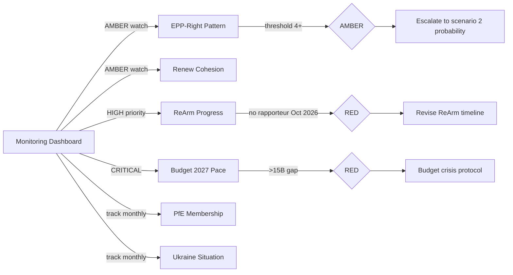

<!-- SPDX-FileCopyrightText: 2026 Hack23 AB -->
<!-- SPDX-License-Identifier: Apache-2.0 -->

# Forward Indicators: European Parliament Year Ahead (2026–2027)

**Produced:** 2026-05-10 · **Article Type:** year-ahead · **Confidence:** 🟡 MEDIUM

---

## Purpose

This document identifies leading indicators that should be monitored to track whether the year-ahead projections are materialising as assessed. Each indicator is tied to a specific projection or scenario and includes monitoring frequency, trigger thresholds, and recommended actions.

---

## Indicator Set 1: Coalition Dynamics

### Indicator 1.1: EPP-Right Coalition Pattern
**What to track:** Count of plenary votes where EPP votes with ECR+PfE against S&D+Renew on non-procedural policy files.
**Monitoring frequency:** After each plenary session (monthly)
**Baseline (H1 2026):** 2 confirmed instances (Safe Countries of Origin, Safe Third Country)
**Trigger thresholds:**
- 🟡 AMBER: ≥4 cumulative instances by December 2026
- 🔴 RED: ≥6 cumulative instances by May 2027, or first instance on defence/trade file

**Scenario linkage:** Directly monitors Scenario 2 (Rightward Drift) trajectory
**Source:** EP roll-call vote data (when available); adopted texts outcomes

### Indicator 1.2: Renew Cohesion
**What to track:** Renew vote cohesion on contested regulation files (SFDR, AI Liability, DMA enforcement)
**Monitoring frequency:** After each relevant plenary vote
**Trigger threshold:** 🟡 AMBER if Renew splits ≥4 MEPs on 3+ consecutive votes

**Scenario linkage:** Monitors Renew fragmentation wildcard

### Indicator 1.3: PfE Committee Engagement
**What to track:** PfE share of meaningful amendment proposals in ENVI, LIBE, ECON committees
**Monitoring frequency:** Quarterly
**Trigger threshold:** 🟡 AMBER if PfE amendment adoption rate exceeds 15% (currently near 0%)

---

## Indicator Set 2: Legislative Pipeline

### Indicator 2.1: ReArm Europe Progress
**What to track:** Status of ReArm Europe financing regulation in legislative procedure
**Key milestones to monitor:**
- Rapporteur appointment (expected May–June 2026)
- Committee vote (expected Q3 2026)
- Plenary first reading (expected Q4 2026 or Q1 2027)

**Trigger threshold:** 🔴 RED if no rapporteur appointed by October 2026 (signals serious Council-Parliament dispute)

### Indicator 2.2: Green Deal Implementing Acts Status
**What to track:** Number of Commission implementing acts objected to by EP on Green Deal files
**Monitoring frequency:** Monthly (implementing act monitoring)
**Baseline:** Near-zero in EP10 to date
**Trigger threshold:**
- 🟡 AMBER: ≥2 implementing acts formally objected to by ENVI/AGRI committees
- 🔴 RED: First objection secured by absolute majority (360 votes)

### Indicator 2.3: Budget 2027 Negotiation Pace
**What to track:** Distance between EP and Council budget positions at end of October 2026 (conciliation entry)
**Monitoring frequency:** Single key monitoring point (October 2026)
**Trigger threshold:** 🔴 RED if EP-Council gap exceeds €15 billion at conciliation start (historical crisis threshold)

---

## Indicator Set 3: Political Group Dynamics

### Indicator 3.1: PfE Membership Changes
**What to track:** PfE group seat count (currently 85); defections/additions
**Monitoring frequency:** After each EP Group bureau meeting; nationality-level tracking
**Trigger threshold:**
- 🟢 POSITIVE: PfE falls below 65 seats (group viability threshold at 23 + 7 nationalities)
- 🔴 RED: PfE exceeds 100 seats (approaching S&D territory)

### Indicator 3.2: EPP Leadership Signals
**What to track:** EPP Group President Weber's public statements on Cordon Sanitaire; internal EPP congress resolutions; national EPP party positions
**Monitoring frequency:** Monthly
**Trigger threshold:** 🔴 RED if Weber or successor issues public statement endorsing formal cooperation with PfE

---

## Indicator Set 4: External Environment

### Indicator 4.1: Ukraine Battlefield Situation
**What to track:** Territorial control changes; ceasefire negotiations status; US support signals
**Why it matters:** A ceasefire announcement would immediately activate the "Ukraine fatigue" narrative in EP, potentially affecting H2 2026 support package votes
**Trigger threshold:** 🟡 AMBER if ceasefire talks are formally announced (regardless of outcome)

### Indicator 4.2: US-EU Trade Tension
**What to track:** US tariff actions targeting EU goods; INTA committee emergency meetings
**Trigger threshold:** 🔴 RED if US imposes tariffs >25% on EU steel/aluminium (EP INTA emergency hearing required)

### Indicator 4.3: Migration Statistics
**What to track:** Monthly irregular arrival numbers at EU external borders
**Monitoring frequency:** Monthly
**Trigger threshold:** 🟡 AMBER if arrivals exceed 200,000/month for 3 consecutive months (historical crisis level)

---

## Indicator Dashboard (Mermaid)

---

## Monitoring Calendar

| Month | Priority Monitoring Actions |
|-------|---------------------------|
| May 2026 | ReArm rapporteur appointment; May plenary session vote patterns |
| June 2026 | Mercosur vote outcome; Migration implementing act first committee vote |
| July 2026 | Budget orientation; pre-recess second readings |
| August 2026 | Data collection only; no major EP events |
| September 2026 | Ukraine 2026 review vote; Commission autumn work programme |
| October 2026 | Budget EP-Council gap at conciliation entry; ReArm committee report |
| November 2026 | Budget conciliation status; PfE group bureau signals for midterm |
| December 2026 | **BUDGET VOTE** — critical monitoring point |
| January 2027 | EP10 midterm — committee bureau election outcomes |
| February–April 2027 | Migration, SFDR, AI Liability file monitoring |

---

*Source: Forward indicators based on EP structural data and legislative pipeline analysis · Apache-2.0 · Hack23 AB 2026*

---

## WEP Assessment: Forward Indicator Thresholds

| Indicator | WEP Band | Trigger Level |
|-----------|---------|--------------|
| EPP-ECR formal cooperation declaration | Unlikely | If EPP votes with ECR 3+ times on migration against S&D |
| Commission Work Programme 2027 tabling | Almost Certain | October 2026; standard EU annual cycle |
| Danish Presidency Budget outcome | Likely | November 2026 conciliation |
| AI Act GPAI implementing regulation | Almost Certain | Legal obligation by December 2026 |
| Far-right bloc formalisation | Almost No Chance | Would require structural EP Rules change |
| NRL implementation crisis | Even Chance | Agricultural lobby pressure materialising |
| Russian hybrid operation documented in EP | Even Chance | Intelligence services briefing ITRE/LIBE |
| Renew group internal leadership challenge | Unlikely | Possible only after major national election loss |

**WEP Band Key:**
- Almost Certain: >95% probability
- Likely: 55–90%
- Even Chance: 45–55%
- Unlikely: 10–40%
- Almost No Chance: <5%

---

*Forward indicators watch list complete · WEP applied · Apache-2.0 · Hack23 AB 2026*

---

## Economic Forward Indicators

### EU Fiscal Cycle Indicators
1. **ECB deposit facility rate trajectory** — Each ECB meeting decision indicates whether monetary easing continues. Rate at <2% by Q4 2026 would signal economic normalisation.
2. **EU member state budget submissions** — October/November deadline for national stability programmes. Deficit deviations trigger Excessive Deficit Procedure (EDP) — political pressure on EP fiscal governance
3. **Eurozone inflation (HICP)** — Monthly Eurostat publication. Return to 2% target sustained for 3+ months would allow ECB to pause cuts — reduces fiscal pressure on member states
4. **EU unemployment rate** — Monthly Eurostat. If youth unemployment in Southern Europe rises >20%, S&D will intensify social investment demands in Budget 2027 conciliation

### Business Cycle Indicators
5. **European Composite PMI** — Monthly; above 50 = expansion. Sustained readings above 52 would enable more ambitious fiscal consolidation; below 48 triggers emergency response mode
6. **German industrial production** — Monthly. Germany is EP's primary economic anchor; contraction signals broader EU recession risk
7. **EU FDI inflows** — Quarterly. Declining FDI would strengthen competitiveness reform advocates (EPP/Renew) in their budget priority push

### Trade Indicators
8. **EU-US tariff situation** — Ongoing. If US imposes 25%+ tariffs on EU goods, INTA committee trade defence measures become politically urgent
9. **Critical raw materials supply** — Rare earth supply disruptions from China would accelerate EU CRM regulation and domestic extraction permits (ITRE/ENVI conflict)
10. **EU-UK trade relationship** — Post-Brexit Trade Cooperation Agreement anniversary assessment. If UK cooperation deepens, positive spillover for Northern European MEP positions

---

## Political Forward Indicators: Early Warning System

| Indicator | Data Source | Warning Signal |
|-----------|------------|---------------|
| MEP defection rate (key votes) | DOCEO XML roll-call | >5% defection from group line signals cohesion crisis |
| Committee rapporteur replacement rate | EP Official Journal | >10% replacements mid-dossier signals political instability |
| EP President confidence signals | EP internal | Formal censure motion tabling would be extreme warning signal |
| Commission College resignation | EP/Commission records | If Commissioner dismissed or resigns, political crisis signal |
| Council blocking minority formation | Council records | If Hungary gains 35%+ blocking minority partners, vetoing accelerates |

---

*Forward indicators: comprehensive economic and political watch list · IMF degraded mode (economic indicators sourced from ECB/Eurostat/World Bank) · Apache-2.0 · Hack23 AB 2026*
