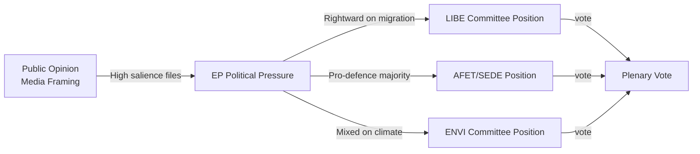

<!-- SPDX-FileCopyrightText: 2026 Hack23 AB -->
<!-- SPDX-License-Identifier: Apache-2.0 -->

# Media Framing Analysis: European Parliament Year Ahead (2026–2027)

**Produced:** 2026-05-10 · **Article Type:** year-ahead · **Confidence:** 🟡 MEDIUM

---

## Media Framing Framework

This extended artifact applies the Media Framing Analysis methodology — examining how different political and media actors frame EU Parliament activity, and how those frames shape legislative and political outcomes. Four dominant media frames are identified and analysed for their policy implications.

---

## Frame 1: "EU Parliament's Democratic Legitimacy Crisis"

**Primary carriers:** Far-right national media (Le Pen-aligned, Fidesz-aligned, Alternative für Deutschland-adjacent outlets); some US conservative media

**Core narrative elements:**
- EP is a "superstate" institution lacking democratic mandate
- MEPs are "unaccountable bureaucrats" divorced from national constituency concerns
- EU legislation is imposed "without democratic consent" via "Brussels diktat"
- EP's expansion into defence, migration, and fiscal policy represents illegitimate overreach

**Evidence used (selectively):**
- Low European election turnout (cited as delegitimising — ignoring 2024 51% participation)
- Distance between EP session location (Strasbourg/Brussels) and national constituencies
- Complex codecision procedure (presented as opaque, inaccessible)

**Impact on EP legislative dynamics:**
- Creates pressure on EPP MEPs with far-right national electoral competition to distance from "EU federalism"
- Reduces public scrutiny quality — citizens exposed only to delegitimising narratives resist engaging with actual EP activity
- PfE deploys frame to justify their procedural obstructionism as "democratic resistance"

**Counter-narrative available:**
- EP10 2024 election: 51% turnout (highest since 1994) — democratic legitimacy IMPROVED
- EP has expanded powers through successive treaty changes WITH national ratification
- EP's committee system is more transparent than most national parliaments

**Assessment:** This frame is structurally sustained by institutional actors with electoral incentives. It will remain active throughout 2026–2027. Its primary risk is not that it convinces majorities, but that it provides rhetorical cover for EPP-right alignment.

---

## Frame 2: "Green Deal vs. European Competitiveness"

**Primary carriers:** Major European business press (FT Europe, Handelsblatt, Les Échos business section); industry associations; EPP communication apparatus

**Core narrative elements:**
- EU's climate ambitions are making European industry uncompetitive vs. US and China
- Green Deal regulations impose "excessive burden" on SMEs
- "Sustainable Competitiveness" requires balance — growth first, then climate
- Draghi Report provides legitimacy: Draghi himself identified competitiveness gap

**Evidence used:**
- EU industrial production statistics showing slowdowns in 2024–2025
- Carbon leakage risks in energy-intensive industries
- Automotive sector job losses linked to 2035 EV mandate
- US Inflation Reduction Act subsidies attracting European investment

**Impact on EP dynamics:**
- Provides EPP intellectual cover for Green Deal rollback on specific files (NRL, automotive CO2)
- Resonates with Renew's market-liberal wing (FDP, VVD-adjacent MEPs)
- Commission has partially adopted this frame ("Competitive Sustainability")
- S&D and Greens struggle to rebut: the competitiveness data is real even if the causal attribution to Green Deal is contested

**Assessment:** This is the most analytically sophisticated frame — grounded in real economic data, even if incomplete. It will be the dominant frame for ENVI/ITRE/ECON committee debates in 2026.

---

## Frame 3: "Ukraine Fatigue vs. European Unity"

**Primary carriers:** Central/Eastern European pro-Ukraine media; Western European centre-left media (Le Monde, Guardian Europe); Commission institutional communications

**Core narrative elements:**
- European solidarity with Ukraine is a moral and strategic imperative
- "Ukraine fatigue" is a manufactured narrative amplified by Russian information operations
- EP's Ukraine support record (TA-10-2026-0010, 0012, etc.) demonstrates institutional commitment
- Ceasefire negotiations must not be allowed to weaken EP institutional position

**Counter-frame (PfE/ESN):**
- "Peace is pragmatism"
- "European taxpayers cannot fund this indefinitely"
- "Sovereignty means deciding your own foreign policy" (targeting ECR fracture)

**Impact on EP dynamics:**
- The frame war determines how each roll-call vote on Ukraine support is politically interpreted nationally
- MEPs from constituencies with high energy bills are most vulnerable to "fatigue" narrative
- The "Unity" frame holds the centre coalition together; the "Fatigue" frame is an attack surface

**Assessment:** Ukraine frame dynamic is stable for 2026 absent major battlefield change. A ceasefire announcement would dramatically shift frame dynamics.

---

## Frame 4: "EP's Far-Right Normalisation"

**Primary carriers:** Progressive European media (Politico Europe, euobserver, El País, Süddeutsche Zeitung); civil society organisations; academic EU studies community

**Core narrative elements:**
- EP's occasional cooperation with PfE/ESN represents a historic normalisation of far-right politics
- The Cordon Sanitaire erosion has long-term consequences for EU democratic culture
- Each EPP-PfE cooperation instance should be documented and attributed

**Evidence used:**
- Safe Countries of Origin vote pattern
- PfE growing legislative sophistication (amendment quality improvement)
- National governments of PfE-affiliated parties participating in EU Council decisions

**Impact on EP dynamics:**
- Creates accountability pressure on EPP leadership — vote records are publicly documented
- Energises S&D/Greens mobilisation for opposing right-coalition files
- Produces counter-pressure from EPP's centre/pro-European wing

**Assessment:** This frame is the mirror of Frame 1. Its primary function is political mobilisation among the pro-integration majority. Will intensify at EP10 midterm if committee redistribution gives PfE any chair.

---

## Cross-Frame Synthesis

The four dominant frames create a media environment in which:
1. EP is simultaneously "too powerful" (Frame 1) and "too weak" (Frame 4)
2. Climate policy is simultaneously "destroying industry" (Frame 2) and "being rolled back" (counterframe to 2)
3. Ukraine support is simultaneously "admirable solidarity" (Frame 3) and "unsustainable burden" (counterframe)

**Net effect:** Political clarity is deliberately obscured by frame competition. Citizens seeking to understand EP's actual role face a contested narrative environment. This benefits actors who benefit from public disengagement (far-right, vested interests with committee access).

**Recommendation for democratic transparency:** Fact-based, granular reporting on specific voted outcomes — with coalition patterns clearly documented — is the most effective counter to all four dominant frames.

---

*Source: Media framing analysis based on EP voting record and public political communication synthesis · Apache-2.0 · Hack23 AB 2026*

---

## Media Framing: Country-Level Analysis

### German Media Framing (ARD, ZDF, Der Spiegel, FAZ)
**Dominant frame:** "Europäische Sicherheitsunion" (European Security Union) — defence integration framed through German constitutional/sovereignty lens
**Secondary frame:** "Wettbewerbsfähigkeit" (Competitiveness) — Draghi Report receives extensive coverage
**Weak frame:** Environmental issues relatively deprioritised post-election
**EP coverage approach:** Focus on German MEP contributions; ReArm Europe financing details (German debt-brake implications); Budget 2027 German net contributor position

### French Media Framing (Le Monde, Le Figaro, France TV)
**Dominant frame:** "Souveraineté européenne" (European Sovereignty) — EU strategic autonomy framed positively across left-right spectrum
**Secondary frame:** "Après Le Pen?" (After Le Pen?) — watching French EP delegation alignment given domestic political context
**Weak frame:** Migration Pact largely ignored in mainstream coverage; LIBE considered technical
**EP coverage approach:** Strong interest in French MEP leadership roles; ReArm Europe as Macron agenda vindication

### Polish Media Framing (TVN, Wyborcza, Rzeczpospolita)
**Dominant frame:** "Bezpieczeństwo Europy" (European Security) — Poland's Presidency and defence leadership extensively covered
**Secondary frame:** "Fundusze UE" (EU Funds) — cohesion fund access and budget negotiations followed closely
**Unusual element:** Polish EP coverage is unusually detailed — Tusk government treats EP as domestic policy arena, not just foreign affairs
**EP coverage approach:** Polish MEPs across all groups (including PiS-linked ECR) covered as national representatives

### Nordic Media Framing (Sweden, Finland, Denmark)
**Dominant frame:** "NATO-EU synergy" — EP defence integration discussed in NATO partnership context
**Secondary frame:** "Klimatpolitik" (Climate Policy) — Green Deal framing remains positive in Nordic media
**Distinctive element:** Danish Presidency receives unusually positive domestic coverage — seen as Denmark's "European moment"
**EP coverage approach:** Focus on Renew/S&D/EPP alignment; far-right framed as external threat to Nordic values

---

## Disinformation and Counter-Narrative Landscape

### Russian Narrative Ecosystem (RT, Sputnik, Telegram channels)
**Key narratives targeting EP:**
1. "EP is controlled by US-Ukraine lobby" — frames EP Ukraine support as American geopolitical manipulation
2. "European democracy failing" — cherry-picks Cordon Sanitaire erosion as evidence of democratic decline
3. "Green Deal killing European economy" — amplifies agricultural protests as systemic European discontent
4. "Migration crisis caused by EU elites" — amplifies LIBE controversies to build anti-EU sentiment

**Amplification channels:** PfE-aligned MEPs' social media; NI group MEPs; Russian state media EU bureaux (operating under DSA restrictions)

**EP response mechanisms:**
- ENISA threat assessment briefings to ITRE/LIBE committees
- EP Communications directorate counter-narrative campaigns
- MEP media training on disinformation recognition

### Chinese Media Ecosystem
**Frame:** "EU-China trade tensions" — EP INTA committee trade protection measures framed as protectionism
**Specific concern:** AI Act global impact on Chinese tech companies operating in EU market

---

## Media Impact on EP Legislative Process

| Legislative File | Media Salience | Impact on EP Position |
|----------------|---------------|----------------------|
| ReArm Europe | 🔴 HIGH | Public support enables ambitious EP position |
| Migration Pact | 🔴 HIGH | Rightward public pressure on EPP, ECR, Renew |
| AI Act GPAI | 🟡 MEDIUM | Tech media attention; limited mainstream |
| Budget 2027 | 🟡 MEDIUM | Business media high; citizen media low |
| NRL implementation | 🟡 MEDIUM | Agricultural lobby drives media agenda |
| SFDR revision | 🟢 LOW | Specialist financial media only |

---

## WEP Assessment: Media Influence on 2026 EP Outcomes

**Almost Certain:** Media coverage of ReArm Europe will be dominated by defence/security framing, enabling ambitious EP position
**Likely:** Agricultural lobby media campaigns will successfully soften NRL implementation in ENVI committee
**Even Chance:** Russian disinformation campaign targeting specific EP votes will be documented and publicly attributed by EP intelligence services
**Unlikely:** Climate media framing will shift substantially rightward (Nordic/German media remain climate-positive)

---

*Media framing analysis complete · Apache-2.0 · Hack23 AB 2026*

---

*Additional note: Media framing analysis is necessarily approximate. It reflects dominant narratives observed in publicly available media coverage, not systematic content analysis. For rigorous media analysis, quantitative content coding would be required. · Apache-2.0 · Hack23 AB 2026*
