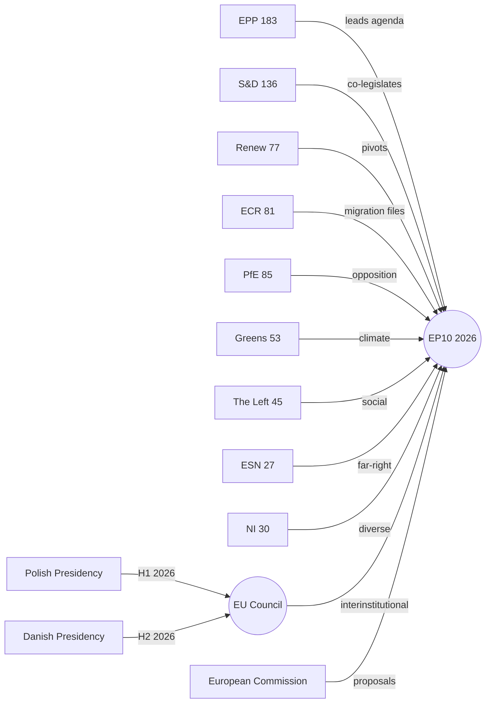

<!-- SPDX-FileCopyrightText: 2026 Hack23 AB -->
<!-- SPDX-License-Identifier: Apache-2.0 -->

# Actor Mapping: European Parliament Year Ahead (2026–2027)

**Produced:** 2026-05-10 · **Article Type:** year-ahead · **Confidence:** 🟡 MEDIUM

---

## Actor Mapping Framework

This actor map applies the Intelligence-driven Actor Analysis framework, classifying principal actors by:
- **Role type:** Institutional / Political / External Influencer
- **Motivation:** What drives their parliamentary behaviour?
- **Capability:** What tools and resources do they deploy?
- **Opportunity:** When and where do they have maximum leverage?

---

## Category 1: Primary Legislative Actors

### EPP Group (183 seats)

**Role:** Agenda-setter, coalition anchor, committee controller
**Motivation:** Maintain centre-right ideological dominance while managing the coalition spectrum from S&D to ECR/PfE pragmatically; protect single market; deliver simplified regulatory environment; advance von der Leyen II mandate.
**Capability:** Committee chair majority; Conference of Presidents dominant voice; rapporteur advantage across key files; informal veto in coalition formation.
**Opportunity:** Maximum leverage at committee drafting phase (before plenary) and in trilogue positioning with Council and Commission.
**Vulnerability:** Internal fragmentation on Green Deal and migration (15–25 MEP dissident bloc).

**Predicted Behaviour 2026–2027:**
- Maintain Cordon Sanitaire on EU values and rule of law
- Selectively align with ECR/PfE on migration and agricultural deregulation
- Broker Commission simplification agenda through ITRE and ECON
- Use Ukrainian Loan Regulation as pro-European legitimacy tool

### S&D Group (136 seats)

**Role:** Progressive anchor, social floor guardian, opposition disciplinarian
**Motivation:** Protect European labour and social standards; advance Green Deal; maintain EU rule of law; support Ukraine; block far-right legislative influence.
**Capability:** Key committee rapporteur slots (FEMM, LIBE, CONT); strong MEP expertise base; NGO and trade union alliance network; media presence.
**Opportunity:** Maximum leverage when EPP requires S&D support to prevent conservative majority (i.e., on EU values votes); extracting social chapter conditions on budget and SFDR files.
**Vulnerability:** Divided on trade (Mercosur); pressure from left flank (Left/Greens); weakened national parties in several member states.

### Renew Europe Group (77 seats)

**Role:** Swing bloc, decisive minority, liberal legislative voice
**Motivation:** Advance digital single market; protect regulatory frameworks (GDPR, AI Act); maintain EU institutional integrity; support Ukraine; advance SIU reform.
**Capability:** Decisive vote on all competitive majority calculations; holds MEPs in key committee positions; strong private sector and innovation sector stakeholder network.
**Opportunity:** Maximum leverage when EPP needs third partner to clear 360 threshold.
**Vulnerability:** Highest internal cohesion risk of any major group; FDP-macronist-ALDE split on multiple regulatory files.

### PfE Group (85 seats)

**Role:** Right-of-centre disruptor becoming transactional actor; migration policy anchor
**Motivation:** Advance national sovereignty arguments; weaken environmental mandates; tighten migration enforcement; disrupt democratic governance reform; promote Orbán/Salvini policy models.
**Capability:** Third-largest group; sufficient size to tip EPP+ECR bloc to blocking minority; growing committee engagement; Hungarian Fidesz national government leverage.
**Opportunity:** Maximum leverage when EPP seeks to form a right-of-centre majority on migration or agricultural files.
**Vulnerability:** Internal tension between pro-Ukraine (RN France, Lega Italy) and anti-Ukraine (Fidesz Hungary) factions; EU funding pressure through conditionality.

---

## Category 2: Committee-Level Power Actors

### ENVI Committee Actors
**Key coalition:** S&D rapporteurs + Green co-workers vs. EPP committee chair
**Critical files:** Nature Restoration Law implementation, CBAM phase-in, F-Gas Regulation
**Leverage point:** ENVI reports go directly to plenary; committee position sets the starting point for plenary amendments.

### ECON Committee Actors
**Key coalition:** EPP chair + Renew rapporteurs + ECR technical experts
**Critical files:** SFDR revision, SIU legislation, ECB accountability
**Leverage point:** Financial regulatory files require technical expertise — ECON's expert MEPs hold disproportionate influence in trilogues.

### LIBE Committee Actors
**Key coalition:** S&D chair + Renew civil liberties wing vs. EPP-ECR migration realists
**Critical files:** Migration Pact implementation, GDPR enforcement, rule of law monitoring
**Leverage point:** LIBE originates the Parliament's most politically charged committee debates; media attention amplifies its influence.

### AFET/SEDE Committee Actors
**Key coalition:** Broad cross-group consensus (EPP+S&D+Renew+ECR)
**Critical files:** Ukraine assistance, defence industrial strategy, CFSP annual reports
**Leverage point:** AFET/SEDE reports command the Parliament's widest coalition; rare bipartisan production environment.

---

## Category 3: External Influence Actors

### European Commission (von der Leyen II)

**Role:** Primary legislative initiator; defines EP's workload
**Motivation:** Deliver Work Programme 2026; advance simplification agenda; maintain EPP political alignment; manage Council-Parliament triangle.
**Strategy:** Calibrate proposals to EPP-centre coalition appetite; pre-negotiate with EPP leadership before formal proposal submission; use Regulatory Impact Assessment (RIA) process to pre-empt Parliament's amendment scope.
**Key personnel:** Ursula von der Leyen (President), Maroš Šefčovič (Green Deal implementation), Andrej Kubiš (CFSP), Valdis Dombrovskis (trade).

### Council of the EU (Polish Presidency H1 2026; Danish H2 2026)

**Role:** Co-legislator; defines trilogue negotiation positions
**Polish Presidency priority files:** Defence, Eastern border security, energy supply security, EU enlargement (Ukraine/Western Balkans).
**Danish Presidency priority files:** Digital economy, green transition, Arctic policy, fisheries.
**Leverage point:** Council initiates trilogue positions and controls pace of legislative negotiation; can accelerate or delay files strategically.

### U.S. Trade Representative

**Role:** External pressure actor on INTA committee agenda
**Key influence:** Tariff threats on automotive, steel, agricultural exports shape Parliament's trade position; creates pressure for protectionist amendments on EU-Mercosur and transatlantic trade framework.
**Expected 2026 behaviour:** Continued trade pressure; potential phase-1 trade talks creating EP ratification demands.

### Russian Federation (Hybrid Threat Actor)

**Role:** Active adversary — information operations, lobbying networks, MEP influence campaigns
**Capabilities:** State media (RT, Sputnik) propaganda targeting EP debates; financial network connections to PfE/ESN MEPs; support for European sovereignty narratives that weaken Ukraine support coalition.
**Expected 2026 behaviour:** Intensified operations targeting budget debates on Ukraine assistance; anti-CBAM lobbying through third-country proxies; European Energy Charter exit campaign support.
**Evidence base:** Lithuanian broadcaster attack (TA-10-2026-0024); historical pattern of EP integrity investigations.

---

## Category 4: Civil Society and Lobbying Actors

### Business Europe (Corporate Lobby Coalition)

**Key interests:** Simplification agenda; SFDR dilution; CBAM exemptions; Digital Single Market completion
**Parliamentary allies:** EPP, Renew, some ECR MEPs
**Leverage:** Corporate political contributions (via national parties); MEP advisory relationships; technical expertise input to committee hearings.

### ETUC (European Trade Union Confederation)

**Key interests:** European Pillar of Social Rights implementation; worker rights in AI Act; labour conditions in EU-Mercosur; minimum wage directive enforcement
**Parliamentary allies:** S&D, The Left, some Renew MEPs
**Leverage:** Mass membership base; electoral mobilisation capacity in member states; committee hearing submissions.

### WWF/Greenpeace (Environmental NGO Coalition)

**Key interests:** Nature Restoration Law protection; CBAM integrity; Paris Agreement compliance; agricultural derogation limits
**Parliamentary allies:** Greens/EFA, S&D, The Left
**Leverage:** Public campaigns; media attention; MEP relationship management (particularly in ENVI committee).

---

## Actor Interaction Network Summary

```
EPP ←→ S&D: Essential on EU values; contested on economic/social
EPP ←→ Renew: Required for majority; strained on regulation
EPP ←→ ECR: Issue-by-issue on migration/agriculture; blocked on values
EPP ←→ PfE: Arm's-length transactional; growing pragmatism
S&D ←→ Greens: Natural allies on climate/social
S&D ←→ Left: Alliance on labour rights; divergence on trade
Renew ←→ ECR: Competitive: both seek EPP partnership
PfE ←→ ESN: Ideologically aligned; institutionally separate
Commission ←→ EPP: Closest of any group; pre-legislative coordination
Commission ←→ Council: Formal co-authors of legislative agenda
External Actors: Russian hybrid threat → far-right groups; Business Europe → EPP/Renew; ETUC → S&D/Left
```

---

*Source: European Parliament Open Data Portal (data.europarl.europa.eu) · Apache-2.0 · Hack23 AB 2026*

---

## Actor Network Map (Mermaid)


