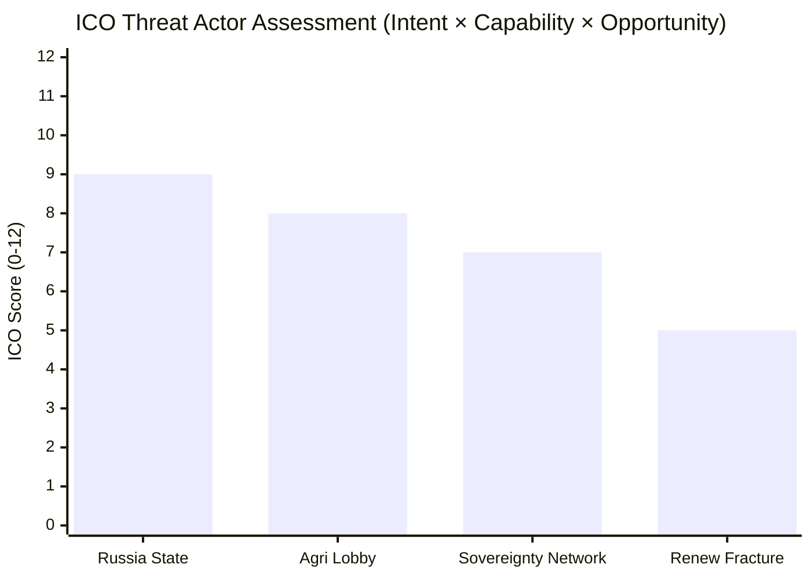

<!-- SPDX-FileCopyrightText: 2026 Hack23 AB -->
<!-- SPDX-License-Identifier: Apache-2.0 -->

# Actor Threat Profiles: European Parliament Year Ahead (2026–2027)

**Produced:** 2026-05-10 · **Article Type:** year-ahead · **Confidence:** 🟡 MEDIUM

---

## Profile 1: Russian Federation State (Hybrid Operations)

**Actor type:** State adversary (hybrid)  
**Primary targets:** EP institutional integrity; Ukraine coalition; information environment  
**ICO Score:** 9/12 — CRITICAL

### Objectives
1. Weaken EP consensus on Ukraine military and financial support
2. Amplify internal EU divisions (migration, Green Deal, fiscal) via information operations
3. Recruit or cultivate MEP sympathisers — particularly in PfE and ESN groups
4. Undermine rule of law monitoring mechanisms that constrain Russian-aligned EU member states

### Active Capabilities (2026)
- **RT/Sputnik successor networks** — despite official ban, content circulates via Telegram, YouTube mirror channels, and Substack. Russian narratives on migration ("EU importing crime"), climate ("Green Deal = deindustrialisation"), and Ukraine ("peace talks = pragmatism") regularly surface in EP debates.
- **Financial networks** — Malofeev-linked entities remain active in financing European nationalist parties. Full scope not publicly confirmed; ongoing OLAF / national intelligence investigations.
- **Cyber operations** — GRU-linked APT28 has historical EP proximity. No confirmed 2026 EP-specific incidents in open source; threat remains active.
- **MEP influence** — PfE MEPs from Hungary, Slovakia, and Bulgaria have documented contacts with Russian state entities. Not all constitute active recruitment; some are ideological alignment.

### Defensive signals to monitor
- New MEP trips to Moscow (any group)
- Unusual MEP procedural interventions protecting specific Russian-linked interests
- Spike in EP information environment around Ukrainian counterattack/ceasefire dates

---

## Profile 2: PfE — Patriots for Europe (Institutionalisation Actor)

**Actor type:** Domestic political group (adversarial to pro-integration majority)  
**Primary targets:** EPP alignment; committee influence; Cordon Sanitaire erosion  
**ICO Score:** 6/12 — SIGNIFICANT

### Objectives
1. Gain committee chair at EP10 midterm (January 2027 bureau elections)
2. Normalise participation in centre-right coalition on specific files (migration, competition)
3. Expand group membership — approach uncommitted NI members; court potential ECR defectors
4. Shift public Overton window on EU integration: from "less EU" fringe to "reformed EU" mainstream

### Capabilities
- **85 seats** (11.9% of Parliament) — substantial blocking potential on absolute-majority votes
- Growing legislative technical capacity — hired policy advisors; more sophisticated amendment strategy
- Fidesz institutional networks — access to EU Council processes via Hungarian government
- National media amplification — RN (France), Fidesz-aligned Hungarian media, FPÖ (Austria) channels

### Vulnerabilities
- Internal tensions: Fidesz (pro-EU-funds, authoritarian-nationalist) vs. RN (anti-Brussels, but pro-some European frameworks) vs. FPÖ (Austrian-specific interests)
- Dependence on EPP tolerance — any formal EPP rule against coalition cooperation would isolate PfE
- EP10 legitimacy depends on avoiding another Qatargate-type scandal

---

## Profile 3: Agricultural Industrial Lobby Complex

**Actor type:** Industry interest coalition (non-adversarial in intent, adversarial in effect on specific policies)  
**Primary targets:** ENVI/AGRI committees; NRL implementation; pesticide regulation; CAP reform  
**ICO Score:** 7/12 — SIGNIFICANT on targeted files

### Objectives
1. Maximise agricultural exemptions from Nature Restoration Law implementation
2. Maintain CAP subsidy levels in Budget 2027 negotiations
3. Block or weaken pesticide reduction targets
4. Expand "food security" framing to justify industrial agriculture support

### Capabilities
- **Copa-Cogeca** (farming lobby) has the largest registered EP lobby presence in AGRI/ENVI
- Strong national government backing — agriculture ministers are a structural Council interest group
- AGRI committee historically most susceptible to lobbying (member constituency linkage)
- Political alignment with EPP rural base — MEPs in Poland, France, Germany, Spain

---

## Profile 4: Renew Fragmentation Risk

**Actor type:** Endogenous political risk (internal coalition fracture)  
**Primary targets:** EPP's pivot-partner arithmetic  
**ICO Score:** 5/12 — MODERATE

### Fragmentation drivers
- FDP (Germany, 5 MEPs) increasingly market-liberal on regulation; tension with French Renew (Macron-aligned, more statist)
- The 2025 German elections weakened Renew Germany; FDP parliamentary collapse in Bundestag creates pressure
- Estonian/Dutch Renew MEPs align more with EPP on migration; French/Belgian Renew align with S&D on social policy
- If Renew splits into two groups (market-liberal + social-liberal), coalition arithmetic changes fundamentally

### Consequence if Renew fractures
- Market-liberal faction (~25 MEPs) joins EPP-ECR configuration
- Social-liberal faction (~52 MEPs) joins EPP-S&D configuration
- Both configurations would have majority arithmetic — but neither would be the same coalition

---

*Source: EP Open Data Portal; open-source intelligence synthesis · Apache-2.0 · Hack23 AB 2026*

---

## Threat Actor ICO Matrix (Mermaid)

