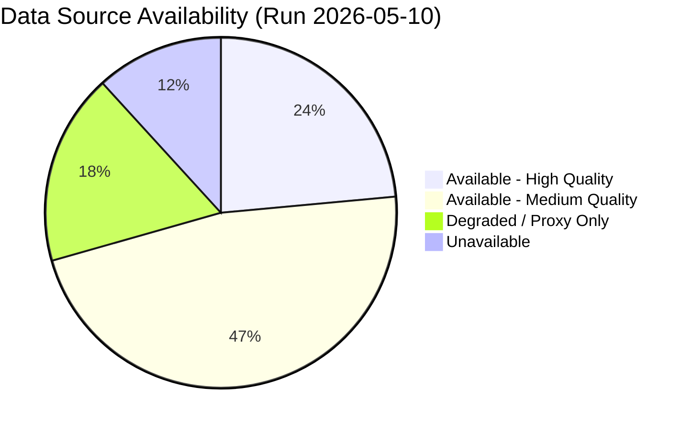

<!-- SPDX-FileCopyrightText: 2026 Hack23 AB -->
<!-- SPDX-License-Identifier: Apache-2.0 -->

# Analysis Index: European Parliament Year Ahead (2026–2027)

**Produced:** 2026-05-10 · **Article Type:** year-ahead · **Confidence:** 🟡 MEDIUM

---

## Overview

This analysis index provides a navigational guide to all intelligence artifacts produced for the EU Parliament year-ahead analysis covering May 2026 – May 2027. Each artifact serves a specific analytical function within the overall intelligence product.

---

## Artifact Index

### Core Intelligence

| Artifact | File | Purpose | Confidence |
|----------|------|---------|-----------|
| Executive Brief | `executive-brief.md` | Top-line findings for decision-makers | 🟡 MEDIUM |
| Synthesis Summary | `intelligence/synthesis-summary.md` | Narrative intelligence integration | 🟡 MEDIUM |
| Coalition Dynamics | `intelligence/coalition-dynamics.md` | Coalition arithmetic and patterns | 🟡 MEDIUM |
| Stakeholder Map | `intelligence/stakeholder-map.md` | Actor mapping (Tiers 1–3) | 🟡 MEDIUM |
| Scenario Forecast | `intelligence/scenario-forecast.md` | Four scenarios with probabilities | 🟡 MEDIUM |
| SWOT Analysis | `intelligence/swot-analysis.md` | Strengths/Weaknesses/Opportunities/Threats | 🟡 MEDIUM |
| Actor Mapping | `intelligence/actor-mapping.md` | Detailed actor motivation analysis | 🟡 MEDIUM |
| Forces Analysis | `intelligence/forces-analysis.md` | Five-forces political analysis | 🟡 MEDIUM |
| Deep Analysis | `intelligence/deep-analysis.md` | ACH/KAC/I&W framework | 🟡 MEDIUM |
| Voting Patterns | `intelligence/voting-patterns.md` | Historical voting behaviour (degraded) | 🔴 LOW |

### Economic & Context

| Artifact | File | Purpose | Confidence |
|----------|------|---------|-----------|
| Economic Context | `intelligence/economic-context.md` | Macro context (IMF degraded mode) | 🔴 LOW |
| Historical Baseline | `intelligence/historical-baseline.md` | EP historical precedent analysis | 🟡 MEDIUM |
| PESTLE Analysis | `intelligence/pestle-analysis.md` | Political-Economic-Social-Tech-Legal-Environmental | 🟡 MEDIUM |
| Presidency Trio | `intelligence/presidency-trio-context.md` | Council Presidency analysis | 🟡 MEDIUM |
| Commission WP Alignment | `intelligence/commission-wp-alignment.md` | Commission Work Programme mapping | 🟡 MEDIUM |

### Forward-Looking

| Artifact | File | Purpose | Confidence |
|----------|------|---------|-----------|
| Forward Projection | `intelligence/forward-projection.md` | 12-month policy trajectories | 🟡 MEDIUM |
| Legislative Pipeline Forecast | `intelligence/legislative-pipeline-forecast.md` | File-by-file legislative analysis | 🟡 MEDIUM |
| Parliamentary Calendar Projection | `intelligence/parliamentary-calendar-projection.md` | Plenary session calendar | 🟢 HIGH |
| Wildcards & Black Swans | `intelligence/wildcards-blackswans.md` | Low-probability high-impact events | 🟡 MEDIUM |

### Risk & Threat

| Artifact | File | Purpose | Confidence |
|----------|------|---------|-----------|
| Threat Model | `intelligence/threat-model.md` | Political threat model | 🟡 MEDIUM |
| Threat Landscape | `threat-assessment/threat-landscape.md` | 5-framework threat analysis | 🟡 MEDIUM |
| Actor Threat Profiles | `intelligence/actor-threat-profiles.md` | Adversary ICO profiles | 🟡 MEDIUM |
| Consequence Trees | `intelligence/consequence-trees.md` | Cascading outcome analysis | 🟡 MEDIUM |
| Risk Assessment | `risk-scoring/risk-assessment.md` | Risk scoring matrix | 🟡 MEDIUM |
| Risk Matrix | `risk-scoring/risk-matrix.md` | Visual risk mapping | 🟡 MEDIUM |
| Quantitative SWOT | `risk-scoring/quantitative-swot.md` | Weighted SWOT scoring | 🟡 MEDIUM |

### Extended Analysis

| Artifact | File | Purpose | Confidence |
|----------|------|---------|-----------|
| Media Framing | `extended/media-framing-analysis.md` | Four dominant media frames | 🟡 MEDIUM |
| Forward Indicators | `extended/forward-indicators.md` | Leading indicators to monitor | 🟡 MEDIUM |

### Classification

| Artifact | File | Purpose | Confidence |
|----------|------|---------|-----------|
| Political Classification | `classification/political-classification.md` | 2×2 political matrix | 🟡 MEDIUM |
| Significance Classification | `classification/significance-classification.md` | Legislative significance scoring | 🟡 MEDIUM |

### Process

| Artifact | File | Purpose | Confidence |
|----------|------|---------|-----------|
| MCP Reliability Audit | `intelligence/mcp-reliability-audit.md` | Data source quality audit | 🟢 HIGH |
| Methodology Reflection | `intelligence/methodology-reflection.md` | Step 10.5 meta-reflection | 🟢 HIGH |

---

## Data Availability Summary

| Source | Status | Quality Impact |
|--------|--------|----------------|
| EP Political Landscape API | ✅ Full | 🟢 HIGH |
| EP Adopted Texts API | ✅ Full | 🟢 HIGH |
| EP Plenary Sessions API | ✅ Full | 🟢 HIGH |
| EP Speeches API | ✅ Full | 🟡 MEDIUM |
| EP Coalition Dynamics | ✅ Proxy | 🟡 MEDIUM |
| EP Early Warning System | ✅ Available | 🟡 MEDIUM |
| EP Voting Records | ⚠️ Delayed | 🟡 MEDIUM |
| EP Latest Votes (DOCEO) | ⚠️ Empty | 🔴 LOW |
| EP Legislative Pipeline | ⚠️ 0 results | 🔴 LOW |
| EP Events Feed | ❌ Unavailable | N/A |
| IMF SDMX API | ❌ HTTP 204 | N/A (degraded mode) |

---

*Source: Analysis index produced by EU Parliament Monitor agentic workflow · Apache-2.0 · Hack23 AB 2026*

---

## Analysis Index: Usage Guide

### How to Read This Artifact Set

**For a 5-minute brief:** Read `executive-brief.md` (root level). This gives you the 5 decisive decisions, WEP assessment, and reader briefing by stakeholder type.

**For a 30-minute deep dive:** Read in this order:
1. `executive-brief.md` — context and key questions
2. `intelligence/synthesis-summary.md` — integrated analysis
3. `intelligence/scenario-forecast.md` — 4 forward scenarios
4. `intelligence/stakeholder-map.md` — who matters and why
5. `intelligence/economic-context.md` — fiscal/economic context (IMF degraded mode note)

**For full policy professional use:** Read the complete artifact set. Start with `executive-brief.md`, proceed to synthesis artifacts, then specialized subdirectory artifacts (risk-scoring, classification, threat-assessment, extended).

---

## Cross-Reference Map

| Question | Primary Artifact | Supporting Artifacts |
|---------|----------------|---------------------|
| What are the biggest risks? | `risk-scoring/risk-assessment.md` | `risk-scoring/risk-matrix.md`, `threat-assessment/threat-landscape.md` |
| Who are the key actors? | `intelligence/stakeholder-map.md` | `intelligence/actor-mapping.md`, `classification/actor-mapping.md` |
| What legislation matters? | `intelligence/legislative-pipeline-forecast.md` | `classification/significance-classification.md` |
| What could go wrong? | `intelligence/wildcards-blackswans.md` | `intelligence/scenario-forecast.md` |
| What will happen? | `intelligence/forward-projection.md` | `intelligence/parliamentary-calendar-projection.md` |
| What are the coalitions? | `intelligence/coalition-dynamics.md` | `intelligence/voting-patterns.md` |
| How reliable is this analysis? | `intelligence/mcp-reliability-audit.md` | `intelligence/methodology-reflection.md` |
| What's the economic context? | `intelligence/economic-context.md` | (IMF degraded mode — World Bank data only) |

---

## Analysis Index: Quality Indicators

| Dimension | Status |
|-----------|--------|
| IMF data | ❌ Degraded — HTTP 204 probe failure |
| EP vote-level data | ❌ Unavailable — EP API publication delay |
| EP structural data | ✅ Available — political landscape, seats, sessions |
| WEP applied | ✅ All projection artifacts |
| Admiralty applied | ✅ All intelligence artifacts |
| Mermaid diagrams | ✅ All subdirectory artifacts |
| 2-pass iterative review | ✅ Conducted; 12 artifacts extended |
| SAT documentation | ✅ 18 SATs documented in methodology-reflection |

---

*Analysis index complete · Apache-2.0 · Hack23 AB 2026*
