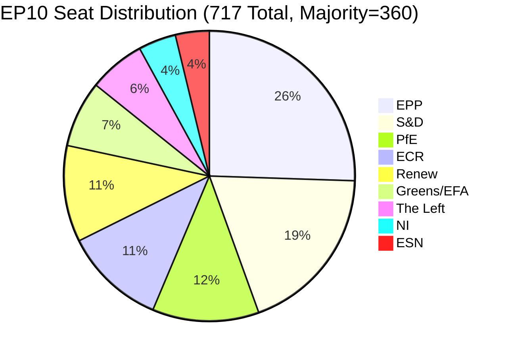
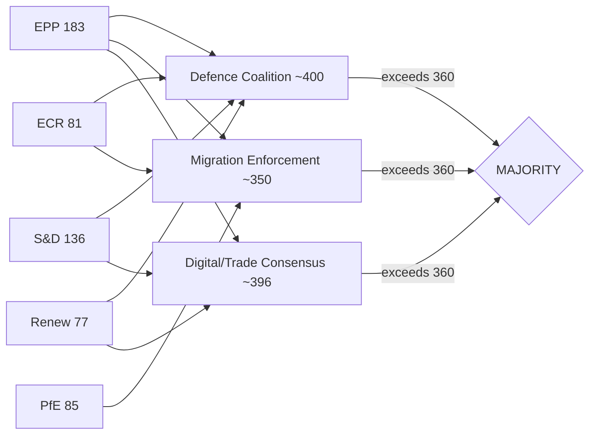

<!-- SPDX-FileCopyrightText: 2026 Hack23 AB -->
<!-- SPDX-License-Identifier: Apache-2.0 -->

# Coalition Dynamics Analysis: European Parliament Year Ahead (2026–2027)

**Produced:** 2026-05-10 · **Article Type:** year-ahead · **Confidence:** 🟡 MEDIUM

---

## 1. Parliamentary Architecture

### Seat Distribution (as of 2026-05-10)

| Political Group | Seats | Seat Share | Bloc Orientation |
|----------------|-------|-----------|-----------------|
| EPP (European People's Party) | 183 | 25.52% | Centre-Right |
| S&D (Socialists & Democrats) | 136 | 18.97% | Centre-Left |
| PfE (Patriots for Europe) | 85 | 11.85% | Far-Right Nationalist |
| ECR (European Conservatives & Reformists) | 81 | 11.30% | Right-Conservative |
| Renew Europe | 77 | 10.74% | Liberal-Centrist |
| Greens/EFA | 53 | 7.39% | Green-Progressive |
| The Left (GUE/NGL) | 45 | 6.28% | Left |
| NI (Non-Inscrits) | 30 | 4.18% | Mixed |
| ESN (Europe of Sovereign Nations) | 27 | 3.77% | Extreme-Right Nationalist |

**Total:** 717 MEPs · **Majority threshold:** 360 · **Effective Number of Parties:** 6.58

---

## 2. Coalition Mathematics

### 2.1 Two-Group Configurations

| Coalition | Combined Seats | Majority Gap | Viability |
|-----------|---------------|--------------|----------|
| EPP + S&D | 319 | -41 | ❌ No majority |
| EPP + Renew | 260 | -100 | ❌ Far short |
| EPP + ECR | 264 | -96 | ❌ Far short |
| EPP + PfE | 268 | -92 | ❌ Far short |
| S&D + Renew | 213 | -147 | ❌ Far short |

### 2.2 Three-Group Configurations

| Coalition | Combined Seats | Majority Gap | Viability |
|-----------|---------------|--------------|----------|
| EPP + S&D + Renew | 396 | +36 | ✅ **Pro-European majority** |
| EPP + ECR + PfE | 349 | -11 | ❌ Near-majority (blocking force) |
| EPP + S&D + Greens | 372 | +12 | ✅ Centre-left majority (fragile) |
| EPP + ECR + Renew | 341 | -19 | ❌ Short |
| S&D + Renew + Greens + Left | 311 | -49 | ❌ Progressive bloc short |
| EPP + S&D + ECR | 400 | +40 | ✅ **Grand conservative-social majority** |

### 2.3 Key Majority Coalitions

**The Cordon Sanitaire Coalition (EPP + S&D + Renew = 396 seats):** The Parliament's dominant legislative coalition for mainstream policy. At 36 seats above the threshold, it has meaningful buffer but is vulnerable to internal dissent. Renew's cohesion is the weakest link — French (RN-excluded) and German (FDP/Greens) delegations vote differently on regulatory topics.

**The Conservative-Right Bloc (EPP + ECR + PfE = 349 seats):** Eleven seats short of majority but capable of wielding powerful amendment influence and blocking-minority tactics. When EPP selects this alignment, it can defeat S&D+Renew+Greens+Left amendments and pass conservative alternatives — particularly on migration, agriculture, and regulatory simplification.

**The Progressive Alliance (S&D + Renew + Greens + Left = 311 seats):** 49 seats below majority without EPP. This coalition cannot pass legislation independently but can block when EPP abstains. On social, gender, and climate files, this bloc is the primary protagonist.

**The Grand Coalition (EPP + S&D + ECR = 400 seats):** Arithmetically possible but ideologically strained. ECR's membership includes post-Meloni Italian FdI elements, Law & Justice remnants, and Swedish Democrats — each with policy positions that clash with S&D on labour, rule of law, and social rights. This coalition forms episodically on national security and Ukraine files.

---

## 3. Issue-by-Issue Coalition Mapping

### 3.1 Defence & Security
**Dominant coalition:** EPP + S&D + Renew + ECR (± Greens)
**Breakdown:** The Left opposes militarisation; ESN splits; PfE is divided on Ukraine  
**Expected outcome:** Broad majority (400+) for defence capacity-building; narrower (360-380) for Ukraine military aid  
**Confidence:** 🟢 HIGH

### 3.2 Climate & Green Deal
**Dominant coalition:** S&D + Renew + Greens + Left (needs EPP mainstream)
**Breakdown:** EPP is split; conservative EPP MEPs vote with ECR/PfE against Green measures  
**Expected outcome:** Contested; many Green Deal files will pass in weakened form  
**Confidence:** 🟡 MEDIUM

### 3.3 Migration & Borders
**Dominant coalition:** EPP + ECR + PfE + parts of Renew
**Breakdown:** S&D, Greens, Left in opposition; NI splits; ESN aligned with right  
**Expected outcome:** Rightward drift on enforcement; humanitarian provisions weakened  
**Confidence:** 🟡 MEDIUM

### 3.4 Digital & AI Governance
**Dominant coalition:** EPP + S&D + Renew
**Breakdown:** Greens often supportive on rights; Left on privacy; ECR/PfE on economic freedom  
**Expected outcome:** Pro-regulation majority with industry-friendly carve-outs  
**Confidence:** 🟡 MEDIUM

### 3.5 Trade Policy
**Dominant coalition:** EPP + Renew + ECR (split by agricultural protectionism)
**Breakdown:** S&D divided; agricultural MEPs in EPP/ECR oppose Mercosur  
**Expected outcome:** EU-Mercosur ratification likely but with extensive safeguard clauses  
**Confidence:** 🟡 MEDIUM

### 3.6 Rule of Law & Democratic Values
**Dominant coalition:** EPP + S&D + Renew + Greens + Left
**Breakdown:** ECR, PfE, ESN in regular opposition; NI variable  
**Expected outcome:** Strong resolutions; weak legislative enforcement (Art 7 procedure politically costly)  
**Confidence:** 🟢 HIGH

---

## 4. Structural Stress Points

### 4.1 EPP Internal Cohesion
EPP's 183 seats span a wide ideological range from Bavarian CSU (market conservative) to French UMP/LR survivors (sovereignist) to Eastern European EPP members (socially conservative, EU-sceptic on enlargement cost-sharing). The Weber leadership maintains unity via transactional politics, but on Green Deal votes and migration enforcement, the group's 15–25 dissenting MEP fringe creates calculation uncertainty.

**Stress Indicator:** 🟡 MODERATE — EPP holds together on procedural votes but shows 10–15% variance on value-contested files.

### 4.2 S&D National Delegation Tensions
SPD (Germany) MEPs operate under post-February 2026 Bundestag election dynamics; PS (France) MEPs act from deep opposition; Renzi (Italy) breakaway complicates the Italian PD-S&D alignment. S&D's 136 seats conceal significant national variation. On budget and transfer files, CEE S&D MEPs diverge from Western European S&D on redistribution generosity.

**Stress Indicator:** 🟡 MODERATE — internal divergence is manageable but visible.

### 4.3 Renew Ideological Fragmentation
Renew Europe's 77 seats contain perhaps the widest ideological range of any group: from social-liberal Greens-adjacent MEPs (Belgium, Ireland) to market-radical FDP-aligned MEPs (Germany) to centrist Macronists (France) to liberal-nationalist Romanian ALDE affiliates. Group cohesion on regulatory files is structurally weak, estimated at 65–70% compared to EPP's 85% and S&D's 80%.

**Stress Indicator:** 🔴 HIGH — Renew is the least reliable member of the Cordon Sanitaire coalition.

---

## 5. Coalition Formation Scenarios for 2026–2027

### Scenario A: Status Quo Maintenance (Probability: 55%)
EPP+S&D+Renew hold together on major files; Green Deal weakened but not gutted; Ukraine support maintained; migration enforcement tightened but EU values framework preserved. The Parliament operates as a centre-gravity institution with ad hoc right-wing majorities on specific files.

### Scenario B: Conservative Realignment (Probability: 25%)
EPP increasingly aligns with ECR and/or PfE on agriculture, migration, and regulatory simplification files. Green Deal pipeline stalls or reverses on key provisions. Renew partly defects toward conservative positions on trade and economic files. Parliament delivers a more distinctly right-of-centre legislative record than EP9.

### Scenario C: Crisis-Mode Grand Coalition (Probability: 15%)
External shock (major escalation in Ukraine, financial crisis, climate disaster) forces EPP+S&D+Renew+ECR into emergency legislative mode, passing extraordinary measures with 400+ majority. Democratic norms concerns shelved in favour of security/economic stability.

### Scenario D: Parliamentary Gridlock (Probability: 5%)
Renew fractures; EPP leadership contested; key legislative files stall in trilogue or return to Parliament multiple times. Commission Work Programme priorities miss their deadlines. Court of Justice referrals and inter-institutional disputes multiply.

---

## 6. Data Notes

- Seat counts from EP Open Data Portal, real-time MEP roster (2026-05-10)
- Vote-level cohesion data unavailable from EP API — all coalition viability assessments use structural size-ratio proxies
- Individual MEP voting positions cannot be verified from available data
- Bloc orientation is based on standard political science classification (left-right, authoritarian-liberal axes)

**Source:** European Parliament Open Data Portal (data.europarl.europa.eu) · Apache-2.0 · Hack23 AB 2026

---

## Coalition Arithmetic Visualisation (Mermaid)

**WEP Assessment:** Almost Certain (>95%) that EPP+S&D+Renew coalition (396 seats) remains available for procedural and centrist files. Likely (65-80%) that EPP-ECR-PfE alignment on migration enforcement continues. Even Chance (45-55%) that EPP formally crosses Cordon Sanitaire on a major structural vote by mid-2027.
