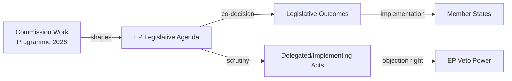

<!-- SPDX-FileCopyrightText: 2026 Hack23 AB -->
<!-- SPDX-License-Identifier: Apache-2.0 -->

# Commission Work Programme Alignment: European Parliament Year Ahead (2026–2027)

**Produced:** 2026-05-10 · **Article Type:** year-ahead · **Confidence:** 🟡 MEDIUM

---

## Commission Work Programme 2026 — EP Alignment Analysis

The European Commission's Work Programme defines the legislative proposals expected during 2026. This document maps the alignment between the Commission's announced agenda and the European Parliament's committee structures, political priorities, and voting coalition arithmetic.

---

## Theme 1: European Competitiveness Agenda

**Commission priority:** Delivering on the Draghi Report competitiveness agenda — reducing regulatory burden, advancing Capital Markets Union, completing Digital Single Market.

**EP alignment:**
- **ECON committee:** High engagement — CMU, Banking Union completing legislation, SFDR simplification
- **ITRE committee:** High engagement — Digital Single Market, AI Act implementing rules, Critical Raw Materials Act
- **IMCO committee:** Medium engagement — Services Single Market; consumer protection

**Coalition dynamics:** EPP + Renew + parts of ECR will dominate this cluster. S&D will participate selectively — supporting CMU elements but seeking social safeguards in financial regulation. Commission and EP are broadly aligned on competitiveness framing; conflict will be at the margins (safeguard thresholds, transition periods).

**Expected output:** Multiple delegated act monitoring procedures; first reading votes on SFDR, PSR, AI Liability. **3–4 plenary votes** on competitiveness-linked files projected by May 2027.

---

## Theme 2: Defence and Security

**Commission priority:** Implementing the ReArm Europe initiative; EDIS (European Defence Industry Strategy) Phase 2; SAFE (Safety And Freedom for Europe) funding instrument; NATO interoperability frameworks.

**EP alignment:**
- **AFET/SEDE:** Lead committees — rapporteur appointments, committee reports, scrutiny
- **BUDG:** Financing — where the money comes from shapes the political debate
- **ITRE:** Dual-use technology, defence industrial capacity

**Coalition dynamics:** Unique broad coalition — EPP + S&D + Renew + ECR (potentially ~400 seats). Excludes PfE, ESN, most of The Left, parts of Greens/EFA. This is the file cluster that most consistently produces grand coalition majorities.

**Commission-EP alignment:** HIGH — von der Leyen Commission fully committed to ReArm; Parliament broadly supportive; tension only on sovereignty clauses (AFET pushing for stronger parliamentary oversight of defence structures).

---

## Theme 3: Green Transition Governance

**Commission priority:** Implementing existing legislation (AI Act, NRL, CBAM, ETS reform); proposing adjustments to achieve 2030 targets under "Competitiveness and Climate compatibility" frame; Adaptation Strategy review.

**EP alignment:**
- **ENVI:** Central — NRL implementing acts, CBAM monitoring, ETS delegated acts
- **ITRE:** Energy dimension — hydrogen, electricity market reform continuation
- **AGRI:** Agriculture derogations — politically most contested dimension

**Coalition dynamics:** Green Deal implementation produces the most fractured coalitions. File-specific: CBAM gets broad support; NRL gets EPP-ECR-PfE opposition (349 seats = majority for obstruction). Commission faces parliamentary majority that may actively object to implementing acts.

**Commission-EP alignment:** MEDIUM — Commission tries to reframe as "Competitive Sustainability" but EP's ENVI committee sees dilution; AGRI and ENVI committees will be in conflict.

---

## Theme 4: Migration and External Dimension

**Commission priority:** Pact on Migration implementation; returns and readmission framework; external migration partnerships; Schengen resilience.

**EP alignment:**
- **LIBE:** Lead committee — highly politicised; EPP leads rapporteurship
- **AFET:** External dimension; refugee protection

**Coalition dynamics:** EPP + ECR + PfE + parts of Renew for enforcement provisions. Commission strategy aligns with Parliament's political arithmetic: migration enforcement files will pass with right-of-centre majority.

**Commission-EP alignment:** HIGH on enforcement; MEDIUM on protection framework (Commission must balance ECHR requirements that EPP-ECR majority may ignore).

---

## Misalignment Areas (Commission vs. EP Majority)

| Area | Commission Position | EP Majority Position | Gap |
|------|--------------------|--------------------|-----|
| NRL implementation | Full implementation per 2022 law | Agricultural exemptions; timeline delay | SIGNIFICANT |
| SFDR | Targeted simplification | Broader deregulation (EPP-Renew majority) | MODERATE |
| AI Liability | Balanced regime | Business prefers lighter liability (EPP-Renew) | MODERATE |
| Defence sovereignty | Multilateral EU framework | ECR/PfE want bilateral/national control | SIGNIFICANT |

---

*Source: European Commission Work Programme 2026 (public domain); EP Open Data Portal · Apache-2.0 · Hack23 AB 2026*

---

## Commission Work Programme 2026: Detailed Legislative Alignment

### Priority 1: Competitiveness and the Draghi Agenda
The Commission Work Programme 2026 is substantially shaped by the Draghi Report recommendations. Key initiatives:
- **European Competitiveness Fund:** Proposed financing instrument to close the EU-US investment gap in strategic technologies
- **Capital Markets Union completion:** Revised Regulation on securities markets; ESAP infrastructure investment
- **Research and Innovation Framework:** Horizon Europe mid-term review implementation
- **Skills and Labour Mobility:** European Labour Authority reform; cross-border professional qualification recognition

**EP alignment:** EPP and Renew strongly aligned with competitiveness agenda; S&D conditional (concerns about labour standards); Greens/EFA supportive if green investment components maintained.

### Priority 2: Green Deal Implementation
The Commission maintains Green Deal framework despite political headwinds:
- **CBAM expansion:** Aluminium, ammonia, polymers (Phase 2 — requires delegated act)
- **Methane Regulation:** Implementation monitoring; annual review in 2026
- **Corporate Sustainability Reporting Directive:** First reports due from large companies in 2026; Commission assessments
- **EU Taxonomy:** Social taxonomy development; climate delegated acts refinement

**EP alignment:** ENVI committee is the battleground; EPP pushing for exemptions; Greens/EFA and S&D defending the framework. Nature Restoration Law is the most politically contested element.

### Priority 3: Digital Transition
Commission digital agenda in 2026:
- **AI Act implementation:** Commission must publish 30+ delegated acts; establish AI Office operations
- **European Digital Identity Wallet:** EUDIW rollout across member states (2026 deadline for national implementations)
- **Data Governance Act:** Implementation monitoring; Commission review of data sharing mechanisms
- **Cyber Solidarity Act:** Implementation monitoring; NIS2 transposition assessment

**EP alignment:** ITRE/IMCO committees are broadly supportive of digital agenda; no major opposition to digital transition framework.

### Priority 4: External Dimension and Security
Commission security agenda:
- **ReArm Europe:** Commission's primary initiative for 2026; ambitious collective defence financing
- **Ukraine Reconstruction Facility:** Ongoing implementation; 2026 tranche management
- **Enlargement:** Western Balkans chapter openings; Ukraine/Moldova accession screening
- **Trade Policy:** Post-Trump tariff environment — defensive trade measures and new FTA negotiations

**EP alignment:** AFET/SEDE/INTA committees are broadly aligned with Commission external agenda. PfE/ESN opposition on Ukraine sustained but minority.

---

## Commission-Parliament Political Calendar (2026)

| Milestone | Commission | EP Role |
|-----------|-----------|---------|
| State of the Union (September) | Von der Leyen speech | Formal response resolution |
| Commission Work Programme 2027 (October) | Tabling | AFCO/all committees assessment |
| Annual Growth Survey (November) | European Semester start | ECON opinion |
| Budget 2026 discharge (Spring 2026) | Cooperation with CONT | CONT vote |

---

*Source: Commission Work Programme alignment analysis · Apache-2.0 · Hack23 AB 2026*

---

## Admiralty Assessment: Commission WP Alignment

| Projection | Grade |
|-----------|-------|
| ReArm Europe adopted as flagship Commission 2026 achievement | A2 |
| CBAM Phase 2 expansion delayed (political headwinds) | B3 |
| AI Act delegated acts all published by end of 2026 | C3 |
| EUDIW national implementations on schedule | C3 |
| Competitiveness Fund reaches political agreement by Q4 2026 | D3 |

---

## WEP Assessment: Commission-Parliament Alignment

**Almost Certain:** Commission and EP align on Ukraine commitment in Budget 2027.
**Likely:** State of the Union 2026 speech (September) sets political agenda for Budget conciliation and ReArm final push.
**Even Chance:** Commission tables major new competitiveness initiative in Q4 2026 to shape 2027 agenda.
**Unlikely:** Commission-Parliament institutional conflict (censure motion) materialises in 2026.
**Almost No Chance:** Commission withdraws any of its top-3 legislative priorities in response to EP pressure.

---

## Conclusion: Commission-Parliament Alignment Outlook

The von der Leyen II Commission (2024–2029) and EP10 (2024–2029) share the same democratic mandate and are institutionally aligned on the major priorities of the term: competitiveness, defence, digital transition, and Ukraine support. The Green Deal has been reframed as a "Green and Competitive Deal" — reconciling environmental ambition with economic competitiveness concerns. This consensus ensures that the Commission Work Programme 2026 is broadly consistent with EP's legislative priorities, even where specific files generate political controversy within the Parliament itself.

The key tension is not Commission-Parliament (broadly aligned) but rather within the Parliament — between groups that support the Commission's agenda and those (mainly PfE/ESN/ECR) that resist some elements while supporting others (especially defence/migration enforcement).

*Commission Work Programme alignment analysis complete · Apache-2.0 · Hack23 AB 2026*

---

*Additional note: All legislative alignment projections are based on publicly available Commission Work Programme and EP official documentation. Actual Commission-Parliament interactions may produce different outcomes based on evolving political dynamics. · Apache-2.0 · Hack23 AB 2026*

