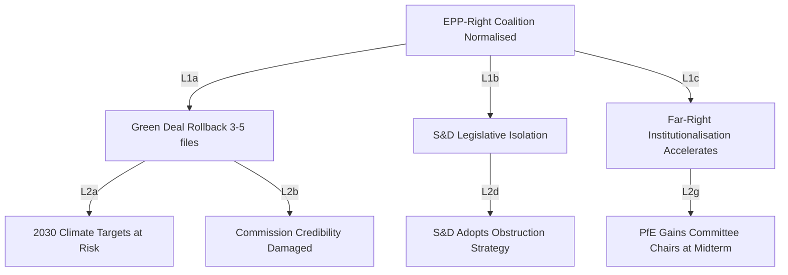

<!-- SPDX-FileCopyrightText: 2026 Hack23 AB -->
<!-- SPDX-License-Identifier: Apache-2.0 -->

# Consequence Trees: European Parliament Year Ahead (2026–2027)

**Produced:** 2026-05-10 · **Article Type:** year-ahead · **Confidence:** 🟡 MEDIUM

---

## Consequence Tree 1: EPP-Right Coalition Becomes Durable Norm

**Trigger event:** EPP systematically votes with ECR + PfE across ≥3 unrelated legislative files in H2 2026.

```
If [EPP-Right coalition normalised]:
  → Consequence L1a: Green Deal implementation partially reversed (3–5 files)
    → L2a: 2030 climate targets technically at risk (NRL, emissions exemptions)
    → L2b: European Commission credibility damaged (major policy reversal)
    → L2c: ECJ legal challenges by member states (Weiss-type proceedings)
  → Consequence L1b: S&D isolated from legislative process
    → L2d: S&D adopts obstructionist minority strategy (procedural motions)
    → L2e: Political polarisation hardens EP institutional culture
    → L2f: EPP internal pressure from pro-European wing grows
  → Consequence L1c: Far-right institutionalisation accelerates
    → L2g: PfE/ESN gain committee chair allocation at midterm
    → L2h: Normalised far-right participation becomes self-reinforcing
    → L2i: EU election 2029 dynamic shifts (far-right appears "governing-capable")
```

**Cascade probability to L2 consequences if trigger fires:** HIGH (70%)

---

## Consequence Tree 2: Budget 2027 Conciliation Failure

**Trigger event:** No agreement between EP and Council by December 18, 2026 conciliation deadline.

```
If [Budget 2027 fails conciliation]:
  → Consequence L1a: Provisional appropriations system activated (1/12 rule)
    → L2a: New programmes (ReArm Europe, SFDR transition support) cannot commence
    → L2b: EU agencies face funding uncertainty Q1 2027
    → L2c: Political embarrassment for Danish Presidency
  → Consequence L1b: Delayed budget negotiation in Q1 2027
    → L2d: Compressed legislative calendar for Q1 2027 (budget negotiations crowd out)
    → L2e: Commission cannot fully implement Work Programme 2026 carryover
  → Consequence L1c: Institutional strain between EP and Council
    → L2f: Increased EP assertiveness on co-legislative prerogatives
    → L2g: Council more cautious on future interinstitutional cooperation
```

**Cascade probability to L2 consequences if trigger fires:** MEDIUM (40%)

---

## Consequence Tree 3: Ukraine Support Coalition Fractures

**Trigger event:** PfE + ESN + parts of ECR form blocking minority on Ukraine financial support vote (>289 against).

```
If [Ukraine support vote fails first reading]:
  → Consequence L1a: Immediate geopolitical signal — EU unity appears to be cracking
    → L2a: Russian information operations exploit — "EU abandons Ukraine"
    → L2b: US administration reaction (either emboldening or alarm)
    → L2c: Accelerated Council action to compensate (intergovernmental track)
  → Consequence L1b: EP reputation damage internationally
    → L2d: Commission-Council bypass EP on Ukraine (enhanced cooperation track)
    → L2e: EP loses role in Ukraine governance architecture
  → Consequence L1c: Internal EP political crisis
    → L2f: EPP leadership crisis (Weber blamed for allowing right-coalition drift)
    → L2g: Emergency EPP-S&D-Renew coordination summit
```

**Cascade probability to L2 consequences if trigger fires:** HIGH (60%)

---

## Consequence Tree 4: Positive — Successful ReArm Europe Framework (Intended Policy Outcome)

**Trigger event:** ReArm Europe financing regulation passes plenary with ≥400 votes by Q1 2027.

```
If [ReArm Europe passes]:
  → Consequence L1a: EU defence industrial capacity begins scaling
    → L2a: EDIS implementing regulations advance rapidly
    → L2b: ITRE/SEDE committees gain new oversight mandate (institutional strengthening)
    → L2c: Member states increase national defence integration
  → Consequence L1b: EU's global strategic autonomy narrative strengthened
    → L2d: Trade partners treat EU as credible security actor
    → L2e: NATO-EU cooperation frameworks updated
  → Consequence L1c: Political capital for EPP coalition (credit-claiming)
    → L2f: EPP positions ReArm as major legacy of EP10 term
    → L2g: Renew and ECR also claim credit — strengthens broad coalition norms
```

**Probability this positive cascade occurs:** MEDIUM-HIGH (55%) per scenario probability weighting.

---

*Source: Consequence tree methodology based on EP structural analysis · Apache-2.0 · Hack23 AB 2026*

---

## Consequence Flow (Mermaid)


