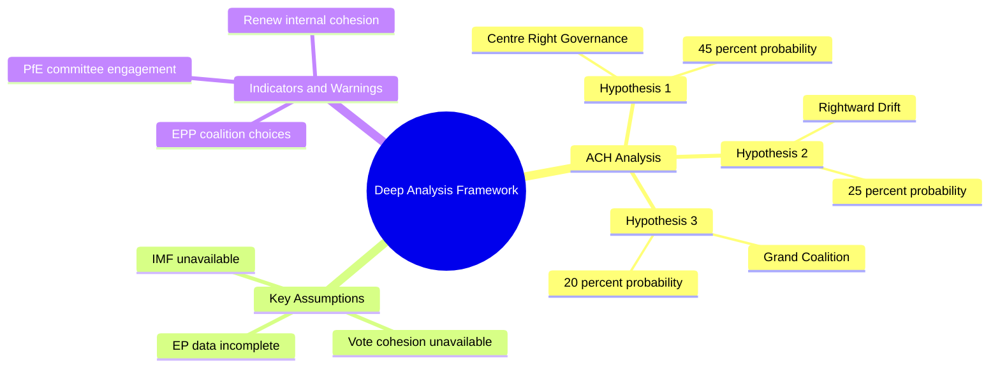

<!-- SPDX-FileCopyrightText: 2026 Hack23 AB -->
<!-- SPDX-License-Identifier: Apache-2.0 -->

# Deep Analysis: European Parliament Year Ahead (2026–2027)

**Produced:** 2026-05-10 · **Article Type:** year-ahead · **Confidence:** 🟡 MEDIUM

---

## Strategic Deep Analysis: The Structural Dynamics of EP10 Year Two

This deep analysis applies Structured Analytic Techniques — Analysis of Competing Hypotheses (ACH), Key Assumptions Check (KAC), and Indicators and Warnings (I&W) — to the European Parliament's year-ahead political and legislative environment (May 2026–May 2027).

---

## Part 1: Key Assumptions Check (KAC)

### Assumption 1: EPP Will Maintain the Cordon Sanitaire Coalition as Its Primary Strategy

**Current reliability:** 🟡 MEDIUM

**Evidence supporting this assumption:**
- EPP historically has recognised that legitimising far-right coalition partners (PfE, ESN) imposes reputational costs across 27 member states
- Metsola's EP Presidency publicly rejects far-right collaboration on values votes
- Von der Leyen II Commission mandate depends on S&D+Renew support in addition to EPP

**Evidence challenging this assumption:**
- EPP-ECR-PfE coalition on Safe Third Country (TA-10-2026-0026) and Safe Countries of Origin (TA-10-2026-0025) demonstrates that selective alignment is already occurring on migration
- Weber's pragmatic positioning has moved EPP noticeably rightward on agricultural policy
- In at least 3–4 member states (Austria, Italy, Hungary), EPP affiliates already govern in coalition with far-right parties at national level, normalising the relationship

**Conclusion:** The Cordon Sanitaire coalition assumption holds for EU-values files (rule of law, democratic norms) but is already being eroded on policy files (migration, agriculture). The "selective Cordon Sanitaire" model — maintaining far-right exclusion on values but accepting far-right alignment on policy — is the more accurate structural description.

### Assumption 2: Renew Europe Will Remain a Reliable Coalition Partner

**Current reliability:** 🔴 LOW

**Evidence supporting:**
- Renew has consistently supported Ukraine, digital regulation, and financial market reform
- Group leaders have reaffirmed Cordon Sanitaire commitment publicly

**Evidence challenging:**
- Renew's internal ideological diversity (FDP → macronists → Alde nationalists) generates persistent internal tension
- German FDP MEPs are increasingly aligned with regulatory simplification positions that challenge Renew's official "liberal pro-regulation" stance
- French macronist MEPs operating under domestic political pressure following legislative elections

**Conclusion:** This assumption requires systematic monitoring. A Renew fracture on a single high-profile vote (SFDR revision, AI Act liability) would trigger coalition recalculation across all major files.

### Assumption 3: Ukraine Support Will Remain the Parliament's Broadest Consensus Area

**Current reliability:** 🟢 HIGH

**Evidence supporting:**
- TA-10-2026-0010 (Loan for Ukraine) and TA-10-2026-0035 (Regulation) demonstrate sustained majority
- EPP, S&D, Renew, Greens, and significant ECR fractions consistently vote for Ukraine support
- Only PfE's Fidesz bloc and ESN routinely oppose

**Evidence challenging:**
- Growing fiscal fatigue arguments (particularly in CEE member states with close ties to Hungary)
- Budget December 2026 confrontation may create trade-offs between Ukraine funding and cohesion policy
- Peace-wing within Greens/EFA and The Left — potential fracture if war escalates into broader European conflict

**Conclusion:** This assumption is the most reliable in the entire assessment. Ukraine parliamentary support will hold through 2026–2027 unless extraordinary geopolitical shift occurs.

---

## Part 2: Analysis of Competing Hypotheses (ACH)

### Question: What will determine whether the Green Deal pipeline survives EP10?

**Hypothesis A: EPP Mainstream Holds — Green Deal Implemented in Weakened Form**

Probability: 40%

Under this hypothesis, EPP mainstream (Weber's majority within EPP) resists far-right pressure to fundamentally reverse Green Deal architecture. Agricultural exemptions are extended; automotive targets adjusted; SME thresholds expanded. But the core legislative architecture — CBAM, ETS expansion, SFDR, Nature Restoration — survives in functional form.

Evidence for: EPP has not formally proposed reversing the Paris Agreement alignment or withdrawing ETS; major business groups support predictability even in weakened form; Commission lobbied hard for Green Deal implementation during COP negotiations.

**Hypothesis B: EPP Rightward Drift — Green Deal Substantially Reversed**

Probability: 35%

Under this hypothesis, EPP's pragmatic rightward drift accelerates. National election pressures (particularly post-German Bundestag election dynamics with CDU/CSU dominating EPP's German delegation) push EPP toward ECR positions on Green Deal. CBAM exemptions expand; Nature Restoration Law revisions are fundamental; automotive CO2 targets postponed beyond 2035.

Evidence for: Safe Countries of Origin and migration votes demonstrate EPP's willingness to form right-wing majorities when issue salience is high; agricultural derogations in 2025 preceded a more general regulatory relaxation logic.

**Hypothesis C: Issue-by-Issue Fragmentation — Unpredictable Outcomes**

Probability: 25%

Under this hypothesis, no stable coalition forms around Green Deal as a package. Each file is contested independently. CBAM survives because business groups want it (level playing field). Nature Restoration fails because agricultural lobby is too strong. SFDR is deeply revised because ECON committee is EPP-Renew dominated. The result is an inconsistent Green Deal — some provisions stronger, some significantly weakened.

**Analytical Assessment:** Hypothesis C is most consistent with the structural reality of EP10's multi-coalition environment. The Green Deal will not be preserved or reversed as a package — it will be selectively dismantled and selectively preserved file by file, with outcomes driven by specific committee compositions and coalition availability.

---

## Part 3: Indicators and Warnings (I&W)

### I&W Framework: Signals for Scenario Evolution

**EPP RIGHTWARD DRIFT — Watch for:**
- 🚨 EPP committee coordinators voting 3+ consecutive times with ECR/PfE against S&D position
- ⚠️ EPP group formally invites PfE rapporteur onto a major file
- ⚠️ Weber makes public statement endorsing ECR/PfE coalition on economic file
- 📊 EPP internal group cohesion on ENVI votes falls below 70%

**RENEW FRACTURE — Watch for:**
- 🚨 Two or more Renew national delegations issue contradictory voting guidance on same file
- ⚠️ German FDP bloc (largest Renew delegation) formally abstains on group whip position
- ⚠️ Renew drops below 40 votes on a plenary majority that required their participation
- 📊 Renew effective size drops below 70 (group membership loss through departure or suspension)

**UKRAINE SUPPORT EROSION — Watch for:**
- 🚨 Budget vote dedicates less than 90% of Ukraine facility commitments vs. prior year
- ⚠️ ECR bloc abstains on Ukraine military assistance vote (vs. current pro-vote position)
- ⚠️ European Council communiqué on Ukraine weakens from "as long as it takes"
- 📊 Ukraine public support polling falls below 50% in 3+ major member states

**FAR-RIGHT INSTITUTIONALISATION ACCELERATION — Watch for:**
- 🚨 PfE MEP appointed as rapporteur on major legislative file
- ⚠️ EPP formally coordinates trilogue strategy with ECR on migration file
- ⚠️ PfE obtains committee chair position in any EP10 committee
- 📊 ESN grows beyond 30 seats through NI defections

---

## Part 4: Long-Form Strategic Assessment

### The EP10 Year Two Paradox: Fragmentation Enabling Ambition

There is a counterintuitive dynamic in EP10's second year that standard political analysis misses: the Parliament's extreme fragmentation (6.58 effective parties; no stable majority) paradoxically enables more ambitious legislative positioning on specific files.

When a bloc cannot form a stable majority, it is forced to negotiate substantively with coalition partners. Each partner extracts policy concessions. The legislative output is therefore richer in policy content — more provisions, more detailed regulations, more stakeholder-responsive frameworks — than a dominant majority that can legislate unilaterally. The EU's legislative quality on AI Act, GDPR, MiFID II, and Green Deal framework acts has historically benefited from this multi-actor negotiation requirement.

The risk is legislative delay and dilution — ambition without delivery. But for policy domains where international competitiveness and regulatory precision matter (AI, digital, financial services, pharmaceutical safety), EP10's fragmented coalition structure may produce more durable, technically sophisticated legislation than a hypothetical EPP majority parliament would.

### The Defence Integration Opportunity Window

The 2026–2027 window for European defence industrial integration is historically exceptional. Three simultaneous factors create rare alignment: (1) geopolitical necessity (Russian war); (2) U.S. strategic ambivalence (post-Trump trade posture); (3) national government willingness to fund (ReArm Europe €500 billion facility).

Parliament's institutional opportunity — and responsibility — is to build legislative frameworks for European defence cooperation (EDIS, OCCAR, EDA strengthening) that outlast the current geopolitical moment. The risk is that Parliament, in crisis mode, accepts intergovernmental defence architecture controlled by Council/EEAS, permanently reducing Parliament's co-legislative role in the most consequential EU policy domain of the 21st century.

### The Migration Governance Inflection

The adoption of Safe Countries of Origin and Safe Third Country concept resolutions signals a qualitative shift in Parliament's migration governance posture. These are not merely policy adjustments — they represent a structural rightward reorientation of Parliament's acceptable policy space on asylum and return. If PfE and ECR can consistently deliver these votes with enough EPP-Renew support, the Parliament's migration policy will diverge significantly from ECHR and UNHCR international standards.

This creates an unresolved tension: Parliament adopts tougher migration enforcement while simultaneously passing rule of law resolutions. The contradiction will crystallise in 2026–2027 when implementing regulations reach the LIBE committee and test whether the enforcement-first coalition can hold across both dimensions simultaneously.

---

*Source: European Parliament Open Data Portal (data.europarl.europa.eu) · Apache-2.0 · Hack23 AB 2026*

---

## Analytical Framework Map (Mermaid)

