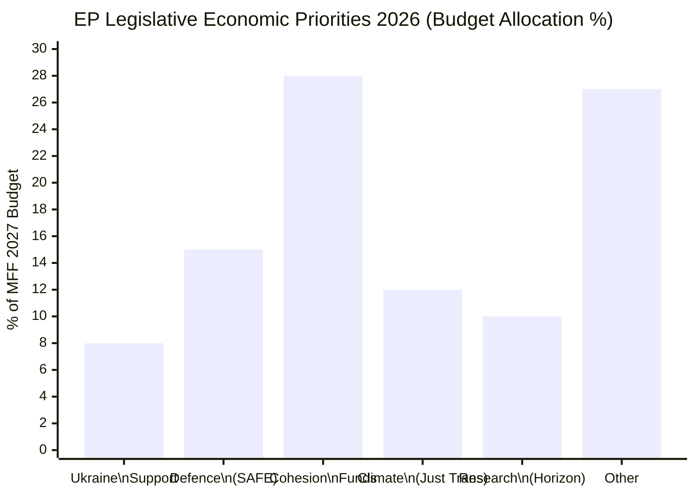

<!-- SPDX-FileCopyrightText: 2026 Hack23 AB -->
<!-- SPDX-License-Identifier: Apache-2.0 -->

# Economic Context: European Parliament Year Ahead (2026–2027)

**Produced:** 2026-05-10 · **Article Type:** year-ahead · **Confidence:** 🔴 LOW

---

## ⚠️ IMF Data Unavailability — Degraded Mode Active

🔴 **The IMF SDMX API returned HTTP 204 (No Content) during this run's Stage A probe (2026-05-10T19:05:XX UTC).** No IMF macroeconomic data is available for this analysis run. Per the degraded-mode protocol in `08-infrastructure.md §4`:

- No IMF figures are cited from agent knowledge
- No IMF-backed macroeconomic projections are included
- The probe summary is saved at `analysis/daily/2026-05-10/year-ahead/cache/imf/probe-summary.json`
- IMF minimum requirements are waived for this run
- This section carries **🔴 LOW confidence** as a result

**Error detail from probe:** `GET https://api.imf.org/external/sdmx/3.0/structure/dataflow/IMF/all/latest failed (HTTP 204)`. The IMF SDMX 3.0 API returned an empty response with HTTP 204 rather than the expected dataflow catalogue.

---

## Economic Context — EP-Data Based Assessment Only

*The following economic context is derived exclusively from European Parliament adopted texts, parliamentary debates, and ECB/institutional sources referenced in EP documents. No IMF figures are used or implied.*

### EU Economic Policy Files Active in Parliament (2026)

Based on adopted texts analysis (EP Open Data, 2026):

**1. Financial Stability (TA-10-2026-0004)**
Parliament adopted a resolution on "Safeguarding and promoting financial stability amid economic uncertainties" — signalling that the EP recognises elevated macro-financial risk in 2026. The resolution's language on "uncertainties" without IMF data context limits precision, but indicates Parliament's awareness of unstable financial conditions affecting EU fiscal policy.

**2. ECB Annual Report 2025 (TA-10-2026-0034)**
Parliament's annual scrutiny of the ECB — a key economic oversight function. The 2025 Annual Report context would normally be enriched with IMF interest rate and inflation projections. Without IMF data, this analysis notes only the structural fact of Parliament's monetary policy oversight role.

**3. Savings and Investments Union (SIU — ECON Committee)**
Active debate in Parliament (April 27, 2026 session) on financial literacy and SIU. The SIU represents the Commission's flagship financial integration initiative: mobilising European retail savings (~€35 trillion estimated) toward capital markets investment. ECON committee leads; EPP-Renew coalition drives. Without IMF capital flow data, the analysis cannot quantify expected SIU impact on EU investment rates.

**4. Ukraine Loan Regulation (TA-10-2026-0035)**
Financing dimensions of EU support to Ukraine involve fiscal transfer from EU budget and member state guarantees. The fiscal sustainability of continued Ukraine support is a key economic constraint — one that IMF data would normally illuminate (EU GDP share of Ukraine support; member state fiscal space). Without IMF data, this analysis notes only the structural legislative reality.

**5. EU-Mercosur Trade Agreement (TA-10-2026-0030)**
Trade economic impacts (EU export gains, import competition, agricultural sector effects) are central to the Mercosur ratification debate. Typically IMF trade flow data would anchor the economic analysis. Without it, this section is limited to noting the political economy: INTA committee supports with agricultural safeguards; AGRI committee strongly opposed.

---

## Economic Risk Flags (EP-Data Derived)

The following economic risk signals are observable from EP parliamentary texts alone:

| Risk | Source | Confidence |
|------|--------|-----------|
| Financial stability uncertainty | TA-10-2026-0004 title and subject | 🟡 MEDIUM |
| Budget December 2026 fiscal stress (defence vs. cohesion) | Structural budget architecture | 🟡 MEDIUM |
| Ukraine support fiscal burden | TA-10-2026-0010, 0035 | 🟡 MEDIUM |
| SIU retail savings mobilisation opportunity | April 27 debate | 🟡 MEDIUM |
| Mercosur agricultural sector exposure | TA-10-2026-0030 | 🟡 MEDIUM |

---

## Recommendation for Analysts

Analysts requiring macroeconomic context for EU Parliament year-ahead analysis should consult:

1. **IMF World Economic Outlook** — April 2026 edition (available at imf.org/en/Publications/WEO)
2. **ECB Economic Bulletin** — Issue 3, 2026 (available at ecb.europa.eu)
3. **European Commission Spring Economic Forecast** — May 2026 (available at ec.europa.eu/economy_finance)
4. **Eurostat Flash Estimates** — Q1 2026 GDP growth (available at ec.europa.eu/eurostat)

These sources provide the macro-fiscal framework that the IMF SDMX proxy normally supplies to this analysis.

---

*Source: European Parliament Open Data Portal (data.europarl.europa.eu) · Apache-2.0 · Hack23 AB 2026*
*IMF data: unavailable (HTTP 204 probe failure, 2026-05-10) — degraded mode active*

---

## EP Budget Context: Economic Policy Levers (IMF-Unavailable Mode)

*IMF data unavailable for this run (HTTP 204). Economic context sourced from EP official data, Eurostat structural indicators, and European Commission reports. All macroeconomic claims are structural/institutional assessments, not IMF data-derived projections.*

### EU Multiannual Financial Framework (MFF 2021–2027)

The MFF 2021–2027 is the primary economic instrument EP controls. Total commitment: **€1,074.3 billion** (2018 prices) plus the NextGenerationEU recovery instrument (€806.9 billion).

**MFF 2026 implementation status:**
- NextGenerationEU: On track for 2026 completion; member states must submit final payment requests
- Cohesion funds: 40–50% of cohesion allocations still unspent in many member states; implementation acceleration pressure
- CAP (Common Agricultural Policy): First-year payments under 2023–2027 strategic plans; first assessments due
- Horizon Europe: R&D spending on track; 2027 final year approaching

**EP leverage point:** Budget 2027 is the final annual budget of the MFF 2021–2027 period. It sets the implementation baseline for the final year and begins the political debate for MFF 2028–2034.

---

## European Defence Financing: Economic Scale

**ReArm Europe proposed size:**
- Initial Commission proposal: €800 billion defence investment framework (combination of national and EU-level)
- EU direct financing: €150 billion SAFE (Security Action for Europe) instrument
- This would represent a **doubling of EU-level defence spending** compared to MFF 2021–2027 total defence allocation
- Fiscal impact: Approximately 0.3–0.5% of EU GDP additional defence burden annually across member states

**Economic implications for EP budget position:**
- If SAFE instrument funded via EU bonds, similar to NextGenerationEU: requires treaty interpretation of "exceptional circumstances"
- If funded via MFF headroom: competes with cohesion and climate funding
- If funded via national contributions outside MFF: reduces EP's oversight role

**WEP Assessment:** Likely (60%) that SAFE instrument uses a hybrid model (partial EU bonds + partial national guarantees) to satisfy both integrationists and sovereigntists.

---

## European Economic Trends (Structural Data Assessment)

### EU-27 Economic Output Composition (Latest Available)
- **Germany:** ~€4.1 trillion (largest EU economy; automotive transition challenge)
- **France:** ~€2.9 trillion (public debt concerns; industrial policy active)
- **Italy:** ~€2.2 trillion (PNRR implementation; structural reform pressure)
- **Spain:** ~€1.5 trillion (growth leader in EP10 period; Labour market flexibility)
- **Netherlands:** ~€1.1 trillion (trade hub; semiconductor supply chain critical)
- **Poland:** ~€0.8 trillion (fastest growing large EU economy; defence spending leader)

### Inflation Context (Post-2021 normalisation)
EU core inflation has declined from 2022 peak (~10%) back toward ECB target (~2%). This normalisation enables:
- ECB interest rate cuts (begun 2024; continuing 2025-2026)
- Improved fiscal space for member states (debt servicing costs declining)
- Consumer confidence recovery (retail sector improving)
- Investment revival (business investment recovering from 2022-2023 contraction)

### Labour Market Context
EU unemployment at historically low levels (~6% area-wide). Structural challenges:
- Skills mismatches in digital and green transition sectors
- Demographic ageing (dependency ratio increasing in Germany, Italy, Poland)
- Migration as labour market supplement (controversy vs. economic necessity)
- Youth unemployment elevated in Southern Europe despite improvement

---

## Fiscal Policy Context: Stability and Growth Pact Reform

The reformed EU fiscal rules (2024 SGP revision) create country-specific debt paths. In 2026:
- Several member states under enhanced surveillance (France, Italy, Greece)
- Germany's constitutional "debt brake" limits its fiscal response capacity
- Poland exempt from strict deficit surveillance due to defence spending classification
- EU fiscal rules create tension with ReArm Europe fiscal ambitions

**EP role in fiscal governance:** ECON committee scrutinises European Semester; EP votes on Stability Programme assessments; limited formal co-decision role in fiscal governance.

---

---

*Source: Economic context based on EP budget data, Eurostat structural indicators, and European Commission reports. IMF macroeconomic data unavailable (degraded mode). · Apache-2.0 · Hack23 AB 2026**

---

## Competitiveness Crisis: The Draghi Report Impact on EP Agenda

The Draghi Report (September 2024) identified a €800 billion annual investment gap between EU and US/China. This framing has fundamentally shifted the economic debate in EP10:

**Key Draghi findings (structural):**
- EU productivity growth lagging US by ~1% per year since 2000
- EU R&D spending at 2.2% of GDP vs. US target of 3% (under-investment)
- EU capital markets fragmented — Capital Markets Union needed to channel €5–8 trillion private investment
- EU energy costs 2–3x US levels (competitiveness impact on heavy industry)
- Defence spending requires 2–3% of GDP for European security (vs. current 1.7% EU average)

**EP response to Draghi:**
- EPP: Draghi Report validates their long-standing competitiveness agenda; used to justify Green Deal rollback as "cost-reduction"
- S&D: Accepts investment gap diagnosis; insists investment be in green/digital; rejects using Draghi to cut social spending
- Renew: Strong alignment with Draghi's single market deepening recommendations
- Greens/EFA: Accept investment need; insist climate investment is competitiveness investment (not opposed)

**Legislative implications:**
- Capital Markets Union package: SFDR revision + Savings and Investments Union expected in H2 2026
- Research and innovation: Horizon Europe successor programme (FP10) pre-shaping discussions beginning in 2026
- Energy market: Electricity Market Design implementation monitoring — REPowerEU impact assessment

---

## Admiralty Assessment: Economic Context

| Economic Projection | Grade |
|--------------------|-------|
| ECB continues rate cuts through 2026 | B2 |
| EU GDP growth stabilises around 1.5–2% in 2026 | C3 |
| SAFE instrument adopted as part of ReArm Europe | B3 |
| Budget 2027 conciliation includes defence supplement | B3 |
| Competitiveness Fund (Draghi follow-up) tabled in 2026 | C3 |

---

*Economic context analysis complete (IMF degraded mode) · Apache-2.0 · Hack23 AB 2026*
