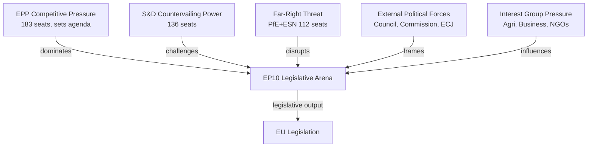

<!-- SPDX-FileCopyrightText: 2026 Hack23 AB -->
<!-- SPDX-License-Identifier: Apache-2.0 -->

# Forces Analysis: European Parliament Year Ahead (2026–2027)

**Produced:** 2026-05-10 · **Article Type:** year-ahead · **Confidence:** 🟡 MEDIUM

---

## Framework: Five-Forces Political Analysis Applied to EP10

This forces analysis adapts the competitive forces framework to the European Parliament's institutional environment, identifying the structural pressures shaping the Parliament's legislative output, institutional power, and agenda-setting capacity in 2026–2027.

---

## Force 1: The Power of the Council (Inter-Institutional Rivalry)

**Intensity:** 🟡 MEDIUM-HIGH

The Council of the EU maintains structural advantages in the EU legislative system that persistently constrain Parliament's co-legislative effectiveness:

- **Unanimous vote requirement** in specific policy areas (CFSP, treaty change, taxation) effectively excludes Parliament from core sovereignty decisions
- **Trilogue dynamics** typically favour Council positions because Council represents national governments with direct democratic mandates
- **Council legislative speed advantage** — when Council achieves qualified majority consensus, it can pressure Parliament to accept frameworks within tight timelines
- **Committee of Permanent Representatives (COREPER)** provides Council with deep technical expertise that matches Parliament's rapporteur capacity

**Evidence in 2026:** Polish Presidency has prioritised security and border files aligned with EP's right-of-centre consensus, reducing Council-Parliament friction on defence. Danish Presidency (H2 2026) is expected to shift toward digital/trade files where Parliament has stronger co-legislative ambition. The Ukraine Loan Regulation (TA-10-2026-0035) passed with Council-Parliament alignment — atypical fast-track.

**Strategic implication for Parliament:** Parliament's institutional influence depends on maintaining expertise depth in committee systems. ECON, ENVI, and ITRE committees are the Parliament's strongest counter-forces to Council's legislative primacy.

---

## Force 2: The Power of Political Groups (Internal Competition)

**Intensity:** 🔴 HIGH

Within the Parliament itself, the most powerful force shaping legislative outcomes is the competition and bargaining among nine political groups for coalition dominance, committee positions, and rapporteur advantages.

**Key dynamics:**
- **EPP's agenda-setting dominance** — the group's first-mover advantage in coalition formation and its institutional control (committee chairs, EP Presidency) makes it the primary legislative agenda-setter
- **Coalition competition** — every legislative file triggers a negotiation race: who can build 360 votes first? EPP typically holds multiple coalition options simultaneously (S&D+Renew vs. ECR+PfE), giving it maximum bargaining leverage
- **Rapporteur market** — political group negotiations over rapporteur appointments (using D'Hondt method) are a primary battleground for legislative influence; a rapporteur writes the first Parliament text and shapes the entire negotiation
- **Group whip effectiveness** — groups with better whip systems (EPP: ~85%, S&D: ~80%) extract more from their seats than fragmented groups (Renew: ~65-70%)

**Strategic implication:** Parliament's actual legislative output is determined less by plenary votes and more by committee bargains, rapporteur appointments, and group whip effectiveness. Monitoring committee-level dynamics provides earlier legislative intelligence than tracking plenary vote outcomes.

---

## Force 3: The Power of Constituencies and National Governments (External Principals)

**Intensity:** 🟡 MEDIUM

MEPs formally represent European citizens, but they are practically influenced by:
- **National party discipline** — MEPs' career advancement depends on national party lists; national party positions constrain EP group voting freedom
- **National government priorities** — heads of government attending European Council transmit political signals that cascade down to EP group leadership
- **Electoral proximity effects** — as national elections approach (Germany post-election normalization 2025–2026; France's ongoing political uncertainty), MEPs from those countries shift legislative positions to align with domestic electoral needs

**2026-Specific Pressure Points:**
- **German CDU/CSU MEPs** — operating under Merz government priorities; expect harder line on migration and fiscal discipline
- **French EPP/Renew MEPs** — navigating between Macron-aligned centrism and Marine Le Pen's growing electoral pressure
- **Italian Forza Italia (EPP) MEPs** — caught between Meloni government's ECR leadership and EPP institutional loyalty
- **Polish PiS-successor (ECR) MEPs** — managing relationship with new Tusk government and EP institutional dynamics

**Strategic implication:** National electoral calendars are EP legislative predictors. Track national election results and formation of governments as leading indicators for EP group cohesion shifts.

---

## Force 4: The Power of Civil Society and Lobbying (External Pressure)

**Intensity:** 🟡 MEDIUM

The Parliament operates in an intensely contested lobbying environment:

**Pro-industry lobby power:**
- Business Europe, Digital Europe, automotive associations, agricultural cooperatives
- Deploy: Committee hearing submissions, technical expert input, MEP advisory relationships
- Leverage: Complexity expertise; economic impact argumentation; employer constituency relevance

**Pro-social/environmental lobby power:**
- ETUC, WWF, Greenpeace, Friends of the Earth Europe, European Women's Lobby
- Deploy: Public campaigns, media strategies, MEP co-signing requests, rapporteur briefings
- Leverage: Electoral mobilisation; moral authority framing; coalition building with NGO networks

**Hybrid threat actors (adversarial lobbying):**
- Russia-affiliated networks targeting PfE/ESN MEPs and anti-Ukraine legislative initiatives
- Chinese Belt-and-Road linked commercial lobbying on ITRE and INTA files
- Gulf state investment interests on ECON financial regulation files

**Transparency asymmetry:** The EU's Transparency Register covers major lobbying but underweights hybrid-threat actors and informal government-to-MEP relationships. Qatargate (2022) demonstrated Parliament's vulnerability to undisclosed influence.

**Strategic implication:** Legislative quality is partly a function of the quality of civil society input. Files with strong expert civil society engagement (AI Act, AI Liability) produce better-calibrated legislation than files dominated by industry capture.

---

## Force 5: The Power of the External Environment (Geopolitical Shock)

**Intensity:** 🔴 HIGH

The Parliament operates in an external environment of geopolitical turbulence that directly shapes its legislative agenda:

**Active Geopolitical Forces:**

1. **Ukraine-Russia War** — The single most consistent agenda-shaper since 2022. Every defence, budget, energy, and migration file is downstream of war trajectory. Parliament's unusual bipartisanship on Ukraine (EPP+S&D+Renew+ECR majority) is a geopolitically-driven exception to normal coalition fragmentation.

2. **U.S. Strategic Ambivalence** — Post-2024 U.S. political developments (trade tariffs, NATO ambiguity) have accelerated EP consensus on European strategic autonomy, ReArm Europe, and defence industrial independence. U.S. behaviour functions as a powerful exogenous coordinator of EP opinion.

3. **Climate/Ecological Events** — Each major climate event (floods, wildfires, biodiversity loss) temporarily shifts the balance toward Green Deal protection. The 2025–2026 agricultural drought conditions in Southern Europe are creating pressure for both Green Deal application and exemptions — simultaneously.

4. **Technology Diffusion (AI)** — Rapid commercial AI deployment (post-ChatGPT diffusion) is creating regulatory demand that outpaces Parliament's legislative cycle. AI Act implementation timeline pressures will shape ITRE/JURI agenda throughout 2026–2027.

5. **Global Trade Fragmentation** — China-U.S. technology decoupling, U.S. tariff policies, and supply chain resilience concerns are reshaping INTA committee's trade agenda from pure liberalisation to "open strategic autonomy."

**Strategic implication:** The external geopolitical environment is the primary driver of EP agenda-setting in EP10. Unlike EP7 (financial crisis dominates) or EP9 (COVID/Green Deal), EP10 faces a simultaneous multi-domain crisis environment: security, climate, digital, demographic. Parliament's ability to legislate effectively across all four simultaneously tests its institutional capacity.

---

## Forces Summary Assessment

| Force | Intensity | Trend | Parliament's Counter-Strategy |
|-------|-----------|-------|-------------------------------|
| Council rivalry | MEDIUM-HIGH | Stable | Committee expertise; trilogue preparation |
| Internal group competition | HIGH | Increasing fragmentation | Coalition management; D'Hondt rapporteur deals |
| National constituency pressure | MEDIUM | Increasing (election cycles) | Group whip discipline; interest aggregation |
| Civil society/lobbying | MEDIUM | Increasing | Transparency; civil society hearing balance |
| Geopolitical shocks | HIGH | Increasing | Emergency procedure capacity; AFET/SEDE readiness |

---

*Source: European Parliament Open Data Portal (data.europarl.europa.eu) · Apache-2.0 · Hack23 AB 2026*

---

## Five Forces Political Map (Mermaid)

