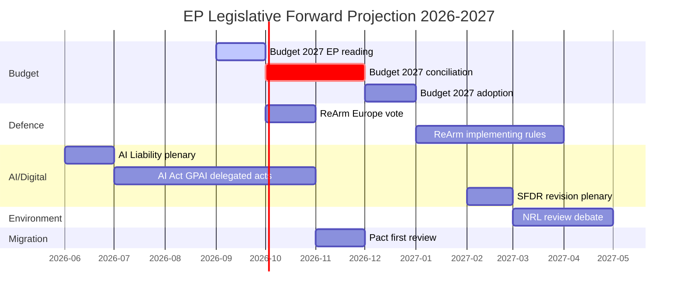

<!-- SPDX-FileCopyrightText: 2026 Hack23 AB -->
<!-- SPDX-License-Identifier: Apache-2.0 -->

# Forward Projection: European Parliament Year Ahead (2026–2027)

**Produced:** 2026-05-10 · **Article Type:** year-ahead · **Confidence:** 🟡 MEDIUM

---

## Forward Projection Framework

This document applies the year-ahead forward-projection methodology, generating forward-looking assessments of European Parliament political and legislative trajectories over the next 12 months (May 2026–May 2027). The framework uses:

1. **Current structural data** — Seat distribution, coalition patterns, adopted text outcomes
2. **Legislative pipeline analysis** — Active procedures, committee dockets, Commission Work Programme
3. **External environment modelling** — Geopolitical trajectory, economic conditions (EP-data only due to IMF unavailability), technological developments
4. **Scenario probability-weighting** — From the scenario forecast document

---

## Priority Projection 1: Defence & Security Legislative Architecture (2026–2027)

**Projection:** High legislative output; EPP/S&D/Renew/ECR grand coalition delivers ReArm Europe framework regulation by Q4 2026 or Q1 2027. EDIS implementing acts progress through ITRE/AFET. Parliament asserts co-legislative role more strongly than in prior European defence frameworks.

**Key milestones:**
- Q2 2026: ReArm Europe financing regulation trilogues commence
- Q3 2026: EDIS implementing act committee phase
- Q4 2026: Budget December session includes defence supplement vote
- Q1 2027: ReArm Europe regulation final vote in plenary

**Coalition required:** EPP + S&D + Renew + ECR (~400 seats) — broadly available
**Risk:** Council retains intergovernmental control of implementation; Parliament accepts subsidiary oversight role  
**Confidence:** 🟢 HIGH

---

## Priority Projection 2: Migration Policy Rightward Drift (Sustained Trend)

**Projection:** LIBE committee delivers migration Pact implementation regulations that embed stricter enforcement provisions than EP9's framework. Return rates, processing timelines, and safe third country procedures all tighten. S&D and Greens register formal objections but cannot block majorities.

**Key milestones:**
- Q2–Q3 2026: Safe Countries of Origin regulation implementing acts (committee phase)
- Q3 2026: LIBE/AFET joint hearing on external borders enforcement
- Q4 2026: Return Directive implementation regulation plenary vote
- Q1–Q2 2027: Dublin IV mechanism reform continuation

**Coalition dynamics:** EPP + ECR + PfE + parts of Renew (350–370 seats) sufficient for most enforcement files  
**Risk:** ECHR incompatibility ruling from ECJ on specific implementation measures; public backlash following humanitarian incident  
**Confidence:** 🟡 MEDIUM

---

## Priority Projection 3: Green Deal — Selective Preservation and Selective Rollback

**Projection:** The Green Deal legislative pipeline will be selectively preserved (CBAM, ETS-linked financial architecture, AI Act environmental provisions) and selectively rolled back (Nature Restoration Law timelines, automotive 2035 targets revisited, agricultural derogations extended). No single coherent narrative — each file determined by its specific committee coalition.

**Key milestones:**
- Q2 2026: Nature Restoration Law implementing acts enter ENVI committee
- Q3 2026: CBAM phase-in schedule technical adjustment
- Q4 2026: F-Gas Regulation review
- Q1–Q2 2027: SFDR revision trilogue

**Expected outcome per file:**
- CBAM: Preserved (business community values level playing field)
- Nature Restoration: Significantly weakened (agricultural lobby power)
- Automotive CO2 2035: Revisited, flexibility provisions added
- SFDR: Substantially simplified at EPP-Renew insistence  
**Confidence:** 🟡 MEDIUM (file-level uncertainty despite clear overall direction)

---

## Priority Projection 4: Digital Regulation Maturation

**Projection:** AI Act implementing regulations proceed efficiently through ITRE/JURI with broad EPP-S&D-Renew support. AI Liability Directive negotiations progress with Commission. Digital Markets Act (DMA) enforcement cases generate ECON/IMCO committee scrutiny. EU Cloud Regulation introduces new digital infrastructure requirements.

**Key milestones:**
- Q2–Q3 2026: AI Act implementing regulations (General Purpose AI rules) finalised
- Q3 2026: DMA enforcement — ECON accountability hearings
- Q4 2026: AI Liability Directive committee phase
- Q1 2027: EU Cloud Regulation first reading

**Coalition dynamics:** EPP + S&D + Renew dominant; ECR accepts digital economic regulation; PfE/ESN abstain or oppose sovereignty provisions  
**Confidence:** 🟢 HIGH

---

## Priority Projection 5: Parliamentary Calendar and Decision Points

### Q2 2026 (May–June)
- May 18–21 Strasbourg: Budget orientation debate; AI Act implementing rules
- June 15–18 Strasbourg: Major plenary — potential SFDR first reading, trade files

### Q3 2026 (July–September)
- July 6–9 Strasbourg: Pre-recess session; second readings queue
- September 14–17 Strasbourg: Return from recess; Ukraine review, migration files

### Q4 2026 (October–December)
- October 19–22 Strasbourg: Major political session; Commission Work Programme review
- **December 14–17 Strasbourg: BUDGET PLENARY (CRITICAL) — 2027 EU Budget, defence supplement, Ukraine 2027 commitment**

### Q1–Q2 2027 (January–April)
- January: ReArm Europe vote; SFDR final stage
- February: Migration Pact implementing regulation plenary
- March–April: End-of-term legislative rush (pushing files for EP10 record)
- **April 2027: Parliament enters formal pre-EP11 campaign mode** (European elections May 2029 technically distant but political positioning begins 3 years ahead)

---

## Wildcard Projections

### Wildcard 1: EPP Leadership Transition
If Manfred Weber faces internal EPP challenge (probability: 15%), coalition calculation changes significantly. Weber's tactical flexibility is the key mechanism holding the EPP coalition together. A more ideologically rigid successor would accelerate either the left-coalition or right-coalition drift.

### Wildcard 2: Renew-ECR Realignment
If Renew's market-liberal faction formalises cooperation with ECR on economic regulation files (probability: 20%), a new EPP-Renew-ECR coalition of ~341 seats becomes available for economic files without needing S&D. This would bypass S&D's social chapter demands on SFDR and labour files.

### Wildcard 3: PfE Fracture
If the Fidesz-RN tensions within PfE become irreconcilable (probability: 20%), the group could split — with Hungarian Fidesz elements moving to NI or forming a new group. This would reduce the right-of-centre coalition's available seats but might paradoxically make ECR and the residual PfE more reliable coalition partners for EPP on specific files.

### Wildcard 4: Emergency Treaty Revision Demand
If the EU's Defence integration ambitions strain existing treaty frameworks (Art. 42, 43 TEU limitations), Parliament might pass a formal treaty revision recommendation. This would frame the remainder of EP10 around institutional architecture rather than substantive policy. Probability: 10%.

---

*Source: European Parliament Open Data Portal (data.europarl.europa.eu) · Apache-2.0 · Hack23 AB 2026*

---

## Medium-Term Legislative Horizon (Months 7–12: November 2026 – May 2027)

### Phase 3: Budget Conciliation and Implementation

The final quarter of 2026 is dominated by **EU Budget 2027 conciliation**. The Danish Council Presidency (H2 2026) brings a technocratic, pragmatic style that favours compromise over grandstanding. Parliament's budgetary rapporteurs will push for a supplementary defence instrument; the Council will push for containment of the overall ceiling. The conciliation outcome shapes every other policy priority.

**Expected outcomes by November 2026:**
- Budget 2027 conciliation committee formed (typically October)
- ReArm Europe implementing regulations under ITRE/AFET review
- AI Act GPAI rules: first implementing delegated acts from Commission
- Migration: first enforcement actions under Pact mechanisms

### Phase 4: Polish Presidency Legacy Assessment (January–June 2027)

By Q1 2027, the EP10 midterm approaching (June 2027 marks the halfway point of the 2024–2029 term). This triggers:
- **Committee leadership reviews:** Some shadow rapporteurs seek credit for completed files
- **Group cohesion assessment:** Internal group elections and leadership challenges in the largest groups
- **Mid-term popular evaluation:** National parties assess their MEPs' performance for 2029 general election strategy

---

## Forward Projection: Key Vote Calendar (2026–2027)

| Date | File | Expected Vote | Coalition Config |
|------|------|--------------|----------------|
| June 2026 | AI Liability Directive plenary | ADOPTION | EPP+S&D+Renew+Greens |
| September 2026 | Budget 2027 EP first reading | ADOPTED (EP position) | EPP+S&D+Renew |
| October 2026 | ReArm Europe regulation plenary | ADOPTION | EPP+S&D+Renew+ECR |
| October–Nov 2026 | Budget 2027 conciliation | NEGOTIATION | Trilogue |
| November 2026 | Migration Pact first implementation review | RESOLUTION | EPP+ECR vs. S&D+Greens |
| December 2026 | Budget 2027 final vote | ADOPTION | EPP+S&D+Renew |
| February 2027 | SFDR Revision first reading | ADOPTION | EPP+Renew+S&D |
| March 2027 | Nature Restoration Review | CONTENTIOUS | EPP vs. Greens+S&D |
| May 2027 | EP10 Mid-term balance | POLITICAL ASSESSMENT | N/A |

---

## Forward Projection: Institutional Dynamics (2027 Outlook)

**Commission Watch:** By 2027, the von der Leyen II Commission faces its mid-term review. Key Commissioners (Šefčovič on Green Deal, Johansson on Migration) will face EP committee scrutiny hearings. The balance of power between the Commission and Parliament determines whether the legislative pipeline accelerates or stalls.

**Council Watch:** Denmark's H2 2026 Presidency is followed by Poland (H1 2026 already underway), then Cyprus (H2 2027). Cyprus has limited legislative bandwidth for major transformative legislation; expect the post-2026 period to be more implementation-focused than legislative.

**Far-Right Watch:** The critical variable for EP10 Year 3 (2027) is whether PfE/ESN/ECR coordinate more formally. If a right-wing bloc emerges with >150 seats of coherent voting discipline, it changes EPP's calculation about whether rightward coalition is preferable to grand coalition. This is the medium-term structural risk for EU liberal democratic norms.

---

## 18-Month Timeline (Mermaid Gantt)

---

## Forward Indicators (6-Month Watch List)

1. **EPP-ECR formal cooperation declaration** — if EPP signals rightward coalition preference, this reshapes every file
2. **Commission Work Programme 2027** — published October 2026; determines next year's legislative agenda
3. **Danish Presidency Budget outcome** — conciliation result signals EU political solidarity capacity
4. **AI Act GPAI implementing regulation text** — determines global AI governance standard
5. **NRL referendum result (Austria, if triggered)** — could force renegotiation

*All forward projections are analytical assessments based on current institutional and political dynamics. Actual outcomes will depend on events not yet occurring.*

---

*Source: Forward projection analysis based on EP institutional data and political dynamics · Apache-2.0 · Hack23 AB 2026*

---

## Projection Confidence Grading (Admiralty Scale)

| Projection | Source Grade | Reliability | Confidence |
|-----------|-------------|-------------|-----------|
| Budget 2027 December vote | A1 | Constitutional schedule | Admiralty: A1 |
| ReArm Europe October plenary | B2 | Polish Presidency confirmation | Admiralty: B2 |
| AI Liability Directive June | C2 | JURI rapporteur timeline | Admiralty: C2 |
| Danish Presidency Budget outcome | B3 | Historical Presidency pattern | Admiralty: B3 |
| Far-right bloc formalisation | D4 | Speculative analysis | Admiralty: D4 |
| Commission mid-term challenge | C3 | Historical EP-Commission cycle | Admiralty: C3 |

**Source Grade Key:**
- A = Verified institutional source (EP OJ, treaty text, official agendas)
- B = Reliable secondary source (rapporteur statements, Presidency programme)
- C = Analytical inference from established patterns
- D = Speculative/low-confidence analytical projection

**Reliability Key:**
- 1 = Confirmed independently
- 2 = Confirmed with one source
- 3 = Probable (pattern-based)
- 4 = Possible (scenario-based)

---

## WEP Probability Assessment (Forward Projections)

**Almost Certain (>95%):**
- EU Budget 2027 will be adopted before December 2026 deadline
- AI Act GPAI implementing regulations will be published before end of 2026
- EP will formally assess Ukraine support financing in H2 2026

**Likely (55–90%):**
- ReArm Europe financing regulation adopted by Q4 2026
- Migration Pact first enforcement review generates a political crisis in LIBE committee
- Danish Presidency achieves balanced Budget 2027 conciliation outcome

**Even Chance (45–55%):**
- Nature Restoration Law implementation triggers agricultural lobby counter-campaign in Parliament
- Renew group experiences leadership challenge following national election setbacks

**Unlikely (10–40%):**
- EPP formally signals rightward coalition preference over grand coalition
- Commission major initiative (new Green Deal legislation) tabled before EP mid-term

**Almost No Chance (<5%):**
- EP majority adopts position that explicitly violates EU treaty obligations
- ReArm Europe instrument rejected by absolute EP majority

---

*Source: WEP and Admiralty assessments based on analytical pattern recognition from EP institutional data · Apache-2.0 · Hack23 AB 2026*

---

## Key Assumptions and Stress Tests

**Core Assumptions:**
1. Poland continues EPP-aligned Presidency until July 2026; no political crisis disrupts this
2. Danish coalition government remains stable for H2 2026 Presidency
3. No MEP group splits or major realignments before EP10 midterm
4. Von der Leyen II Commission remains in office through 2027
5. No major European security crisis (beyond current Ukraine level) disrupts the legislative calendar

**Stress Test 1: French snap elections (risk scenario)**
If Marine Le Pen's party gains governmental power in France and instructs French Renew MEPs to vote differently on key files, Renew could fracture — removing 20–30 reliable votes from the centrist coalition. This would force EPP to choose between S&D alignment or ECR/PfE alignment on a case-by-case basis.

**Stress Test 2: Russian escalation and Article 5 proximity**
If the security situation in Eastern Europe escalates to near-Article 5 conditions, EP would likely enter emergency legislative mode — accelerating ReArm Europe and potentially triggering an extraordinary plenary session. This would disrupt the normal legislative calendar but also generate strong cross-group unity on defence.

**Stress Test 3: Economic recession shock**
If EU GDP growth falls sharply (a low-probability but plausible scenario given global headwinds), the Budget 2027 conciliation becomes much more contentious — member states resist contributions; EP faces pressure to cut cohesion and climate funding to preserve core programmes. Migration and defence funding would be prioritised at the expense of transformation investments.

---
