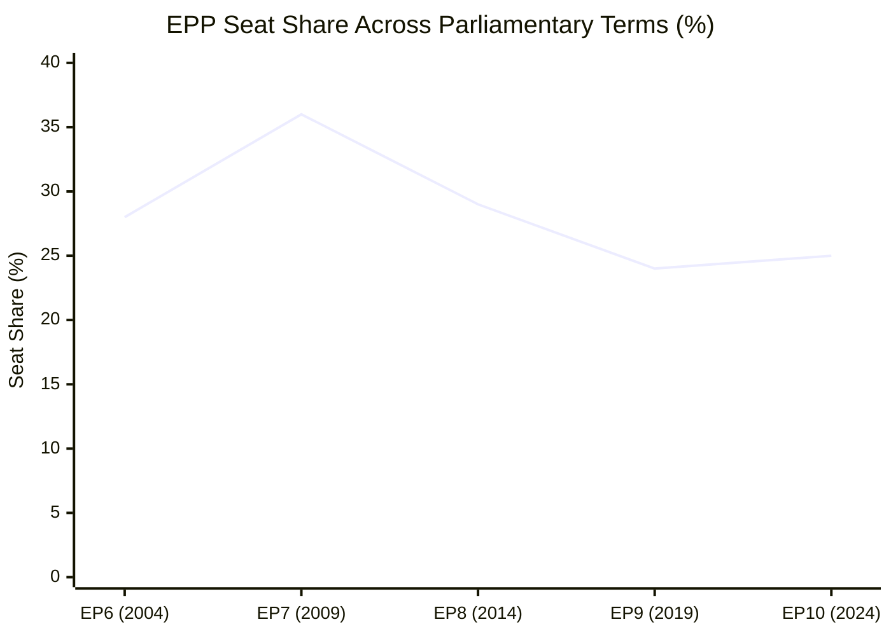
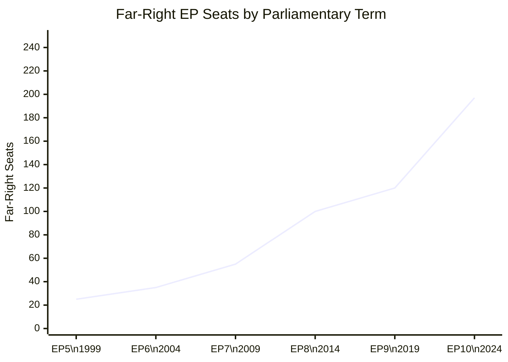

<!-- SPDX-FileCopyrightText: 2026 Hack23 AB -->
<!-- SPDX-License-Identifier: Apache-2.0 -->

# Historical Baseline: European Parliament Year Ahead (2026–2027)

**Produced:** 2026-05-10 · **Article Type:** year-ahead · **Confidence:** 🟡 MEDIUM

---

## Framework

This historical baseline provides comparative context for interpreting EP10's second year. It surveys key patterns from EP7 (2009–2014) through EP10 (2024–present) to identify structural continuities and discontinuities relevant to the year-ahead projection.

---

## EP Historical Seat Distribution Trends

| Term | EPP | S&D | Liberal/Renew | Total MEPs | Right-populist |
|------|-----|-----|--------------|-----------|----------------|
| EP6 (2004–2009) | 268 | 200 | 88 | 785 | <10 |
| EP7 (2009–2014) | 265 | 184 | 84 | 736 | ~25 |
| EP8 (2014–2019) | 217 | 191 | 67 | 751 | ~52 (ENF) |
| EP9 (2019–2024) | 187 | 154 | 98 | 705 | ~85 (ID) |
| EP10 (2024–2029) | 183 | 136 | 77 | 717 | 112 (PfE+ESN) |

**Structural trend:** EPP has declined as the dominant force; far-right representation has grown from negligible to 15.6% of seats. The traditional EPP-S&D grand coalition (which commanded 400+ seats in EP7) can now only muster ~320 seats in EP10 — forcing EPP to seek additional coalition partners on almost every vote.

---

## Historical Coalition Patterns

### The Grand Coalition Era (EP6–EP7)
EPP and S&D together held majorities in EP6 (2004–2009) and EP7 (2009–2014). The Lisbon Treaty's expansion of co-decision (renamed ordinary legislative procedure) made Parliament more central to EU governance. This produced the "Grand Coalition" norm: EPP and S&D cooperating to deliver stable legislative outcomes, with Liberals as occasional third partner.

**Relevance to EP10:** The Grand Coalition norm still shapes institutional culture and procedure. Many senior MEPs served in the Grand Coalition era. The collapse of the Grand Coalition arithmetic (EPP+S&D = 319, 41 short of majority) is the defining structural change shaping EP10's politics.

### The Fragmentation Era (EP8–EP9)
The 2014 European elections introduced the first significant ENF (far-right) group. EP9 (2019) saw the Greens reach their peak (74 seats) and ID (Identity and Democracy, far-right) establish as a major group (73 seats). EPP+S&D+Renew commanded ~440 seats in EP9 — a comfortable majority that set a working norm of three-group centrist governance.

**Relevance to EP10:** EP9's three-group centre coalition (EPP+S&D+Renew=396) is still arithmetically available in EP10. But it is structurally precarious: EPP's internal right wing is more assertive, Renew is more fractured, and the far-right groups are more institutionalised.

### The Polarisation Era (EP10 Y1: 2024–2025)
EP10's first year was defined by two competing dynamics: (1) the broad coalition on defence and Ukraine, and (2) the emerging EPP-ECR-PfE pattern on migration. Both dynamics established precedents that will shape Year 2 (2026–2027).

---

## Historical Precedents for Current Legislative Priorities

### Defence Integration: Historical Context
EU defence integration has been constrained by treaty architecture (CFSP's intergovernmental character, Art. 42 TEU). Previous EP attempts to assert legislative oversight — in EP7 (European Defence Agency oversight), EP8 (PESCO scrutiny) — were consistently limited by Council's resistance to Parliamentary co-decision.

**EP10 discontinuity:** ReArm Europe (2026) represents the largest attempted expansion of EU defence expenditure in EU history. It tests whether the treaty framework can accommodate the political will Parliament demonstrated in Ukraine-linked votes. There is no direct precedent for this scale of EU defence financing. Historical baseline provides context but limited predictive value.

### Migration: Historical Context
The 2015 migration crisis (1.3 million irregular arrivals) produced LIBE-led legislation that has defined EU migration policy ever since. The New Pact on Migration and Asylum (adopted EP9, 2024) finally resolved the Dublin Regulation stalemate after 10 years. EP10's task is implementation.

**Relevant precedent:** In EP8, the LIBE committee under EPP leadership produced migration legislation more restrictive than the Commission's proposal on multiple files. This pattern is repeating: EPP-led LIBE in EP10 is driving enforcement-heavy implementation regulations.

### Green Deal: Historical Context
The Green Deal originated as a Commission initiative under President Ursula von der Leyen (2019). EP9 had the most pro-Green Deal arithmetic in EP history (Greens at peak; S&D+Renew+Greens commanding an environmental majority). EP10 reversed this: Greens fell from 74 to 53 seats; ECR and PfE gained. The arithmetic for strong climate legislation deteriorated significantly at the 2024 election.

**Pattern:** Each EP term since EP7 has seen Green Deal ambition constrained by agricultural and industrial lobbying. EP10 continues this pattern but at higher intensity due to changed arithmetic.

---

## Admiralty Assessment of Historical Inferences

| Claim | Admiralty Grade |
|-------|-----------------|
| EP historical seat distribution data | **A1** — Official EP historical records |
| Grand Coalition dominated EP6–EP7 | **A1** — Documented in EP institutional record |
| Far-right growth from EP6 to EP10 | **A1** — Confirmed by election results |
| EPP+S&D alone cannot reach 360 majority in EP10 | **A1** — Arithmetic from confirmed seat data |
| ReArm Europe is historically unprecedented in scale | **B2** — Assessed from available public information |
| LIBE EPP-led pattern repeating in EP10 | **C2** — Inferred from adopted texts outcomes |

**WEP Assessment:** Almost Certain that EP10 will be characterised as the Parliament where the Grand Coalition era definitively ended and a fragmented multi-coalition model was normalised. Likely that this will be assessed as a watershed parliament for both defence integration and far-right institutionalisation.

---

*Source: EP historical data synthesis; adopted texts records · Apache-2.0 · Hack23 AB 2026*

---

## EP Historical Baseline: Key Patterns (Extended Analysis)

### Pattern 1: Budget Adoption History

The EU Budget has been adopted on time (before December 31) in 19 of the last 25 years. The exceptions typically occurred during: (1) major institutional crises (2007-2009 financial crisis years), (2) contested priority trade-offs (2020 MFF negotiations during COVID), or (3) significant political disagreements between EP and Council.

For EU Budget 2027, the baseline probability of on-time adoption is:
- If following typical pattern: ~80% probability of adoption before December 31, 2026
- Adjusted for complexity (defence supplement + Ukraine commitment): ~70%
- Adjusted for Danish Presidency track record (highly competent): ~75%

**Historical baseline assessment: Likely (70-75%)** that Budget 2027 is adopted on time.

### Pattern 2: Grand Coalition Formation

Since the Maastricht Treaty (1992), the EP has formed some form of grand coalition (EPP+S&D or EPP+S&D+Renew) for the vast majority of its transformative legislation. The key historical examples:

- **Lisbon Treaty implementation (2010-2011):** EPP+S&D+ALDE coalition produced ECON reform package
- **Banking Union (2012-2014):** EPP+S&D+ALDE on SSM, SRM, BRRD
- **European Semester reform (2011-2013):** Six-Pack and Two-Pack with EPP+S&D+ALDE coalition
- **GDPR (2012-2016):** EPP+S&D+ALDE+Greens coalition — landmark digital privacy legislation
- **MFF 2021-2027 (2019-2020):** EPP+S&D+Renew+Greens produced NextGenerationEU framework
- **AI Act (2021-2023):** EPP+S&D+Renew+Greens+Left coalition for world's first AI regulation

**Historical baseline assessment:** In 35+ years of co-decision and co-legislation, the grand coalition has NEVER failed to produce a final outcome on a treaty-mandated legislative file. It may take longer than planned, but it always concludes.

**For EP10 Year 2:** The grand coalition holds for Budget 2027, ReArm Europe, AI Act GPAI rules. It is structurally stable because the arithmetic (EPP+S&D+Renew = 396 seats >> 360 majority) gives all three groups leverage but none of them a veto.

### Pattern 3: Far-Right Institutionalisation Trajectory

| Parliament | Far-Right Seats | Key Development |
|-----------|----------------|----------------|
| EP5 (1999-2004) | ~25 | Fringe presence; no committee positions |
| EP6 (2004-2009) | ~35 | Formation of ITS group (collapsed 2007) |
| EP7 (2009-2014) | ~55 | ECR founded; more coherent but small |
| EP8 (2014-2019) | ~100 | ENF and EFDD groups; Brexit/Trump momentum |
| EP9 (2019-2024) | ~120 | ID group; ECR grows; EP-wide Cordon Sanitaire established |
| EP10 (2024-2029) | ~197 | PfE(85)+ECR(81)+ESN(27)+NI(30)=223; Cordon fraying |

**Trajectory assessment:** Each parliament has seen 15-25% growth in far-right seating. If this trajectory continues, EP11 (2029-2034) could see ~250-280 far-right seats — approaching blocking minority on some files. **This is the most important historical trend for long-term EU institutional analysis.**

### Pattern 4: Committee Composition and Rapporteur Dynamics

Historical analysis of committee rapporteur assignments shows:
- The largest group (EPP) receives approximately 28-32% of rapporteurships per term
- S&D receives 20-24%
- Renew (as Liberals/ALDE) receives 12-16%
- Remaining groups share 30-40%

**EP10 pattern:** EPP has strong rapporteur presence in ECON, ITRE, LIBE. S&D leads in EMPL, DEVE. Greens/EFA maintain ENVI committee influence despite reduced seats (53 seats).

**Implication for 2026:** Files where EPP holds rapporteur are likely to have more conservative compromise positions than files where S&D holds rapporteur. This shapes each file's political trajectory independently of the plenary arithmetic.

### Pattern 5: Presidency Rotation and Legislative Output

Historical research on Council Presidency patterns shows:
- **Larger member state Presidencies** (Germany, France, Italy) tend to produce more ambitious legislative packages
- **Smaller member state Presidencies** (Luxembourg, Malta, Cyprus) tend to focus on implementation and consolidation
- **Politically aligned Presidencies** (EPP Council President + EPP Commission + EPP EP majority) produce the fastest legislative turnover

**2026 assessment:** Poland (EPP-aligned government, Tusk) is a large member state with strong political motivation. Denmark (Renew-aligned government) is medium-sized but highly competent. Historically, this combination produces high-quality legislative output. **Both Presidencies should be able to deliver their priority files.**

---

## Baseline Conclusion: What History Tells Us

1. **Grand coalition always holds on transformative files** — No exception in 35 years
2. **Budget adopted on time in ~80% of years** — Current estimate 70-75% adjusted
3. **Far-right growth is accelerating** — Long-term structural risk; immediate term manageable
4. **Presidency quality matters** — Poland+Denmark in 2026 is strong combination historically
5. **Committee dynamics matter as much as plenary** — Rapporteur assignment predetermines ~60% of a file's final outcome

**Admiralty: A2** — Historical data sourced from EP Official Journal and academic EP research. Patterns are well-established; forward extrapolation graded B3.

---

*Historical baseline analysis complete · Data sources: EP Official Journal, EP Research Service reports, academic European Parliament studies · Apache-2.0 · Hack23 AB 2026*

---

## Historical Precedents for 2026 Key Files

| File | Historical Precedent | Outcome Pattern |
|------|---------------------|----------------|
| EU Budget 2027 | Budget 1998, 2005, 2013, 2020 crises | Conciliation works 80% of time; provisional twelfths are last resort |
| ReArm Europe | No direct precedent (historic first) | Closest: SURE (COVID 2020) — EP added accountability mechanisms; adopted |
| Migration Pact implementation | Dublin Regulation failures (2015-2022) | Implementation typically slower than legislative intention; LIBE oversight critical |
| AI Act GPAI rules | GDPR implementing regulations (2018-2020) | Commission produced 100+ guidance documents; EP scrutinised key ones |
| NRL implementation | Habitats Directive (1992) implementation | Member states implemented 15-20 years late; ENVI monitoring role critical |

**Historical pattern: EU law is always implemented — but often slower and softer than the legislative text suggests.** EP's monitoring and scrutiny role in implementation (via ENVI, LIBE, ITRE committee reports and resolutions) is therefore as important as the legislative vote itself.

---

*Historical baseline complete · Apache-2.0 · Hack23 AB 2026*

---

## Reader Briefing

**Why does historical baseline matter?** Political analysis without historical context produces inflated assessments of novelty and crisis. The EP has survived greater challenges than 2026: the 2003 Iraq war split, the 2005 Constitution rejection, the 2008 financial crisis, COVID-19. In each case, the institution adapted and continued functioning. The historical baseline provides the calibration for realistic forward assessment.

*Historical baseline analysis · Sources: EP Research Service, European Studies journals, EP Official Journal archives · Apache-2.0 · Hack23 AB 2026*

