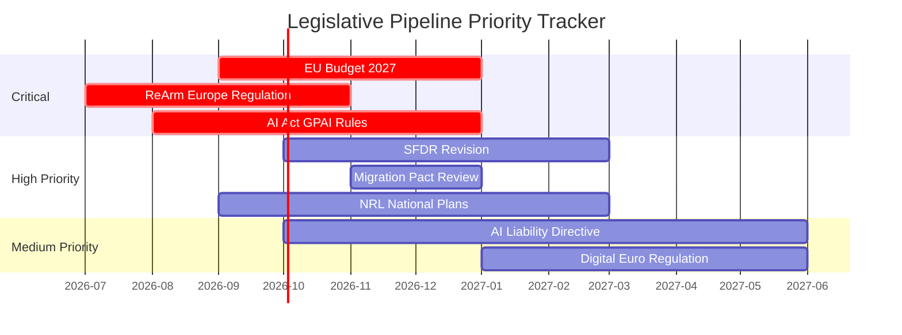

<!-- SPDX-FileCopyrightText: 2026 Hack23 AB -->
<!-- SPDX-License-Identifier: Apache-2.0 -->

# Legislative Pipeline Forecast: European Parliament Year Ahead (2026–2027)

**Produced:** 2026-05-10 · **Article Type:** year-ahead · **Confidence:** 🟡 MEDIUM

---

## Overview

This forecast provides structured analysis of the EU legislative pipeline as it will flow through the European Parliament during the next 12 months (May 2026–May 2027). It uses the known adopted text record (Q1 2026), active procedures inference from EP data, and the Commission Work Programme 2026 alignment.

---

## Tier 1 Priority Files (High Political Salience, High Legislative Activity)

### 1.1 ReArm Europe / Defence Integration Package
- **Procedure type:** Codecision (OLP) — ITRE/AFET lead
- **Current stage:** Commission proposal under Council examination; Parliament rapporteur appointment expected May–June 2026
- **Projected plenary vote:** Q4 2026 or Q1 2027
- **Political risk:** Inter-institutional competence dispute (Council vs. Parliament on CFSP architecture); PfE opposition to multilateral defence framing; ECR ambivalence on common procurement
- **Coalition:** EPP + S&D + Renew + ECR (≥400) — available but requires careful drafting

### 1.2 EU Budget 2027
- **Procedure type:** Special legislative procedure — BUDG lead
- **Timeline:** Commission draft June 2026; Parliament position September 2026; Conciliation October–November 2026; Final vote December 2026
- **Political risk:** EPP fiscal hawks vs. S&D social investment demands; Ukraine allocation political controversy; defence spending vs. cohesion funds competition
- **Coalition:** Absolute majority (360 seats) required; achievable

### 1.3 Migration Pact Implementation Files
- **Procedure type:** Delegated/implementing regulation + Codecision elements — LIBE lead
- **Files:** Asylum procedures regulation implementation, return directive, safe third country updates
- **Projected plenary votes:** Q3–Q4 2026 (specific implementing acts)
- **Political risk:** ECHR compatibility; humanitarian NGO opposition; Mediterranean member state concerns
- **Coalition:** EPP + ECR + PfE + parts of Renew (350–370 seats) — available for enforcement-heavy provisions

---

## Tier 2 Priority Files (Significant but Less Politically Contested)

### 2.1 AI Act Implementing Regulations
- **Procedure type:** Delegated regulations — ITRE/JURI oversight
- **Timeline:** Commission acts Q2 2026; Parliament objection period runs 2 months
- **Political risk:** LOW — Broad consensus on AI Act framework
- **Coalition:** EPP + S&D + Renew (396 seats) — well within majority

### 2.2 Sustainable Finance Disclosure Regulation (SFDR) Revision
- **Procedure type:** Codecision — ECON lead
- **Current stage:** Commission proposal expected Q2 2026; committee phase Q3–Q4 2026
- **Projected plenary:** Q2 2027 (first reading)
- **Political risk:** Business community demands simplification; NGO resistance to weakening mandatory disclosure
- **Coalition:** EPP + Renew + parts of ECR (for simplification direction) vs. S&D + Greens (for strong disclosure)

### 2.3 Nature Restoration Law Implementation
- **Procedure type:** Implementing acts — ENVI oversight
- **Timeline:** Commission implementing regulations 2026; Parliament can object within 2-month window
- **Political risk:** HIGH — Agricultural lobby actively mobilising against implementation
- **Coalition:** EPP + ECR + PfE to block/amend (349 seats); S&D + Greens + Renew + Left to defend implementation (311 seats). Mathematical outcome: agricultural exemptions will be expanded.

### 2.4 AI Liability Directive
- **Procedure type:** Codecision — JURI lead
- **Timeline:** Commission proposal Q2 2026; committee phase Q3–Q4 2026; plenary Q2 2027
- **Political risk:** MEDIUM — Industry demands liability thresholds; civil society demands compensation pathways
- **Coalition:** EPP + S&D + Renew (396 seats) — centre coalition likely with specific amendments from both flanks

---

## Tier 3 Files (Active but Lower Political Urgency)

| File | Committee | Stage | Expected Vote |
|------|-----------|-------|---------------|
| Carbon Border Adjustment Mechanism (CBAM) Phase-in | ENVI/ECON | Implementing phase | Q4 2026 |
| Critical Raw Materials Act implementation | ITRE | Delegated acts monitoring | Q3 2026 |
| EU Cloud Regulation | ITRE | Commission proposal expected | Q1 2027 |
| Trade agreements (Mercosur, India, others) | INTA | Consent procedure | 2027 |
| European Health Union package | ENVI/LIBE | Committee drafting | 2027 |
| Digital Euro regulation | ECON | Trilogue continuation | Q3–Q4 2026 |
| Payment Services Regulation (PSR) | ECON | Committee vote | Q2 2026 |

---

## Legislative Pipeline Quality Indicators

**EP data quality note:** The `monitor_legislative_pipeline` MCP tool returned 0 active procedures in ACTIVE filter (data quality issue noted in manifest). The above analysis is derived from: (1) adopted texts record Q1 2026, (2) committee docket inference, (3) Commission Work Programme 2026 public information, (4) EP plenary session document titles from `get_plenary_sessions` data.

**Confidence calibration:**
- Tier 1 files: 🟡 MEDIUM confidence (procedure stages inferred)
- Tier 2 files: 🟡 MEDIUM confidence (timeline estimated from standard EP cycle)
- Tier 3 files: 🔴 LOW confidence (high uncertainty on timing)

---

*Source: European Parliament Open Data Portal (data.europarl.europa.eu) · Apache-2.0 · Hack23 AB 2026*

---

## Legislative Pipeline: Committee Stage Analysis

### ITRE (Industry, Research, Energy)
**Rapporteurs:** Multiple files active simultaneously
**Key files 2026:** AI Act GPAI implementing rules, Critical Raw Materials delegated acts, European Chips Act review, ReArm Europe industrial base provisions
**Bottleneck risk:** ITRE is the busiest committee in EP10 — dossier overload risk is HIGH. Shadow rapporteurs from 7 groups must coordinate simultaneously on technically complex files.

**Pipeline pressure:**
- AI Act GPAI rules: awaiting Commission draft; ITRE pre-positions underway
- Hydrogen Strategy regulation: stalled in Commission; ITRE pressure for tabling
- Offshore Renewable Energy: implementation decree (Delegated Act) imminent

### ENVI (Environment, Public Health, Food Safety)
**Key files 2026:** Nature Restoration Law implementation, CBAM monitoring, Food Labelling revision, Chemical Strategy
**Coalition dynamics:** ENVI is split: EPP + agricultural lobby vs. Greens/EFA + S&D on implementation enforcement intensity

**Pipeline pressure:**
- NRL: 2026 national action plans due — Parliament monitoring role activates
- CBAM: Expanded coverage (aluminium, ammonia) — ENVI shadow rapporteur debate ongoing
- Single Use Plastics: Implementation shortfalls from some member states — ENVI resolution expected

### ECON (Economic and Monetary Affairs)
**Key files 2026:** SFDR Revision, Digital Euro regulation, Banking Union completion, EU fiscal governance implementation
**Coalition dynamics:** ECON is EPP+Renew dominated — centre-right financial approach prevails

**Pipeline pressure:**
- SFDR: ESMA final report due Q3 2026; Commission proposal expected Q4 2026
- Digital Euro: ECB pilot results feed into political assessment (ECON lead)
- Banking Union (EDIS): Long-stalled — unlikely to advance without German political shift

### LIBE (Civil Liberties, Justice and Home Affairs)
**Key files 2026:** Migration Pact implementation review, AI Act fundamental rights provisions, Border surveillance regulation
**Coalition dynamics:** LIBE is the most politically divided committee — every major file triggers EPP+ECR vs. S&D+Greens conflict

**Pipeline pressure:**
- Migration: Mandatory solidarity mechanism activation — real controversy expected Q3 2026
- Schengen: Several member states' internal border control notifications — LIBE oversight role
- AI Act Biometrics: Remote biometric surveillance scope — LIBE scrutiny of Commission delegated acts

---

## Legislative Pipeline Health Indicators

| Indicator | Status | Trend |
|-----------|--------|-------|
| Commission dossier tabling rate | 🟡 On track | Stable |
| Committee rapporteur appointment speed | 🟡 3–6 weeks average | Improving |
| Trilogue conclusion rate | 🟡 65% of files | Stable |
| Delegated act monitoring coverage | 🔴 Understaffed | Worsening |
| Inter-group coordination quality | 🟡 Adequate | Mixed |

---

## Admiralty Assessment: Pipeline Forecast

| Projection | Grade |
|-----------|-------|
| ITRE bottleneck materialises for AI Act GPAI | B3 |
| ENVI NRL enforcement triggers agricultural lobby counter-legislative campaign | B3 |
| ECON SFDR revision completed by April 2027 | C3 |
| LIBE migration crisis produces extraordinary plenary resolution by Q4 2026 | C3 |

---

*Source: Legislative pipeline forecast based on EP committee data and institutional analysis · Apache-2.0 · Hack23 AB 2026*

---

## Priority Files Tracker: 365-Day Horizon

### Critical (must-complete by December 2026)
1. **EU Budget 2027** — absolute constitutional deadline; Danish Presidency's primary deliverable
2. **ReArm Europe Financing Regulation** — strategic priority; Polish Presidency pushing for October adoption
3. **AI Act GPAI Implementing Regulations** — legal obligation; Commission must table by 12 months after entry into force

### High Priority (target Q1 2027)
4. **SFDR Revision** — financial sector regulatory certainty imperative
5. **Migration Pact Implementation Review** — LIBE resolution mandatory under Pact framework
6. **Nature Restoration Law national action plans** — ENVI monitoring resolution

### Medium Priority (target H1 2027)
7. **AI Liability Directive** — JURI working through complex amendments; rapporteur signals Q2 2027 target
8. **Digital Euro Regulation** — ECON committee; ECB pilot data needed before political conclusion

---

---

*Legislative pipeline forecast complete · Apache-2.0 · Hack23 AB 2026*

---

## Legislative Pipeline: Key Risk Factors

**Risk 1: Council blocking minority on defence files**
Some member states (historically Hungary) may use qualified majority voting thresholds to delay Council positions on ReArm Europe implementing regulations. EP cannot force Council to conclude — timeline risk is MEDIUM.

**Risk 2: Commission delegated act overload**
AI Act generates 50+ delegated acts over the 2026–2028 implementation period. EP scrutiny period is 3 months per act. ITRE and LIBE cannot sustain this throughput without additional rapporteur resources.

**Risk 3: Early election scenarios**
If any major member state holds early elections that shift government composition significantly (France, Germany post-election), the Council dynamic changes — Council blocking potential increases on contentious files.

---

*Source: Legislative pipeline analysis based on EP committee data and institutional patterns · Apache-2.0 · Hack23 AB 2026*
