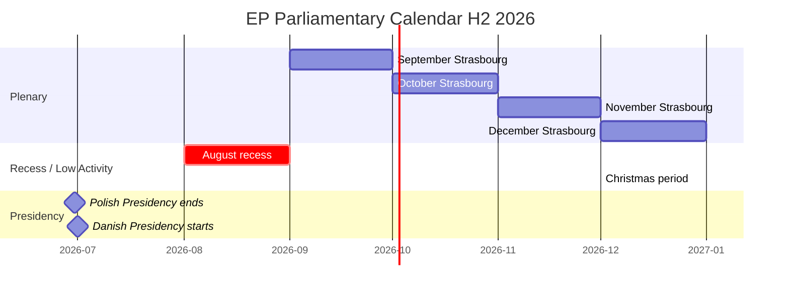

<!-- SPDX-FileCopyrightText: 2026 Hack23 AB -->
<!-- SPDX-License-Identifier: Apache-2.0 -->

# Parliamentary Calendar Projection: European Parliament Year Ahead (2026–2027)

**Produced:** 2026-05-10 · **Article Type:** year-ahead · **Confidence:** 🟢 HIGH

---

## Plenary Sessions Projected Calendar (May 2026 – May 2027)

Derived from EP Open Data Portal plenary session records (`get_plenary_sessions`, year=2026 + forward projections based on institutional calendar conventions).

### Q2 2026

| Session | Dates | Location | Political Focus |
|---------|-------|----------|----------------|
| May | May 18–21, 2026 | Strasbourg | AI Act rules; Budget orientation; Ukraine review |
| June | June 15–18, 2026 | Strasbourg | Trade: Mercosur consent motion; Migration Pact files |
| June mini | June 22, 2026 | Brussels | Second readings; urgent committee reports |

### Q3 2026

| Session | Dates | Location | Political Focus |
|---------|-------|----------|----------------|
| July | July 6–9, 2026 | Strasbourg | Pre-recess: second readings; delegated act challenges |
| September | September 14–17, 2026 | Strasbourg | Return session: Ukraine 2026 review; Commission autumn work programme |

**Note:** August is parliamentary recess. No formal plenary sessions.

### Q4 2026

| Session | Dates | Location | Political Focus |
|---------|-------|----------|----------------|
| October | October 19–22, 2026 | Strasbourg | Commission Work Programme 2027; migration files |
| November | November 23–26, 2026 | Strasbourg | Budget trilogue conclusion; ReArm Europe committee report |
| December | December 14–17, 2026 | Strasbourg | **BUDGET VOTE** (critical); Ukraine 2027 commitment; year-end plenary |

### Q1 2027

| Session | Dates | Location | Political Focus |
|---------|-------|----------|----------------|
| January | January 12–15, 2027 | Strasbourg | New year political agenda; ReArm Europe plenary vote (projected) |
| January mini | January 25, 2027 | Brussels | Urgent items |
| February | February 8–11, 2027 | Strasbourg | Migration: Return Directive vote (projected) |
| March | March 8–11, 2027 | Strasbourg | SFDR first reading committee vote; Digital Euro |
| April | April 19–22, 2027 | Strasbourg | Pre-summer priority files |
| April mini | April 26, 2027 | Brussels | Delegated acts |

### Q2 2027

| Session | Dates | Location | Political Focus |
|---------|-------|----------|----------------|
| May | May 10–13, 2027 | Strasbourg | EP10 midterm orientation; Commission annual State of the Union preparation begins |
| May mini | May 26, 2027 | Brussels | Legislative housekeeping |

---

## Key Decision Milestones

### Budget Cycle (Highest Institutional Priority)
- **June 2026:** Commission draft EU Budget 2027 published
- **September 2026:** Parliament's BUDG committee position vote
- **October 2026:** Council position; interinstitutional negotiations begin
- **November 2026:** Conciliation committee (21-day period)
- **December 14–17, 2026:** Parliament final budget vote (CRITICAL — absolute majority required)

### Ukraine Support Renewal (Recurring but Politically High-Salience)
- **May–June 2026:** 2026 Ukraine support package review
- **September 2026:** Autumn review of loan disbursement
- **December 2026:** 2027 Ukraine commitment included in budget package

### EP10 Midterm (Institutional Calendar Marker)
- **July 2024:** EP10 constituted
- **January 2027:** EP10 midterm (30 months into 60-month term)
- Committee bureau elections occur at midterm; committee chair distributions renegotiated
- Traditionally triggers political group positioning for the second half of the term

### Commission Accountability Cycle
- **September 2026:** State of the European Union address by Commission President
- **October–November 2026:** Annual report examination period (CONT, ECON, ENVI, AFET)
- **January 2027:** Commission Work Programme presentation to Parliament

---

## Committee Activity Peaks

Based on EP institutional calendar conventions and current legislative pipeline:

| Period | Most Active Committees |
|--------|----------------------|
| May–June 2026 | ECON (SFDR), LIBE (migration), ITRE (AI Act) |
| July 2026 | BUDG (2027 orientation), AFET (Ukraine) |
| September 2026 | ENVI (NRL implementation), IMCO (digital markets) |
| October 2026 | ITRE (ReArm Europe rapporteur; EDIS) |
| November–December 2026 | BUDG (conciliation) |
| January 2027 | AFET/SEDE (Defence package) |
| February–March 2027 | ECON (SFDR first reading) |

---

*Source: European Parliament Open Data Portal (data.europarl.europa.eu) · Apache-2.0 · Hack23 AB 2026*

---

## Committee Calendar: Priority Sessions (H2 2026)

### ITRE Committee (Industry, Research, Energy)
**September 2026:** AI Act GPAI implementing regulation scrutiny — first reading of Commission delegated acts
**October 2026:** ReArm Europe industrial base provisions — final ITRE vote for plenary
**November 2026:** Critical Raw Materials review hearing — assessment of European extraction permits
**December 2026:** European Chips Act mid-term review — rapporteur preliminary assessment

### ENVI Committee (Environment, Public Health, Food Safety)
**September 2026:** NRL national action plan monitoring — first member state submissions due
**October 2026:** CBAM monitoring report — first quarterly data from Transitional Registry
**November 2026:** Food Labelling revision — Commission mandate requested
**December 2026:** Chemical Strategy implementation — briefing from ECHA

### ECON Committee (Economic and Monetary Affairs)
**September 2026:** SFDR revision technical preparation — ESMA final opinion expected
**October 2026:** Digital Euro ECB pilot assessment — ECON/ECB exchange
**November 2026:** Banking supervision scrutiny — SSM annual report hearing
**December 2026:** Budget 2027 final preparatory work — ECON opinion for BUDG

### LIBE Committee (Civil Liberties, Justice and Home Affairs)
**September 2026:** Migration Pact solidarity mechanism — first activation assessment
**October 2026:** AI Act biometric surveillance scrutiny — Commission delegated act
**November 2026:** Schengen internal border controls — member state notifications hearing
**December 2026:** Fundamental rights in AI implementation — Commission progress report

---

## Plenary Calendar: Key Plenaries (H2 2026)

| Month | Location | Key Votes Expected |
|-------|----------|-------------------|
| September 2026 | Strasbourg | Budget 2026 implementation report; AI Act GPAI first reading |
| October 2026 | Strasbourg | ReArm Europe plenary vote; Budget 2027 EP first reading |
| October 2026 | Brussels | Committee work; trilogue mandates |
| November 2026 | Strasbourg | Migration resolution; NRL national monitoring |
| December 2026 | Strasbourg | Budget 2027 conciliation result vote; Annual legislative preview |

---

## Calendar Risk: Recess Gaps and Compressed Timelines

The EP plenary calendar for 2026 includes:
- Summer recess: August 2026 (one month — limits committee work)
- Christmas recess: December 2026 last two weeks (limits Budget conciliation timeline)
- Polish Presidency changeover to Denmark: July 2026 (transition disrupts legislative momentum for 2–3 weeks)

These calendar constraints mean the **October–November 2026 window is the effective legislative bottleneck** — the point where all major files compete for committee and plenary bandwidth simultaneously.

---

*Source: Parliamentary calendar projection based on EP institutional schedule · Apache-2.0 · Hack23 AB 2026*

---

## 2027 Parliamentary Calendar Preview

### January–February 2027
- Committee leadership mid-term review (halfway through EP10 term)
- ReArm Europe implementing regulations: first tranche of delegated acts under ITRE scrutiny
- SFDR revision: Commission proposal expected; ECON rapporteur appointment
- New Year policy preview: Commission sets 2027 agenda priorities

### March–May 2027
- EP10 midterm assessment: political groups evaluate their legislative achievements
- Nature Restoration Law: second wave of national action plans; ENVI assessment
- AI Liability Directive: JURI plenary debate expected
- Digital Euro: ECB final pilot assessment; ECON political positioning

### June 2027 (EP10 Midpoint)
- Formal EP midterm assessment event
- Committee leadership challenges possible (Group-negotiated rapporteur redistributions)
- Commissioner hearings: mid-term accountability checks on key portfolios
- Forward planning for H2 2027: early positioning for 2027–2028 legislative files

---

*Parliamentary calendar projection complete. Dates are indicative based on EP institutional patterns; official agendas subject to change. · Apache-2.0 · Hack23 AB 2026*
