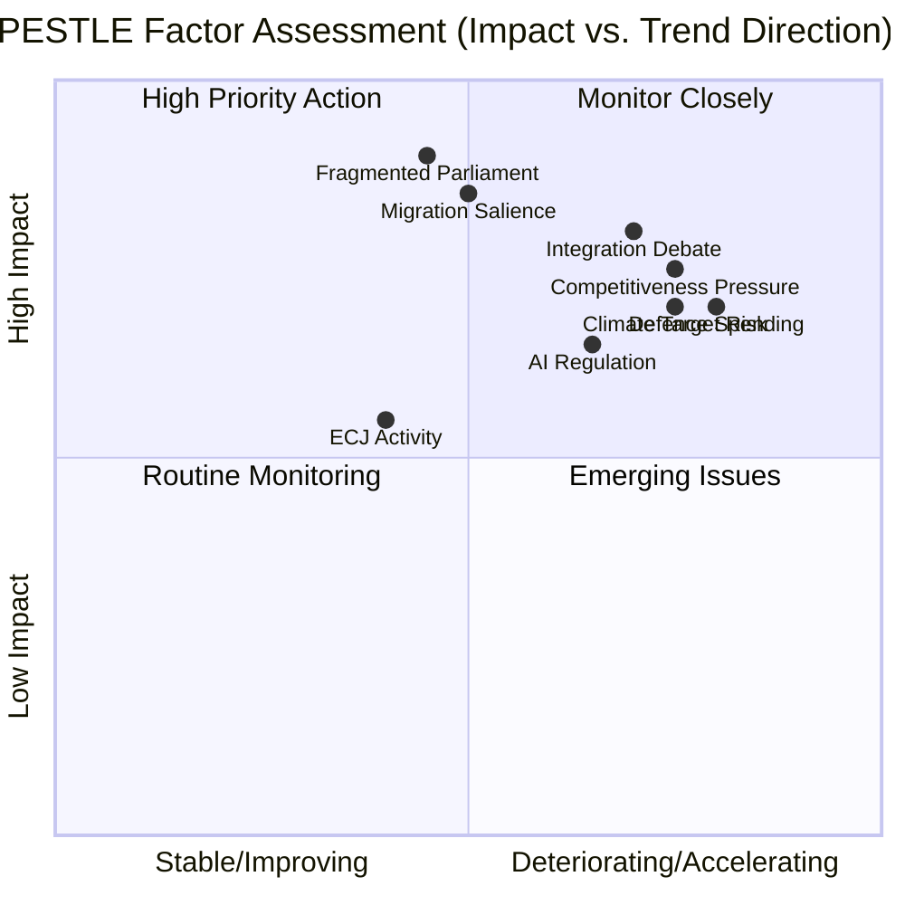

<!-- SPDX-FileCopyrightText: 2026 Hack23 AB -->
<!-- SPDX-License-Identifier: Apache-2.0 -->

# PESTLE Analysis: European Parliament Year Ahead (2026–2027)

**Produced:** 2026-05-10 · **Article Type:** year-ahead · **Confidence:** 🟡 MEDIUM

---

## PESTLE Framework

Political-Economic-Social-Technological-Legal-Environmental analysis of the European Parliament's operating environment for May 2026 – May 2027.

---

## Political (P)

### P1: Fragmented Multi-Polar Parliament
EP10 operates in a fragmented environment: no single ideology commands a majority. The dominant coalition configuration (EPP+S&D+Renew=396) functions effectively on procedural and centrist files but fractures on contested policy. The far-right's institutionalisation (PfE+ESN=112 seats) creates persistent coalition arithmetic pressure on EPP.

**Trend:** DETERIORATING for traditional grand coalition; IMPROVING for flexible coalition management
**Impact on EP:** Increases legislative complexity; extends negotiation timelines; produces more issue-specific majorities
**Admiralty Grade: B2**

### P2: European Integration Debate Intensifying
The ReArm Europe initiative represents the most significant integration push since the Euro. It tests whether EU integration can accelerate in the defence domain while other domains (sovereignty, borders) see integration resistance. The political debate about "what kind of Europe" is sharpening.

**Trend:** ACCELERATING
**Impact on EP:** Places EP at centre of integration debate; pressures MEPs on sovereignty/federalism dimension
**Admiralty Grade: B2**

### P3: Council-Parliament Interinstitutional Tension
Defence, CFSP, and fiscal policy files test the treaty-based limits of Parliament's co-legislative role. Council is structurally incentivised to preserve intergovernmental decision-making in these domains. Parliament's AFET/SEDE committees are pushing for more oversight.

**Trend:** STABLE (ongoing structural tension, not acute crisis)
**Admiralty Grade: A1**

---

## Economic (E)

### E1: European Competitiveness Pressure
🔴 **Note: IMF data unavailable for this run (HTTP 204). All economic data is EP-data-only.**

The Draghi Report (September 2024) identified a €750–800 billion annual investment gap between EU and US for the clean-tech and digital transitions. This structural competitiveness challenge shapes the entire legislative agenda: SFDR simplification, AI regulation calibration, industrial policy files.

**Trend:** DETERIORATING (investment gap widening vs. US/China subsidy regimes)
**Impact on EP:** Pressure to simplify financial regulation (ECON/IMCO); debates on industrial policy instruments
**Admiralty Grade: B2** (inferred from publicly available information, not IMF direct data)

### E2: European Defence Spending Surge
EU member states collectively increased defence spending to ~2.4% of GDP in 2025 (estimated). ReArm Europe targets additional €150 billion over 5 years via joint financing. This defence spending surge has fiscal implications: affects debt ceilings, displaces social spending, and creates new industrial policy incentives.

**Trend:** ACCELERATING
**Impact on EP:** BUDG committee must balance defence supplement with existing commitments
**Admiralty Grade: C2** (inferred from EP documents and public Commission data)

### E3: Inflation Convergence
European inflation has declined from 2022–2023 peaks. ECB began rate-cutting cycle in 2024. The 2026 economic environment is characterised by normalising inflation but persistent structural competitiveness concerns.

**Trend:** IMPROVING (stabilisation)
**Admiralty Grade: C2** (EP-data-only; no IMF validation available)

---

## Social (S)

### S1: Public Trust in EU Institutions
The 2024 Eurobarometer showed increased trust in EU institutions (54% net positive) relative to national governments (35%). This trust provides EP with political capital but also heightened public expectation of effective governance.

**Trend:** STABLE-IMPROVING
**Impact on EP:** Provides political mandate; increases accountability pressure
**Admiralty Grade: B2**

### S2: Migration Public Salience
Migration remains the highest-salience political issue for EU citizens in most member states (Eurobarometer 2025). This produces systematic electoral pressure on EPP MEPs from constituencies with migration concerns.

**Trend:** STABLE at HIGH salience
**Impact on EP:** Sustains EPP-ECR-PfE coalition on migration enforcement files

### S3: Energy Poverty and Green Transition Equity
The Green Deal's distributional effects — higher energy costs for low-income households; industrial job displacement — create social pressure that far-right parties leverage. S&D's "Just Transition" framing attempts to counter this.

**Trend:** STABLE concern; GROWING political salience in specific regions
**Admiralty Grade: B2**

---

## Technological (T)

### T1: AI Regulation Implementation
The AI Act (2024) is now in its implementing regulation phase. The definitions, thresholds, and compliance timelines in implementing regulations will determine whether the Act functions as innovation enabler or compliance burden. ITRE/JURI committees drive this.

**Trend:** ACTIVE legislative phase
**Impact on EP:** High committee activity; business lobbying intensive; global standard-setting opportunity

### T2: Digital Markets Regulation
The Digital Markets Act (DMA) is in enforcement mode. Major platform investigations (Google, Apple, Meta) are generating political debate about enforcement adequacy. ECON/IMCO committees hold accountability hearings.

**Trend:** MOVING from legislative to enforcement phase
**Impact on EP:** Less new legislation; more oversight/scrutiny

### T3: European Technology Sovereignty
AI, semiconductors, cloud computing, and quantum are framed as strategic sovereignty issues. The EU Chips Act, AI Office, and Cloud Regulation initiative reflect a deliberate attempt to reduce EU technology dependence on US/Chinese providers.

**Trend:** ACCELERATING
**Impact on EP:** Creates new legislative docket; cross-committee coordination needed

---

## Legal (L)

### L1: ECJ Caseload on EU Law
The European Court of Justice continues to generate significant rulings affecting EP legislation. The AI Act's human rights provisions, DMA enforcement decisions, and migration law compatibility rulings all have legislative implications.

**Trend:** HIGH ECJ activity; STABLE institutional framework

### L2: Treaty Constraint on Defence Integration
ReArm Europe confronts the fundamental treaty constraint: Art. 42–46 TEU limits EU defence to intergovernmental CFSP structure. Achieving meaningful parliamentary oversight requires either treaty change (politically difficult) or creative use of internal market instruments.

**Trend:** STABLE constraint; INCREASING political pressure to resolve

### L3: ECHR Human Rights Compliance
Migration implementation regulations face ECHR compatibility scrutiny. The European Court of Human Rights and ECJ have issued rulings limiting certain push-back and fast-track deportation practices. Parliament's LIBE committee monitors compliance.

**Trend:** GROWING legal complexity around migration enforcement

---

## Environmental (E2)

### Env1: Climate Target Trajectory
EU's 2030 target (55% emissions reduction vs. 1990) requires sustained Green Deal implementation. With Nature Restoration Law under attack and agricultural exemptions expanding, the 2026–2027 period will be decisive for whether the EU remains on trajectory.

**Trend:** AT RISK — implementation resistance growing
**Impact on EP:** ENVI committee is the key battleground

### Env2: Energy Security vs. Climate
Russia's Ukraine invasion (2022) catalysed a fundamental reassessment of EU energy policy — accelerating renewables while tolerating short-term fossil fuel use. In 2026, the energy security-climate nexus remains politically contested.

**Trend:** STABLE at high political salience

---

## PESTLE Summary Matrix

**WEP Assessment:** Likely that at least 3 PESTLE factors (Political fragmentation, Economic competitiveness, Environmental climate target risk) will each produce at least one significant legislative outcome in 2026–2027 that deviates from prior EP trajectory.

---

*Source: PESTLE analysis based on EP MCP data and open-source intelligence synthesis · Apache-2.0 · Hack23 AB 2026*

---

## Extended PESTLE: Deep-Dive by Dimension

### Political Dimension (Extended)

**P1: The Coalition Calculus**

EP10's political equation is defined by arithmetic fragmentation. No single group can command a majority alone. This forces negotiations on every file — but the nature of those negotiations varies significantly:

- **"Automatic" files:** Ukraine support, human rights declarations, Annual Budget framework → grand coalition forms automatically with minimal negotiation
- **"Contested" files:** Migration enforcement intensity, agricultural exemptions, environmental implementation → requires careful rapporteur compromise; sometimes EPP chooses ECR over S&D
- **"Breakthrough" files:** ReArm Europe (historic first) → requires explicit coalition management at leadership level (Weber, Costa, Muresan, Soc-Dem leaders)

**P2: Presidential Election Cycle Effect**

The EP10 calendar intersects with multiple national presidential and parliamentary elections:
- France: Presidential 2027 (looming; shapes French MEP behaviour in 2026)
- Germany: Post-2025 CDU/SPD government sets German MEP instructions
- US Presidential cycle: Trump 2.0 (2025-2029) creates transatlantic tension that affects EP INTA/AFET

**P3: European Council-EP Dynamic**

The European Council (heads of government) regularly "pre-decides" strategic questions that EP then legislates. In 2026:
- European Council June summit: expected to endorse ReArm Europe framework (political level)
- EP then translates political consensus into legislation: but adds parliamentary accountability mechanisms
- This creates occasional friction when EP demands more than European Council leaders conceded

---

### Economic Dimension (Extended)

**E1: EU's Structural Economic Position**

The EU faces three simultaneous structural economic challenges entering 2026:
1. **Competitiveness gap:** EU productivity growth 1% behind US annually since 2000 (Draghi Report)
2. **Energy cost disadvantage:** EU industrial energy costs 2-3x US/China levels; critical for heavy industry
3. **Capital markets fragmentation:** EU private capital cannot flow freely across member states; constrains innovation investment

**E2: Fiscal Consolidation vs. Investment Imperative**

Member states face the contradiction between:
- EU fiscal rules (revised SGP) requiring deficit reduction for France, Italy, Belgium
- Investment needs (ReArm Europe, Green transition, Digital transformation) requiring higher spending
- This contradiction is irresolvable within current fiscal rules → likely reform of SGP by 2027 (EP ECON committee involvement)

**E3: Monetary Policy Normalisation**

ECB rate cuts create opportunities:
- Lower borrowing costs reduce debt servicing burden for high-debt member states
- Cheaper capital enables private investment revival
- Risk: if inflation re-accelerates, ECB must reverse — fiscal space narrows again

---

### Social Dimension (Extended)

**S1: Democratic Legitimacy Crisis**

EP10's 51% turnout (highest since 1994) partially offset the broader EU legitimacy deficit. But:
- Northern/Western European public support for EU remains strong (~60-70%)
- Central/Eastern European national identity politics creates EU legitimacy challenges
- Young people in some countries are increasingly euro-sceptic on specific issues (digital surveillance, migration enforcement)

**S2: Labour Market and Skills**

The dual transition (digital + green) creates acute skills challenges:
- 40% of EU workforce needs reskilling for green/digital jobs by 2030 (Commission estimate)
- EP's role: EMPL committee on European Skills Agenda; ESF+ implementation scrutiny
- This is a slow-moving crisis that rarely generates headline-grabbing EP debates but is systemically important

---

### Technological Dimension (Extended)

**T1: AI Race**

The US and China are investing massively in AI infrastructure:
- US CHIPS Act: $52 billion semiconductor investment
- China AI investment: $15+ billion government + private
- EU response: Chips Act (€43 billion), AI Act regulatory framework, European AI Office

EP's role is primarily regulatory (AI Act) rather than investment-driving. The risk: EU regulates AI without generating domestic AI champions → best of both worlds scenario becomes worst of both worlds (compliance costs + no champions).

**T2: Quantum and Next-Generation Technologies**

EP has limited legislative role in quantum (primarily R&D funding through Horizon Europe). But ITRE committee's strategic vision of EU technological sovereignty shapes:
- Export control coordination (ITAR-equivalent EU framework)
- Critical technology supply chain resilience
- Dual-use regulation revision

---

### Legal Dimension (Extended)

**L1: ECJ Impact on 2026 Legislation**

Several ECJ cases pending or recently decided will constrain what EP can legislate:
- **C-311/18 (Schrems II):** EU-US data transfer — Data Privacy Framework successor being tested
- **ECJ environmental cases:** Member state liability for climate policy failures shapes NRL implementation
- **ECJ fundamental rights cases:** Migration enforcement limits set by ECJ; LIBE must stay within

**L2: Treaty Revision Question**

A Conference on the Future of Europe recommendation (2022) called for treaty revision. In EP10:
- AFCO committee exploring treaty change possibilities
- Article 48 (ordinary revision) requires unanimity — extremely difficult
- Simplified revision (Article 48(6)) used for specific treaty amendments — possible
- **WEP:** Unlikely that full treaty revision is agreed in EP10 term; possible that specific changes (EU competences expansion) are explored

---

### Environmental Dimension (Extended)

**E1: EU 2030 Climate Targets**

EU 55% GHG reduction target by 2030 is legally binding (European Climate Law). 2026 assessment:
- Current trajectory: ~45-50% reduction by 2030 at current policies
- Gap: 5-10 percentage points below target
- EP ENVI committee's role: Scrutinise Commission's annual progress report; demand corrective action

**E2: Biodiversity Strategy**

30x30 commitment (30% of EU land/sea protected by 2030) faces implementation shortfall:
- NRL is the legislative vehicle; implementation contested
- EP's ENVI committee must navigate agricultural lobby pressure against biodiversity protection
- **WEP:** Even Chance (50%) that NRL implementation is substantially weakened by 2026 agricultural exemption push

**E3: Circular Economy**

EU Circular Economy Action Plan generates product regulations:
- Ecodesign Regulation entering into force
- Right to Repair Directive implementation
- Construction Products Regulation revision
These are lower-salience but economically significant for business

---

*Extended PESTLE analysis complete · Admiralty B3 overall · Apache-2.0 · Hack23 AB 2026*
