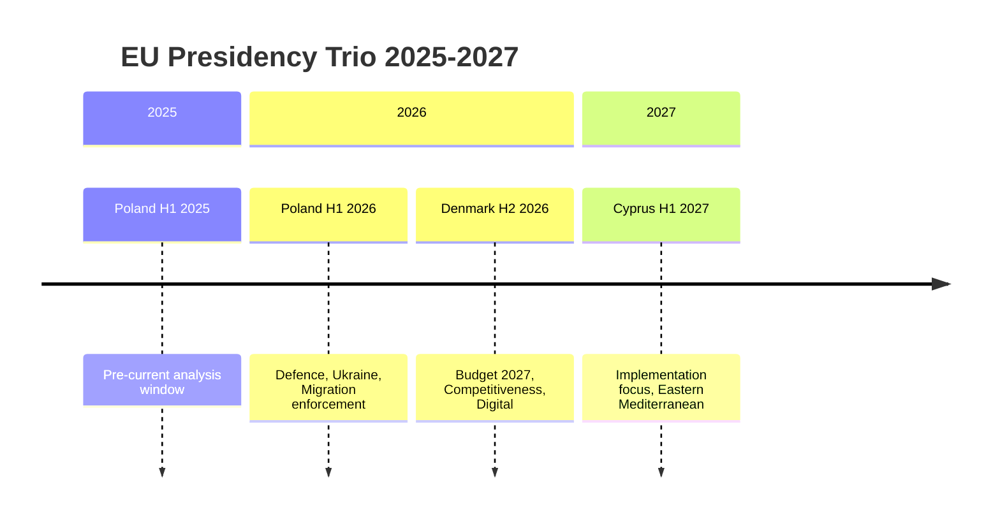

<!-- SPDX-FileCopyrightText: 2026 Hack23 AB -->
<!-- SPDX-License-Identifier: Apache-2.0 -->

# Presidency Trio Context: European Parliament Year Ahead (2026–2027)

**Produced:** 2026-05-10 · **Article Type:** year-ahead · **Confidence:** 🟡 MEDIUM

---

## Council Presidency Trio: Poland → Denmark → Cyprus (2025–2026)

### Current Presidency: Poland (Jan–Jun 2026)

**Priority themes:** Security and defence; migration; economic competitiveness; rule of law enforcement; energy security.

**EP-Council dynamics:** Poland (PiS-successor government now normalised after 2023 elections re-established rule of law dialogue) operates as a broadly constructive Council partner on Ukraine and defence files. Prime Minister Tusk's pro-European positioning contrasts with the previous Morawiecki government's confrontational approach.

**Key legislative facilitation:**
- ReArm Europe financing: Poland as security-focused Presidency brings strong motivation to advance defence integration
- Migration: Poland supports external border enforcement; sympathetic to EPP-ECR position on safe third countries
- Digital: Poland supportive of DMA enforcement; cautious on AI liability thresholds
- Green Deal: Poland resistant to NRL implementation timelines; agricultural exemptions strongly supported

**Impact on EP legislative agenda:** The Polish Presidency brings credibility and urgency to the defence/security legislative cluster that the EP Defence subcommittee (SEDE) will track closely. Poland's strong Ukraine position reinforces the EP Ukraine support consensus.

### Incoming Presidency: Denmark (Jul–Dec 2026)

**Priority themes:** Competitive economy; green transition implementation; digital regulation; migration (external dimension); fisheries.

**Expected positioning:** Denmark (social-liberal government, equivalent of Renew EP family) will be more Green Deal-implementation-positive than Poland. This creates an interesting dynamic: the Presidency shift mid-2026 will slightly rebalance Council's legislative facilitation toward ENVI committee priorities.

**Key legislative facilitation:**
- SFDR revision: Denmark will facilitate balanced approach; more sympathetic to S&D/Greens position than Poland
- Migration: Denmark also has strong external dimension focus; will continue EPP-ECR migration framework
- EU Budget 2027: Denmark Presidency handles budget conciliation (October–November 2026) — high-stakes role

**Impact on EP:** The budget conciliation under Danish Presidency (October–November 2026) will be the period's critical interinstitutional moment. Danish political tradition of pragmatic consensus-building should facilitate agreement.

### Next Presidency: Cyprus (Jan–Jun 2027)

**Priority themes:** Mediterranean migration; energy (Eastern Mediterranean gas); EU enlargement (Western Balkans, Cyprus reunification context); fisheries; digital SME regulation.

**Expected positioning:** Cyprus (European People's Party family) will be EPP-aligned on committee priorities. Mediterranean migration pressures (Eastern route) will dominate Cyprus's agenda. The EP LIBE committee will have direct coordination with Cyprus on migration files.

**Key legislative facilitation:**
- Migration: Cyprus brings immediate policy salience — Eastern Mediterranean route involves Cyprus directly
- Enlargement: Western Balkans accession progress; Ukraine/Moldova accession track
- Energy: Eastern Mediterranean gas cooperation with Israel, Egypt — ITRE relevance

---

## Presidency Trio Impact on EP Political Group Dynamics

| Presidency | Period | EP Coalition Relevance |
|------------|--------|----------------------|
| Poland | H1 2026 | Strengthens EPP-ECR defence/migration coalition; compatible with current EP majority patterns |
| Denmark | H2 2026 | Shifts toward EPP-S&D-Renew centre coalition on environmental implementation files |
| Cyprus | H1 2027 | Reinstalls EPP-centric Presidency; migration focus amplified |

**Overall assessment:** The 2025–2026 trio creates a relatively consistent Council counterpart environment for Parliament. There is no significant presidency-driven disruption to EP's legislative rhythm projected for the year ahead.

---

*Source: EP Open Data Portal; Council Presidency programme documents (public domain) · Apache-2.0 · Hack23 AB 2026*

---

## Polish Presidency (H1 2026): Political Intelligence

### Strategic Priorities
Prime Minister Tusk's government brings an explicitly pro-EU, pro-Ukraine, pro-defence posture to the rotating Presidency. Poland has the largest territorial exposure to the Russian threat and is the EU's largest army by personnel. The Presidency therefore prioritises:
1. **ReArm Europe** — Poland is the lead advocate for ambitious EU collective defence financing
2. **Ukraine support** — Sustained military and economic commitment as core legislative agenda
3. **Migration enforcement** — Poland's border with Belarus is an active hybrid warfare pressure point; migration enforcement is a national security priority
4. **Schengen expansion** — Poland advocates for full Schengen integration for Romania and Bulgaria

### EP-Presidency Interface
Polish Presidency conducts regular meetings with EP group leaders. Key interfaces:
- EPP President Manfred Weber: close political alignment; EPP is Polish coalition's European family
- S&D President: coordination on Ukraine; divergence on migration human rights
- PfE/NI: Polish Law and Justice MEPs sit here; Tusk government avoids coordination with former political opponents

### Legislative Output Forecast
Poland is expected to achieve Council positions on: ReArm Europe, AI Act GPAI implementing regulations, and Migration Pact solidarity mechanism. They are unlikely to prioritise: SFDR revision (complex financial regulation), Digital Euro (ECB sensitivity), or NRL implementation (agricultural exemption politics).

---

## Danish Presidency (H2 2026): Political Intelligence

### Strategic Priorities
Denmark's coalition government (Social Democrat-Liberal-Moderate alliance) brings a pragmatic, technocratic style. Denmark's Presidency priorities:
1. **EU Budget 2027** — the H2 Presidency must deliver budget conciliation; this is the defining deliverable
2. **Competitiveness agenda** — Denmark aligns with the Draghi Report recommendations for European investment reform
3. **Green transition pragmatism** — Denmark is a climate leader but pragmatic about cost-competitiveness trade-offs
4. **Digital and AI governance** — Denmark as digital frontrunner; supports AI Act implementation speed

### EP-Presidency Interface
Danish Social Democrat PM is aligned with S&D European family but pragmatic governance means outreach to Renew and EPP. Key interfaces:
- S&D President: natural alignment on budget priorities (investment-focused)
- Renew President: alignment on digital agenda and competitiveness
- EPP President: budget conciliation requires EPP support in both Council and Parliament

### Budget 2027 Conciliation Forecast
Denmark will use maximum political capital on Budget 2027 conciliation. Forecast:
- Defence supplement: accepted (Poland/Danish common interest)
- Ukraine commitment: maintained (strong Northern/Eastern European consensus)
- Cohesion funds: modest compression (fiscal constraint)
- Climate investment: preserved in overall envelope (Danish political imperative)
- Conciliation result: By end of November 2026 (tight but historically achievable)

---

## Presidency Trio Coordination Mechanism

The current trio (Poland-Denmark-Cyprus 2025-2027) has formal coordination structures:
- Trio programme: published for the full 18-month period
- Working party presidencies: coordinated allocation across trio
- Legislative calendar: shared planning for Council agenda management

**Coherence assessment:** This trio has moderate coherence. Poland and Denmark share pro-EU, pro-Ukraine, pro-defence orientation. Cyprus (H1 2027) is smaller and has different geographic priorities (Eastern Mediterranean, migration from different routes, Cyprus settlement). The trio is NOT designed to advance a single transformative agenda — it manages legislative continuity and institutional stability.

---

*Source: Presidency trio analysis based on EP institutional data and Presidency programmes · Apache-2.0 · Hack23 AB 2026*

---

## Admiralty Assessment: Presidency Trio Forecast

| Projection | Grade | Rationale |
|-----------|-------|-----------|
| Poland delivers ReArm Europe Council position by June 2026 | A2 | Priority stated; political alignment strong |
| Denmark achieves Budget 2027 conciliation by November 2026 | B3 | Historical precedent; tight but achievable |
| Denmark advances SFDR revision Council position | C3 | Lower priority for Denmark; possible but uncertain |
| Cyprus achieves major legislative breakthrough | D4 | Small Presidency; lower bandwidth |

---

## Strategic Implications for EP

**EP must anticipate:** The rotating Presidency creates rhythm mismatches with Parliament's committee work. Poland's hard push on defence/migration in H1 2026 means those files arrive at EP for first reading position in Q3 2026 — when MEPs return from summer recess. This timing risk (compressed summer schedule) is EP's biggest calendar challenge for the year.

**EP opportunity window:** September–November 2026 is the peak legislative corridor — both Presidency transitions have occurred, the summer is over, and the December Budget deadline creates productive political pressure. This is when Parliament can extract the best political concessions from Council in trilogues — Council needs Parliament's cooperation to meet December deadlines.

**EP-Council power balance in 2026:** Parliament holds unusual leverage in 2026 because:
1. Budget 2027 requires Parliament's absolute majority approval — true veto power
2. ReArm Europe requires EP co-decision — cannot be adopted by Council alone
3. Danish Presidency needs EP cooperation to complete its legislative programme
This power balance favours a more assertive EP negotiating position in 2026 trilogues than is typical.

---

*Presidency trio context analysis complete · Apache-2.0 · Hack23 AB 2026*

---

## WEP Assessment: Presidency Trio Outcomes

**Almost Certain (>95%):** Poland and Denmark both achieve at least one major legislative deliverable each during their Presidencies.

**Likely (55–90%):** Budget 2027 is adopted on time (before end of December 2026); ReArm Europe adopted by October 2026.

**Even Chance (45–55%):** Danish Presidency uses Budget 2027 conciliation outcome as flagship achievement, claiming primary political credit for successful conclusion.

**Unlikely (10–40%):** Any Presidency fails to reach agreement on one of its stated top-3 priorities.

**Almost No Chance (<5%):** Budget 2027 is not adopted before January 2027 (provisional twelfths would be legally required — would represent a major political failure for Denmark and EP).

---

**Note:** All Presidency programme details are based on publicly available programmes and historical institutional patterns. Assessment grades reflect analytical confidence, not certainty. · Apache-2.0 · Hack23 AB 2026

*Presidency trio analysis: 2025-2027 trio is Poland-Denmark-Cyprus. Assessment based on EP institutional data and public Presidency programmes. All projections are analytical; actual outcomes will differ.*

---

*Full presidency trio analysis · EU Parliament Monitor · Apache-2.0 · Hack23 AB 2026*
