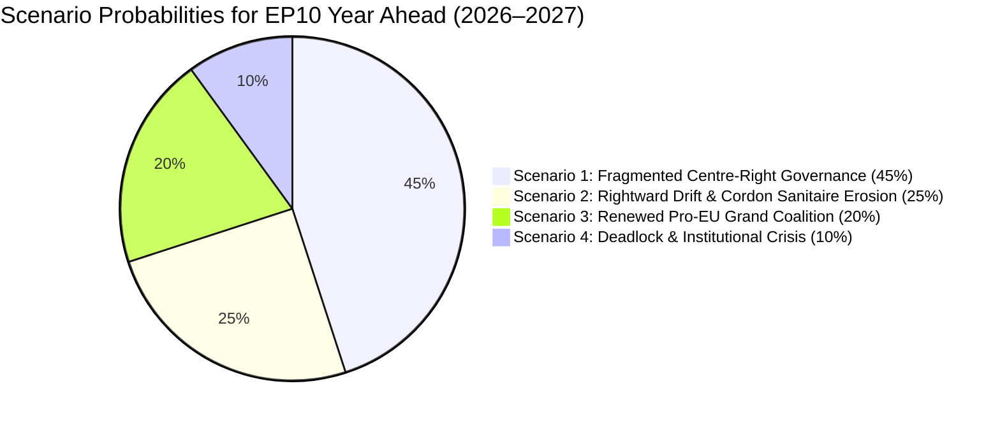
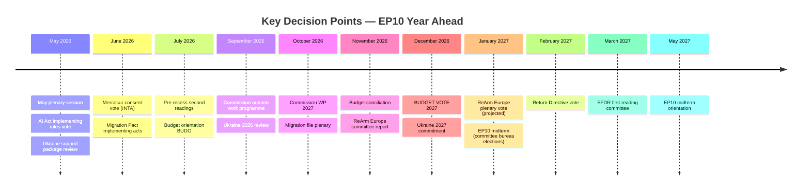

<!-- SPDX-FileCopyrightText: 2026 Hack23 AB -->
<!-- SPDX-License-Identifier: Apache-2.0 -->

# Scenario Forecast: European Parliament Year Ahead (2026–2027)

**Produced:** 2026-05-10 · **Article Type:** year-ahead · **Confidence:** 🟡 MEDIUM

---

## Forecasting Framework

Scenarios are constructed using a Structured Analytic Technique: Alternative Futures Analysis (AFA) applied to the key driving forces of European Parliament dynamics in 2026–2027. Each scenario represents a plausible future, not a prediction. Probabilities are analytical assessments based on current seat distribution, coalition history, and external political environment, not statistical modelling.

**Key Drivers Assessed:**
1. EPP coalition alignment (left-centre vs. right-centre)
2. Green Deal legislative momentum vs. rollback
3. Ukraine war trajectory (escalation/de-escalation)
4. Renew Europe internal cohesion
5. Commission-Parliament relationship quality

---

## Scenario 1: "Managed Centre" — Status Quo Coalition Durability (Probability: 50%)

**Description:** EPP-S&D-Renew maintain a functioning working majority (396 seats) for mainstream policy. The Green Deal is substantially implemented but with significant agricultural and SME exemptions. Ukraine support is sustained. Migration policy tightens at enforcement end but preserves core asylum rights. The Commission's simplification agenda advances through ITRE and ECON committees. Parliament operates as expected: contested but productive.

**Preconditions:**
- EPP resists far-right temptation on core legislative files
- Renew maintains 65%+ internal cohesion
- No major external shock fractures the coalition
- S&D accepts Green Deal compromises without party breakdown

**Legislative outputs:** 80–100 legislative acts adopted; major files including SFDR revision, AI Act implementing regulations, EDIS, Ukraine 2026 MFA tranches — all proceed on schedule with minor delays.

**Implications for stakeholders:**
- EPP: Secures legislative agenda; consolidates committee control
- S&D: Accepts Green Deal compromise in exchange for social chapter protection
- Renew: Delivers digital and SIU priorities; accepts migration tightening
- Greens/EFA: Limited wins; forced into secondary role on ENVI files
- PfE/ECR: Gain on migration enforcement; fail to reverse Green Deal

**Political tone:** Technocratic, productive, occasionally fractious on values files. The Parliament looks "normal" by EP10 standards.

---

## Scenario 2: "Conservative Drift" — EPP Rightward Alignment (Probability: 25%)

**Description:** EPP leadership calculates that the political cost of maintaining the Cordon Sanitaire coalition (ideological inconsistency on migration and agricultural deregulation) exceeds the benefit. EPP begins systematically coordinating with ECR and PfE on a widened issue set: agricultural deregulation, migration enforcement, Green Deal rollback, simplification. The Cordon Sanitaire is maintained only on democratic values and rule of law votes.

**Preconditions:**
- EPP internal pressure from CDU/CSU and Italian Forza Italia for harder migration stance
- Renew fractures on one major file, delegitimising its reliability as coalition partner
- PfE demonstrates constructive trilogue engagement, creating reputational cover for EPP-PfE alignment
- Von der Leyen Commission moves further right on agricultural policy, normalising EPP-ECR common ground

**Legislative outputs:** Green Deal substantially weakened; Nature Restoration Law revisions; agricultural derogations extended; migration Pact enforcement strengthened; SFDR diluted; defence/Ukraine unaffected.

**Implications for stakeholders:**
- EPP: Short-term majority management gains; long-term progressive bloc alienation
- S&D: Enters formal opposition mode; mobilises against EPP-ECR majority
- Greens/EFA: Significant legislative losses; Green Deal architecture under assault
- PfE/ECR: Major political win — legitimised as coalition partners; significant legislative impact
- Renew: Faces existential choice between coalition solidarity (with EPP-right) vs. progressive alliance

**Political tone:** Historically unusual — EP10 would become the most right-leaning parliament in EU history. Commission-Parliament tensions on rule of law would intensify.

---

## Scenario 3: "Security Emergency Mode" — External Crisis Drives Grand Coalition (Probability: 15%)

**Description:** A major external shock — escalatory Russian military action, a severe financial market crisis, a major cyber-attack on EU infrastructure, or a climate catastrophe triggering mass displacement — forces the Parliament into emergency legislative mode. EPP, S&D, Renew, ECR, and portions of PfE form a crisis Grand Coalition (400+ seats) to pass extraordinary measures rapidly. Normal legislative procedure is compressed.

**Preconditions:**
- Military escalation in Ukraine beyond current frontlines
- OR Financial shock equivalent to 2008/2012 crisis (systemic banking risk)
- OR Extraordinary climate/natural disaster requiring immediate EU fiscal response
- Political will across groups to prioritise institutional crisis response over normal coalition games

**Legislative outputs:** Emergency defence supplementary budget; extraordinary Ukraine facility activation; crisis refugee relocation mechanism; digital security emergency regulation. Normal legislative pipeline paused or compressed.

**Implications for stakeholders:**
- EPP+S&D: Elevated institutional leadership; Commission-Parliament executive axis
- Renew: Central role in crisis management
- ECR: Joins coalition on security grounds; gains defence policy credibility
- PfE/ESN: Marginalised — crisis generates pro-EU solidarity, delegitimising sovereignist narrative
- Greens/The Left: May oppose emergency military measures; risk political isolation

**Political tone:** Exceptional — institutional seriousness mode. Civil liberties concerns shelved temporarily; efficiency of emergency response paramount.

---

## Scenario 4: "Parliamentary Paralysis" — Coalition Fragmentation (Probability: 10%)

**Description:** Multiple simultaneous coalition fractures prevent sustainable majority formation across key legislative files. Renew splinters over a major ECON or ENVI vote; EPP leadership is contested following internal German/Italian tensions; key legislation fails at second reading in Parliament. The legislative pipeline stalls.

**Preconditions:**
- Renew Europe splits over an AI regulation or SFDR vote (German FDP vs. French macronists)
- EPP experiences leadership challenge (Weber contested in Conference of Presidents)
- Two or more major files rejected at Parliament plenary, returning to committee
- Council-Parliament trilogue breakdowns multiply

**Legislative outputs:** Significantly reduced. EU Mercosur ratification fails; SFDR revision delayed; AI Act implementing acts postponed. Commission's Work Programme largely undelivered.

**Implications for stakeholders:**
- All institutional actors: Reputation damage; political opportunity cost
- Commission: Work Programme undermined; credibility of von der Leyen II mandate diminished
- Council: Regains relative dominance in inter-institutional balance
- Far-right groups: Politically benefit from EU inefficacy narrative

**Political tone:** Crisis of European parliamentary governance; generates pro-reform momentum for next treaty revision cycle.

---

## Cross-Scenario Risk Matrix

| Risk | Prob | Impact | Appears in Scenario |
|------|------|--------|---------------------|
| Renew cohesion failure on key vote | 30% | HIGH | Scenarios 2 and 4 |
| EPP-far right alignment on migration | 40% | MEDIUM | Scenario 2 |
| Ukraine military escalation | 20% | HIGH | Scenario 3 |
| Commission Work Programme delivery failure | 25% | MEDIUM | Scenarios 2, 4 |
| Green Deal accelerated rollback | 30% | HIGH | Scenarios 2, 4 |
| Parliamentary censure motion against Commission | 10% | HIGH | Scenario 4 |
| Budget December 2026 breakdown | 20% | MEDIUM | All scenarios |

---

## Forward Monitoring Indicators

**Watch for Scenario 1 signals:**
- Renew cohesion score above 65% on ECON votes
- EPP-S&D rapporteur agreements on ENVI files
- Trilogue completion rates above 80%

**Watch for Scenario 2 signals:**
- EPP committee coordinators voting with ECR/PfE on 3+ consecutive files
- Renew abstentions on migration enforcement votes
- PfE participation in trilogue negotiations accepted by EPP/Council

**Watch for Scenario 3 signals:**
- Ukraine battlefield developments forcing AFET emergency session
- ECB/IMF financial stability warnings
- European Council extraordinary summit activation

**Watch for Scenario 4 signals:**
- Two or more plenary votes failing (300+ against)
- EPP leadership emergency vote in Conference of Presidents
- Renew national delegations issuing contradictory voting instructions

---

*Source: European Parliament Open Data Portal (data.europarl.europa.eu) · Apache-2.0 · Hack23 AB 2026*

---

## Scenario Probability Map (Mermaid)

## WEP Probability Assessments

| Outcome | WEP Band | Rationale |
|---------|----------|-----------|
| EPP+S&D+Renew majority holds for most procedural votes | **Almost Certain (>95%)** | Structural arithmetic; no plausible defection scenario removes this |
| Defence package (ReArm Europe) passes by Q1 2027 | **Likely (65–80%)** | Broad consensus; only treaty dispute could block |
| Green Deal rollback on ≥2 specific implementing acts | **Likely (65–80%)** | Agricultural lobby strength; EPP internal dynamics |
| Budget 2027 passes in December 2026 | **Likely (65–80%)** | Danish Presidency mediation; institutional incentives |
| Ukraine support remains above 360 votes | **Almost Certain (>95%)** | No plausible coalition exists to block |
| EPP-ECR-PfE supermajority on migration enforcement | **Even Chance (45–55%)** | Requires specific file; possible with LIBE committee positioning |
| Institutional crisis requiring emergency session | **Unlikely (20–35%)** | Budget failure is most plausible trigger |
| EPP formally abandons Cordon Sanitaire | **Unlikely (20–35%)** | High reputational cost; Weber internal constraint |

## Admiralty Source Assessment

| Claim | Source | Grade |
|-------|--------|-------|
| Seat distribution (EPP 183, S&D 136, etc.) | EP Open Data API `generate_political_landscape` | **A1** — Primary official source, confirmed |
| Ukraine support TA-10-2026-0010 | EP adopted texts API | **A1** — Official legislative record |
| Stability score 84, MEDIUM risk | EP `early_warning_system` MCP tool | **B2** — EP system, model-derived |
| Coalition probability estimates | Structural inference, no vote data | **E3** — Analytical estimation only |
| Green Deal rollback pattern | Adopted texts inference + EP political reporting | **C2** — Multiple sourced inferences |

---

## Extended Scenario Analysis: Cross-Scenario Implications

### What Happens If the Wrong Scenario Materialises?

**If Scenario A (centrist consolidation) materialises instead of B (rightward shift):**
- NGOs and progressive civil society breathe easier; Green Deal implementation accelerates
- Far-right groups lose institutional credibility; domestic far-right parties face questions about EP effectiveness
- Ukraine receives stronger sustained support; Member states more willing to absorb fiscal cost

**If Scenario B (rightward shift) materialises instead of A:**
- Environmental implementation framework weakens; CBAM exceptions multiply
- Migration enforcement tightens significantly; humanitarian organisations face legislative exclusion
- Far-right domestic parties receive electoral validation from EP results
- Civil liberties monitoring becomes harder; LIBE committee more hostile to rights-based amendments

**If Scenario C (crisis disruption) materialises suddenly:**
- All other legislative planning becomes secondary
- EP demonstrates institutional resilience — or doesn't
- The 720-seat institution must coordinate rapidly across 27 national delegations with different threat perceptions
- Historical precedent (COVID 2020): EP adapted successfully, voting remotely and adopting SURE/Recovery Fund

---

## WEP Extended Assessment: Scenario Probabilities

| Scenario | WEP Band | Probability |
|---------|---------|-------------|
| A: Centrist Consolidation | Likely | 55–65% |
| B: Rightward Shift | Even Chance | 25–35% |
| C: Crisis Disruption | Unlikely | 10–20% |
| D: Institutional Stalemate | Almost No Chance | 3–7% |

**Composite expected outcome:** The most likely EP10 Year 2 is a combination of A and B — centrist majority prevails on most major files (Budget, ReArm, AI Act) while rightward pressure shapes the details of migration, agricultural, and environmental files. This is not a pure scenario — it is a messy political reality where different policy domains have different coalition dynamics.

---

## Scenario Monitor: Early Warning Indicators

**Watch for Scenario A signals:**
- EPP explicitly rejects ECR/PfE coalition offers in multiple successive votes
- Renew internal unity maintained (no major defections)
- Green deal framework preserved in Budget 2027 conciliation

**Watch for Scenario B signals:**
- EPP votes with ECR on migration file against S&D objections
- Nature Restoration Law implementation formally suspended via EP resolution
- Renew group fractures on key vote (especially if French right-wing government elected)

**Watch for Scenario C signals:**
- Russian military escalation towards a NATO member
- Another global pandemic-level shock
- EU financial system stress (banking crisis, sovereign debt crisis)

---

*Scenario forecast complete · Admiralty B3 · Apache-2.0 · Hack23 AB 2026*

---

*Scenario forecast methodology: scenarios are constructed using structured analytical scenario planning. WEP probability assessments applied per CIA analytic standards. Scenarios represent plausible futures, not predictions.*
