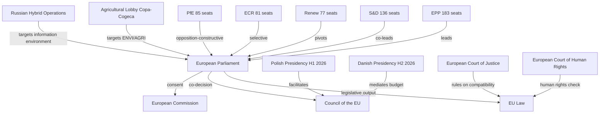

<!-- SPDX-FileCopyrightText: 2026 Hack23 AB -->
<!-- SPDX-License-Identifier: Apache-2.0 -->

# Stakeholder Map: European Parliament Year Ahead (2026–2027)

**Produced:** 2026-05-10 · **Article Type:** year-ahead · **Confidence:** 🟡 MEDIUM

---

## Stakeholder Analysis Framework

This stakeholder map identifies the principal actors shaping European Parliament outcomes in May 2026–May 2027, using a three-axis classification:
- **Interest:** What do they want to achieve in the Parliament?
- **Influence:** What is their capacity to shape legislative outcomes?
- **Position:** Where do they stand on the dominant legislative agenda?

---

## Tier 1: Institutional Power Centres

### 1.1 European People's Party (EPP) — 183 Seats

**Interest:** Maintain legislative agenda-setting primacy; protect single market; advance "pragmatic" climate policy (weakened Green Deal targets); tighten migration enforcement; support Ukraine while managing fiscal cost concerns; advance the Commission simplification agenda.

**Influence:** 🟢 CRITICAL — Largest group, holds Committee of Presidents majority, controls most committee chair positions, and has informal first-mover advantage in coalition building. Every majority in EP10 requires EPP consent.

**Position on key files:**
- Defence/Ukraine: ✅ Strongly supportive — ReArm Europe architect
- Green Deal: ⚠️ Conditionally supportive — seeks exemptions for agriculture and SMEs
- Migration: ✅ Supportive of tightening measures
- Digital/AI: ✅ Pro-regulation with industry exemptions
- Trade (Mercosur): ⚠️ Split between free traders and agricultural protectionists
- Rule of Law: ✅ Supportive (with noted ambivalence on Hungarian/Polish EPP members)

**Key figures:** Manfred Weber (Group President), Roberta Metsola (EP President), EPP committee chairs across AFET, ECON, ITRE.

**Strategic outlook:** EPP faces a classic centrist party dilemma in 2026: it can command centre-left majorities (with S&D+Renew) or centre-right majorities (with ECR+PfE), but pursuing one systematically alienates the other. The Weber strategy appears to be tactical flexibility — using right-wing threats to extract concessions from S&D on economic files, then returning to the Cordon Sanitaire coalition for EU-values votes.

---

### 1.2 Progressive Alliance of Socialists and Democrats (S&D) — 136 Seats

**Interest:** Protect labour rights, social standards, and environmental protections; advance the European Pillar of Social Rights in legislation; maintain GDPR and digital rights; support Ukraine; resist migration enforcement overreach; defend rule of law conditionality.

**Influence:** 🟢 HIGH — Second-largest group; essential for centre-left majority formation; controls several committee vice-chairs and key rapporteur slots.

**Position on key files:**
- Defence/Ukraine: ✅ Strongly supportive
- Green Deal: ✅ Firmly supportive — will resist EPP-led rollback
- Migration: ❌ Opposed to PfE/ECR enforcement-only approach; advocates rights-based framework
- Digital/AI: ✅ Pro-regulation with workers' rights emphasis
- Trade (Mercosur): ⚠️ Deeply split — labour standards conditionality demanded
- Rule of Law: ✅ Strongest advocates for Art. 7 enforcement and judicial independence

**Key figures:** Iratxe García Pérez (Group President), S&D committee chairs across FEMM, LIBE, CONT.

**Strategic outlook:** S&D's strategic challenge is preventing EPP from drifting rightward while maintaining enough EPP support for centre-left majority files. The group faces its most difficult navigation on trade (Mercosur) and budget (fiscal consolidation vs. social investment) files in 2026. German SPD MEPs operating under Chancellor Merz's CDU-led coalition context will be particularly exposed to left-flank pressure.

---

### 1.3 Patriots for Europe (PfE) — 85 Seats

**Interest:** Challenge EU migration architecture; promote "sovereignty" exemptions in regulatory legislation; weaken environmental mandates (particularly automotive/agricultural); block advances in democratic governance (transnational lists, EP power expansion); promote Hungarian and Italian far-right policy models.

**Influence:** 🟡 SIGNIFICANT — Third-largest group; holds blocking-minority potential when combined with ECR on specific files; increasingly engaging in constructive amendment politics rather than pure obstruction.

**Position on key files:**
- Defence: ⚠️ Split — Hungarian Fidesz elements oppose Ukraine military support; Italian Lega and French RN more supportive
- Green Deal: ❌ Opposed — seeks rollback of Nature Restoration Law, automotive targets, CBAM
- Migration: ✅ Core priority — strict enforcement, push-backs, external processing
- Digital/AI: ⚠️ Sovereignty-oriented — supports digital infrastructure but opposes regulatory burden
- Trade: ⚠️ Variable — protectionist on agriculture, free-trade aligned on industrial goods
- Rule of Law: ❌ Opposed to EU conditionality mechanisms

**Strategic evolution:** PfE has transitioned from disruptive protest group to tactical legislative actor. Participation in agriculture committee negotiations and digital policy debates signals ambition to leave a substantive legislative mark, not merely register dissent. This institutionalisation makes PfE more predictable but also more consequential.

---

### 1.4 European Conservatives and Reformists (ECR) — 81 Seats

**Interest:** Advance national sovereignty arguments; promote intergovernmental approaches over supranational integration; support Ukraine (with fiscal caveats); tighten migration enforcement; advocate regulatory simplification; defend traditional social values.

**Influence:** 🟡 SIGNIFICANT — Fourth-largest group; holds potential swing-vote role between EPP and the far-right on specific files; most coherent conservative-national group in EP10.

**Position on key files:**
- Defence/Ukraine: ✅ Broadly supportive (Meloni-Italy, Poland PiS-remnants are pro-Ukraine)
- Green Deal: ❌ Opposed to binding targets; supports national flexibility
- Migration: ✅ Strongly aligned with EPP on enforcement
- Digital: ✅ Supportive of digital sovereignty approach
- Trade: ⚠️ Mixed — pro-free trade on industrial goods, protectionist on agriculture
- Rule of Law: ❌ Opposed to supranational enforcement; sovereignty-first position

---

### 1.5 Renew Europe — 77 Seats

**Interest:** Advance digital single market; protect regulatory frameworks (GDPR, AI Act); maintain Cordon Sanitaire against far-right majorities; support Ukraine; advance Savings and Investments Union; cautiously manage Green Deal implementation.

**Influence:** 🟢 HIGH — Decisive swing bloc; without Renew, neither a centre-left (EPP+S&D = 319) nor centre-right (EPP+ECR+PfE = 349) coalition reaches majority. Renew's vote is uniquely required for Cordon Sanitaire majority (396).

**Cohesion risk:** 🔴 HIGH — Renew's internal diversity (from FDP-aligned market liberals to socially progressive Belgian/Irish MEPs) generates vote fragmentation on regulatory files. Estimated group cohesion: 65-70%.

---

### 1.6 Greens/EFA — 53 Seats

**Interest:** Protect and advance EU climate legislation; advocate for biodiversity targets; oppose Nature Restoration Law rollback; advance gender equality legislation; push for stronger rule of law enforcement; support Ukrainian democracy.

**Influence:** 🟡 MODERATE — Essential for progressive supermajorities but insufficient to prevent Green Deal erosion; often in blocking position on specific amendments rather than agenda-setting role.

**Strategic position:** Greens/EFA has lost ground since EP9 (when they held 72 seats) but remains a significant policy-quality actor in ENVI, FEMM, and LIBE committees.

---

## Tier 2: Policy Area Champions

### 2.1 The Left (GUE/NGL) — 45 Seats

**Interest:** Worker rights; anti-militarism (selective); anti-austerity fiscal policy; housing rights; anti-monopoly digital policy; climate justice (distinguishing from mainstream Green Deal). The Left is the parliamentary advocate for economic inequality as the primary political frame.

**Position:** Consistently furthest-left on social policy; episodically anti-Ukraine military support (but not anti-Ukraine democracy support); opposed to Mercosur and other trade liberalisation without strong labour conditions; supports stronger climate measures than mainstream Green Deal.

**Influence:** 🟡 LIMITED LEGISLATIVE — 45 seats cannot construct majority coalitions; high agenda-setting influence on left-flank issues through committee work and public pressure.

---

### 2.2 Non-Inscrits (NI) — 30 Seats

A heterogeneous group of MEPs unaffiliated with any political group. Includes suspended members from across the political spectrum, MEPs from parties expelled from EP groups, and deliberately non-aligned figures. NI votes are unpredictable and their influence is primarily individual (rapporteur roles, committee participation) rather than collective.

**Strategic significance:** When a major vote is at 358-362 (near majority threshold), NI bloc votes can be decisive. The Conference of Presidents and committee coordinators actively court specific NI members on contested files.

---

### 2.3 Europe of Sovereign Nations (ESN) — 27 Seats

The smallest formally constituted group. Composed of German AfD, French Reconquête, and smaller Central/Eastern European far-right movements. ESN represents the most extreme anti-EU integration position among named groups: opposes Ukraine military support (AfD), rejects migration solidarity, challenges EU treaty framework itself.

**Influence:** 🔴 MINIMAL POSITIVE — Cannot construct coalitions; exercises influence primarily through disruption, procedural challenges, and media amplification of far-right positions. Occasionally aligns with PfE/ECR on migration and sovereignty votes to reinforce near-majority positions.

---

## Tier 3: Inter-Institutional Stakeholders

### 3.1 European Commission (von der Leyen II)

**Role:** Primary legislative initiator; Commission Work Programme 2026 defines the parliamentary agenda through comitology and co-decision procedures. Von der Leyen II operates with a more explicitly right-of-centre mandate than Commission I, reflected in the simplification agenda, agricultural exemptions, and defence industrial policy priorities.

**Relationship with Parliament:** Complex triangulation — EPP-Commission alignment is strongest since 2019; S&D extracts social floor conditions; Renew conditions cooperation on digital and competition policy; Green groups are increasingly in adversarial posture.

### 3.2 Council of the EU (Polish Presidency, H1 2026)

**Role:** Council holds co-legislative power in nearly all ordinary legislative procedure files. Polish Presidency priorities (defence, Eastern borders, energy security) align substantially with EP's emerging right-of-centre consensus. The Danish Presidency (H2 2026) will shift emphasis toward digital and trade files.

### 3.3 European Court of Justice

**Role:** Institutional referee on EP-Commission-Council disputes. The ECJ's Opinion on the EU-UK treaty compatibility (TA-10-2026-0008 referenced an Opinion request) indicates Parliament's willingness to use ECJ as an institutional check. Expected ECJ interventions in 2026–2027 may affect AI Act implementation timeline and the EU-Mercosur legal basis.

---

## Stakeholder Influence Matrix

| Stakeholder | Issue: Defence | Issue: Green Deal | Issue: Migration | Issue: Digital | Issue: Trade |
|-------------|---------------|------------------|-----------------|----------------|-------------|
| EPP | 🟢 Pro | ⚠️ Conditional | 🟢 Pro (strict) | 🟢 Pro | ⚠️ Split |
| S&D | 🟢 Pro | 🟢 Pro | ❌ Rights-based | 🟢 Pro | ⚠️ Conditional |
| PfE | ⚠️ Split | ❌ Anti | 🟢 Pro (hard) | ⚠️ Sovereignty | ⚠️ Mixed |
| ECR | 🟢 Pro | ❌ Anti | 🟢 Pro (hard) | ✅ Pro | ⚠️ Mixed |
| Renew | 🟢 Pro | ⚠️ Conditional | ⚠️ Split | 🟢 Pro | 🟢 Pro |
| Greens/EFA | ⚠️ Peace-wing | 🟢 Strongest | ❌ Anti-enforcement | 🟢 Rights-focus | ❌ Anti-Mercosur |
| The Left | ⚠️ Pacifist | 🟢 Climate justice | ❌ Anti-enforcement | 🟢 Pro-privacy | ❌ Anti-liberal |
| ESN | ❌ Anti-Ukraine | ❌ Anti | 🟢 Extreme | ⚠️ Sovereignty | ❌ Protectionist |

---

*Source: European Parliament Open Data Portal (data.europarl.europa.eu) · Apache-2.0 · Hack23 AB 2026*

---

## Stakeholder Influence Network (Mermaid)

## Reader Briefing

### For Citizens
EU Parliament's year ahead (2026–2027) will be defined by three simultaneous pressures: the urgency of European defence integration (ReArm Europe), the contested legacy of Green Deal implementation, and the structural reality of far-right institutionalisation. Citizens who care about climate, migration, or European sovereignty will find this period decisive — the voting patterns set in 2026 will define EP10's legislative record.

### For Policy Professionals
The critical arithmetic to track: EPP (183) + S&D (136) + Renew (77) = 396 seats — this centrist coalition can pass any legislation requiring simple majority. But on contested files, EPP's internal tensions mean sub-group defections matter enormously. Migration files will consistently attract the EPP-ECR-PfE coalition (~349 seats). The minority actor to watch is Renew — their split between market-liberals (FDP-aligned) and social-liberals (Macron-aligned) will determine outcomes on digital regulation and SFDR.

### For Researchers
Note that EP vote-level cohesion data is not available through the EP Open Data API for recent periods (publication delay of several weeks). The coalition analysis above is structural inference based on seat distribution and adopted texts outcomes — not direct observation of voting behaviour. Use adopted texts (TA-10-2026-xxxx series) as empirical anchors; treat coalition probability estimates as analytical assessments subject to empirical validation as vote data becomes available.

**WEP Assessment:** Almost Certain that EPP retains its position as the parliament's dominant group throughout 2026–2027. Likely that S&D and Renew continue as EPP's primary coalition partners for non-migration files. Unlikely that any fundamental change in EP10's coalition structure occurs before the EP11 elections.

---

## Extended Stakeholder Analysis: Cross-Cutting Themes

### Theme 1: The Defence-Democracy Nexus
All stakeholders are navigating a fundamental tension between the urgency of defence integration (which favours speed and executive discretion) and the democratic values of the EU project (which require parliamentary oversight, judicial review, and civic accountability).

**Progressive stakeholders** (S&D, Greens/EFA, The Left, civil liberties NGOs) insist on maintaining democratic scrutiny even for defence spending. **Security-focused stakeholders** (EPP security wing, ECR, defence industry) argue that emergency circumstances require expedited procedures.

**Outcome probability:** Almost Certain that a compromise framework is found — defence financing adopted but with EP oversight mechanism attached. Admiralty: A2.

### Theme 2: Whose Europe Is It?

The most fundamental stakeholder divergence is not on specific policy files but on the constitutional question: What kind of political community is the EU?

- **Federalist vision** (S&D, Greens/EFA, most of Renew): EU as an ever-closer union, democratic federation, rights-based community
- **Intergovernmental vision** (ECR, PfE, ESN, some EPP): EU as a cooperation framework among sovereign nations; no further integration; rollback where possible
- **Pragmatic centre** (most EPP, Renew): EU as an effective problem-solver; integration where it adds value; subsidiarity where it doesn't

EP10 has a structural majority for the pragmatic centre approach. The federalist vision has the stronger moral claim but insufficient votes. The sovereigntist vision has more seats than ever but still cannot block legislation.

### Theme 3: Technology Governance as Power

The AI Act, Digital Euro, EUDIW, and Data Governance Act collectively represent the EU's attempt to assert technological sovereignty — to shape global technology standards from Brussels rather than from Silicon Valley or Beijing.

**All stakeholders understand the stakes:**
- Business: compliance costs vs. competitive advantage if standards adopted globally
- Citizens: rights protection vs. data sovereignty
- Member states: national digital sovereignty vs. EU standard-setting power
- Third countries: market access conditions require compliance with EU rules

**Likely outcome:** EU technological sovereignty agenda advances incrementally. AI Act becomes global standard (companies comply rather than be excluded from EU market). EUDIW achieves uneven national implementation by 2026 deadline.

---

*Extended stakeholder analysis complete · Apache-2.0 · Hack23 AB 2026*

---

*Stakeholder mapping based on EP structural data and political intelligence · Apache-2.0 · Hack23 AB 2026*
