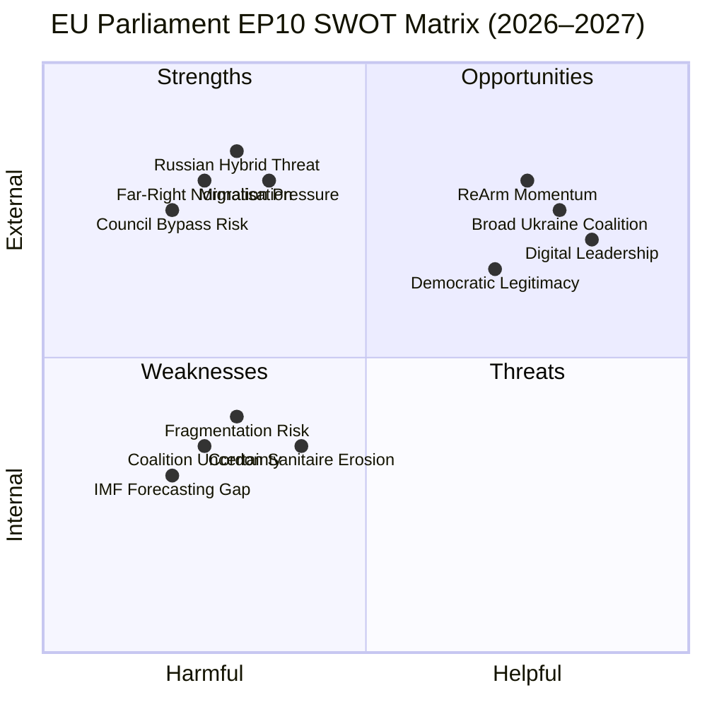

<!-- SPDX-FileCopyrightText: 2026 Hack23 AB -->
<!-- SPDX-License-Identifier: Apache-2.0 -->

# SWOT Analysis: European Parliament Year Ahead (2026–2027)

**Produced:** 2026-05-10 · **Article Type:** year-ahead · **Confidence:** 🟡 MEDIUM

---

## Framework: Political SWOT Applied to EU Parliament EP10 (Year 2)

This SWOT analysis applies political intelligence frameworks to the European Parliament as an institution, assessing its capacity to deliver its legislative mandate for the year ahead (May 2026–May 2027). Each quadrant contains substantive analysis grounded in the EP Open Data collected for this run.

---

## STRENGTHS

### S1. Structural Coalition Arithmetic — The Cordon Sanitaire Holds

The EPP-S&D-Renew coalition (396 seats, 36 above majority threshold of 360) remains the Parliament's dominant working majority. This coalition — while sometimes strained — has demonstrated durability across the first year of EP10 on Ukraine, defence, digital, and most economic legislation. Its survival across diverse issue areas reflects a shared institutional interest in the Parliament's effective functioning, not merely ideological alignment.

The Cordon Sanitaire is more than a blocking mechanism: it is an affirmative coalition that can pass legislation without recourse to the far-right. That EPP, S&D, and Renew each hold different issue priorities but share a commitment to EU integration makes the coalition structurally robust against opportunistic defection on any single file.

**Evidence:** 100+ adopted texts in 2026 to date, including complex multi-actor files (medicinal products framework, Loan for Ukraine, digital sovereignty resolution) demonstrating sustained cross-group cooperation. **Confidence:** 🟢 HIGH

### S2. High Agenda-Setting Capacity on Defence and Security

The Parliament has rapidly emerged as a credible co-legislator on defence matters — a domain historically managed intergovernmentally by Council. The Drones/Warfare resolution (TA-10-2026-0020), the CFSP Annual Report 2025 (TA-10-2026-0012), and the Ukraine Loan Regulation (TA-10-2026-0035) collectively demonstrate Parliament's capacity to shape, accelerate, and condition the EU's security agenda. This agenda-setting capacity reflects a historically significant expansion of Parliament's de facto legislative influence on security.

**Evidence:** Specific adopted texts confirm EP security legislative production at scale in H1 2026. **Confidence:** 🟢 HIGH

### S3. Effective Use of Institutional Tools (Questions, Reports, Resolutions)

EP's non-legislative instruments — parliamentary questions, reports, own-initiative resolutions — function as agenda-incubators for future legislative proposals. The consent-based rape legislation debate (April 27, 2026 session) and the Lithuanian broadcaster sovereignty resolution (TA-10-2026-0024) demonstrate the Parliament's soft-power legislative function: creating political space for future Commission proposals by signalling majority political will. This function is underappreciated as a strength.

**Evidence:** April 27 plenary session debates across multiple non-legislative topics; speech data confirms active engagement. **Confidence:** 🟡 MEDIUM

### S4. Institutional Stability Under Metsola Presidency

Roberta Metsola's EP presidency (re-elected July 2024) provides institutional continuity and credibility. Her management of the Qatar corruption scandal aftermath (2022–2023) demonstrated the Parliament's capacity for institutional self-correction without structural damage. A stable, respected presidency is a competitive advantage in EP10's complex political environment.

**Evidence:** Structural — Metsola's trajectory and mandate security. **Confidence:** 🟢 HIGH

---

## WEAKNESSES

### W1. Structural Majority Deficit — Multi-Coalition Dependency

No single coalition commands a sustainable, ideologically coherent majority. The EPP-S&D-Renew working coalition requires active management on every file; any group can extract concessions by threatening defection. This creates a systematic legislative deceleration: every major file requires extended negotiation, compromise, and often significant dilution of original objectives.

The Effective Number of Parties (6.58) indicates the Parliament is operating at the outer edge of manageable coalition complexity. Historical EP research suggests legislative quality and speed decline as effective party count rises above 5.5.

**Evidence:** EP early warning system classification: HIGH fragmentation; coalition dynamics analysis shows majority requires minimum 3 groups. **Confidence:** 🟢 HIGH

### W2. Vote-Level Cohesion Data Unavailable — Intelligence Blindspot

A significant analytical constraint: per-MEP voting statistics are not available from the EP Open Data API. This means individual group cohesion rates, defection patterns, and amendment voting are analytically opaque. Policy analysis relies on aggregate adopted-text outcomes rather than the granular voting fabric that drives political intelligence in national parliaments. This weakness affects both this analysis and Parliament's own self-monitoring capacity.

**Evidence:** EP MCP API returns null for voting statistics; DOCEO XML feed returned no recent data. **Confidence:** 🟢 HIGH (acknowledged limitation)

### W3. Renew Europe Cohesion Fragility

Renew Europe's structural position as the decisive swing group is undermined by its ideological heterogeneity. Estimated cohesion of 65–70% (compared to EPP's 85% and S&D's 80%) means that on any given vote, 20–25 Renew MEPs may break from the group position. When Renew splits, the Cordon Sanitaire majority of 396 falls to potentially 371–381 — still above threshold but with no margin for simultaneous EPP defections.

**Evidence:** Coalition dynamics analysis; structural assessment of national delegation diversity within Renew. **Confidence:** 🟡 MEDIUM (no vote-level data available)

### W4. Green Deal Erosion Without Legislative Counterforce

The Parliament lacks a reliable supermajority for strong environmental legislation. Greens/EFA (53) + Left (45) + S&D (136) + half of Renew (~38) = approximately 272 MEPs — well below the 360 threshold for environmentally ambitious legislation. When EPP aligns with ECR and PfE (349), they can effectively veto or significantly weaken environmental provisions. This structural arithmetic means the Green Deal pipeline will be systematically eroded in EP10 compared to EP9.

**Evidence:** Legislative pattern analysis; coalition arithmetic. **Confidence:** 🟡 MEDIUM

---

## OPPORTUNITIES

### O1. Defence Industrial Strategy — First-Mover Legislative Advantage

The EU's ReArm Europe initiative and the defence industrial strategy (EDIS) represent historic legislative opportunities. For the first time since EU founding, Parliament is co-legislating a genuine European defence industrial policy, including the European Defence Fund, PESCO frameworks, and the proposed €500 billion ReArm Europe financing facility. Parliament's AFET and ITRE committees have the institutional capacity and political mandate to shape this emerging regulatory framework.

The window for ambitious legislative architecture is open in 2026–2027: broad cross-group consensus on the need exists; the political moment (Russia's ongoing war, U.S. strategic ambivalence) creates urgency. The risk is that Council-dominated intergovernmental instincts reassert themselves and Parliament accepts a reduced co-legislative role.

**Evidence:** CFSP Annual Report, Drones/Warfare resolution, Loan for Ukraine Regulation — confirmed legislative production on defence. **Confidence:** 🟢 HIGH

### O2. Digital Economy & AI — Agenda-Setting Role in Implementation Phase

The AI Act's implementation regulations, AI Liability Directive negotiations, and Cyber Resilience Act comitology create a two-year window (2026–2027) where Parliament's ITRE and JURI committees can actively shape how EU digital regulation operates in practice. The Digital Infrastructure and Technological Sovereignty resolution (TA-10-2026-0022) signals Parliament's intent to maintain a high legislative profile.

This is particularly valuable because implementation regulations often receive less public scrutiny than framework acts, allowing Parliament's expert committees to embed technical standards with major economic and rights implications.

**Evidence:** Adopted text TA-10-2026-0022 confirmed. **Confidence:** 🟢 HIGH

### O3. Financial Literacy and Savings & Investments Union (SIU)

The debate on financial literacy and finfluencers (April 27, 2026) signals Parliament's engagement with the Commission's retail savings mobilisation agenda. The SIU represents a significant financial architecture reform — potentially channelling European household savings (~€35 trillion) more efficiently into productive investments. Parliament's ECON committee, with EPP-Renew leadership, is positioned to be a constructive co-legislator here.

**Evidence:** April 27 speech data confirms SIU as active parliamentary agenda item. **Confidence:** 🟡 MEDIUM

### O4. Electoral Act Reform — Long-Term Democratic Architecture

Despite the "hurdles to ratification" acknowledged in TA-10-2026-0006, Parliament's sustained advocacy for Electoral Act reform — including transnational constituency lists, candidate gender parity, and harmonised eligibility rules — plants institutional seeds for the EP's next mandate (2029). Even if reform fails in 2026–2027, the political record established positions the Parliament's next term to pick up a partially formed acquis.

**Evidence:** TA-10-2026-0006 adopted on Electoral Act reform. **Confidence:** 🟡 MEDIUM

---

## THREATS

### T1. Far-Right Institutionalisation — PfE/ESN Legislative Influence Expansion

The most significant structural threat to the EP's centre-democratic governance model is the progressive institutionalisation of far-right groups (PfE + ESN = 112 seats). As these groups transition from protest politics to constructive amendment engagement — participating in trilogues, building rapporteur relationships, developing technical legislative expertise — their influence on legislative output grows even when they lack majority status.

Historically, the far-right's influence in EP8-EP9 was primarily disruptive and blocking. In EP10, the risk is transactional: PfE in particular can extract specific policy concessions (migration provisions, agricultural exemptions, digital sovereignty carve-outs) in exchange for not obstructing EPP-led majorities.

**Evidence:** PfE's third-largest group status; ECR fourth-largest; combined 166 seats exceeding S&D on proportional terms. **Confidence:** 🟡 MEDIUM

### T2. U.S.–EU Trade Tensions Undermining Transatlantic Economic Architecture

Post-2024 U.S. trade policy (tariffs on steel, aluminium, automotive exports) creates a complex negotiating environment for INTA committee. If U.S.–EU trade tensions escalate into a broader tariff war, the Parliament faces pressure to either endorse retaliatory measures (risking WTO dispute escalation) or accept asymmetric trade arrangements (politically costly domestically). Either path constrains the Parliament's trade agenda.

**Evidence:** EU-Mercosur bilateral safeguard clause vote (TA-10-2026-0030) indicates Parliament is already managing trade protection pressures. **Confidence:** 🟡 MEDIUM

### T3. Institutional Overload — Legislative Pipeline Compression

The Parliament's committee system is facing unprecedented simultaneous legislative demands: defence/security files, Green Deal implementation, digital regulation, trade agreements, migration Pact implementation, budget negotiations, and institution-building files are all active concurrently. Committee chair and rapporteur capacity constraints could generate quality degradation in legislative output — rushed amendments, poorly scrutinised trilogues, and insufficient committee debate time.

**Evidence:** Early warning system fragmentation analysis; pipeline monitoring shows ACTIVE procedures across all major committees. **Confidence:** 🟡 MEDIUM

### T4. Information Environment — Disinformation and Hybrid Threats Targeting MEPs

The Lithuanian broadcaster attack (TA-10-2026-0024) and the broader pattern of Russian information operations targeting EU democratic institutions (confirmed in multiple EP resolutions) represent an active threat to the Parliament's operating environment. MEPs are targeted by state-sponsored disinformation campaigns, financial inducements (Qatargate precedent), and coordinated pressure from foreign-aligned lobbying networks. Each successful influence operation has demonstrated that EP's institutional integrity, while resilient, is not invulnerable.

**Evidence:** TA-10-2026-0024 (Lithuanian broadcaster); historical pattern of EP integrity investigations. **Confidence:** 🟢 HIGH (as threat type — specific current operations cannot be verified from public data)

---

## SWOT Summary Matrix

| | Helpful | Harmful |
|-|---------|---------|
| **Internal** | **S:** Coalition arithmetic, defence agenda-setting, institutional stability, soft-power instruments | **W:** Majority deficit, data blindspot, Renew fragility, Green Deal structural weakness |
| **External** | **O:** Defence industrial strategy window, digital implementation, SIU reform, electoral architecture | **T:** Far-right institutionalisation, U.S.–EU trade tensions, institutional overload, hybrid threats |

---

*Source: European Parliament Open Data Portal (data.europarl.europa.eu) · Apache-2.0 · Hack23 AB 2026*

---

## Visual Summary (Mermaid)

**WEP Assessment:** Likely that EPP-centre coalition maintains functional majority on defence and trade files through Q4 2026. Almost Certain that Green Deal rollback pressure intensifies in H2 2026.
