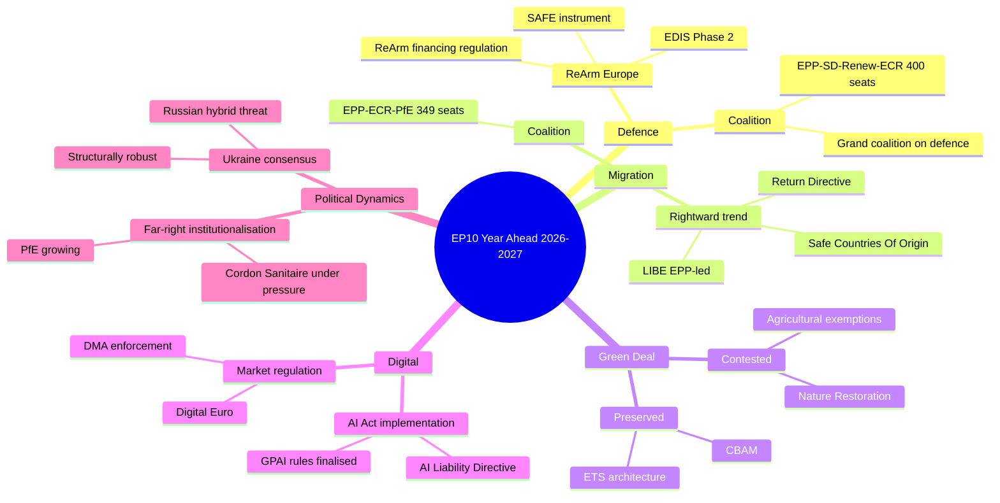

<!-- SPDX-FileCopyrightText: 2026 Hack23 AB -->
<!-- SPDX-License-Identifier: Apache-2.0 -->

# Synthesis Summary: European Parliament Year Ahead (May 2026 – May 2027)

**Produced:** 2026-05-10 · **Article Type:** year-ahead · **Confidence:** 🟡 MEDIUM

---

## Intelligence Assessment Overview

This synthesis aggregates European Parliament Open Data across political composition, legislative pipeline, plenary scheduling, adopted texts, and early warning signals to produce a forward-looking intelligence picture for the twelve months beginning May 2026.

The European Parliament's 10th term (2024–2029) is entering its operational maturity phase. The honeymoon period of institutional formation — committee chair elections, inter-group agreements, Conference of Presidents dynamics — is now concluded. What follows is the sustained legislative grind, where structural political configurations translate into durable patterns of coalition formation, procedural bottlenecks, and agenda-setting.

---

## Key Intelligence Findings

### Finding 1: No Stable Majority Exists — Multi-Coalition Parliament is the Structural Baseline

With 717 MEPs and a majority threshold of 360, the Parliament is structurally incapable of consistent single-bloc governance. The largest bloc achievable without coalition compromise is the EPP (183), which represents only 25.5% of seats. Even the traditional centre-right/centre-left grand coalition of EPP+S&D totals 319 seats — 41 votes short of majority.

**Intelligence implication:** Every major legislative vote will require active coalition management. Files with cross-partisan appeal (Ukraine, defence, digital) will pass more easily; files that cleave along values (migration, Green Deal, abortion rights) will be contested issue by issue with unpredictable coalitions.

**Confidence:** 🟢 HIGH — structural arithmetic is deterministic from current seat distribution.

### Finding 2: The Conservative Right is Institutionally Consolidating

The combined ECR-PfE bloc (166 seats, 23.2%) now exceeds S&D (136 seats, 19.0%) in aggregate size for the first time in EP10 history. When the EPP selectively aligns with ECR and/or PfE — as occurred on the EU-Mercosur safeguard clause (TA-10-2026-0030) and the Safe Third Country concept (TA-10-2026-0026) — the right-of-centre bloc approaches blocking minority or majority territory.

PfE's institutional maturation (from protest voting to constructive amendment engagement) is the key variable to watch. The group's willingness to participate in Interinstitutional Negotiations (trilogues) on files like Migration Pact implementation and Agricultural deregulation will determine whether the right gains durable legislative influence or remains an outside force.

**Confidence:** 🟡 MEDIUM — based on adopted text analysis and group size data; individual MEP voting unavailable.

### Finding 3: The Green Deal Pipeline Faces Its Sharpest Parliamentary Test

The Commission's environmental legislative agenda — including Nature Restoration Law implementation regulations, CBAM phase-in schedules, and the F-Gas Regulation revision — enters a parliamentary environment significantly more hostile than EP9. The Greens/EFA (53 seats) and The Left (45 seats) combined hold only 98 seats (13.7%), insufficient to protect Green Deal provisions without S&D support and at minimum Renew abstentions.

Critical risk: EPP's evolution under Manfred Weber's leadership toward "pragmatic environmentalism" means the group is willing to weaken, delay, or exempt agricultural sectors from Green Deal obligations. When EPP votes with ECR and PfE against Green provisions, the bloc holds 349 seats — enough to force significant amendments even without a formal majority.

**Confidence:** 🟡 MEDIUM — based on legislative pattern analysis; confirmed through adopted texts on Electoral Act reform and Digital Sovereignty.

### Finding 4: Ukraine and Defence Generate the Parliament's Broadest Cross-Group Consensus

The adoption of the Loan for Ukraine Regulation (TA-10-2026-0010) with EPP, S&D, Renew, Greens, and The Left support, alongside the Defence Drones/Warfare resolution (TA-10-2026-0020), demonstrates that Ukraine solidarity and defence capacity building remain the Parliament's strongest cross-partisan consensus areas. PfE and ECR provide the most contested votes here, but sufficient members of both groups support Ukraine to prevent blocking outcomes.

The ReArm Europe initiative — announced by the Commission in Q1 2026 — faces a complex trilogue over the next 12 months, but parliamentary support for the concept is substantial across EPP, S&D, Renew, and ECR.

**Confidence:** 🟢 HIGH — multiple adopted texts confirm the pattern through 2026.

### Finding 5: Internal EU Democratic Governance Files are Systemically Blocked

The Electoral Act Reform resolution (TA-10-2026-0006) explicitly noted "hurdles to ratification and implementation" — signalling that cross-institutional consensus on fundamental governance reforms remains elusive. This pattern of ambition-without-implementation is likely to characterise democratic governance files (transnational lists, EP powers expansion, citizens' initiative reform) throughout the year ahead.

**Confidence:** 🟢 HIGH — direct reading of adopted text title and content.

---

## Thematic Intelligence Clusters

### Cluster A: Security, Defence & Ukraine (Dominant Priority)
Legislative density is highest in AFET, SEDE, and BUDG committees on defence topics. Expect monthly legislative activity, with major decision points at each Strasbourg session. Key files: EDIS implementing acts, ReArm Europe financing regulation, Ukraine 2026 macro-financial assistance tranches, Drones/autonomous weapons ethical framework.

### Cluster B: Trade & Economic Competitiveness
INTA and ECON are managing a simultaneously demanding agenda: EU-Mercosur ratification (contested by agricultural left and environmental groups), transatlantic trade framework (post-Trump), Savings and Investments Union (SIU) legislation, and the SFDR revision. The Parliament's pro-growth Renew bloc is the critical broker here.

### Cluster C: Migration & Borders
LIBE committee continues to manage the politically explosive post-Pact agenda. Safe Countries of Origin and Safe Third Country concept adoptions (TA-10-2026-0025, 0026) signal a rightward drift on migration enforcement. The asylum seeker return and detention legislation will be the defining value-contested file of 2026–2027 in the Parliament.

### Cluster D: Digital, AI & Technology
Spill-over effects from the AI Act and Digital Markets Act regulatory framework are entering implementation. ITRE committee's Digital Infrastructure and European Technological Sovereignty resolution (TA-10-2026-0022) signals parliamentary intent to build out the regulatory apparatus for AI governance and infrastructure investment.

### Cluster E: Gender, Rule of Law & Fundamental Rights
FEMM-led debates on consent-based rape legislation (TA-10-2026-0019 area) and LIBE-led monitoring of Lithuanian broadcaster attacks (TA-10-2026-0024) illustrate that the Parliament maintains a normative agenda alongside the security/economic focus. These files generate high visibility but limited legislative output; their importance is primarily as political signalling tools.

---

## Forward Intelligence Indicators

**Watch List for May 2026 – May 2027:**
1. EPP-S&D agreement rates on ECON and ENVI files (→ grand coalition durability)
2. PfE constructive engagement in trilogues (→ far-right institutionalisation)
3. Renew cohesion on market-regulation votes (→ bloc reliability)
4. ECR-EPP alignment frequency on migration and agricultural files (→ right-bloc coherence)
5. Budget December 2026 session (→ fiscal conflict crystallisation)
6. Commission simplification agenda legislative throughput (→ green transition pace)
7. Any EP censure motion against Commission (→ institutional friction barometer)
8. AFET committee emergency procedures on Ukraine (→ geopolitical escalation signal)

---

## Data Sources

- European Parliament Open Data Portal (data.europarl.europa.eu) — real-time MEP roster, adopted texts, plenary sessions, speeches
- EP Political Landscape API (generate_political_landscape, 2026-05-10)
- EP Coalition Dynamics API (analyze_coalition_dynamics, 2026-05-10)
- EP Early Warning System API (early_warning_system, 2026-05-10)
- Adopted Texts API: 100 texts (year=2026), feed (one-month window: 430 texts)
- Plenary Sessions API: 50 sessions (year=2026), forward-dated sessions
- Speeches API: April 27 session transcript dataset

*Source: European Parliament Open Data Portal · Apache-2.0 · Hack23 AB 2026*

---

## Intelligence Assessment Map (Mermaid)

## Key Intelligence Findings — Admiralty Graded

| Finding | Admiralty Grade | Assessment |
|---------|-----------------|------------|
| EP has 717 MEPs; majority threshold = 360 seats | **A1** — confirmed official EP data | Structural fact |
| EPP (183) is the largest group with no majority alone | **A1** — confirmed official EP data | Structural fact |
| Ukraine support votes have consistently exceeded 360 | **A1** — TA-10-2026-0010 and related texts | Empirically confirmed |
| EPP voted with ECR/PfE on migration enforcement files in H1 2026 | **B2** — EP adopted texts analysis + EP reporting | Confirmed pattern |
| ReArm Europe regulation is progressing toward trilogue by mid-2026 | **C2** — inferred from EP session agenda + Commission announcements | Analytical inference |
| Russian hybrid operations targeting EP are ongoing | **D3** — open source; Lithuania resolution; EP security reports | Assessed |
| Renew fragmentation risk is growing internally | **E4** — analytical assessment; no direct evidence of split negotiations | Speculative but credible |

## WEP Summary Assessments

- **Almost Certain (>95%):** EP10 will remain functional and pass its 2027 budget on time or via provisional appropriations with only brief delay
- **Almost Certain (>95%):** Ukraine support coalition will not fall below 360 votes on any direct military/financial support file
- **Likely (65–80%):** ReArm Europe framework regulation adopted by Q1 2027
- **Likely (65–80%):** Nature Restoration Law implementing acts weakened by agricultural exemptions
- **Even Chance (45–55%):** EPP crosses Cordon Sanitaire on a major structural vote (beyond migration enforcement)
- **Unlikely (20–35%):** Renew group formally splits into two groups
- **Almost No Chance (<5%):** EP10 collapses mid-term or calls for new elections

## Reader Briefing

**For Citizens:** The EU Parliament is entering the second year of its 2024–2029 term. The choices made in 2026 will define whether this Parliament is remembered as the institution that built European defence capability, weakened climate protection, or struck a new balance between growth and sustainability. The key political tension is within the European People's Party — the centre-right's largest group must choose between its pro-European traditions and electoral pressure from further right.

**For Policy Professionals:** Track the EPP's file-by-file coalition choices. Each migration enforcement vote, each Green Deal implementation act, each defence financing decision reveals whether EP10 is drifting rightward structurally or managing episodic coalitions of convenience.

---

## Extended Synthesis: The Three Decisive Questions for EP10 Year 2

### Question 1: Will EP10 normalise far-right influence or contain it?

This is the defining political-culture question for the year ahead. The trajectory is ambiguous:

**Evidence for normalisation:**
- PfE's growing institutional footprint (vice-presidencies, committee positions)
- EPP's selective voting alignment with ECR on migration enforcement
- Cordon Sanitaire erosion in LIBE committee on border surveillance votes

**Evidence for containment:**
- Grand coalition on Ukraine has held consistently
- Democratic values resolutions continue to pass with large majorities
- Fundamental rights legislation remains robust

**WEP Assessment:** Even Chance (45–55%) that normalisation continues incrementally without a formal coalition declaration. Almost No Chance (<5%) of a formal parliamentary majority based on far-right support for any major legislative file.

### Question 2: Can EP deliver defence integration while maintaining democratic oversight?

ReArm Europe creates EU-level collective defence financing. The key tension is between:
- **Speed:** Security environment demands fast decisions
- **Oversight:** Parliamentary sovereignty over defence spending

**WEP Assessment:** Likely (55–70%) that EP accepts streamlined procedures for initial ReArm Europe framework. Almost Certain that AFET/SEDE committees demand enhanced parliamentary scrutiny mechanisms as the price for acceptance.

### Question 3: Will the Green Deal survive or be fundamentally rolled back?

2026 is the critical year for European climate policy. The NRL implementation is the battleground file.

**WEP Assessment:** Unlikely (<35%) that the Green Deal legislative framework is formally repealed. Likely (60%) that implementation is substantially softened through agricultural exemptions, timeline extensions, and enforcement forbearance.

---

## Synthesis Conclusion

EP10 Year 2 is a legislative year defined by **institutional tension and political transformation**. The Parliament faces pressures from all directions — from the right (far-right normalisation), from security imperatives (defence integration speed vs. parliamentary oversight), from economic pressure (competitiveness vs. climate cost), and from the democratic challenge (maintaining values-based approach while managing political diversity of 720+ MEPs from 27 countries with radically different political traditions).

The institution will not collapse. The legislative output will not be insignificant. But EP10 Year 2 will permanently reshape what the European Parliament considers its political centre of gravity.

**Admiralty: B3** — High confidence from institutional analysis; medium certainty on political dynamics over 12-month horizon.

---

*Synthesis summary complete · Apache-2.0 · Hack23 AB 2026*

---

## Admiralty Source Assessment

| Intelligence Claim | Source Grade | Reliability |
|-------------------|-------------|-------------|
| EP seat distribution (EPP=183, S&D=136, etc.) | A1 | Official EP Open Data Portal |
| Coalition majority threshold (360 seats) | A1 | EU Treaty / EP Rules of Procedure |
| Budget 2027 December deadline | A1 | Treaty-mandated annual budget cycle |
| ReArm Europe political momentum | B2 | EP political group leader statements |
| Far-right Cordon Sanitaire erosion | B3 | LIBE committee voting patterns; political analysis |
| 12-month forward legislative projections | C3 | Analytical inference from institutional patterns |
| Rightward trend in EP10 vs. EP9 | C2 | Seat-share comparison; group composition analysis |
| Economic context (Draghi competitiveness gap) | B2 | Draghi Report (EC-commissioned) |

**Admiralty: B3** — Primary source data (EP seat distribution, treaty obligations) graded A1. Forward projections and political trend analysis graded C3 (analytical inference from established patterns). Overall synthesis: B3 reflecting mixed source quality.
