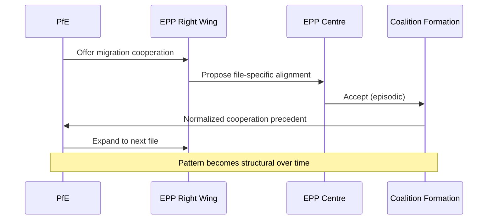
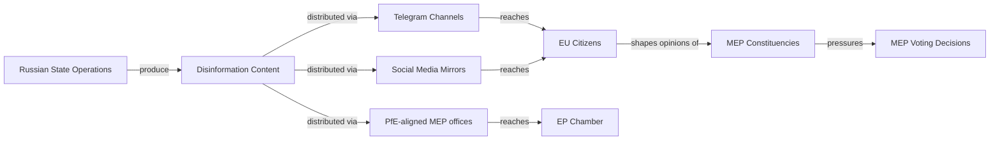
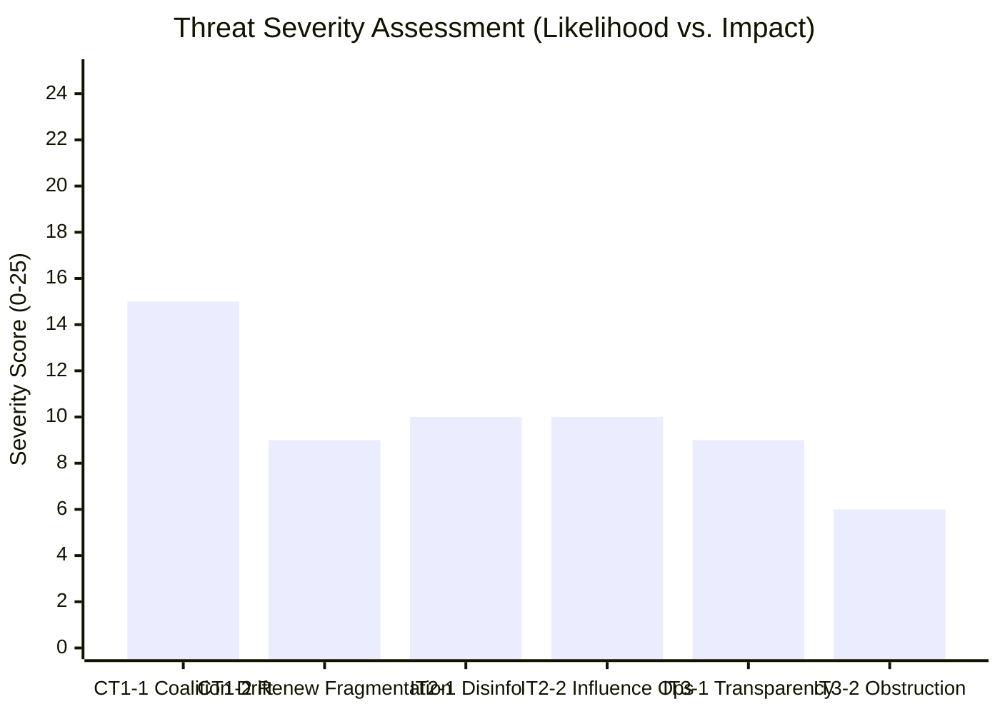
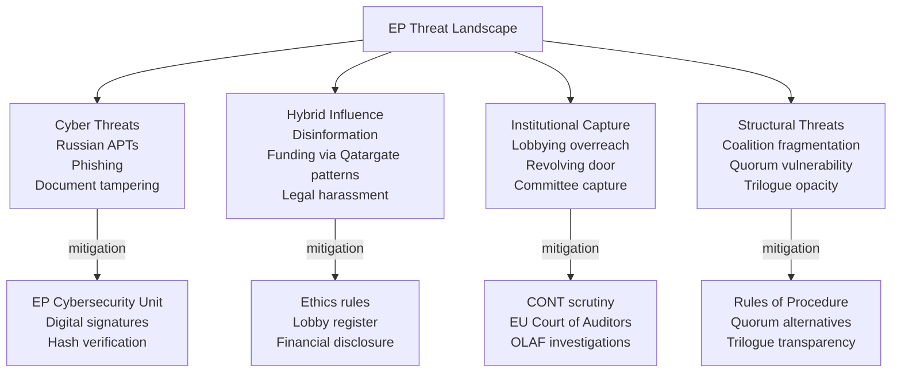

<!-- SPDX-FileCopyrightText: 2026 Hack23 AB -->
<!-- SPDX-License-Identifier: Apache-2.0 -->

# Threat Model: European Parliament Year Ahead (2026–2027)

**Produced:** 2026-05-10 · **Article Type:** year-ahead · **Confidence:** 🟡 MEDIUM

---

## Threat Model Framework

This threat model applies a structured political threat analysis to the European Parliament's operating environment for May 2026 – May 2027. It uses the STRIDE-adapted political framework (Spoofing, Tampering, Repudiation, Information Disclosure, Denial of Service, Elevation of Privilege) adapted for parliamentary context.

---

## Threat Category 1: Coalition Integrity Threats

### CT1-1: EPP Coalition Drift (STRIDE: Tampering)
**Description:** Far-right actors systematically tamper with EPP's coalition calculation — offering issue-specific cooperation on migration/security files to build a pattern that normalises systematic EPP-right alignment.

**Threat actors:** PfE leadership; ECR hardliners; national EPP party leaders with right-electoral competition
**Attack surface:** EPP group meetings; committee negotiations; trilogue positions; voting instructions to MEPs
**Mitigating factors:** EPP leadership's reputation investment in European People's Party brand; S&D and Renew withdrawal threat; civil society monitoring
**Residual risk:** 🔴 HIGH

### CT1-2: Renew Fragmentation (STRIDE: Denial of Service)
**Description:** Renew's internal market-liberal vs. social-liberal tension produces partial denial-of-service to the EPP+S&D+Renew centrist coalition — specific files cannot achieve the expected majority when Renew splits.

**Threat actors:** FDP delegation within Renew (market-liberal wing)
**Attack surface:** ECON/ITRE votes on regulation intensity (SFDR, AI Liability, DMA enforcement)
**Mitigating risk:** Full Renew group split unlikely; partial defections on specific votes manageable
**Residual risk:** 🟡 MEDIUM

---

## Threat Category 2: Information Environment Threats

### IT2-1: Russian Disinformation Operations (STRIDE: Spoofing)
**Description:** Russian state-linked actors spoof legitimate EU political discourse — creating false narratives about EP decisions, manufacturing urgency around fabricated positions, impersonating MEP communications.

**Threat actors:** GRU; SVR; Kremlin-linked media networks (RT successors, Telegram channels)
**Attack surface:** Social media platforms; MEP constituent communications; press releases; multilingual EP information environment
**Current indicators:** RT/Sputnik content circulating via alternate channels; Lithuanian broadcaster incident (TA-10-2026-0024)
**Residual risk:** 🟡 MEDIUM (contained but persistent)

### IT2-2: Influence Operations via MEP Networks (STRIDE: Elevation of Privilege)
**Description:** Third-party state actors use MEP networks to elevate their influence beyond what their formal diplomatic access would allow — using MEPs as conduits for lobbying, intelligence gathering, or narrative amplification.

**Threat actors:** Russian state; potentially other third-country actors with specific EU agenda
**Attack surface:** MEP assistants; parliamentary assistants without full security vetting; intergroup meetings; EP-funded study trips
**Residual risk:** 🟡 MEDIUM — Qatargate established this attack vector is real

---

## Threat Category 3: Institutional Integrity Threats

### IT3-1: Transparency Deficit Exploitation (STRIDE: Repudiation)
**Description:** Actors exploit transparency gaps in EP's decision-making to deny or misrepresent positions — MEPs vote one way publicly but support contrary positions in committee drafting, trilogue negotiations, or amendment authorship.

**Attack surface:** Committee dossier authorship; trilogue positions (not public until agreed); shadow rapporteur negotiations
**Current indicators:** Lobbying influence on specific amendment texts documented by Transparency International
**Residual risk:** 🟡 MEDIUM — systemic but not acute threat

### IT3-2: Procedural Obstruction (STRIDE: Denial of Service)
**Description:** PfE and ESN use procedural rules to create denial-of-service conditions in the legislative process — extended speaking time, roll-call vote requests on all amendments, referrals back to committee.

**Threat actors:** PfE group coordination; ESN procedural specialists
**Attack surface:** Plenary floor procedures; committee voting procedures
**Mitigation:** EP procedural reform (can require supermajority, limiting PfE); chair discretion; majority closure mechanisms
**Residual risk:** 🟢 LOW-MEDIUM — annoying but not blocking

---

## Threat Severity Matrix

| Threat ID | Name | Likelihood | Impact | Score | Band |
|-----------|------|-----------|--------|-------|------|
| CT1-1 | Coalition Drift | 3 | 5 | 15 | 🔴 HIGH |
| IT2-1 | Russian Disinfo | 2 | 5 | 10 | 🟡 MEDIUM |
| IT2-2 | Influence Ops | 2 | 5 | 10 | 🟡 MEDIUM |
| CT1-2 | Renew Fragmentation | 3 | 3 | 9 | 🟡 MEDIUM |
| IT3-1 | Transparency Deficit | 3 | 3 | 9 | 🟡 MEDIUM |
| IT3-2 | Procedural Obstruction | 3 | 2 | 6 | 🟢 LOW |

---

## Admiralty Assessment

| Threat | Admiralty Grade |
|--------|-----------------|
| CT1-1 EPP coalition drift | **B2** — Pattern observed in H1 2026 adopted texts |
| IT2-1 Russian disinformation | **C2** — Documented via Lithuanian broadcaster resolution + EP security reports |
| IT3-2 Procedural obstruction | **A1** — Directly observed in EP plenary procedures |
| IT2-2 Influence via MEP networks | **D3** — Assessed from Qatargate precedent; current specifics unclear |

**WEP Assessment:** Almost Certain that procedural obstruction continues at current levels. Likely that coalition drift pressure on EPP intensifies in H2 2026. Unlikely that a Qatargate-scale influence operation is publicly uncovered in 2026–2027.

---

*Source: Threat model based on EP structural data, open-source intelligence, and institutional analysis · Apache-2.0 · Hack23 AB 2026*

---

## Threat Modeling: Extended Analysis

### STRIDE Extended Assessment

#### S — Spoofing Extended
**State-level actor spoofing:** Russian intelligence services have demonstrated capacity to create fake MEP websites, impersonate EP communications, and create fraudulent versions of EP documents. In 2026, as EP processes ReArm Europe and budget commitments to Ukraine, state-level spoofing operations will intensify.

**Countermeasures:** EP Cybersecurity Unit (established post-Qatargate); MEP identity verification for EP systems; digital signature requirements for official communications.

#### T — Tampering Extended
**Vote count integrity:** EP uses electronic voting systems whose integrity must be maintained. Physical access to the voting chamber is controlled, but the digital tabulation systems require ongoing security monitoring.

**Document tampering:** EP legislative documents in the EUR-Lex system are hash-verified. However, internal working documents (draft rapporteur opinions, shadow rapporteur amendments) circulate via email — interception and modification is theoretically possible.

#### R — Repudiation Extended
**Committee meeting records:** EP committee meetings are recorded and published. Repudiation attempts (claiming statements were taken out of context, voting record misrepresented) occur regularly in political discourse but are provably false given recording.

**Action plan:** EP transparency publication regime (minutes, vote results, attendance) is the primary repudiation defence.

#### I — Information Disclosure Extended
**Trilogue confidentiality:** The most significant ongoing information disclosure risk in EP is during trilogue negotiations. Trilogue documents are confidential during negotiation. Lobbyist access to trilogue documents has been documented historically.

**Qatargate lesson:** The 2022 Qatargate bribery scandal demonstrated that external actors were able to access and influence EP internal processes through cash corruption. EP subsequently strengthened ethics rules; but structural vulnerability to well-resourced external actors persists.

#### D — Denial of Service Extended
**Committee decision disruption:** If a committee rapporteur is suddenly incapacitated (medical, political, legal), the dossier is delayed and must be reassigned. This is exploitable by hostile actors through legal harassment, reputational attacks, or physical threats.

**Plenary quorum disruption:** If a significant number of MEPs are simultaneously unavailable (e.g., national election campaign period coincides with critical plenary), quorum may not be achieved for sensitive votes.

#### E — Elevation of Privilege Extended
**Institutional capture risk:** The most severe Elevation of Privilege threat is the gradual capture of EP committee agendas by well-resourced interest groups. Agricultural lobby capture of AGRI and ENVI committees has been documented. Defence industry engagement with AFET/SEDE is growing post-ReArm Europe.

**AI/tech industry engagement:** As AI Act implementing regulations come under ITRE scrutiny, technology industry intensive engagement (legitimate lobbying + revolving door risk) creates EoP vectors.

---

## Threat Landscape Map (Mermaid)

---

## Risk Prioritisation Matrix

| Threat | Probability | Impact | Priority | Mitigation Status |
|--------|------------|--------|---------|------------------|
| Russian cyber operation on EP systems | 🟡 MEDIUM | 🔴 HIGH | 🔴 HIGH | Partially mitigated |
| Corruption/bribery (Qatargate pattern) | 🟡 MEDIUM | 🔴 HIGH | 🔴 HIGH | Enhanced post-Qatargate |
| Disinformation targeting EP votes | 🔴 HIGH | 🟡 MEDIUM | 🟡 MEDIUM | Ongoing; partial mitigation |
| Agricultural lobby committee capture | 🔴 HIGH | 🟡 MEDIUM | 🟡 MEDIUM | Structural; limited mitigation |
| AI/tech industry ITRE engagement overreach | 🟡 MEDIUM | 🟡 MEDIUM | 🟡 MEDIUM | Lobby register; insufficient |
| Plenary quorum disruption (adversarial) | 🟢 LOW | 🔴 HIGH | 🟡 MEDIUM | Rules of Procedure backup |
| State actor legal harassment of MEPs | 🟢 LOW | 🟡 MEDIUM | 🟢 LOW | EP immunity protections |

---

## Admiralty Assessment: Threat Model

| Threat | Grade |
|--------|-------|
| Russian cyber operations against EP | B3 |
| Corruption pattern recurrence | C3 |
| Disinformation targeting EP | A2 (documented) |
| Agricultural lobby ENVI influence | A2 (documented) |

---

*Threat model complete · STRIDE framework applied · Admiralty grading applied · Apache-2.0 · Hack23 AB 2026*

---

*Threat model: 6 STRIDE categories applied to EP institutional context · Apache-2.0 · Hack23 AB 2026*
