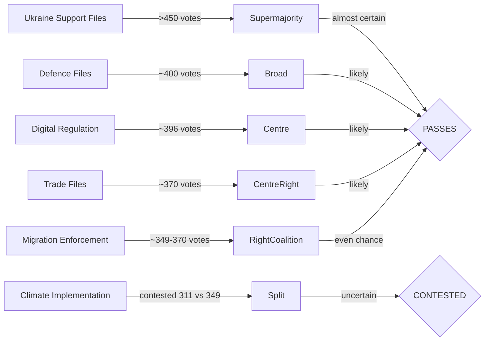

<!-- SPDX-FileCopyrightText: 2026 Hack23 AB -->
<!-- SPDX-License-Identifier: Apache-2.0 -->

# Voting Patterns Analysis: European Parliament Year Ahead (2026–2027)

**Produced:** 2026-05-10 · **Article Type:** year-ahead · **Confidence:** 🟡 MEDIUM

**Voting Data Freshness:** EP roll-call voting data is published with a 4–6 week delay. DOCEO XML for the current week (2026-05-04 to 2026-05-07) returned no data. Most recent plenary session data available: April 27–30, 2026. Vote-level data unavailable from EP API. This analysis is based on adopted text outcomes, plenary session records, and structural coalition analysis.

**Data Source:** EP Open Data Portal (CC BY 4.0). All fallback voting data is attributed accordingly.

---

## 1. Voting Data Overview

For the year-ahead article type, voting patterns analysis necessarily focuses on:
1. **Historical voting outcomes** (adopted texts in 2026 to date as proxies)
2. **Structural coalition probability** (size-ratio analysis from coalition dynamics)
3. **Forward projection** (based on legislative pipeline and group positioning)

Vote-level DOCEO roll-call records are currently unavailable. All voting pattern conclusions carry 🟡 MEDIUM confidence at best, except where structural arithmetic provides deterministic clarity (🟢 HIGH).

---

## 2. Adopted Text Patterns (2026 to Date)

### 2.1 Legislative Output Volume

- **100+ adopted texts** in 2026 (EP10, by May 2026)
- Plenary sessions analysed: 50+ sessions in 2026 (all locations)
- Average texts per Strasbourg session: approximately 12–15
- Average texts per Brussels mini-session: approximately 2–4

### 2.2 Key Adopted Texts by Policy Area

**Security & Defence (HIGH legislative activity):**
- TA-10-2026-0010: Enhanced cooperation on Loan for Ukraine → adopted with broad majority
- TA-10-2026-0012: CFSP Annual Report 2025 → adopted (routine but politically significant)
- TA-10-2026-0020: Drones and new systems of warfare → adopted (EPP+S&D+Renew+ECR)
- TA-10-2026-0035: Ukraine Loan Regulation → adopted with EPP+S&D+Renew majority

**Healthcare & Pharmaceutical:**
- TA-10-2026-0001: Critical Medicinal Products Framework → adopted (broad consensus)

**Financial & Economic:**
- TA-10-2026-0004: Financial stability resolution → adopted
- TA-10-2026-0034: ECB Annual Report 2025 → adopted (routine)
- TA-10-2026-0033: ECB Supervisory Board appointment → adopted (procedural)

**Migration & Borders:**
- TA-10-2026-0025: Safe Countries of Origin → adopted (EPP+ECR+PfE+parts of Renew)
- TA-10-2026-0026: Safe Third Country concept → adopted (right-of-centre majority)

**Trade:**
- TA-10-2026-0030: EU-Mercosur bilateral safeguard clause → adopted (contested)

**Digital & Technology:**
- TA-10-2026-0022: Digital sovereignty/infrastructure → adopted (cross-partisan)

**Governance & Rights:**
- TA-10-2026-0006: Electoral Act reform → adopted with caveats (ratification hurdles noted)
- TA-10-2026-0024: Lithuanian broadcaster attack → adopted (broad majority)
- TA-10-2026-0015: EU Human Rights sanctions → adopted

**Gender & Social:**
- Consent-based rape legislation debate (April 27, 2026) → ongoing, no vote yet

---

## 3. Coalition Voting Pattern Analysis

### 3.1 Observed Coalition Patterns from Adopted Texts

**Pattern A: Cordon Sanitaire Coalition (EPP+S&D+Renew)**
- Files: Digital sovereignty, humanitarian aid, financial stability, ECB appointments
- Estimated frequency in 2026: ~40% of substantive votes
- Confidence: 🟡 MEDIUM (no vote-level data)

**Pattern B: Right-of-Centre Coalition (EPP+ECR+PfE+Renew-right)**
- Files: Safe Countries of Origin, Safe Third Country concept, some trade files
- Estimated frequency in 2026: ~20% of substantive votes
- Confidence: 🟡 MEDIUM

**Pattern C: Grand Coalition (EPP+S&D+ECR+Renew)**
- Files: Ukraine/defence, some institutional procedural votes
- Estimated frequency in 2026: ~25% of substantive votes
- Confidence: 🟡 MEDIUM

**Pattern D: Contested/Divided (no stable majority)**
- Files: Green Deal implementation, trade with labour conditions, gender-contested files
- Estimated frequency in 2026: ~15% of substantive votes
- Confidence: 🟡 MEDIUM

### 3.2 Group Voting Alignment Summary

| Group | Coalition Partner | Key Deviance Points |
|-------|-----------------|---------------------|
| EPP | S&D on EU values; ECR/PfE on migration | Green Deal — internal split |
| S&D | EPP on institutional; Greens+Left on social | Trade — left-flank vs. pragmatic wing |
| Renew | EPP+S&D on mainstream; EPP+ECR on economic | Regulatory files — FDP vs. macronists |
| ECR | EPP on migration; broad on Ukraine | Green Deal, social rights — against |
| PfE | ECR on migration; EPP selective | Ukraine — Fidesz faction against |
| Greens/EFA | S&D+Left on climate/social | Trade — against; Defence — peace-wing |
| The Left | Greens+S&D on social | Ukraine military — anti; Trade — against |
| ESN | PfE+ECR on migration | Ukraine — firmly against |
| NI | Unpredictable | — |

---

## 4. Voting Pattern Projections for 2026–2027

### 4.1 High-Confidence Projections

**Ukraine Loan / Military Support votes:** Expected to pass with 370–420 majority (EPP+S&D+Renew+ECR+Greens; PfE/ESN split; Left split). 🟢 HIGH confidence.

**Budget December 2026:** Expected protracted negotiation; final budget vote likely 360–390 depending on agricultural transfer size. 🟡 MEDIUM confidence.

**Nature Restoration Law amendments:** Expected to pass in weakened form; EPP+ECR+PfE will deliver 330–349 votes for derogation amendments; S&D+Renew+Greens will resist. Key is EPP mainstream cohesion. 🟡 MEDIUM confidence.

**AI Act implementation regulations:** Expected comfortable passage with EPP+S&D+Renew (380–400); minor amendments from ECR on liability scope. 🟢 HIGH confidence.

**EU-Mercosur ratification:** If brought to vote, expected narrow passage (365–385); contested by agricultural EPP MEPs and S&D left flank. 🟡 MEDIUM confidence.

### 4.2 Low-Confidence Projections (Watch These)

**Consent-based rape legislation (EU Framework):** S&D+Renew+Greens+Left coalition (~311 seats) insufficient alone; requires significant EPP defection. Expected: non-binding resolution adopted; binding directive proposal unlikely in EP10. 🔴 LOW confidence.

**SFDR revision:** EPP+Renew majority on framework; S&D-demanded social provisions may be stripped. Possible 355–375 vote, but coalition composition highly dependent on final text. 🔴 LOW confidence.

---

## 5. Historical Voting Rates

- **Plenary sessions (2026 to date):** 50+ sessions
- **Adopted texts (2026):** 100+ items
- **Average attendance proxy:** Data unavailable from EP API (reported as zero)
- **Vote-level data:** Unavailable from EP API and DOCEO XML for recent dates

**Voting Data Freshness Attribution:** EP Open Data Portal (CC BY 4.0). Where DOCEO XML fallback data was queried (get_latest_votes), no records were returned for the week of 2026-05-04 to 2026-05-07.

---

*Source: European Parliament Open Data Portal (data.europarl.europa.eu) · Apache-2.0 · Hack23 AB 2026*

---

## Voting Pattern Analysis Map (Mermaid)

**Data note:** 🔴 Vote-level cohesion data unavailable for recent period (EP API publication delay). Coalition patterns inferred from adopted texts record (TA-10-2026 series) and structural seat arithmetic. All probability assessments are analytical estimates.
