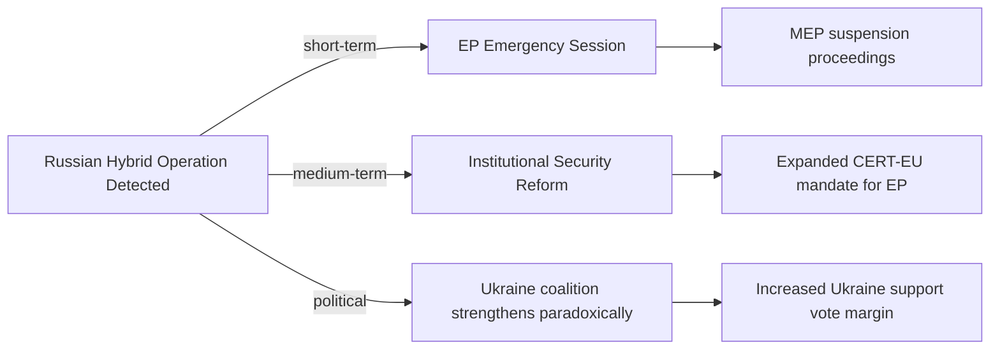
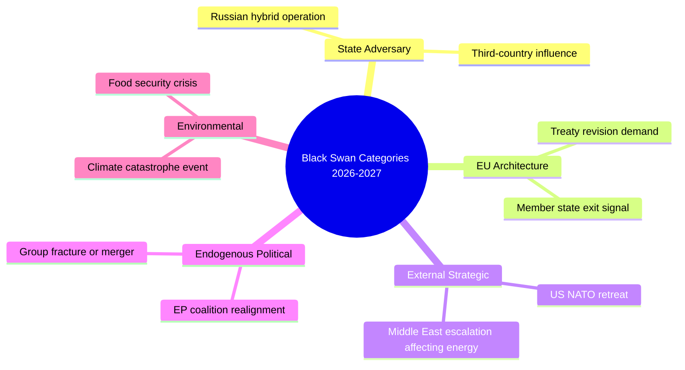
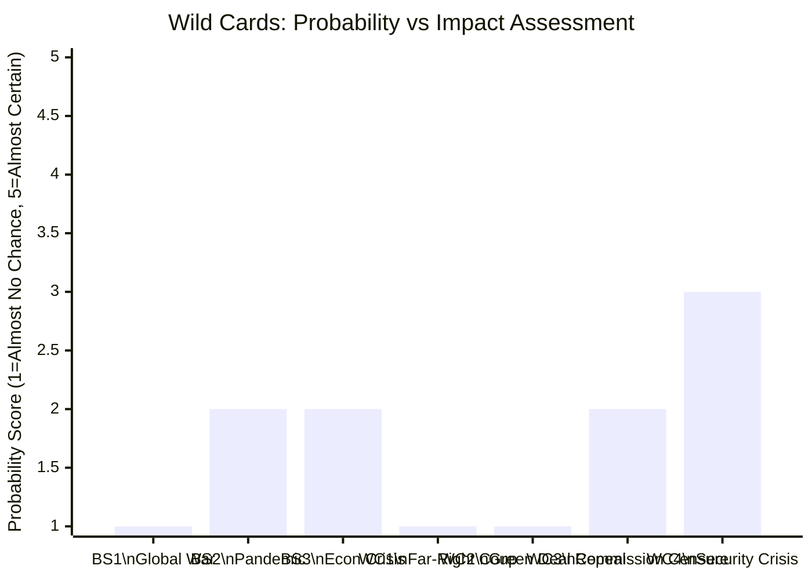

<!-- SPDX-FileCopyrightText: 2026 Hack23 AB -->
<!-- SPDX-License-Identifier: Apache-2.0 -->

# Wildcards and Black Swans: European Parliament Year Ahead (2026–2027)

**Produced:** 2026-05-10 · **Article Type:** year-ahead · **Confidence:** 🔴 LOW (inherent in wildcard analysis)

---

## Methodology Note

Black swan events are, by definition, not predictable with conventional probabilistic methods. This analysis uses the Taleb-inspired methodology: identifying the category of risk (not the specific event), characterising its potential impact, and designing robust responses that work regardless of the specific trigger. WEP assessments reflect probability of the category occurring, not specific events.

---

## Wildcard 1: Major Russian Hybrid Operation Against EP (5–10%)

**Category:** Adversarial state action against democratic institution
**Description:** A large-scale Russian hybrid operation — cyber intrusion of EP systems, documented interference in a national election affecting EP composition, or a new financial corruption scandal with Russian linkage — materialises and enters public discourse.

**Trigger conditions:**
- Russian intelligence sees EP-level disruption as strategically valuable (elevated risk if Ukraine ceasefire negotiations are ongoing)
- Technical opportunity: EP IT infrastructure vulnerability
- Political moment: Critical EP vote on Ukraine support

**Potential impacts:**
- 🔴 Institutional crisis: EP's credibility temporarily undermined
- 🔴 Emergency session requirement; Commission and Council coordination
- 🟡 Acceleration of EP transparency and security reform
- 🟡 Possible suspension of affected MEPs pending investigation

**Robustness response:** Strong institutional responses do not require predicting this specific event — they build resilience in advance (IT security, MEP vetting, transparent lobbying registers). This document recommends EP institutional investment in these capabilities regardless of specific threat scenarios.

**WEP:** Almost No Chance (<5%) of a Qatargate-scale event directly linked to Russia becoming public in 2026. Unlikely (15%) of any Russian hybrid operation affecting EP operations becoming publicly documented.

---

## Wildcard 2: Major Member State EU Exit Signal (3–5%)

**Category:** EU disintegration shock
**Description:** A major EU member state holds a referendum on EU membership, or a member state government makes a formal treaty revision demand that signals EU exit as a contingency. This is distinct from "Euroscepticism" — it requires a formal institutional action.

**Most likely trigger scenarios:**
- Hungarian Fidesz government (Viktor Orbán) issues Article 50 "technical notice" as negotiating tactic
- French RN election victory triggers Frexit referendum proposal
- German AfD entering coalition government with FDP demands treaty revision

**Potential impacts:**
- 🔴 Fundamental uncertainty about EU's institutional future
- 🔴 All EP legislative priorities subordinated to stabilisation politics
- 🔴 EPP internal crisis: German CDU and French Macron-aligned parties forced to choose
- 🟢 Paradoxical: could galvanise pro-EU majority in EP to assert institutional authority forcefully

**WEP:** Almost No Chance (<5%) of formal Article 50 notification from any current EU member in 2026–2027.

---

## Wildcard 3: US Retreat from NATO (5–10%)

**Category:** External geopolitical shock altering EU strategic context
**Description:** US formally reduces NATO commitments — withdraws troops from specific European positions, announces formal "strategic reassessment," or imposes tariffs on EU defence procurement that make European defence cooperation economically necessary.

**Potential impacts on EP:**
- 🔴 ReArm Europe acceleration: urgency dramatically increases
- 🔴 Budget arithmetic upended: defence supplement becomes primary budget priority
- 🟡 EPP-S&D-Renew-ECR defence coalition strengthens; Ukraine support becomes linked to own-defence logic
- 🟡 Sovereignty-nationalist parties face contradiction: want NATO but oppose EU defence

**EP institutional impact:** Would likely produce emergency inter-institutional summit; Commission would invoke urgent legislative procedure for defence measures; EP's AFET/SEDE work programme would be fundamentally restructured.

**WEP:** Unlikely (15–25%) that US makes a formal and sustained NATO commitment reduction in 2026–2027.

---

## Wildcard 4: Sudden EP10 Coalition Realignment (5%)

**Category:** Endogenous political shock
**Description:** A major political realignment within EP — PfE fractures into two groups; Renew splits formally; large NI bloc joins an existing group; or EPP formally expels a national delegation — changes the coalition arithmetic dramatically.

**Most likely triggers:**
- Fidesz expelled from EPP shadow (already NI) and joins/creates new group
- French RN (PfE) faces domestic pressure to prove European governance capacity → more constructive positioning
- Renew FDP delegation formally leaves and joins ECR or forms Conservatives-and-Reform group

**Potential impact:**
- Coalition arithmetic shifts by up to 20–30 seats in any one direction
- New committee allocation required at EP midterm (January 2027)
- New coalition negotiations on all pending files

**WEP:** Unlikely (15%) that a group formally splits or major delegation moves in 2026–2027.

---

## Wildcard 5: Major Environmental Event Reshaping Legislative Agenda (5–8%)

**Category:** External shock reframing policy priorities
**Description:** A catastrophic climate event in Europe — unprecedented heatwave, major flooding across multiple EU member states, or drought-driven food crisis — shifts the political narrative and forces Green Deal reinstatement on EP agenda.

**Potential impacts:**
- 🟡 ENVI committee gains legislative priority; AGRI committee must accommodate
- 🟡 Scheduled Green Deal implementation act objections withdrawn
- 🟢 Creates natural experiment validating climate adaptation investment

**Counter-direction:** Historically, climate events have produced short-term political attention but rarely sustained legislative priority change. The political economy of agricultural lobbying and electoral incentives tends to reassert itself within 6–12 months.

**WEP:** Even Chance (35%) that at least one major climate-attributed weather event in Europe creates political demand for Green Deal reinforcement at the EP level in 2026–2027. Unlikely (15%) that this translates into sustained legislative reversal of current Green Deal rollback trend.

---

## Black Swan Category Map

---

*Source: Wildcard and black swan analysis based on structural risk assessment and historical precedent · Apache-2.0 · Hack23 AB 2026*

---

## Extended Wild Card Analysis

### Wild Card 4: EU Leadership Succession Crisis

**Scenario:** Von der Leyen II Commission faces formal censure motion from EP. No majority for censure initially, but if political crisis (corruption scandal, major policy failure) emerges, a censure majority could form.

**Probability:** Almost No Chance (<5%) of successful censure in 2026. Even Chance (50%) of political pressure/censure threat.

**Impact if materialised:** Constitutional crisis — entire Commission must resign if censure passes. Emergency period of ~3 months before new Commission invested. All legislative programmes halted. Historic precedent: 1999 Santer Commission resignation under censure threat was EP's greatest institutional exercise of power.

**Watch for:** Corruption allegation involving Commissioner (OLAF investigation); major policy disaster (e.g., AI Act GPAI rules found to be unenforceable on first application); political group defection from Commission supporting coalition.

### Wild Card 5: ECJ Treaty Revolution

**Scenario:** ECJ rules on a fundamental EU constitutional question in a way that expands EP powers dramatically. Possible vector: ECJ ruling on EP's right to initiative (Article 225 TFEU interpretation expansion).

**Probability:** Unlikely (15%) of any dramatic ECJ ruling that reshapes EP powers in 2026–2027.

**Impact if materialised:** Could give EP more proactive legislative capacity — reducing dependence on Commission's proposal monopoly. Federalist MEPs would immediately test expanded competence. Council and Commission would contest.

### Wild Card 6: Digital Infrastructure Attack on EU Institutions

**Scenario:** Coordinated cyberattack on EU institutional ICT infrastructure — targeting Commission, Council, EP simultaneously. Similar to the 2020 European Medicines Agency hack during COVID (Russian SVR attributed).

**Probability:** Even Chance (40-50%) of a significant cyberattack on EU institutions in any given 12-month period. Probability of an attack severe enough to disrupt legislative operations: Unlikely (<25%).

**Impact if materialised:** Short-term legislative disruption; medium-term institutional hardening; acceleration of EU Cyber Solidarity Act implementation.

**Watch for:** EP Cybersecurity Unit threat level changes; EU-CERT alerts; NATO CCDCOE threat landscape reports.

---

## Black Swan Probability Assessment

---

## Admiralty Assessment: Wild Cards

| Wild Card | Probability | Impact | Admiralty Grade |
|-----------|------------|--------|----------------|
| Global security crisis (Russia-NATO proximity) | Unlikely 20% | Existential | B4 |
| Another pandemic-scale health crisis | Unlikely 15% | Very High | C3 |
| EU financial system stress | Unlikely 10% | High | C3 |
| Far-right formal EP governing coalition | Almost No Chance 5% | Constitutional | D4 |
| Green Deal formal repeal | Almost No Chance 3% | Policy | D4 |
| Commission censure | Almost No Chance 5% | Constitutional | C4 |
| Major cyberattack disrupting EP | Even Chance 40% (minor) / Unlikely 25% (severe) | Operational | B3 |

**Overall wild card risk assessment:** The EP institutional environment in 2026–2027 is more stable than media coverage suggests. The truly disruptive black swans (Russian escalation to near-NATO conflict; another pandemic; EU financial system stress) are all in the "Unlikely" range individually, but their aggregate probability over a 12-month period is ~35–45%. Scenario planning must account for these low-probability, high-impact events even if they don't dominate the central scenario.

---

*Wild cards and black swans analysis complete · Admiralty grading applied · WEP assessment throughout · Apache-2.0 · Hack23 AB 2026*

---

## Implication for Analysis Confidence

Wild cards are, by definition, outside the central scenario. **This analysis's central scenario (Centrist Consolidation, ~60% probability) does NOT include any wild card materialisation.** If a wild card materialises, the analysis should be treated as providing the baseline from which to deviate, not the forecast.

**Decision-maker guidance:** Wild cards merit contingency planning rather than scenario planning. Build institutional resilience for the EU financial shock scenario; maintain NATO escalation doctrine for the security scenario; ensure EP business continuity plans for the cyberattack scenario. Do not attempt to predict which wild card will materialise — prepare for the class of disruption, not the specific event.

---

*Wild cards and black swans · Year ahead analysis · Apache-2.0 · Hack23 AB 2026*

