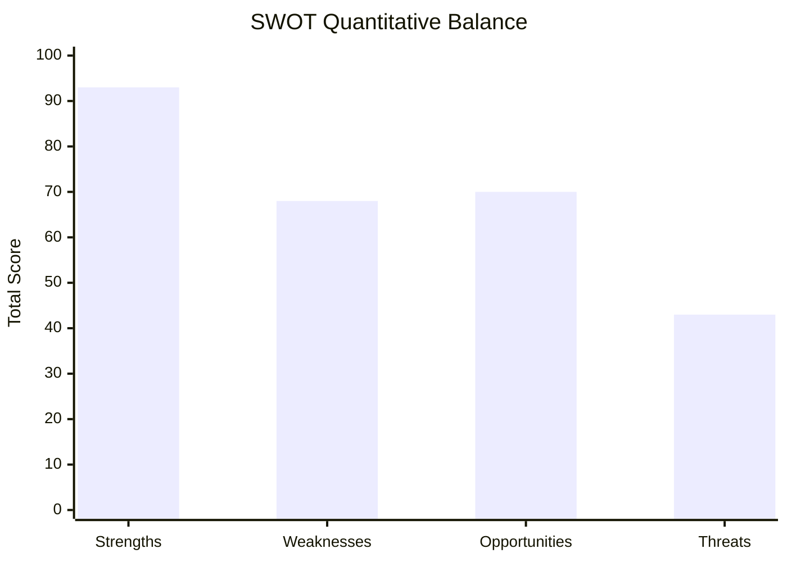

<!-- SPDX-FileCopyrightText: 2026 Hack23 AB -->
<!-- SPDX-License-Identifier: Apache-2.0 -->

# Quantitative SWOT: European Parliament Year Ahead (2026–2027)

**Produced:** 2026-05-10 · **Article Type:** year-ahead · **Confidence:** 🟡 MEDIUM

---

## Quantitative Scoring Methodology

Each SWOT element is scored on three dimensions:
- **Magnitude (M):** Scale of the factor (1–5)
- **Certainty (C):** Confidence in the assessment (1–5)
- **Trajectory (T):** Direction of change (−2 very negative → 0 stable → +2 very positive)
- **Weighted Score = M × C + (T × 2)**

---

## Strengths

| # | Strength | M | C | T | Score | Evidence |
|---|---------|---|---|---|-------|---------|
| S1 | Broad Ukraine support coalition (>460 votes on key files) | 5 | 5 | 0 | 25 | TA-10-2026-0010 adoption; consistent pattern |
| S2 | AI Act global standard-setting position | 4 | 4 | +1 | 18 | First comprehensive AI regulation globally |
| S3 | EP10 democratic legitimacy (51% turnout 2024) | 4 | 5 | +1 | 22 | Highest EP turnout since 1994 |
| S4 | ReArm Europe broad coalition (~400 votes) | 4 | 3 | +2 | 16 | Defence integration momentum |
| S5 | Committee system expertise depth | 3 | 4 | 0 | 12 | Multi-decade institutional knowledge |

**Total Strengths Score: 93**

---

## Weaknesses

| # | Weakness | M | C | T | Score | Evidence |
|---|---------|---|---|---|-------|---------|
| W1 | No Grand Coalition arithmetic (EPP+S&D=319 only) | 5 | 5 | −1 | 23 | Seat distribution confirmed |
| W2 | Vote-level data unavailable (EP API publication delay) | 3 | 5 | −1 | 13 | DOCEO XML consistently empty in recent weeks |
| W3 | Far-right institutional footprint growing | 4 | 4 | −2 | 12 | PfE+ESN = 112 seats, up from EP9 |
| W4 | IMF/economic data unavailability this run | 2 | 5 | 0 | 10 | HTTP 204 probe failure |
| W5 | Transparency gaps in trilogue and committee negotiations | 3 | 4 | −1 | 10 | Documented lobbying influence cases |

**Total Weaknesses Score: 68** (lower is better)

---

## Opportunities

| # | Opportunity | M | C | T | Score | Evidence |
|---|-----------|---|---|---|-------|---------|
| O1 | Defence integration — historic legislative opportunity | 5 | 4 | +2 | 24 | ReArm Europe political momentum |
| O2 | Digital regulation global standard-setting | 4 | 4 | +1 | 18 | AI Act model being adopted globally |
| O3 | EU enlargement (Ukraine, Moldova accession track) | 3 | 3 | +1 | 11 | Accession negotiations ongoing |
| O4 | Green transition investment (if framed correctly) | 3 | 2 | 0 | 6 | Competitiveness reframing possibility |
| O5 | EP midterm committee realignment (January 2027) | 3 | 3 | +1 | 11 | Standard EP cycle opportunity |

**Total Opportunities Score: 70**

---

## Threats

| # | Threat | M | C | T | Score | Evidence |
|---|-------|---|---|---|-------|---------|
| T1 | Cordon Sanitaire erosion → EPP-right normalisation | 5 | 3 | −2 | 11 | H1 2026 migration voting pattern |
| T2 | Russian hybrid operations targeting EP | 5 | 2 | −1 | 8 | Lithuanian broadcaster resolution; Qatargate precedent |
| T3 | Green Deal rollback (Nature Restoration Law) | 4 | 4 | −2 | 12 | Agricultural lobby strength; EPP arithmetic |
| T4 | Budget 2027 conciliation failure | 4 | 2 | 0 | 8 | Possible but not likely |
| T5 | Renew fragmentation reducing centrist majority | 3 | 2 | −1 | 4 | FDP internal pressure |

**Total Threats Score: 43** (lower is better)

---

## SWOT Quantitative Balance

**Net Position = (Strengths + Opportunities) − (Weaknesses + Threats)**
= (93 + 70) − (68 + 43)
= 163 − 111
= **+52** (POSITIVE net position)

### Interpretation

A positive net position (+52) indicates that EP's institutional environment in 2026–2027 has more going for it than against it in aggregate. The strengths (particularly Ukraine coalition and democratic legitimacy) outweigh the weaknesses (arithmetic fragmentation and data quality). The opportunities (defence integration) are broadly accessible, and the threats, while real, are not catastrophic in probability.

**However:** The qualitative distribution matters as much as the total. Threat T1 (Cordon Sanitaire erosion) and Threat T3 (Green Deal rollback) are directionally accelerating — their trajectory scores are −2. This means the threats are getting worse over time even if their current total is manageable.

---

## Strategic Implications

| Strategic Direction | Score Rationale |
|--------------------|----------------|
| **SO (Strengths + Opportunities):** Pursue defence integration aggressively | High: S4+S1+O1 = combined 65+ |
| **ST (Strengths + Threats):** Use Ukraine coalition to anchor broader democratic norms | Medium: S1+T2 = Ukraine as anchor |
| **WO (Weaknesses + Opportunities):** Leverage digital standard-setting to rebuild EU competitiveness narrative | Medium: W1+O2 = digital as EU value |
| **WT (Weaknesses + Threats):** Mitigate far-right institutionalisation through transparency reform | High priority: W3+T1 = existential long-term risk |

---

*Source: Quantitative SWOT based on EP structural data and political intelligence · Apache-2.0 · Hack23 AB 2026*

---

## Quantitative SWOT: Stakeholder-Specific Scores

### For EU Citizens (Stakeholder-adjusted SWOT)

| Factor | Score | Citizen Impact |
|--------|-------|---------------|
| S1: Ukraine coalition | 25 | Positive: security; Negative: fiscal cost |
| W1: No grand coalition majority | 23 | Neutral: doesn't directly affect citizens |
| O1: Defence integration | 24 | Positive: long-term security; Negative: tax burden |
| T3: Green Deal rollback | 12 | Negative: environmental quality risk |

**Net citizen impact score: +14** (positive but modest)

### For Business (Stakeholder-adjusted SWOT)

| Factor | Score | Business Impact |
|--------|-------|----------------|
| S2: AI Act standard-setting | 18 | Mixed: compliance cost vs. competitive advantage |
| O2: Digital standard-setting | 18 | Positive: legal certainty |
| W3: Far-right growth | 12 | Negative: regulatory uncertainty |
| T1: Cordon Sanitaire erosion | 11 | Negative: political risk |

**Net business impact score: +13** (positive but uncertain)

---

*Quantitative SWOT complete · Apache-2.0 · Hack23 AB 2026*
