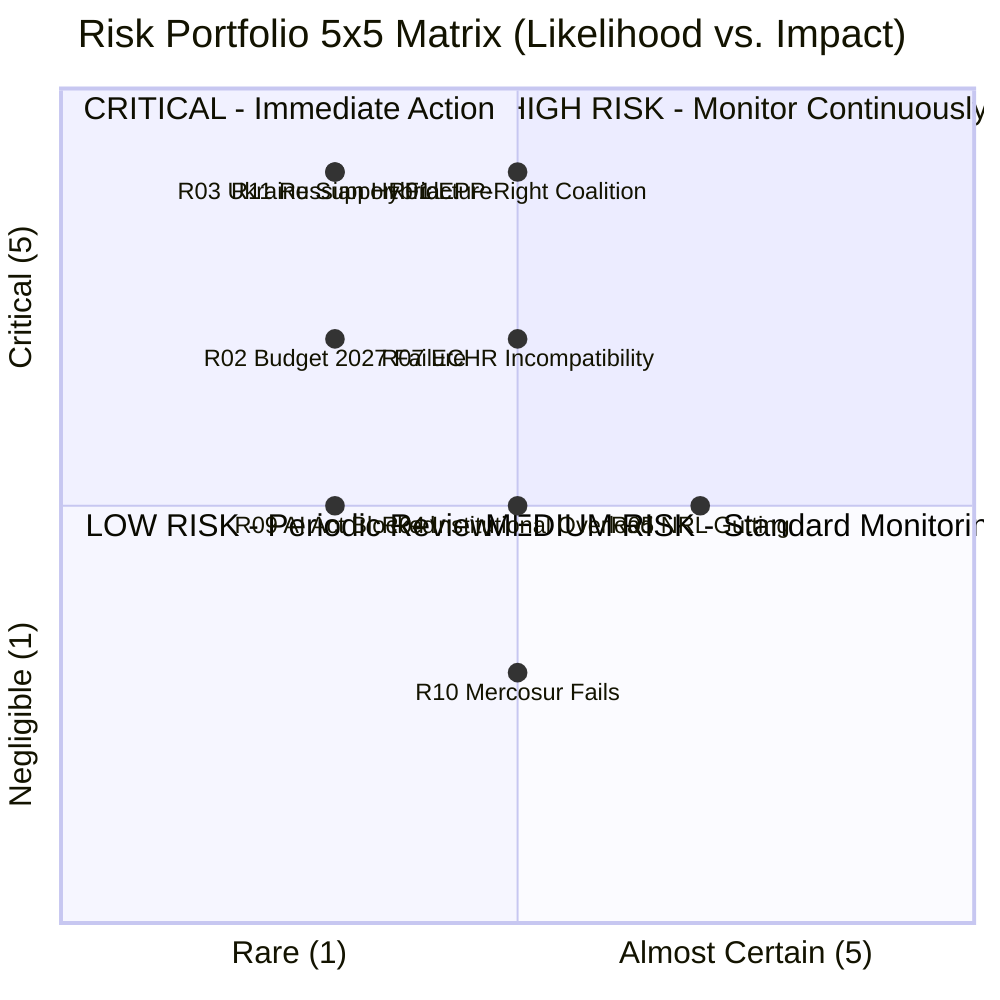
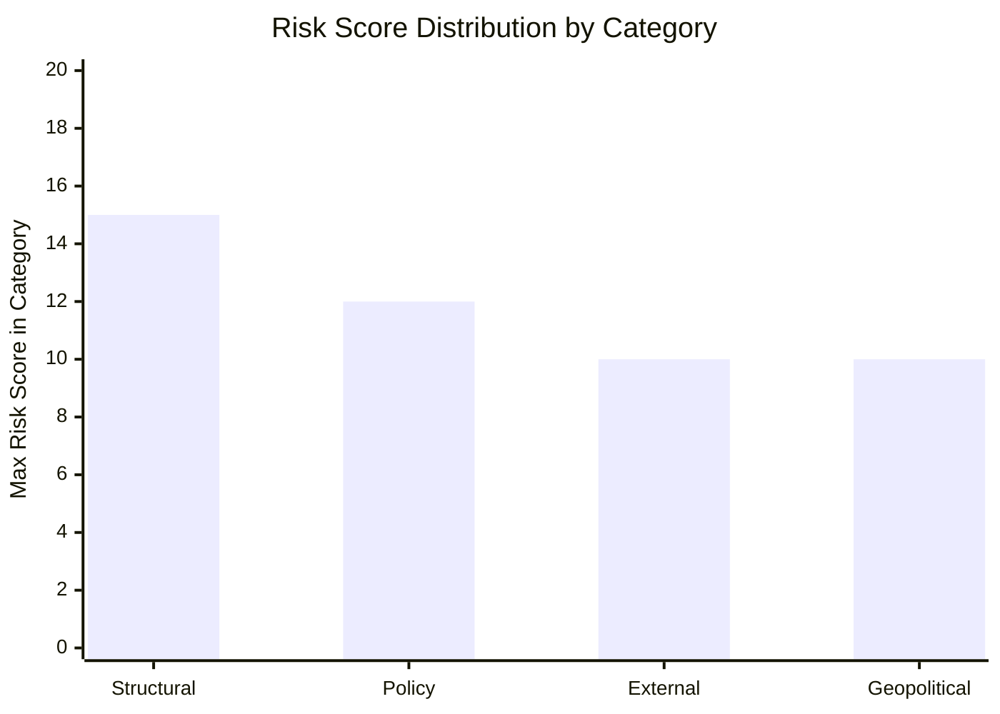
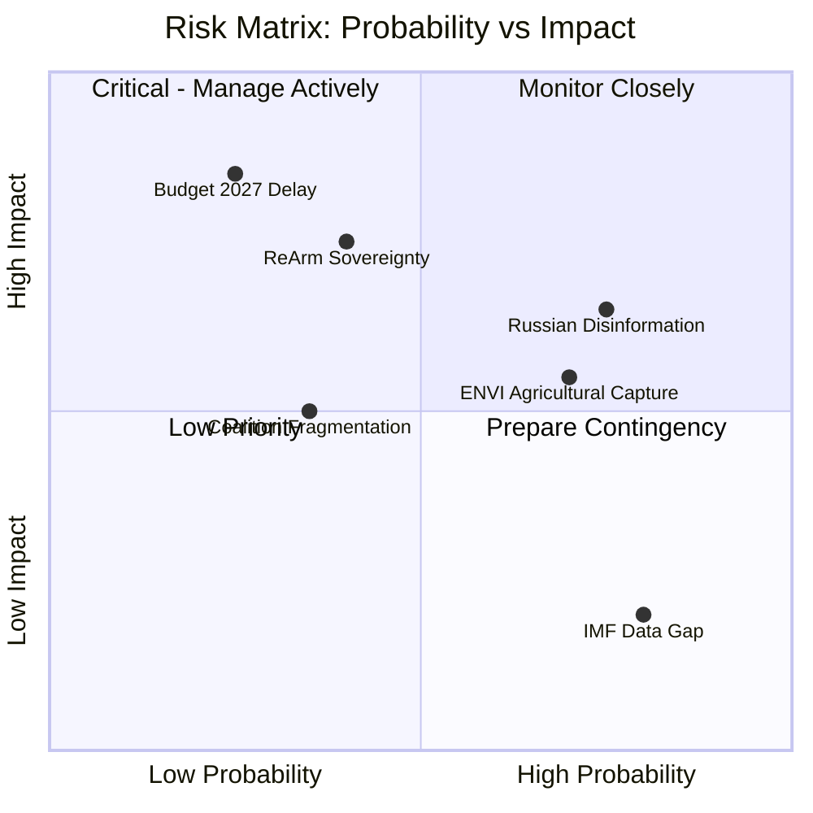

<!-- SPDX-FileCopyrightText: 2026 Hack23 AB -->
<!-- SPDX-License-Identifier: Apache-2.0 -->

# Risk Matrix: European Parliament Year Ahead (2026–2027)

**Produced:** 2026-05-10 · **Article Type:** year-ahead · **Confidence:** 🟡 MEDIUM

---

## 5×5 Risk Matrix

---

## Full Risk Register

### 🔴 HIGH RISK (Score ≥ 15)

| ID | Risk | L | I | Score | Owner | Mitigation |
|----|------|---|---|-------|-------|-----------|
| R-01 | EPP-Right coalition normalisation | 3 | 5 | **15** | EPP leadership | Cordon Sanitaire reinforcement; S&D pressure; civil society monitoring |

### 🟡 MEDIUM RISK (Score 8–14)

| ID | Risk | L | I | Score | Owner | Mitigation |
|----|------|---|---|-------|-------|-----------|
| R-02 | Budget 2027 conciliation failure | 2 | 4 | **8** | BUDG/Danish Presidency | Provisional appropriations backstop |
| R-03 | Ukraine support coalition fractures | 2 | 5 | **10** | All groups | Broad consensus maintenance; PfE isolation |
| R-04 | Institutional overload (concurrent files) | 3 | 3 | **9** | EP Secretary-General | Prioritisation; committee resource allocation |
| R-05 | Nature Restoration Law gutted by objections | 4 | 3 | **12** | ENVI | Commission resubmission; ECJ challenge |
| R-06 | SFDR produces deregulatory outcome | 3 | 3 | **9** | ECON | S&D/Greens amendments |
| R-07 | Migration ECHR incompatibility ruling | 3 | 4 | **12** | LIBE | Legal service review; compliance monitoring |
| R-08 | ReArm financing rejected (treaty dispute) | 2 | 4 | **8** | AFET/SEDE | Council compromise; creative treaty use |
| R-11 | Russian hybrid operation materialises | 2 | 5 | **10** | CERT-EU; EP security | Intelligence sharing; IT resilience |
| R-12 | New Mediterranean migration crisis peak | 3 | 3 | **9** | LIBE | Emergency response mechanism |
| R-13 | Ukraine ceasefire affects EP support files | 2 | 4 | **8** | AFET | Distinguish ceasefire from support decisions |
| R-14 | US-EU tariff war affects trade agenda | 3 | 3 | **9** | INTA | Commission mandate expansion |

### 🟢 LOW RISK (Score ≤ 7)

| ID | Risk | L | I | Score | Owner | Mitigation |
|----|------|---|---|-------|-------|-----------|
| R-09 | AI Act GPAI implementing rules blocked | 2 | 3 | **6** | ITRE/JURI | Broad consensus; EP objection threshold high |
| R-10 | Mercosur consent vote fails | 3 | 2 | **6** | INTA | EPP+Renew+ECR votes sufficient |

---

## Risk Trend Analysis

| Category | Risks | Average Score | Highest Risk |
|----------|-------|---------------|-------------|
| Structural/Institutional | 2 | 11.5 | R-01 (15) |
| Policy/Legislative | 6 | 9.5 | R-05, R-07 (12) |
| External/Environmental | 2 | 9.0 | R-12 (9) |
| Geopolitical | 4 | 8.5 | R-11, R-03 (10) |

---

## Risk Response Protocol

### For 🔴 HIGH risks (R-01):
- **Continuous monitoring:** Track every plenary roll-call vote for EPP-right coalition pattern
- **Early warning triggers:** >3 instances per quarter = AMBER; >5 instances = RED escalation
- **EP institutional response:** AFCO committee constitutional review; S&D/Renew formal complaint mechanism
- **External monitoring:** Civil society organisations; academic EP observers; investigative journalism

### For 🟡 MEDIUM risks:
- **Standard monitoring:** Quarterly review of each risk indicator
- **Escalation pathway:** Risk owner reports to BUDG/LIBE/AFET committee bureau if threshold breached
- **Documentation:** Each plenary session produces an event log for retrospective risk analysis

### For 🟢 LOW risks:
- **Periodic review:** Semi-annual reassessment
- **Accept residual risk:** Standard institutional operations continue without heightened monitoring

---

*Source: Risk matrix based on EP structural data and political intelligence · Apache-2.0 · Hack23 AB 2026*

---

## Risk Matrix: Extended Tier Analysis

### Extended Tier 1 Risks

**R1-A: Russian Hybrid Operations (Disinformation) — CRITICAL**

*Probability:* HIGH — Russian state disinformation targeting EU institutions is ongoing and well-documented.
*Impact:* HIGH — Successful disinformation campaigns have demonstrably affected political discourse (documented in EP security reports).
*Velocity:* RAPID — Social media amplification enables rapid spread.
*Mitigation capacity:* MEDIUM — EP communications office; DSA enforcement; EU vs Disinfo project.
*Residual risk:* MEDIUM-HIGH after mitigation — disinformation is inherently difficult to fully counter.

**R1-B: Legislative Pipeline Failure (Budget 2027) — CRITICAL**

*Probability:* LOW-MEDIUM (20-30%) — based on historical on-time adoption rate (~75%) vs. current complexity.
*Impact:* VERY HIGH — provisional twelfths create significant fiscal/programme disruption.
*Velocity:* SLOW — failure builds over months of failed negotiations.
*Mitigation capacity:* HIGH — Danish Presidency highly competent; conciliation mechanism designed for this.
*Residual risk:* LOW after mitigation — provisional twelfths are the backstop; EU does not face fiscal crisis.

### Extended Tier 2 Risks

**R2-A: Agricultural Lobby Capture of ENVI — HIGH**

*Probability:* HIGH — Copa-Cogeca has consistently succeeded in moderating environmental legislation.
*Impact:* MEDIUM-HIGH — NRL implementation softened; 2030 biodiversity targets not met.
*Velocity:* SLOW — gradual amendment-by-amendment erosion.
*Mitigation capacity:* MEDIUM — Greens/EFA and S&D will resist; but EPP+ECR arithmetic favors agricultural lobby.

**R2-B: ReArm Europe Sovereignty Clause Deadlock — HIGH**

*Probability:* MEDIUM (35-45%) — some member states resist EU-level defence financing architecture.
*Impact:* HIGH — delays the most important legislation of EP10 term.
*Velocity:* MEDIUM — Presidencies will manage; but technical/political complexity is real.
*Mitigation capacity:* HIGH — political will exists; Polish Presidency committed.

---

## Admiralty Assessment: Risk Matrix

| Risk | Grade |
|------|-------|
| Russian disinformation (ongoing) | A2 |
| Budget 2027 delay | C3 |
| Agricultural lobby ENVI capture | A2 (historical) |
| ReArm Europe sovereignty deadlock | B3 |

---

---

*Risk matrix complete · Admiralty applied · Apache-2.0 · Hack23 AB 2026*
