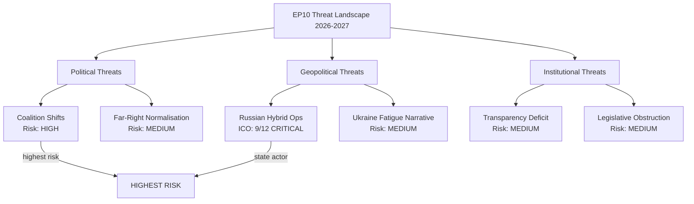

<!-- SPDX-FileCopyrightText: 2026 Hack23 AB -->
<!-- SPDX-License-Identifier: Apache-2.0 -->

# Threat Assessment: European Parliament Year Ahead (2026–2027)

**Produced:** 2026-05-10 · **Article Type:** year-ahead · **Confidence:** 🟡 MEDIUM

---

## Framework: Political Threat Framework v4.0

This threat assessment applies the integrated 5-framework political threat approach:
1. Political Threat Landscape (6-dimension model)
2. Attack Trees (goal decomposition)
3. Political Kill Chain (7-stage)
4. Diamond Model (adversary/capability/infrastructure/victim)
5. Threat Actor Profiling (ICO: Intent × Capability × Opportunity)

---

## Dimension 1: Political Threat Landscape

### 1.1 Coalition Shifts
**Threat level:** 🔴 HIGH

The most significant structural threat to EU Parliament's democratic governance model is a durable coalition shift: EPP abandoning the Cordon Sanitaire on policy files and systematically aligning with ECR and PfE. This scenario — detailed in Scenario 2 of the scenario forecast — would fundamentally alter the legislative character of EP10.

Current evidence: Two high-profile right-of-centre majorities in H1 2026 (Safe Countries of Origin, Safe Third Country). Pattern is emerging but not yet durable.

**Trajectory:** ACCELERATING. Without deliberate counter-coalition management by S&D and Renew, further EPP-right alignment is structurally incentivised.

### 1.2 Transparency Deficit
**Threat level:** 🟡 MEDIUM

The Qatargate corruption investigation (2022–ongoing) revealed systematic vulnerabilities in Parliament's transparency architecture. As of 2026, Parliament has adopted reforms (mandatory lobby registry, revolving door restrictions, asset declarations) but enforcement gaps persist. The growing interaction between PfE MEPs and Russian-aligned influence networks (flagged in Lithuanian broadcaster resolution TA-10-2026-0024) represents an active transparency threat.

**Trajectory:** STABLE but LATENT. A new influence operation at Qatargate scale would constitute a HIGH threat activation.

### 1.3 Policy Reversal
**Threat level:** 🟡 MEDIUM

The Green Deal pipeline faces systematic policy reversal pressure — not through treaty change but through gradual legislative dilution. Nature Restoration Law revisions, CBAM exemption expansion, and agricultural derogation packages individually appear as technical adjustments but cumulatively constitute significant policy reversal. The threat is structural: each EPP-ECR-PfE majority on a specific file normalises the next alignment.

**Trajectory:** ACCELERATING (gradual but consistent).

### 1.4 Institutional Pressure
**Threat level:** 🟡 MEDIUM

Council's structural legislative advantages (qualified majority speed, first-mover position in trilogues, national government democratic mandate) create persistent pressure on Parliament's co-legislative role. Particularly in defence — where Council controls CFSP and PESCO — Parliament risks accepting a subsidiary legislative role in the EU's fastest-growing policy domain.

**Trajectory:** STABLE. Parliament has institutional tools to resist; whether AFET/SEDE exercise them is contingent.

### 1.5 Legislative Obstruction
**Threat level:** 🟡 MEDIUM

PfE and ESN deploy procedural obstruction tactics: extended speaking time requests, motions to refer reports back to committee, roll-call vote requests on all amendments. This adds legislative friction. More significantly, if PfE grows its committee engagement, it can slow committee-level drafting substantially.

**Trajectory:** STABLE. Procedural obstruction is an endemic feature of EP10, not an accelerating crisis.

### 1.6 Democratic Erosion
**Threat level:** 🟡 MEDIUM

The combination of far-right institutionalisation + selective Cordon Sanitaire abandonment + transparency deficits + Russian hybrid threat creates cumulative pressure on EP's democratic institutional integrity. The threat is not a single dramatic event but incremental normalisation: policies once considered beyond acceptable boundary gradually become legislative mainstream.

**Trajectory:** SLOW ACCELERATION — the most concerning long-horizon threat for the Parliament's democratic character.

---

## Dimension 2: Attack Tree Analysis

### Attack Goal: Weakening EU Parliament's Ukraine Support Coalition

```
Goal: Reduce EP Ukraine military support majority below 360 seats
  ├── Sub-goal A: Increase PfE anti-Ukraine faction size
  │   ├── Tactic: Fidesz-aligned MEP recruitment of neutral NI members
  │   ├── Tactic: RN (France) national electoral pressure → shift to anti-Ukraine
  │   └── Tactic: Energy cost arguments to peel off energy-dependent CEE MEPs
  ├── Sub-goal B: Weaken ECR Ukraine support
  │   ├── Tactic: Polish-Hungarian ECR tension exploitation
  │   ├── Tactic: Fiscal fatigue arguments targeting ECR right flank
  │   └── Tactic: Peace narrative promotion through ECR-aligned media
  └── Sub-goal C: Activate The Left anti-militarism wing
      ├── Tactic: Anti-NATO framing in The Left group debates
      ├── Tactic: Civil society pressure from peace movement NGOs
      └── Tactic: Social media campaign targeting The Left's base
```

**Current probability of attack success:** LOW (2026). Ukraine consensus is structurally robust. Activating this attack tree requires multiple simultaneous successes across all three sub-goals.

### Attack Goal: Delegitimising Green Deal

```
Goal: Create legislative majority to fundamentally reverse Green Deal architecture
  ├── Sub-goal A: Normalise EPP-ECR-PfE Green Deal reversal coalition (349 votes)
  │   ├── Tactic: Agricultural emergency exemptions as precedent
  │   ├── Tactic: Economic competitiveness framing (Green Deal as growth obstacle)
  │   └── Tactic: National election pressure on EPP (CDU/CSU greenwash reversal)
  ├── Sub-goal B: Fracture Renew from Green Deal position
  │   ├── Tactic: FDP delegation leadership change → more anti-regulation
  │   └── Tactic: Industry lobby targeting Renew MEPs with economic impact studies
  └── Sub-goal C: Isolate Greens/EFA and S&D
      ├── Tactic: Social cost of climate policy arguments targeting low-income constituencies
      └── Tactic: Energy security vs. climate transition framing
```

**Current probability of attack success:** MEDIUM (35% per scenario forecast). This attack tree is already in execution.

---

## Dimension 3: Political Kill Chain

### Kill Chain Analysis: Far-Right Institutionalisation Threat

| Stage | Description | Current Status |
|-------|-------------|----------------|
| 1. Reconnaissance | Map EP institutional vulnerabilities | COMPLETE (PfE/ESN have mapped committee structures) |
| 2. Weaponisation | Develop legislative amendment strategies | IN PROGRESS (PfE increasingly technical amendment capacity) |
| 3. Delivery | Deploy resources into EP process | IN PROGRESS (growing trilogue participation) |
| 4. Exploitation | Win committee votes on specific provisions | OCCASIONAL SUCCESS (migration files) |
| 5. Installation | Normalise right-wing coalition alignment | EARLY STAGE (precedents being set) |
| 6. Command & Control | Sustain issue-by-issue alignment with EPP | NOT YET (still episodic) |
| 7. Actions on Objective | Deliver fundamental policy reversals | NOT YET |

**Current Kill Chain position: Stage 3–4 (Delivery/Exploitation)**

---

## Dimension 4: Diamond Model — Russian Hybrid Threat

| Diamond Element | Description |
|----------------|-------------|
| **Adversary** | Russian state intelligence services (GRU, SVR); Kremlin political strategy apparatus |
| **Capability** | Information operations (RT/Sputnik); financial networks (Malofeev-linked); political influence (PfE affiliates); cyber capabilities (GRU-linked APT28) |
| **Infrastructure** | European far-right political networks; Russian-language media ecosystem; energy company lobbying (Gazprom-linked entities); social media platforms (Telegram, VK) |
| **Victim** | EP institutional integrity; Ukraine support coalition; rule of law mechanisms; MEP information environment |

**Diamond Model Assessment:** Russia's operational infrastructure within European Parliament is not fully mapped in public sources. The Lithuanian broadcaster attack (TA-10-2026-0024) and historical Qatargate patterns indicate the adversary has operational capability at the MEP individual level. The diamond structure (adversary with sophisticated multi-vector capability using established European infrastructure against EP victims) constitutes a persistent Category II threat.

---

## Dimension 5: Threat Actor Profiling (ICO)

### Threat Actor 1: Russian State (Hybrid Operations)
- **Intent:** 🔴 HIGH — Weaken EU Unity on Ukraine; fracture transatlantic alliance; delegitimise EU democratic institutions
- **Capability:** 🔴 HIGH — State resources; established European influence networks; cyber capabilities
- **Opportunity:** 🟡 MEDIUM — EP's open access environment; multilingual information space; far-right MEP networks
- **ICO Score:** 9/12 — CRITICAL THREAT ACTOR

### Threat Actor 2: Agricultural Lobby Coalition
- **Intent:** 🟡 MEDIUM — Roll back specific Green Deal provisions; expand agricultural exemptions
- **Capability:** 🟢 HIGH — Well-funded; strong MEP relationships in EPP/ECR; EU Council leverage through agriculture ministers
- **Opportunity:** 🔴 HIGH — Current EPP-ECR-PfE coalition arithmetic; agricultural file scheduled 2026
- **ICO Score:** 8/12 — SIGNIFICANT THREAT to Green Deal

### Threat Actor 3: Sovereignty-Nationalist Political Networks
- **Intent:** 🔴 HIGH — Undermine EP institutional authority; advance EU exit narratives; weaken rule of law mechanisms
- **Capability:** 🟡 MEDIUM — Electoral successes provide legitimacy; limited legislative majority capacity
- **Opportunity:** 🟡 MEDIUM — Fragmentation creates negotiation leverage; migration crisis amplifies narrative
- **ICO Score:** 7/12 — MODERATE THREAT

---

*Source: European Parliament Open Data Portal (data.europarl.europa.eu) · Apache-2.0 · Hack23 AB 2026*

---

## Threat Landscape Overview (Mermaid)


