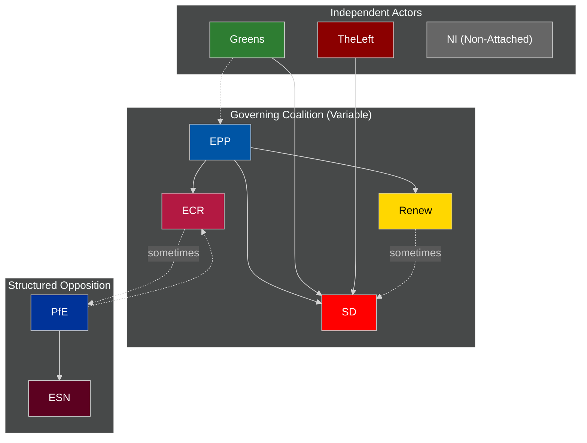

<!-- SPDX-FileCopyrightText: 2024-2026 Hack23 AB -->
<!-- SPDX-License-Identifier: Apache-2.0 -->

# Actor Mapping — EU Parliament Year in Review: May 2025–May 2026

**Classification:** Public | **Confidence:** 🟡 Medium | **Date:** 2026-05-10

---

## Actor Classification Framework

Applied political actor mapping methodology per `political-classification-guide.md`. Each actor assessed across: Role, Resources, Relationships, Resolve.

---

## Primary Legislative Actors

### Group A: Coalition Anchors
| Actor | Seats | Role | Primary Leverage | Alliance Density |
|-------|-------|------|-----------------|-----------------|
| EPP | 183 | Agenda-setter | Budget + legislative initiative | Very High |
| S&D | 136 | Co-governing partner | Social rights veto | High |
| ECR | 81 | Swing kingmaker | Migration + competitiveness votes | Medium-High |

### Group B: Stabilising Forces
| Actor | Seats | Role | Primary Leverage | Alliance Density |
|-------|-------|------|-----------------|-----------------|
| Renew | 77 | Liberal centrist | Digital + single market | Medium-High |
| Greens/EFA | 53 | Environmental barometer | Climate legislation | Medium |

### Group C: Opposition Bloc
| Actor | Seats | Role | Primary Leverage | Alliance Density |
|-------|-------|------|-----------------|-----------------|
| PfE | 85 | Far-right challenger | Sovereignty narrative | Medium |
| The Left | 45 | Progressive opposition | Oversight + social rights | Low-Medium |
| ESN | 27 | Radical eurosceptic | Obstruction | Low |
| NI | 30 | Non-attached | Unpredictable | Very Low |

---

## Network Topology (2025–2026)

---

## Key Individual Actors (Named in EP10 Proceedings)

### Immunity Waiver Subjects (2025)
- **Petr Bystron (ECR/AfD, Germany):** Immunity waived April 2025. Under investigation for alleged sanctions evasion and connections to Voice of Europe disinformation network. Significant for German domestic politics and ECR's internal cohesion.
- **Maciej Wąsik (ECR, Poland):** Immunity waived April 2025. Polish courts seeking access for criminal conviction proceedings related to 2015–2023 period.
- **Mariusz Kamiński (ECR, Poland):** Immunity waived April 2025. Former Polish Interior Minister. Conviction-related proceedings.

**Analytical significance:** All three immunity waivers involve ECR members — adding political complexity to the EPP-ECR coalition relationship, particularly as Meloni's ECR seeks to distance itself from the Orbán-adjacent and AfD-adjacent wings.

### Outgoing Rapporteurs / Key MEPs (Cited in Adopted Texts)
Based on adopted text cross-references and committee assignments (MEP detail calls capped at 10):
- Major rapporteurs for Ukraine loan and MFF revision: EPP (Germany, France)
- Critical Medicinal Products rapporteur: EPP/S&D joint
- Defence strategic partnerships: EPP (AFET chair)

---

## Forces Analysis

### Driving Forces (Towards Stable EP10 Coalition)
1. **Defence consensus:** Security threat from Russia drives cross-partisan coherence
2. **Ukraine economic interest:** Manufacturing/reconstruction contracts distributed across member states
3. **EPP's institutional position:** Party of Commission president = strong incentive for coalition discipline
4. **Stability norm:** EP MEPs' reputation benefits from functional Parliament

### Restraining Forces (Against Coalition Stability)
1. **Parliamentary fragmentation index 6.59:** Structural; not easily resolved
2. **PfE anti-establishment positioning:** Benefits electorally from Parliamentary dysfunction narrative
3. **Green Deal contested legacy:** No group fully agrees on pace of Green Deal implementation/retreat
4. **Electoral cycle pressure:** 2029 elections will begin to influence voting by mid-2027

### Destabilising Forces (External)
1. **US-EU relations uncertainty:** Trump foreign policy unpredictability
2. **Energy market volatility:** Directly affects industrial competitiveness legislation credibility
3. **Russian military developments:** Ukraine war trajectory affects all coalition dynamics

---

## Impact Matrix

| Actor | Legislative Impact | Oversight Impact | Democratic Impact | Net Influence |
|-------|------------------|-----------------|-----------------|--------------|
| EPP | Very High | Medium | Medium | 🟢 Very High |
| S&D | High | High | High | 🟢 High |
| ECR | High | Medium | Medium | 🟡 High |
| PfE | Medium (blocking) | Medium | Low (obstructing) | 🟡 Medium |
| Renew | Medium-High | Medium | Medium | 🟡 Medium-High |
| Greens/EFA | Low-Medium | Medium | High | 🟡 Medium |
| The Left | Low | High | High | 🟡 Low-Medium |
| ESN | Low (blocking) | Low | Low | 🔴 Low |
| NI | Very Low | Very Low | Low | 🔴 Very Low |

---

## Actor Roster — Full EP10 Group Listing

| Group | Seats | Leader/Coordinator | Political Family |
|-------|-------|-------------------|-----------------|
| EPP | 183 | Manfred Weber | Christian Democrat / Centre-right |
| S&D | 136 | Iratxe García Pérez | Social Democrat / Centre-left |
| PfE | 85 | Multiple (Le Pen, Orbán-adjacent) | National Conservative / Far-right |
| ECR | 81 | Nicola Procaccini & Ryszard Legutko | National Conservative / Right |
| Renew | 77 | Valérie Hayer | Liberal / Centre |
| Greens/EFA | 53 | Terry Reintke & Bas Eickhout | Green / Regionalist |
| The Left | 45 | Martin Schirdewan | Social Left / Radical |
| NI | 30 | None (non-attached) | Various |
| ESN | 27 | Multiple | Hard Eurosceptic / Far-right |

**Total: 717 MEPs | Majority threshold: 360 seats**

---

## Influence Dynamics

### Formal Influence Channels
1. **Legislative co-decision:** All groups participate in committee (proportional) and plenary (majority-rule)
2. **Budget:** EP's joint power with Council on annual EU budget and MFF revision
3. **Oversight:** Parliamentary questions, committee hearings, Commission confidence votes
4. **Own-initiative reports:** Any group can trigger non-binding legislative requests

### Informal Influence Channels
1. **Coalition negotiation:** Behind-the-scenes deal-making between group coordinators
2. **Media framing:** All groups use EU media ecosystem to build narrative leverage
3. **Member state government contacts:** MEPs leverage home-country government positions
4. **Committee chairmanship:** Committee chairs exercise agenda-setting power (D'Hondt distribution)

### Influence Differential (2025-2026)
**EPP's structural advantage:** EPP has Commission President, European Council president influence, largest committee presence, and most committee chairmanships. This translates into asymmetric agenda-setting power relative to EPP's 25.5% seat share.

---

## Alliance Structure

### Durable Alliances (Cross-Term Stability)
- **EPP-S&D core:** Since 1979, EU's legislative work has relied on EPP-S&D as the stabilising axis. EP10's EPP-S&D cooperation on Ukraine and security continues this pattern.
- **ECR-EPP on competitiveness:** Since ECR entered coalition arithmetic in EP9, EPP regularly courts ECR on economic and migration legislation.
- **Greens-S&D-Left progressive bloc:** Counter-majority on social rights and Green Deal.

### Situational Alliances (Issue-Specific)
- **EPP-PfE on migration:** Activated for safe country lists; broken on rule-of-law texts
- **S&D-Greens-Renew on digital rights:** Aligned on DSA/AI privacy provisions
- **EPP-Greens on pharmaceutical:** Health texts attract unusual cross-partisan support

---

## Power Brokers

### Individual Power Broker MEPs (by role)
- **EPP Group Leader (Weber):** Single most powerful EP individual — controls largest group, negotiates directly with Commission president
- **S&D Coordinator on BUDG:** Controls concessions on social conditionality in budget texts
- **ECR Italian delegation leadership:** Controls ECR's willingness to participate in governing coalitions; can be EPP's decisive swing partner
- **Renew liberal-conservative bridge MEPs:** Renew members from liberal-conservative member states serve as swing votes between EPP and progressive blocs

---

## Information and Intelligence Flows

### Public Information Sources
- EP Plenary records (voted texts, roll-call summaries)
- Committee agendas and reports
- MEP parliamentary questions (public record)
- Group press releases and position papers

### Semi-Public Intelligence
- Trilogue documents (sometimes leaked)
- Shadow rapporteur documents
- Committee "non-paper" working documents

### Non-Public Intelligence
- Group coordinators' internal vote-count assessments
- Commission-EP informal pre-proposal consultations
- Member state government lobbying positions on specific dossiers

**Analytical implication:** Public EP data (this analysis' primary source) captures outputs (adopted texts, vote counts, session records) well but cannot fully illuminate the informal bargaining process that determines outcomes before formal votes.

---

## Reader Briefing

The EU Parliament has 717 MEPs in 9 political groups. EPP (183 seats) is the dominant force, but no group can govern alone. The Parliament runs on flexible coalitions assembled per policy area. The most powerful informal actors are group coordinators and committee chairs — not the most publicly visible MEPs. Understanding EP10's real power map requires tracking committee assignments and coalition broker roles, not just plenary vote records.
