<!-- SPDX-FileCopyrightText: 2024-2026 Hack23 AB -->
<!-- SPDX-License-Identifier: Apache-2.0 -->

# Forces Analysis — EU Parliament Year in Review: May 2025–May 2026

**Classification:** Public | **Confidence:** 🟡 Medium | **Date:** 2026-05-10

---

## Political Forces Shaping EP10 (2025–2026)

### Macro-Level Forces

**Force 1: Security Paradigm Shift** — Strength: Very Strong
Russia's continued Ukraine war has fundamentally shifted EU's strategic posture. The EP10 defence votes, Ukraine loan, and MFF revision collectively represent a permanent expansion of EU security architecture. This force is durable (5-10 year horizon) and has already re-ordered EP coalition dynamics.

**Force 2: Competitiveness Imperative** — Strength: Strong
US IRA and China state subsidy competition have forced EU industrial policy shift. The Draghi/Letta competitiveness agenda is now EP10's governing economic philosophy. EPP has anchored its position on competitiveness framing. This force will intensify as 2027 elections approach and economic performance becomes a political referendum.

**Force 3: Migration Salience** — Strength: Strong
Far-right parties' electoral success in EP2024 election translated directly into EP10 migration policy outcomes. The leftward limit of migration consensus has moved significantly. This force is self-reinforcing: policy tightening generates either more migration crisis salience (if flows continue) or political credit (if flows reduce).

**Force 4: Techno-Regulatory Pressure** — Strength: Medium-Strong
AI Act implementation, digital services enforcement, and data governance are creating a permanent techno-regulatory workload for EP10 committees. IMCO and LIBE are the primary affected committees. Tech sovereignty is now a mainstream cross-partisan frame.

### Restraining Forces

**Force 5: Fragmentation Drag** — Strength: Very Strong
The fragmentation index of 6.59 means every legislation requires multi-group assembly. Transaction costs of coalition management are structurally high. This force limits legislative velocity and legislative ambition (bills must be negotiable across 3-4 groups).

**Force 6: Green Deal Contestation** — Strength: Medium
While EPP is formally recalibrating Green Deal, it cannot fully retreat — the legal architecture (ETS, Nature Restoration, CBAM) is embedded in EU law and third-country trade relationships depend on it. This creates an ongoing tension between rhetorical recalibration and implementation obligation.

**Force 7: Rule-of-Law Fatigue** — Strength: Medium
The Qatargate aftermath created a reform impulse in EP9 that has dissipated in EP10. Rule-of-law enforcement remains contested — the Bystron immunity waiver shows institutional mechanisms working, but OLAF/EPPO coordination remains weak.

---

## Competitive Forces (Porter-style Institutional Analysis)

| Force | Intensity | Direction | Key actors |
|-------|-----------|-----------|------------|
| Threat of new political groups | Medium | Fragmenting | PfE expansion, ESN consolidation |
| Bargaining power of Commission | High | Status quo | Von der Leyen's legislative monopoly |
| Bargaining power of Council | High | Status quo | German, French, Italian presidencies |
| Rivalry among EP groups | Very High | Fragmenting | EPP-ECR-PfE triangulation |
| Substitute governance mechanisms | Low | Status quo | No functional substitute for EP legislative mandate |

---

## Force Field Diagram (Net Assessment)

**Driving forces** (pushing EP10 toward higher legislative output and strategic coherence):
- Security consensus across EPP/S&D/ECR (strongest)
- Competitiveness agenda EPP anchor
- Ukraine emergency creating crisis coalition cohesion

**Restraining forces** (limiting EP10 effectiveness):
- Fragmentation index record-high (strongest)
- Internal ECR/PfE tensions
- Green Deal rhetorical vs. implementation tension

**Net assessment:** Driving forces slightly outweigh restraining forces in the 2025–2026 period, explaining why legislative output is above historical average despite record fragmentation. However, the equilibrium is fragile — a single major exogenous shock (see Wildcards) could reverse the balance.

---

## Issue Frame

**Central issue:** Can EP10 sustain above-average legislative productivity despite record fragmentation (ENP 6.59)?

**Frame dimensions:**
1. **Security imperative vs. institutional capacity:** The security crisis creates legislative urgency; the fragmented Parliament is stretched to meet it
2. **Right-turn vs. Green Deal obligation:** EPP's rightward shift collides with legally binding Green Deal implementation obligations
3. **Sovereignty vs. integration:** PfE/ESN push sovereignty narrative; EPP's governing position requires integration to deliver competitiveness/security agenda

**Stakes:** EP10's institutional legacy — whether it demonstrates that a fragmented Parliament can remain effective — will shape EU institutional reform debates heading into EP11.

---

## Driving Forces

**Force 1: Russia-Ukraine security consensus** — VERY STRONG
The ongoing Ukraine war provides external forcing function. All mainstream groups (EPP, S&D, ECR, Renew) share fundamental security consensus, creating a reliable coalition for security/defence legislation.

**Force 2: Competitiveness imperative** — STRONG
US IRA, Chinese subsidies, and energy cost differentials have made industrial competitiveness a shared priority. EPP's competitiveness agenda resonates across EPP-ECR-Renew and receives partial S&D support.

**Force 3: Institutional reputation** — MEDIUM
EP as an institution has incentive to demonstrate legislative effectiveness. Presidents, committee chairs, and senior MEPs have career interest in a productive EP10.

---

## Restraining Forces

**Force 1: Structural fragmentation** — VERY STRONG
ENP 6.59 creates high coalition-building transaction costs. Every vote requires fresh coalition assembly. This is not eliminating output but is suppressing legislative ambition and speed.

**Force 2: Migration coalition limits** — MEDIUM
The migration-tightening coalition (EPP-ECR-PfE-Renew partial) is narrower than the security coalition. On migration, every vote is contested and subject to Renew internal debates.

**Force 3: Green Deal rhetorical vs. legal conflict** — MEDIUM
EPP's stated direction (competitiveness first, Green Deal recalibration) conflicts with the embedded legal architecture of Green Deal regulation. This restrains both the environmental agenda and the business deregulation agenda.

---

## Net Pressure

```mermaid
%%{init: {"theme":"dark"}}%%
xychart-beta
    title "Driving vs. Restraining Forces (1-10 scale)"
    x-axis ["Security", "Competitiveness", "Institutional", "Fragmentation", "Migration limits", "Green tension"]
    y-axis "Force Strength" 0 --> 10
    bar "Driving" [9, 7, 5, 0, 0, 0]
    bar "Restraining" [0, 0, 0, 9, 5, 5]
```

**Net pressure vector:** Driving forces (21 total) slightly exceed restraining forces (19 total), explaining above-average EP10 output despite structural constraints. The equilibrium is maintained by the security consensus offsetting fragmentation drag.

---

## Intervention Points

**Intervention Point 1: ECR coalition management**
If ECR fractures (Bystron proceedings), EPP must rapidly rebuild coalition formula. Intervention needed: clear EPP-Renew-S&D "core coalition" communication that reassures markets and policy stakeholders of legislative continuity.

**Intervention Point 2: Green Deal implementation deadlines**
Several Green Deal implementation deadlines fall in 2026-2027 (CBAM adjustment, EV transition). As these approach, restraining forces intensify. Intervention needed: Commission-EP dialogue to establish coherent "recalibration" framework that preserves legal obligations while adjusting pace.

**Intervention Point 3: Pre-election positioning (2027-2028)**
As 2029 election approaches, groups will prioritise electoral positioning over legislative cooperation. Intervention needed: EP leadership must frontload major legislation by end of 2027.

---

## Reader Briefing

The EU Parliament's legislative environment in 2025-2026 is shaped by powerful driving forces (security consensus, competitiveness pressure) that are, for now, overcoming equally powerful restraining forces (fragmentation, migration politics, Green Deal tension). This explains the paradox of high output despite high fragmentation. The balance is fragile and unlikely to persist beyond 2027 as pre-election dynamics kick in.
