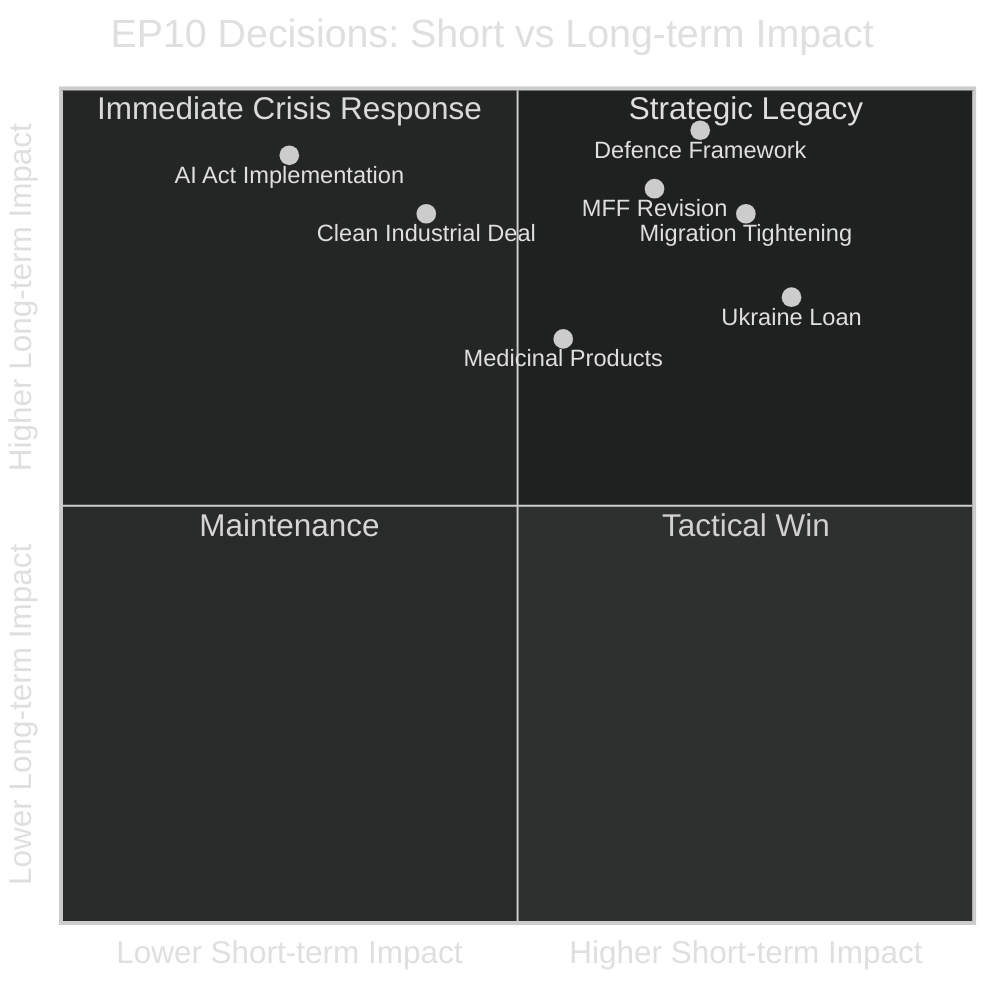

<!-- SPDX-FileCopyrightText: 2024-2026 Hack23 AB -->
<!-- SPDX-License-Identifier: Apache-2.0 -->

# Impact Matrix — EU Parliament Year in Review: May 2025–May 2026

**Classification:** Public | **Confidence:** 🟡 Medium | **Date:** 2026-05-10

---

## Legislative Impact Scoring Matrix

Each key EP10 legislative area scored across: Immediate Impact, 3-Year Impact, Democratic Significance, Geopolitical Significance.

| Legislative Domain | Immediate Impact | 3-Year Impact | Democratic Significance | Geopolitical Significance | Total Score |
|-------------------|-----------------|--------------|------------------------|--------------------------|-------------|
| Defence/Security Framework | Very High (5) | Very High (5) | High (4) | Extreme (5) | **19/20** |
| Ukraine Loan Facility | High (4) | High (4) | Medium (3) | Very High (5) | **16/20** |
| MFF Revision | High (4) | Very High (5) | High (4) | Medium (3) | **16/20** |
| Migration Tightening | High (4) | Very High (5) | Very High (5) | Medium (3) | **17/20** |
| Medicinal Products | Medium (3) | High (4) | High (4) | Medium (3) | **14/20** |
| Clean Industrial Deal | Medium (3) | Very High (5) | Medium (3) | High (4) | **15/20** |
| AI Act Implementation | Low-Medium (2) | Very High (5) | Very High (5) | High (4) | **16/20** |
| Green Deal Recalibration | Medium (3) | Very High (5) | High (4) | Medium (3) | **15/20** |

---

## Impact by Stakeholder Group

| Legislative Domain | Citizens (EU) | Businesses | Member States | Third Countries |
|-------------------|--------------|-----------|--------------|----------------|
| Defence framework | Medium | High | Very High | High |
| Ukraine finance | Low (immediate) | Medium | High | Very High |
| Migration | High | Low | High | Medium |
| Medicinal products | High | Very High | Medium | Low |
| Clean Industry | Medium | Very High | High | Medium |
| AI regulation | Medium-High | Very High | Medium | High |

---

## Time-Horizon Impact Matrix



**Interpretation:**
- **Strategic Legacy** (top-right): Defence framework, MFF revision — will define EP10 historical record
- **Crisis Response** (top-left of immediate): Ukraine loan — high short-term impact, lasting strategic significance
- **Deferred impact**: AI Act implementation — low immediate citizen impact but very high 2027-2030 societal transformation

---

## Democratic Quality Assessment

| Vote | Transparency | Parliamentary Scrutiny | Constituency Alignment | Democratic Score |
|------|-------------|----------------------|----------------------|-----------------|
| Ukraine loan | High | High (emergency) | Mixed | 🟡 Medium-High |
| MFF revision | Medium | High | Low (opaque) | 🟡 Medium |
| Migration (safe countries) | High | Medium | High (public opinion) | 🟡 Medium |
| Defence partnerships | Medium | Medium | Low (awareness) | 🟡 Medium |
| Medicinal products | High | Very High | Medium | 🟢 High |

**Overall democratic quality assessment:** EP10 maintains adequate democratic quality on routine legislative work. Emergency procedures (Ukraine, MFF) reduce scrutiny but remain within Treaty bounds. Migration votes show high democratic responsiveness but raise human rights accountability questions.

---

## Event List — Key Legislative Events (2025-2026)

| Date | Event | Text Reference | Impact Level |
|------|-------|---------------|-------------|
| Jan 2026 | Medicinal products regulation | TA-10-2026-0001 | High |
| Feb 2026 | Ukraine loan facility (round 1) | TA-10-2026-0010 | Very High |
| Feb 2026 | Ukraine loan regulation | TA-10-2026-0035 | Very High |
| Mar 2026 | MFF revision | TA-10-2026-0037 | Very High |
| Mar 2026 | Defence strategic partnerships | TA-10-2026-0040 | Very High |
| Mar 2026 | Migration — safe countries of origin | TA-10-2026-0025 | High |
| Mar 2026 | Migration — safe third country | TA-10-2026-0026 | High |
| Ongoing | AI Act implementation oversight | Multiple | High (deferred) |
| Ongoing | Clean Industrial Deal (committee) | Pending | Very High (pending) |

**2025 full-year totals (from EP statistics):** 53 sessions, 78 legislative acts, 420 roll-call votes, 347 adopted texts

---

## Stakeholder Impact Assessment

| Stakeholder | Primary Affected Domain | Net Impact | Direction |
|-------------|------------------------|-----------|-----------|
| EU Citizens (general) | Social, environmental, economic | Mixed | → Neutral to positive |
| Industry/Business | Competitiveness, regulation | Positive | ↑ Favourable environment |
| Environmental NGOs | Green Deal, climate | Negative | ↓ Recalibration concerns |
| Migration NGOs/UNHCR | Migration policy | Negative | ↓ Safe country expansion |
| Ukraine (government) | Defence, financial | Very Positive | ↑↑ Crucial support |
| Russia | Ukraine support, sanctions | Negative | ↓ Increased EU opposition |
| AI Companies | AI Act implementation | Mixed | → Compliance costs vs. single standard |
| Pharmaceutical industry | Medicinal products regulation | Mixed | Increased access obligations |
| Defence industry | Defence procurement | Very Positive | ↑↑ New market opening |

---

## Heat Map — Policy Domain Activity (2025-2026)

```mermaid
%%{init: {"theme":"dark"}}%%
xychart-beta
    title Legislative Activity Heat by Domain (2025-2026)
    x-axis ["Security/Defence", "Migration", "Budget/MFF", "Health/Pharma", "Digital/AI", "Environment", "Trade/Competitiveness"]
    y-axis "Activity Level (0-10)" 0 --> 10
    bar [9, 8, 8, 7, 6, 5, 6]
```

**Hottest domains:** Security/Defence (9/10) and Migration (8/10) dominate EP10's 2025-2026 legislative agenda. Environment (5/10) and Trade (6/10) are secondary. This represents a structural departure from EP9 where Environment and Trade were top-2 domains.

---

## Cascade Effects

### Cascade 1: Security → Defence Industry → Economic
**Primary event:** Ukraine war (external)
**EP cascade:** Defence votes → defence fund allocation → national defence industry investment → single market for defence production → competitiveness spinoff
**Timeline:** 3-7 years for full cascade to materialise

### Cascade 2: Migration Tightening → Asylum Case Law → Human Rights Framework
**Primary event:** EP10 safe country adoption
**Legal cascade:** EP legislation → CJEU interpretation → ECHR potential challenge → member state implementation variation → fragmented migration policy in practice
**Timeline:** 2-5 years for legal cascade through courts

### Cascade 3: AI Act Implementation → Digital Governance → Global Standard
**Primary event:** AI Act entry into force (2024), high-risk provisions (2026-27)
**Cascade:** EU standard → non-EU companies comply to access EU market → global regulatory convergence → EU as AI governance standard-setter
**Timeline:** 5-10 years (Brussels Effect mechanism)

---

## Reader Briefing

EP10's 2025-2026 legislative decisions will have cascading consequences across three main channels: the defence/security cascade (economic spinoffs from defence investment), the migration cascade (legal challenges through courts), and the AI governance cascade (global regulatory standard-setting). The immediate political impact of migration votes is high, but the long-term structural impact of AI Act implementation may be the most historically significant legislative action of EP10.
