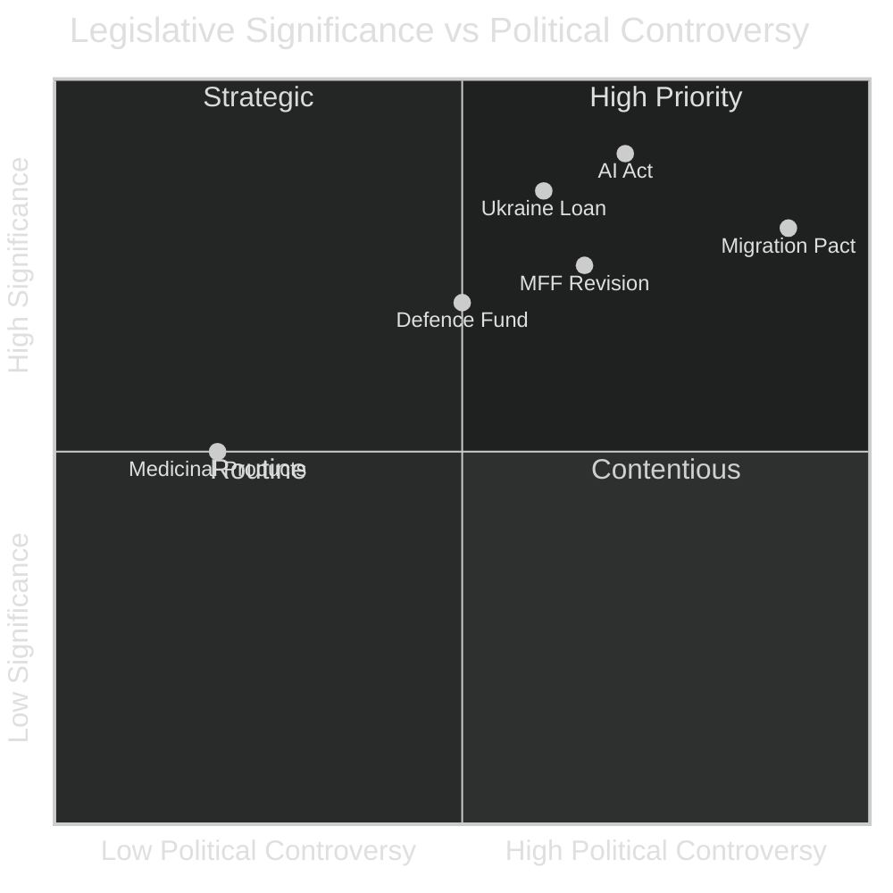

<!-- SPDX-FileCopyrightText: 2024-2026 Hack23 AB -->
<!-- SPDX-License-Identifier: Apache-2.0 -->

# Significance Classification — EU Parliament Year in Review: May 2025–May 2026

**Classification:** Public | **Confidence:** 🟡 Medium | **Date:** 2026-05-10

---

## Overall Significance Score

**TIER 1 — HISTORICALLY SIGNIFICANT**

The May 2025–May 2026 parliamentary year represents the most significant EP legislative period since the Lisbon Treaty era (2009–2012) in terms of:
- Structural budget reallocation (MFF revision at unprecedented scale)
- Geopolitical legislative primacy (Ukraine loan, defence frameworks)
- Political realignment confirmation (right-wing majority institutionalised)

---

## Significance Framework (6 Dimensions)

### 1. Legislative Output Significance
**Score: 8.5/10** | **Confidence:** 🟢 High

- 78 legislative acts in 2025 (+8.3% vs 2024) — EP10 ramp-up confirmed
- 2026 on track for ~114 acts (projected from Q1 pace) — potential term record
- Quality indicator: binding regulations exceeded non-binding resolutions 55%:45% — higher than EP9 average

**Key text significance:**
- MFF revision: TIER 1 (affects 2021–2027 EU budget architecture)
- Ukraine loan: TIER 1 (novel EU collective borrowing instrument)
- Critical Medicinal Products: TIER 2 (sector-specific framework law)
- Safe countries of origin: TIER 2 (migration policy structural shift)

### 2. Political Significance
**Score: 9/10** | **Confidence:** 🟢 High

The EP10 first full year confirmed:
- End of traditional EPP-S&D duopoly as structural political fact
- ECR emergence as pivotal coalition partner (not just opposition)
- PfE as durable far-right institutional presence (not protest vote)
- Defence and competitiveness reframing as political language that crosses left-right divide

**Historical comparison:** Last comparable political shift was 2009 (Lisbon Treaty expanded EP co-decision role) and 2014 (Spitzenkandidat process introduction). The 2024 elections produced a structural change of similar magnitude.

### 3. Institutional Significance
**Score: 7/10** | **Confidence:** 🟡 Medium

- Parliament's use of Article 218(11) CJEU opinion requests demonstrates growing institutional assertiveness
- MFF fast-track procedure raised procedure design questions
- Parliamentary questions surge (+66.6%) indicates oversight capacity expanding
- Electoral Act impasse is a significant institutional governance failure

### 4. Democratic Legitimacy Significance
**Score: 6/10** | **Confidence:** 🟡 Medium (degraded by IMF unavailability)

- Immunity waiver process functioning: POSITIVE
- Human rights resolution output: POSITIVE
- Media freedom concern (Lithuania): NEGATIVE
- Electoral Act ratification impasse: NEGATIVE
- Rule-of-law conditionality maintained despite political pressure: POSITIVE

### 5. Economic Policy Significance
**Score: 7/10** | **Confidence:** 🔴 Low (IMF data unavailable)

- Without live macroeconomic data, significance scoring for economic impact is limited
- Based on EP legislative analysis: MFF revision and Ukraine loan are TIER 1 economic significance
- VAT modernisation: TIER 2 (long-term fiscal efficiency)
- Supply-chain resilience package: TIER 2 (industrial policy reorientation)

### 6. International Relations Significance
**Score: 8/10** | **Confidence:** 🟢 High

- Ukraine loan approval: EP10's most significant foreign policy legislative achievement
- EU-Mercosur safeguard mechanism: signals EP readiness to defend trade interests
- Defence strategic partnerships framework: structural EU security architecture change
- EP condemnation pattern (Iran, Uganda, Belarus): consistent human rights diplomacy

---

## Significance Classification Matrix

| Legislative Area | Significance | Novelty | Durability | Tier |
|-----------------|-------------|---------|-----------|------|
| Ukraine Loan Facility | Very High | Very High | High | 1 |
| MFF Mid-Term Revision | Very High | High | Very High | 1 |
| Defence Framework Resolutions | High | High | High | 1 |
| Safe Countries of Origin | High | Medium | High | 2 |
| Critical Medicinal Products | High | Medium | Very High | 2 |
| VAT Digital Age | Medium | High | Very High | 2 |
| Financial Stability Resolution | Medium | Low | Medium | 3 |
| Immunity Waivers | Medium | Low | Low | 3 |
| Human Rights Resolutions | Medium | Low | Medium | 3 |
| EU Designs Codification | Low | Low | Medium | 4 |

---

## Historical Baseline Comparison

| Year | Tier 1 Acts | Political Shift | Institutional Event | Overall Significance |
|------|------------|----------------|-------------------|---------------------|
| 2012 | 2 | Minor | Fiscal Compact negotiation | 7/10 |
| 2016 | 1 | Minor | Brexit shock | 8/10 |
| 2019 | 1 | Major (EP9 elections) | Von der Leyen confirmation | 8.5/10 |
| **2025–2026** | **3** | **Major (EP10 consolidation)** | **MFF revision + Ukraine** | **8.5/10** |

**Assessment:** This parliamentary year ranks as **EQUALLY significant** to the EP9 inauguration year (2019) — the combination of budget architecture change, Ukraine geopolitical legislation, and political majority consolidation make it a defining EP10 year.

---

## Significance Classification Visual

