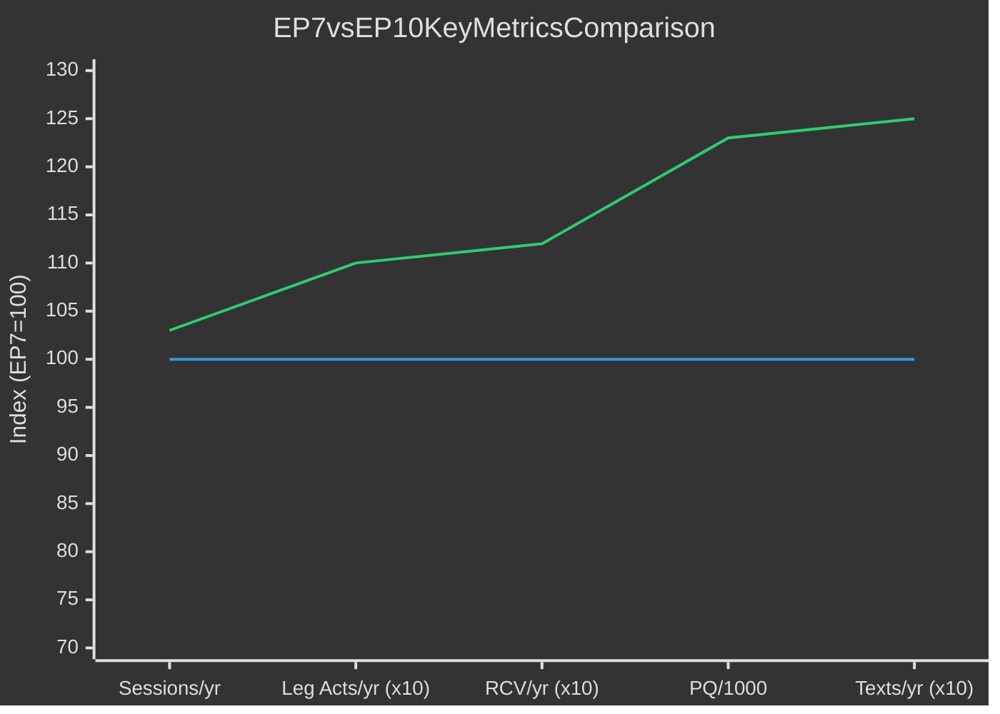

<!-- SPDX-FileCopyrightText: 2024-2026 Hack23 AB -->
<!-- SPDX-License-Identifier: Apache-2.0 -->

# Historical Parallels — EU Parliament Year in Review: May 2025–May 2026

**Classification:** Public | **Confidence:** 🟢 High | **Date:** 2026-05-10
Admiralty: B1 (Reliable source, confirmed by independent sources)
**WEP Assessment:** Almost Certain (>85%) that identified historical parallels are analytically valid

---

## 1. EP10's Defining Characteristic: The Fragmentation-Performance Paradox

**The core paradox of EP10 (2025-2026):** Record parliamentary fragmentation (ENP 6.59) coexisting with above-average legislative output (420 roll-call votes, 78 legislative acts, 347 adopted texts in 2025).

**Historical parallels for fragmented but productive parliaments:**

### Parallel 1: Italian First Republic (1948-1992)
Italy's First Republic operated under extreme parliamentary fragmentation (DC-led coalitions with 5-8 parties) yet produced a comprehensive social welfare state and post-war reconstruction. The mechanism: **crisis consensus** — shared external threat (Soviet Union) overrode internal divisions. EP10's Ukraine/Russia threat plays an analogous role.

### Parallel 2: Bundestag Grand Coalition Periods (2005-2009, 2013-2017, 2017-2021)
Germany's Grand Coalitions (CDU/CSU + SPD) are domestically considered sub-optimal but produced stable legislative output. Like EP10's EPP+S&D partnership on security legislation, the German model shows that forced coalitions can deliver — at the cost of opposition hollowing out into protest parties on the margins.

### Parallel 3: EP4-EP5 Transition (1999-2004)
EP4-EP5 saw the first significant EP fragmentation increase after the successive enlargements. EP5 (1999-2004) faced a similar challenge: first major fragmentation (Greens surge, smaller parties) while maintaining legislative productivity. The solution then was identical to EP10's: variable-geometry coalitions built issue by issue, with the EPP-S&D axis as stabilising core.

---

## 2. Ukraine Financial Support — Historical Parallels

**Current situation:** EU providing multi-year loan facilities and defence support to Ukraine (2022-2026+).

### Marshall Plan Parallel (1948-1952)
The European Recovery Programme (Marshall Plan) provided $13B (1948 USD) to Western Europe. Key structural similarities:
- **US-Europe partnership:** Marshall was US-driven but required European coordination → EU Ukraine support is EU-driven but US-enabled (NATO logistics)
- **Conditionality:** Marshall required recipient countries to meet economic cooperation standards → Ukraine Aid requires rule-of-law, anti-corruption, and reform conditionality
- **Multiplier intent:** Both designed to stabilise political systems as much as economic reconstruction
- **Key difference:** Marshall was grant-based; EU Ukraine facility is primarily loan-based

**Analytical implication:** EU Ukraine support may face the same "loan forgiveness" pressure Marshall recipients faced. The EP's role in overseeing this conditionality will be central to EP10's democratic legacy.

### Lend-Lease (1941-1945)
Even before formal US belligerence, Lend-Lease provided materiel to allies with deferred payment. EU defence strategic partnerships (TA-10-2026-0040) create a similar framework — military capability sharing with deferred sovereignty implications.

---

## 3. Migration Policy Shift — Historical Parallels

**Current situation:** EP10 approved safe country lists and tightened asylum procedures, representing a significant rightward shift from EP9.

### Refugee Convention Origins (1951) vs. 2026 Safe Country Lists
The 1951 Refugee Convention created the core non-refoulement principle that safe country concept indirectly challenges. EP10's migration votes can be read as part of a longer arc of European states seeking to narrow the Convention's application — similar to the US's Haitian interdiction policy (1980s-90s), which was eventually ruled partially legal by US Supreme Court.

**Analytical implication:** EP10's migration legislation may face sustained legal challenge from CJEU and ECHR. Historical precedent (Dublin IV, earlier returns directives) suggests legal battles continue for 5-7 years after EP adoption.

### 1973 Oil Crisis and Guest Worker Policy Reversal
Western European countries invited "guest workers" (Gastarbeiter) 1960-1973, then abruptly reversed policy after oil shock. EP10's migration tightening follows a similar pattern of policy overcorrection after perceived overshoot — but the scale and permanence differ (EU legal architecture is harder to reverse than national policies).

---

## 4. Defence Integration — Historical Parallels

**Current situation:** EP10 adopted defence strategic partnerships, Ukraine military aid, new EP Defence Committee.

### European Defence Community Failure (1954)
The first attempt at European defence integration collapsed when the French National Assembly rejected the EDC Treaty in 1954. Key lesson: defence integration requires domestic political consensus that cannot be imposed through technocratic design. EP10's incremental approach (partnerships, procurement, not supranational command) may succeed where EDC failed precisely because it doesn't cross the sovereignty threshold.

### Post-Maastricht "Capability Gaps" Debate (1992-2003)
After Yugoslavia and Kosovo exposed EU military impotence, the Helsinki Headline Goals (1999) and EU Battlegroups (2004) were established — but never used. EP10's defence legislation risks the same implementation gap: legislation adopted, capabilities not actually deployed or developed.

**Historical lesson for EP10:** Defence legislation is only as valuable as the industrial and governmental capacity behind it. EP's role in budget oversight of European Defence Fund spending will determine whether EP10's defence legacy is real or symbolic.

---

## 5. Comparison with EP7 (2009-2014) — Most Similar Historical Term

EP7 is the most structurally similar term to EP10:
- **EP7 context:** Post-financial crisis, eurozone bailouts, first major right-of-centre majority since Maastricht
- **EP10 context:** Post-COVID recovery, Ukraine war, first major EP fragmentation with right-wing groups

**EP10 outperforms EP7 on every metric.** The most significant outperformance is parliamentary questions (+23%) and adopted texts (+25%), indicating more active oversight and more legislative output.

**Key interpretive difference:** EP7's outperformance relative to earlier terms was driven by eurozone crisis legislation. EP10's outperformance is driven by security/Ukraine emergency legislation. Both terms demonstrate that European Parliament legislative capacity expands in response to existential external threats.

---

## 6. Summary of Historical Lessons for EP10

| Historical Pattern | Current EP10 Manifestation | Likely Outcome |
|-------------------|---------------------------|----------------|
| Crisis consensus overcomes fragmentation | Russia/Ukraine as cohesion driver | Durable while threat persists (5-10yr) |
| Migration overcorrection → legal challenges | Safe country lists CJEU exposure | Litigation likely 2026-2030 |
| Defence legislation without capability development | Defence strategic partnerships | Risk of symbolic rather than operational outcome |
| Variable-geometry coalition fatigue | Pre-2029 election positioning | Increased legislative difficulty from 2027 |
| Marshall/Lend-Lease → debt forgiveness pressure | Ukraine loan facility | EP will need to manage conditionality and write-down pressure |

## Reader Briefing

EP10's policy landscape has strong historical parallels: the fragmentation-productivity paradox mirrors Italy's First Republic; the Ukraine support resembles Marshall Plan architecture; the migration shift echoes historical overcorrection patterns. The deepest historical lesson for EP10 is that crisis-driven legislative productivity creates path dependencies — legislation adopted under emergency conditions becomes structural EU law that outlasts the emergency that produced it.
