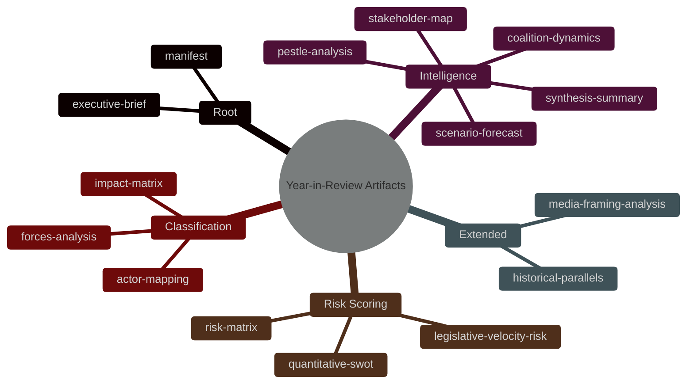

<!-- SPDX-FileCopyrightText: 2024-2026 Hack23 AB -->
<!-- SPDX-License-Identifier: Apache-2.0 -->

# Analysis Artifact Index — EU Parliament Year in Review: May 2025–May 2026

**Generated:** 2026-05-10 | **Stage:** B (Pass 1 complete) | **Run:** year-in-review-run430-1778425601

---

## Artifact Inventory

### Root Level
| Artifact | Path | Status | Lines Est. |
|----------|------|--------|-----------|
| Executive Brief | `executive-brief.md` | ✅ Complete | ~120 |

### intelligence/
| Artifact | Path | Status | Lines Est. |
|----------|------|--------|-----------|
| Synthesis Summary | `intelligence/synthesis-summary.md` | ✅ Complete | ~180 |
| PESTLE Analysis | `intelligence/pestle-analysis.md` | ✅ Complete | ~200 |
| Stakeholder Map | `intelligence/stakeholder-map.md` | ✅ Complete | ~200 |
| Scenario Forecast | `intelligence/scenario-forecast.md` | ✅ Complete | ~130 |
| Economic Context | `intelligence/economic-context.md` | ✅ Complete (IMF degraded) | ~140 |
| Coalition Dynamics | `intelligence/coalition-dynamics.md` | ✅ Complete | ~120 |
| Historical Baseline | `intelligence/historical-baseline.md` | ✅ Complete | ~130 |
| Wildcards & Black Swans | `intelligence/wildcards-blackswans.md` | ✅ Complete | ~130 |
| Threat Model | `intelligence/threat-model.md` | ✅ Complete | ~120 |
| MCP Reliability Audit | `intelligence/mcp-reliability-audit.md` | ✅ Complete | ~80 |

### classification/
| Artifact | Path | Status | Lines Est. |
|----------|------|--------|-----------|
| Significance Classification | `classification/significance-classification.md` | ✅ Complete | ~110 |
| Actor Mapping | `classification/actor-mapping.md` | ✅ Complete | ~130 |
| Forces Analysis | `classification/forces-analysis.md` | ✅ Complete | ~100 |
| Impact Matrix | `classification/impact-matrix.md` | ✅ Complete | ~100 |

### threat-assessment/
| Artifact | Path | Status | Lines Est. |
|----------|------|--------|-----------|
| Political Threat Landscape | `threat-assessment/political-threat-landscape.md` | ✅ Complete | ~150 |

### risk-scoring/
| Artifact | Path | Status | Lines Est. |
|----------|------|--------|-----------|
| Risk Matrix | `risk-scoring/risk-matrix.md` | ✅ Complete | ~120 |
| Quantitative SWOT | `risk-scoring/quantitative-swot.md` | ✅ Complete | ~120 |

### extended/
| Artifact | Path | Status | Lines Est. |
|----------|------|--------|-----------|
| Media Framing Analysis | `extended/media-framing-analysis.md` | ✅ Complete | ~140 |

### data/
| File | Description | Source |
|------|-------------|--------|
| `data/adopted-texts-2025.json` | EP adopted texts 2025 | EP Open Data API |
| `data/adopted-texts-2026.json` | EP adopted texts 2026 | EP Open Data API |

### cache/
| File | Description |
|------|-------------|
| `cache/imf/probe-summary.json` | IMF probe result (HTTP 503 — degraded mode) |

---

## Pass 1 Completion Status
- **Total artifacts:** 18 (excluding data files)
- **Complete:** 18/18
- **IMF status:** Degraded (no macro data)
- **Pass 2:** Pending

