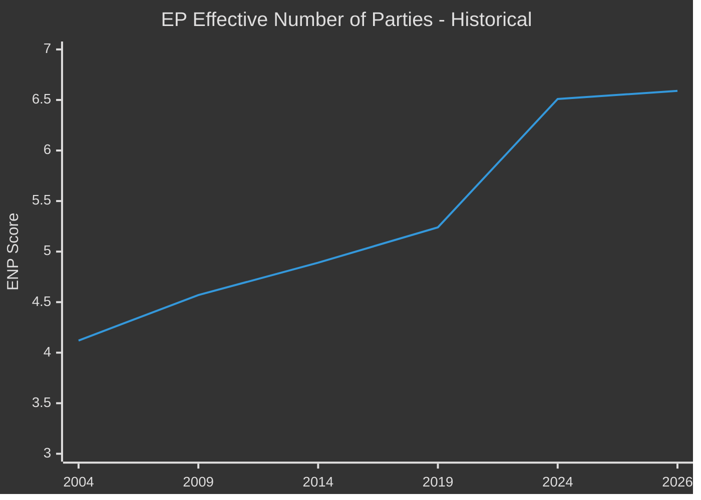

<!-- SPDX-FileCopyrightText: 2024-2026 Hack23 AB -->
<!-- SPDX-License-Identifier: Apache-2.0 -->

# Coalition Dynamics — EU Parliament Year in Review: May 2025–May 2026

**Classification:** Public | **Confidence:** 🟡 Medium | **Date:** 2026-05-10

---

## Coalition Landscape Overview

EP10 operates under a **structurally multi-polar majority architecture**. The majority threshold is 360 seats (of 717). No two-group combination reaches this threshold:

| Coalition | Seats | Threshold | Result |
|-----------|-------|-----------|--------|
| EPP + S&D | 319 | 360 | ❌ Short by 41 |
| EPP + ECR | 264 | 360 | ❌ Short by 96 |
| EPP + PfE | 268 | 360 | ❌ Short by 92 |
| EPP + Renew | 260 | 360 | ❌ Short by 100 |

**Minimum winning coalitions (3 groups):**
| Coalition | Seats | Majority | Type |
|-----------|-------|---------|------|
| EPP + S&D + ECR | 400 | ✅ +40 | Security/defence |
| EPP + S&D + Renew | 396 | ✅ +36 | Moderate mainstream |
| EPP + ECR + PfE | 349 | ❌ Short 11 | Hard right attempt |
| EPP + S&D + Greens | 372 | ✅ +12 | Green/social |

---

## Active Coalitions (2025–2026)

### Coalition 1: "Grand Security Coalition" (EPP + S&D + ECR + Renew)
**Active on:** Ukraine/defence legislation
**Seat count:** 477 (66.5%)
**Cohesion:** High on geopolitics; Low on social policy
**Key votes:** Ukraine loan facility, defence strategic partnerships, CFSP annual report

This cross-partisan security consensus spans from centre-right to democratic socialist. Specifically activated on existential geopolitical questions (Ukraine, NATO, Russia) and does not carry over to domestic policy.

### Coalition 2: "Competitiveness Agenda" (EPP + ECR + Renew + S&D partial)
**Active on:** Industrial policy, single market, digital regulation
**Seat count:** ~370 (with partial S&D)
**Cohesion:** Medium — S&D defections on labour standards issues
**Key votes:** MFF revision, clean industrial deal framework, tech sovereignty resolution

### Coalition 3: "Migration Tightening" (EPP + ECR + PfE + Renew partial)
**Active on:** Migration, asylum, safe country concepts
**Seat count:** ~365 (variable)
**Cohesion:** Medium — Renew defections when rule-of-law implications arise
**Key votes:** Safe countries of origin (TA-10-2026-0025), safe third country concept (TA-10-2026-0026)

### Coalition 4: "Progressive Resistance" (S&D + Greens + The Left + Renew partial)
**Active on:** Green Deal enforcement, social rights, rule-of-law conditionality
**Seat count:** ~311 (blocking minority territory)
**Key votes:** Rule-of-law discharge language, workers' rights, climate monitoring

---

## Coalition Stress Indicators

### PfE Internal Fragmentation
**Concern level: MEDIUM**
PfE contains MEPs from Hungary (Orbán-aligned), France (Le Pen allies), Austria (FPÖ), and 10+ other countries with divergent positions on Russia/Ukraine. Security escalation could trigger visible PfE fractures.

### ECR-EPP Boundary Tension
**Concern level: MEDIUM**
Petr Bystron's immunity waiver (April 2025) creates awkward optics for ECR-EPP cooperation. If Bystron's case escalates, ECR internal tensions could limit cooperation appetite.

### Green Deal "Truce" Durability
**Concern level: MEDIUM**
Current EPP-Greens/EFA tacit truce (EPP doesn't repeal Green Deal; Greens/EFA don't obstruct competitiveness) is informal. Any major ENVI committee confrontation could break this bargain.

---

## Parliamentary Fragmentation Trend

Fragmentation index of 6.59 (2026) represents a secular trend since 2004. Post-2019 acceleration reflects rise of far-right as distinct political forces and decline of traditional EPP-S&D concentration.

---

## EPP Governing Formula

- Needs minimum 2 groups beyond S&D for any majority
- ECR most efficient additional partner (81 seats, issue-compatible on defence/competitiveness)
- Renew required on digital/single market/rule-of-law issues
- PfE activatable on migration but costs coalition credibility with centrist voters

**Opposition blocking mathematics:** S&D + Greens + The Left + Renew (alienated) = ~311 seats — functional blocking minority on super-majority requirements and ability to shape text in committee.
