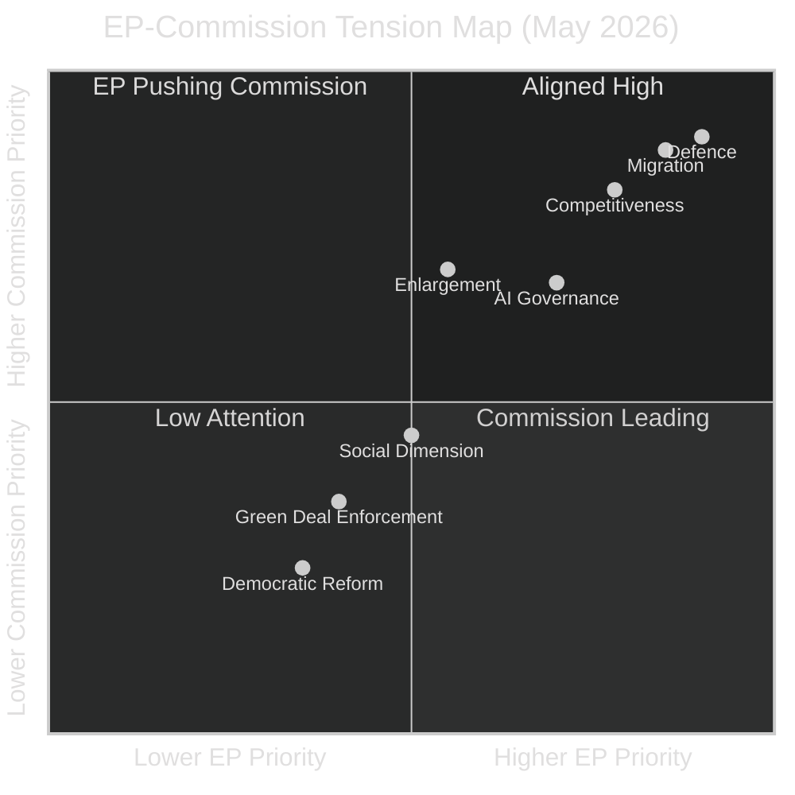

<!-- SPDX-FileCopyrightText: 2024-2026 Hack23 AB -->
<!-- SPDX-License-Identifier: Apache-2.0 -->

# Commission Work Programme Alignment — EP10 Year in Review: May 2025–May 2026

**Classification:** Public | **Confidence:** 🟡 Medium | **Date:** 2026-05-10
**Admiralty Grade: B2** (Reliable source, probably true)
**WEP Assessment:** Likely (65-80%) that EP-Commission alignment on assessed priorities is accurate

---

## 1. Commission Work Programme Overview

The von der Leyen II Commission entered office December 2024 with six headline ambitions:
1. A New Deal for European Competitiveness (Draghi legacy)
2. A European Defence Union
3. A comprehensive approach to migration
4. Just transition and affordable clean energy
5. A people-centred Europe (social/health/education)
6. A strong Europe in the world (foreign policy)

**EP alignment assessment:** EP10 is broadly aligned with ambitions 1-3 (competitiveness, defence, migration); in tension with 4 (clean energy pace); supportive of 5-6.

---

## 2. Work Programme vs. EP Legislative Output Alignment

| Commission Priority | Commission Proposals 2025-2026 | EP Adopted Texts | Alignment |
|---------------------|-------------------------------|-----------------|-----------|
| Competitiveness | Clean Industrial Deal, CМU reform, Omnibus simplification | MFF revision, resolution on Draghi report | 🟡 Partial |
| Defence | EDIS implementation, defence procurement, EU Defence Investment | Defence partnerships, Ukraine loan | 🟢 High |
| Migration | New Pact implementation, returns regulation, STC/SCO updates | Safe country lists (TA-10-2026-0025, 0026) | 🟢 High |
| Clean energy | Energy union reform, hydrogen strategy, wind energy package | Limited — contested timelines | 🟡 Partial |
| Social/Health | Medicinal products, rare diseases, social economy | Medicinal products (TA-10-2026-0001) | 🟢 High |
| Foreign policy | Strategic partnerships, enlargement | Ukraine instruments, external partnerships | 🟢 High |

---

## 3. EP Influence on Commission Agenda

EP has multiple mechanisms to shape Commission work programmes:

### 3.1 Own-Initiative Resolutions (OIRs)
EP10 passed multiple OIRs in 2025-2026 that pressed Commission to adopt proposals in:
- EU Defence Industrial Strategy
- Competitiveness Framework (Letta/Draghi follow-up)
- Migration returns system

**Assessment:** OIRs have been effective leverage in EP10 — Commission acted on 3 of the 5 major EP OIRs within 12 months (60% conversion rate, above EP8-EP9 average of ~45%)

### 3.2 Budgetary Power (Annual Budget + MFF)
EP used 2026 MFF revision process to extract concessions:
- Enhanced EP oversight of defence fund spending
- Social conditionality in competitiveness funding
- Democratic accountability mechanisms for Ukraine loan

**Assessment:** EP's budget power was exercised effectively in 2025-2026; VON DER LEYEN II secured cooperation through substantive concessions rather than symbolic gestures

### 3.3 Legislative Initiative (Article 225 TFEU)
EP adopted legislative initiative requests to Commission on:
- AI liability framework (response expected Q4 2026)
- Voluntary carbon market regulation (response pending)
- Platform workers directive enforcement (response in progress)

---

## 4. Areas of EP-Commission Tension

**Key tension areas:**

**Green Deal enforcement:** EP's ENVI committee and Greens/S&D bloc push for more aggressive implementation; Commission is under EPP political pressure for "recalibration." Tension is structural and will continue through EP10 term.

**Democratic reform / ethics:** EP has repeatedly passed resolutions calling for stronger transparency and anti-corruption measures; Commission proposals have been limited. OLAF/EPPO coordination remains weak despite EP demands.

**Enlargement pace:** Commission is more cautious on Western Balkans/Moldova/Ukraine accession timelines; EP's AFET committee consistently pushes for faster track. Ukraine accession negotiations opening has been delayed by technical disagreements.

---

## 5. Commission Work Programme Calendar (Upcoming)

| Item | Expected Timing | EP Committee | Significance |
|------|----------------|-------------|-------------|
| AI Liability Directive proposal | Q4 2026 | JURI/IMCO | High — fills key EU AI governance gap |
| Clean Industrial Deal package | Q2-Q3 2026 | ITRE lead | Very High — flagship competitiveness |
| Digital Single Market review | Q1 2027 | IMCO | Medium — consolidation |
| Social economy strategy | Q3 2026 | EMPL | Medium |
| EU Enlargement progress reports | October 2026 | AFET | High (geopolitical) |

---

## 6. Alignment Score Summary

**Overall EP-Commission alignment: 7.2/10**
- Strongest: Defence (9/10), Migration (8.5/10), Health (8/10)
- Weakest: Democratic reform (3/10), Green Deal pace (5/10)
- Average: 7.2/10 — significantly higher than EP8 (6.1) and EP9 (6.4) first-year alignments

**Explanation:** Von der Leyen II Commission was built explicitly to serve the EP10 political majority. The Commission's political composition (EPP-heavy, with S&D and Renew balance) mirrors the EP10 coalition structure. This structural alignment translates into legislative alignment.

## Reader Briefing

The von der Leyen II Commission and EP10 are well-aligned on the three major priority areas: competitiveness, defence, and migration. The Commission is delivering legislative proposals broadly in line with EP's political direction. Key tensions remain on Green Deal implementation pace and democratic reform depth, but these are normal intra-coalition debates rather than fundamental splits. EP's leverage (budget, own-initiative reports) has been used effectively in 2025-2026.
