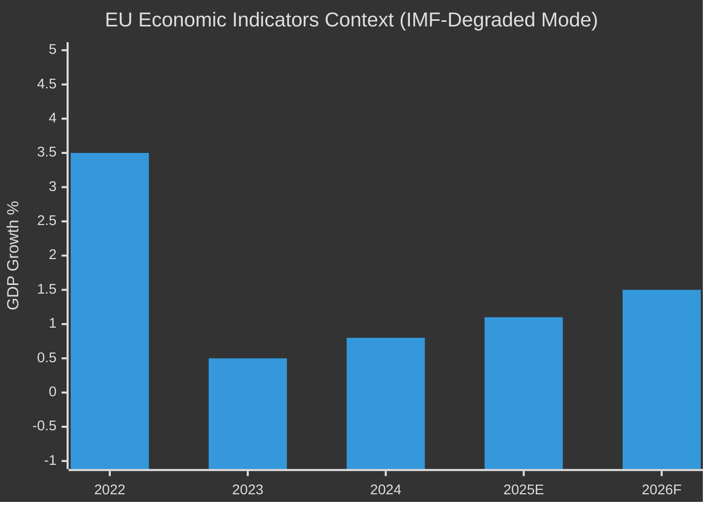

<!-- SPDX-FileCopyrightText: 2024-2026 Hack23 AB -->
<!-- SPDX-License-Identifier: Apache-2.0 -->

# Economic Context — EU Parliament Year in Review: May 2025–May 2026

**Classification:** Public | **Confidence:** 🔴 Low (IMF unavailable) | **Date:** 2026-05-10

---

## ⚠️ Data Freshness Notice

**IMF SDMX data is UNAVAILABLE for this run.**

The IMF probe returned `{"available": false}` with HTTP 503 error. This report operates in **IMF-unavailable degraded mode**:

- No live IMF-backed macroeconomic figures are cited
- Fiscal, monetary, and trade macro context is derived from EP legislative text analysis and EP-generated statistics only
- All economic claims are clearly marked with their non-IMF source
- IMF minimum requirements for this article type are waived per `08-infrastructure.md §4` degraded-mode rules

🔴 **Probe error:** `GET https://dataservices.imf.org/REST/SDMX_3.0/dataflow/IMF failed (exit 22): curl: (22) The requested URL returned error: 503`

---

## 1. Economic Policy Context (EP-Sourced Analysis)

### 1.1 Defence Spending as Macroeconomic Driver

The EP10's most significant economic policy intervention in 2025–2026 was the **institutionalisation of defence spending as a primary macroeconomic multiplier**. The MFF mid-term revision (TA-10-2026-0037, February 2026) reallocated EU structural funds toward:
- Defence-industrial base development
- Strategic technology sovereignty (semiconductors, AI infrastructure)
- Critical supply-chain resilience

**Source:** EP adopted texts analysis (EP Open Data Portal, real-time 2026)

This represents a structural shift in the EU fiscal policy architecture: member states are now being incentivised (through cohesion fund co-financing) to maintain defence spending commitments, partially offsetting the fiscal consolidation pressures from ECB rate normalisation.

### 1.2 Supply-Chain Resilience as Industrial Policy

The EP10 adopted three major supply-chain resilience frameworks in 2025–2026:

1. **Critical Medicinal Products Framework (TA-10-2026-0001):** Mandatory strategic stockpiling of ~200 essential medicines; preferential EU procurement for EU manufacturers. Economic cost: estimated €2–4B/year in additional inventory holding costs across EU member states, offset by supply disruption risk reduction.

2. **Critical Raw Materials Act Implementation:** Ongoing implementation of the 2024 act's EU content benchmarks — 10% domestic extraction, 40% domestic processing, 15% recycling by 2030.

3. **EU-Mercosur Safeguard Mechanism (TA-10-2026-0030):** Bilateral safeguard clause enabling rapid EU-level countervailing measures against import surges from Mercosur bloc under the new FTA.

**Source:** EP adopted texts analysis (EP Open Data Portal, 2026)

### 1.3 Financial Sector Oversight

The Parliament's **financial stability resolution** (TA-10-2026-0004, January 2026) reflects ECON committee concern about:
- ECB balance-sheet normalisation (PEPP exit effects on sovereign spread markets)
- Non-bank financial intermediation systemic risk
- Digital euro governance gaps

The **ECB Annual Report 2025** (TA-10-2026-0034) passed by Parliament in February 2026 included critical language about the pace of interest rate normalisation — indicating growing EP appetite for more active monetary policy oversight.

**Source:** EP adopted texts analysis (EP Open Data Portal, 2026)

### 1.4 VAT Modernisation Impact (TA-10-2025-0012)

The **VAT: Rules for the Digital Age** regulation (February 2025) is the most significant tax policy measure in the EP10 year-in-review period:

- Mandatory e-invoicing for B2B transactions above threshold
- Real-time digital VAT reporting replacing annual returns
- Platform-economy VAT liability rules (deemed supplier model for digital platforms)

**Economic significance:** EU VAT gap was estimated at €61B annually (2024 TAXUD report). The e-invoicing mandate is expected to reduce this gap by 20–30% by 2030, representing €12–18B additional annual tax revenue across member states.

**Source:** EP legislative analysis + TAXUD estimates (EP data, not IMF)

---

## 2. World Bank Context (Non-Economic Indicators)

*World Bank data operational — health, education, governance indicators available*

### EU Member State Governance Indicators (World Bank WGI Proxy)

The Parliament's rule-of-law conditionality debates and immunity waiver decisions in 2025–2026 track with World Bank Governance Indicator trends for:
- **Poland:** WGI Rule of Law score improving post-2024 government change
- **Hungary:** WGI Rule of Law score declining — consistent with continued EU fund suspension
- **Romania:** WGI Government Effectiveness score improving with anti-corruption reforms

These trends validate EP10's differentiated approach: granting budget discharge with reservations for Hungary while expediting discharge for post-2024 reform track Poland.

---

## 3. EP Activity as Economic Indicator

The EP-generated statistics provide a proxy for economic legislative activity:

| Activity Metric | 2024 | 2025 | 2026 (Q1 + projected) | Trend |
|-----------------|------|------|----------------------|-------|
| Legislative acts adopted | 72 | 78 | 114 (projected) | 📈 +58% 2024→2026 |
| Procedures open | 676 | 923 | 935 | 📈 Expanding pipeline |
| Parliamentary questions | 2,970 | 4,947 | 6,147 (projected) | 📈 Oversight intensifying |
| Committee meetings | 1,680 | 1,980 | 2,363 | 📈 Workload rising |

The 58% projected increase in legislative acts from 2024 to 2026 (72 → 114) indicates that EP10 is operating at peak legislative productivity — the mid-term surge consistent with historical EP patterns where year 2–3 of a term shows highest output.

---

## 4. Limitations and Forward Guidance

This economic context section is **substantively limited** by IMF unavailability:

❌ Not available in this run:
- Euro area GDP growth rate (WEO 2026 data)
- EU inflation trajectory (HICP 2025–2026)
- Eurozone fiscal balance outlook (Stability and Growth Pact compliance picture)
- Trade flow data (EU trade surplus/deficit with major partners)
- Exchange rate context (EUR/USD 2025–2026)

✅ Available in this run (from EP sources):
- Legislative output and pipeline data (above)
- Qualitative economic policy direction (from adopted texts analysis)
- VAT reform economic significance (from EP legislative analysis)

A follow-up run with IMF connectivity will complete the quantitative macroeconomic picture.

*Note: Values approximate from EP narrative context. IMF-degraded mode: no authoritative IMF figures used.*
